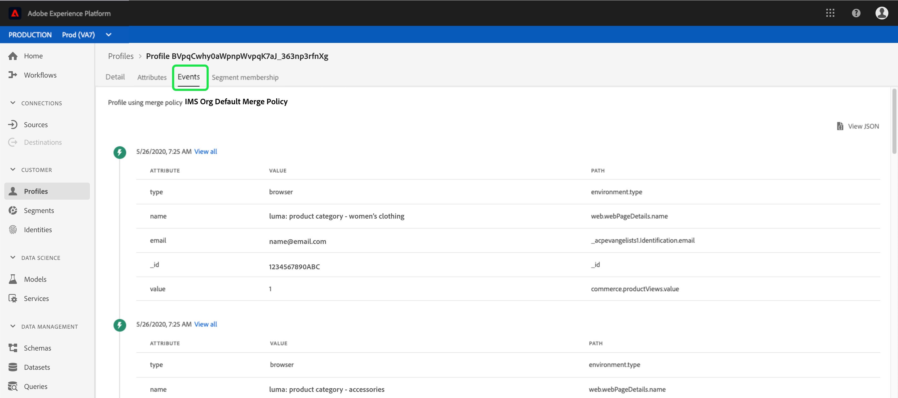

# [!DNL Real-time Customer Profile] UI 안내서

[!DNL Real-time Customer Profile] 에서는 온라인, 오프라인, CRM 및 타사 데이터를 포함하여 여러 채널의 데이터를 결합하여 각 개별 고객을 전체적으로 볼 수 있습니다. 이 문서는 Adobe Experience Platform UI(사용자 인터페이스)의 [!DNL Real-time Customer Profile] 데이터와 상호 작용하기 위한 안내서의 역할을 합니다.

## 시작하기

이 UI 안내서에서는 [!DNL Real-time Customer Profiles] 관리와 관련된 다양한 [!DNL Experience Platform] 서비스를 이해해야 합니다. 이 안내서를 읽거나 UI에서 작업하기 전에 다음 서비스에 대한 설명서를 검토하십시오.

* [[!DNL Real-time Customer Profile] 개요](../home.md): 여러 소스에서 집계된 데이터를 기반으로 통합된 실시간 소비자 프로필을 제공합니다.
* [[!DNL Identity Service]](../../identity-service/home.md): 데이터 소스 [!DNL Real-time Customer Profile] 를 수집할 때 서로 다른 데이터 소스의 ID를 브리징하여  [!DNL Platform]활성화합니다.
* [[!DNL Experience Data Model (XDM)]](../../xdm/home.md): 고객 경험 데이터를  [!DNL Platform] 구성하는 표준화된 프레임워크입니다.

## [!UICONTROL 개요]

Experience Platform UI의 왼쪽 탐색 영역에서 **[!UICONTROL 프로필]**&#x200B;을 선택하여 프로필 대시보드를 표시하는 **[!UICONTROL 개요]** 탭을 엽니다.

>[!NOTE]
>
>조직이 Platform을 처음 사용하고 아직 활성 프로필 데이터 세트 또는 병합 정책이 만들어지지 않은 경우 [!UICONTROL 프로필] 대시보드가 표시되지 않습니다. 대신 [!UICONTROL 개요] 탭에는 실시간 고객 프로필을 시작하는 데 도움이 되는 링크와 설명서가 표시됩니다.

### 프로필 대시보드 {#profile-dashboard}

프로필 대시보드는 조직의 프로필 데이터와 관련된 주요 지표에 대해 설명합니다.

자세한 내용은 [프로필 대시보드 안내서](../../dashboards/guides/profiles.md)를 참조하십시오.

##  브라우저 탭 지표

**[!UICONTROL 찾아보기]** 탭을 선택하여 조직의 프로필 데이터와 관련된 여러 지표를 표시합니다. 이 안내서의 다음 섹션에 설명된 대로 이 탭을 사용하여 병합 정책 또는 ID를 사용하여 프로필 저장소를 탐색할 수도 있습니다.

**[!UICONTROL Browse]** 탭의 오른쪽에는 [프로필 수](#profile-count)와 [프로필 목록을 네임스페이스](#profiles-by-namespace)로 나열합니다.

>[!NOTE]
>
>이러한 프로필 지표는 조직의 기본 병합 정책을 사용하여 평가되므로 [프로필 대시보드](#profile-dashboard)에 표시되는 지표와 다를 수 있습니다. 기본 병합 정책을 정의하는 방법을 비롯하여 병합 정책 작업에 대한 자세한 내용은 [병합 정책 개요](../merge-policies/overview.md)를 참조하십시오.

이 섹션에서는 이러한 지표 외에도 마지막으로 업데이트된 날짜 및 시간을 제공하여 지표가 마지막으로 평가된 시기를 표시합니다.

### 프로필 수 {#profile-count}

조직의 기본 병합 정책이 프로필 조각과 병합되어 각 개별 고객에 대한 단일 프로필을 구성한 후 Experience Platform 내에 조직에서 가진 총 프로필 수를 프로필 수로 표시합니다. 다시 말해, 조직에 여러 채널에서 브랜드와 상호 작용하는 단일 고객과 관련된 여러 프로필 조각이 있을 수 있지만 이러한 조각은 기본 병합 정책에 따라 함께 병합되고 모두 동일한 개인과 관련되어 있으므로 &quot;1&quot; 프로필 수를 반환합니다.

프로필 카운트에는 속성(레코드 데이터)이 있는 프로필과 Adobe Analytics 프로필과 같은 시계열(이벤트) 데이터만 포함된 프로필도 모두 포함됩니다. Platform 내의 최신 총 프로필 수를 제공하기 위해 프로필 수를 정기적으로 새로 고칩니다.

#### 프로필 수 지표 업데이트

[!DNL Profile] 스토어에 레코드를 섭취할 때 카운트가 5% 이상 증가하거나 감소하면 작업이 트리거되어 카운트가 업데이트됩니다. 스트리밍 데이터 워크플로우의 경우 5% 증가 또는 감소 임계값이 충족되었는지 확인하기 위해 시간별로 검사를 수행합니다. 이 경우 프로필 수를 업데이트하도록 작업이 자동으로 트리거됩니다. 일괄 처리를 수집하기 위해 배치를 프로필 저장소에 성공적으로 수집한 후 15분 이내에 5% 증가 또는 감소 임계값이 충족되면 작업이 실행되어 프로필 수를 업데이트합니다.

### [!UICONTROL 네임스페이스별 프로필] {#profiles-by-namespace}

**[!UICONTROL 네임스페이스별 프로필]** 지표는 프로필 저장소에 있는 병합된 모든 프로필에 대한 총 네임스페이스 수 및 분류를 표시합니다. 네임스페이스별 총 프로필 수(즉, 각 네임스페이스에 대해 표시된 값을 함께 추가)는 한 프로필에 여러 네임스페이스가 연결되어 있을 수 있으므로 프로필 수 지표보다 항상 더 높게 됩니다. 예를 들어 고객이 둘 이상의 채널에서 브랜드와 상호 작용하는 경우 여러 네임스페이스가 해당 개별 고객과 연결됩니다.

#### 네임스페이스] 지표로 [!UICONTROL 프로필 업데이트

[프로필 수](#profile-count) 지표와 유사하게, [!DNL Profile] 스토어에 레코드를 섭취하면 카운트가 5% 이상 증가 또는 감소하면 네임스페이스 지표를 업데이트하기 위해 작업이 트리거됩니다. 스트리밍 데이터 워크플로우의 경우 5% 증가 또는 감소 임계값이 충족되었는지 확인하기 위해 시간별로 검사를 수행합니다. 이 경우 프로필 수를 업데이트하도록 작업이 자동으로 트리거됩니다. 배치 수집 의 경우, 배치를 [!DNL Profile] 스토어에 성공적으로 섭취한 후 15분 내에 5% 증가 또는 감소 임계값이 충족되면 작업이 실행되어 지표를 업데이트합니다.

## [!UICONTROL 찾아보기] 탭을 사용하여 프로필을 봅니다

**[!UICONTROL 찾아보기]** 탭에서 병합 정책을 사용하여 샘플 프로필을 보거나 ID 네임스페이스 및 값을 사용하여 특정 프로필을 찾을 수 있습니다.

### [!UICONTROL 병합 정책]으로 찾아보기

**[!UICONTROL 찾아보기]** 탭은 기본적으로 조직의 기본 병합 정책으로 설정됩니다. 다른 병합 정책을 선택하려면 병합 정책 이름 옆에 있는 `X` 선택기를 사용하여 **[!UICONTROL 병합 정책 선택]** 대화 상자를 엽니다.

>[!NOTE]
>
>선택한 병합 정책이 없으면 **[!UICONTROL 병합 정책]** 필드 옆에 있는 선택기 단추를 사용하여 선택 대화 상자를 엽니다.

**[!UICONTROL 병합 정책 선택]** 대화 상자에서 병합 정책을 선택하려면 정책 이름 옆의 라디오 단추를 선택한 다음 **[!UICONTROL 선택]**&#x200B;을 사용하여 [!UICONTROL 찾아보기] 탭으로 돌아갑니다. 그런 다음 **[!UICONTROL 보기]**&#x200B;를 선택하여 샘플 프로필을 새로 고침하고 새 병합 정책이 적용된 프로필의 샘플링을 볼 수 있습니다.

선택한 병합 정책이 적용된 후 조직의 프로필 저장소에서 최대 20개의 프로필 샘플을 나타내는 프로필입니다. 선택한 병합 정책에 대한 샘플 프로필은 조직의 프로필 저장소에 새 데이터가 추가되면 새로 고쳐집니다.

샘플 프로필 중 하나의 세부 사항을 보려면 **[!UICONTROL 프로필 ID]**&#x200B;를 선택하십시오. 자세한 내용은 [프로필 세부 정보 보기](#profile-detail)에 대한 이 안내서의 뒷부분에 있는 섹션을 참조하십시오.

플랫폼 내의 병합 정책 및 역할에 대한 자세한 내용은 [병합 정책 개요](../merge-policies/overview.md)를 참조하십시오.

### [!UICONTROL Identity]로 찾아보기 {#browse-identity}

**[!UICONTROL 찾아보기]** 탭에서 ID 네임스페이스를 사용하여 ID 값으로 특정 프로필을 조회할 수 있습니다. ID로 검색하려면 병합 정책, ID 네임스페이스 및 ID 값을 제공해야 합니다.

필요한 경우 **[!UICONTROL 병합 정책]** 선택기를 사용하여 **[!UICONTROL 병합 정책 선택]** 대화 상자를 열고 사용할 병합 정책을 선택합니다.

그런 다음 **[!UICONTROL ID 네임스페이스]** 선택기를 사용하여 **[!UICONTROL ID 네임스페이스 선택]** 대화 상자를 열고 검색할 네임스페이스를 선택합니다. 조직에 네임스페이스가 많은 경우 대화 상자의 검색 막대를 사용하여 네임스페이스 이름을 입력할 수 있습니다.

네임스페이스를 선택하여 추가 세부 정보를 보거나 라디오 단추를 선택하여 네임스페이스를 선택할 수 있습니다. 그런 다음 **[!UICONTROL 선택]**&#x200B;을 사용하여 계속할 수 있습니다.

[!UICONTROL ID 네임스페이스]를 선택하고 [!UICONTROL 찾아보기] 탭으로 돌아오면 선택한 네임스페이스와 관련된 **[!UICONTROL ID 값]**&#x200B;을 입력할 수 있습니다.

>[!NOTE]
>
>이 값은 개별 고객 프로필에 한정되며 제공된 네임스페이스에 대한 올바른 항목이어야 합니다. 예를 들어 ID 네임스페이스 &quot;이메일&quot;을 선택하려면 유효한 이메일 주소 형식의 ID 값이 필요합니다.

값을 입력한 후 **[!UICONTROL 보기]**&#x200B;를 선택하고 값과 일치하는 단일 프로필이 반환됩니다. 프로필 세부 정보를 보려면 **[!UICONTROL 프로필 ID]**&#x200B;를 선택하십시오.

## 프로필 세부 사항 보기 {#profile-detail}

**[!UICONTROL 프로필 ID]**&#x200B;를 선택하면 **[!UICONTROL 세부 정보]** 탭이 열립니다. **[!UICONTROL 세부 정보]** 탭에 표시되는 프로필 정보가 여러 프로필 조각에서 병합되어 개별 고객에 대한 단일 보기를 형성했습니다. 여기에는 기본 속성, 연결된 ID 및 채널 환경 설정과 같은 고객 세부 사항이 포함됩니다.

표시되는 기본 필드는 기본 프로필 속성을 표시하도록 조직 수준에서 변경할 수도 있습니다. 특성 추가 및 제거 및 대시보드 패널 크기 조정을 위한 단계별 지침을 포함하여 이러한 필드를 사용자 지정하는 방법에 대한 자세한 내용은 [프로필 세부 사용자 지정 안내서](profile-customization.md)를 참조하십시오.

사용 가능한 다른 탭을 선택하여 개별 고객 프로필과 관련된 추가 정보를 볼 수 있습니다. 이러한 탭에는 현재 프로필이 자격을 갖는 세그먼트를 보여주는 속성, 이벤트 및 세그먼트 멤버십 탭이 포함됩니다.

### 속성 탭

**[!UICONTROL 속성]** 탭은 지정된 병합 정책이 적용된 후 단일 프로필과 관련된 모든 속성을 요약하는 목록 보기를 제공합니다.

이러한 속성은 **[!UICONTROL JSON 보기]**&#x200B;를 선택하여 JSON 개체로도 볼 수 있습니다. 이 기능은 프로필 속성을 Platform에 수집하는 방법을 이해하려는 모든 사용자에게 유용합니다.

### 이벤트 탭

**[!UICONTROL 이벤트]** 탭에는 고객과 연결된 ExperienceEvents와 관련된 데이터가 포함되어 있습니다. 여기에는 이메일 열기, 장바구니 활동, 페이지 보기 등이 포함될 수 있습니다. 개별 이벤트에 대해 **[!UICONTROL 모두 보기]**&#x200B;를 선택하면 이벤트의 일부로 캡처되는 추가 필드와 값이 제공됩니다.

또한 **[!UICONTROL JSON 보기]**&#x200B;를 선택하여 이벤트를 JSON 개체로도 볼 수 있습니다. 이 기능은 플랫폼에서 이벤트가 캡처되는 방식을 이해하는 데 유용합니다.

### 세그먼트 멤버십 탭

**[!UICONTROL 세그먼트 멤버십]** 탭에는 개별 고객 프로필이 현재 속한 세그먼트의 이름과 설명이 있는 목록이 표시됩니다. 이 목록은 프로필이 세그먼트에서 자격을 얻거나 만료되면 자동으로 업데이트됩니다. 현재 프로필이 적격인 세그먼트의 총 개수가 탭의 오른쪽에 표시됩니다.

Experience Platform의 세그멘테이션에 대한 자세한 내용은 [Adobe Experience Platform 세그멘테이션 서비스 설명서](../../segmentation/home.md)를 참조하십시오.

## 병합 정책

기본 **[!UICONTROL 프로필]** 메뉴에서 **[!UICONTROL 병합 정책]** 탭을 선택하여 조직에 속하는 병합 정책 목록을 확인합니다. 나열된 각 정책에는 해당 이름, 기본 병합 정책인지 여부 및 적용되는 스키마 클래스가 표시됩니다.

병합 정책에 대한 자세한 내용은 [병합 정책 개요](../merge-policies/overview.md)를 참조하십시오.

## 결합 스키마 {#union-schema}

기본 **[!UICONTROL 프로필]** 메뉴에서 **[!UICONTROL 결합 스키마]** 탭을 선택하여 수집된 데이터에 사용 가능한 결합 스키마를 확인합니다. 조합 스키마는 [!DNL Real-time Customer Profile]에서 사용할 수 있도록 스키마가 활성화된 동일한 클래스의 모든 [!DNL Experience Data Model] (XDM) 필드의 병합입니다.

결합 스키마에 대한 자세한 내용은 [결합 스키마 UI 안내서](union-schema.md)를 참조하십시오.

## 다음 단계

이 안내서를 읽으면 Experience Platform UI를 사용하여 조직의 프로필 데이터를 보고 관리하는 방법을 알 수 있습니다. Experience Platform API를 사용하여 프로필 데이터를 사용하는 방법에 대한 자세한 내용은 [실시간 고객 프로필 API 안내서](../api/overview.md)를 참조하십시오.
