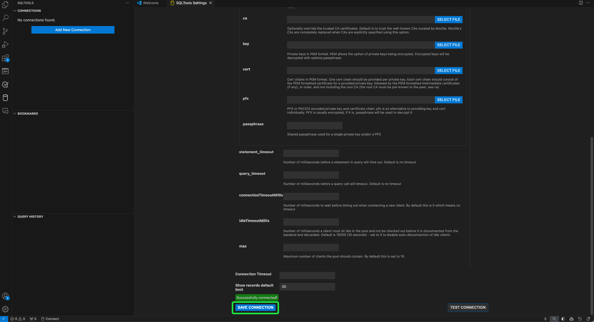

# 쿼리 서비스에 [!DNL GitHub Copilot] 및 [!DNL Visual Studio Code] 연결

>[!IMPORTANT]
>
>이 통합 도구를 사용하기 전에 GitHub와 공유되는 데이터를 이해해야 합니다. 공유 데이터에는 편집 중인 코드 및 파일에 대한 컨텍스트 정보(&quot;프롬프트&quot;)와 사용자 작업에 대한 세부 정보(&quot;사용자 참여 데이터&quot;)가 포함되어 있습니다.  [[!DNL GitHub Copilot]의 개인 정보 취급 방침](https://docs.github.com/en/site-policy/privacy-policies/github-general-privacy-statement#github-privacy-statement)을 검토하여 수집된 데이터에 대해 알아보세요. 또한 조직의 데이터 거버넌스 정책을 준수할 책임이 있으므로 서드파티 서비스 참여의 보안 영향도 고려해야 합니다. Adobe은 이 도구의 사용으로 인해 발생할 수 있는 데이터 관련 문제 또는 문제에 대해 책임을 지지 않습니다. 자세한 내용은 GitHub 설명서를 참조하십시오.

OpenAI Codex에서 제공하는 [!DNL GitHub Copilot]은(는) 코드 조각 및 편집기 내에서 직접 전체 함수를 제안하여 코딩 경험을 향상시키는 AI 기반 도구입니다. [!DNL Visual Studio Code]&#x200B;([!DNL VS Code])과(와) 통합된 [!DNL Copilot]은(는) 특히 복잡한 쿼리를 사용하여 작업할 때 워크플로를 크게 가속화할 수 있습니다. [!DNL GitHub Copilot] 및 [!DNL VS Code]을(를) 쿼리 서비스에 연결하여 보다 효율적으로 쿼리를 작성하고 관리하는 방법에 대해 알아보려면 이 안내서를 따르십시오. [!DNL Copilot]에 대한 자세한 내용은 [GitHub의 Copilot 제품 페이지](https://github.com/pricing) 및 [공식 [!DNL Copilot] 설명서](https://docs.github.com/en/copilot/about-github-copilot/what-is-github-copilot)를 참조하십시오.

이 문서에서는 [!DNL GitHub Copilot] 및 [!DNL VS Code]을(를) Adobe Experience Platform 쿼리 서비스와 연결하는 데 필요한 단계를 설명합니다.

## 시작하기 {#get-started}

이 안내서를 사용하려면 이미 GitHub 계정에 액세스할 수 있고 [!DNL GitHub Copilot]에 등록해야 합니다. [GitHub 웹 사이트에서 등록](https://github.com/github-copilot/signup)할 수 있습니다. [!DNL VS Code]도 필요합니다. 공식 웹 사이트에서 [다운로드 [!DNL VS Code] 할 수 있습니다](https://code.visualstudio.com/download).

[!DNL VS Code]을(를) 설치하고 [!DNL Copilot] 구독을 활성화했으면 Experience Platform에 대한 연결 자격 증명을 획득하십시오. 이러한 자격 증명은 Experience Platform UI의 [!UICONTROL 쿼리] 작업 영역의 [!UICONTROL 자격 증명] 탭에 있습니다. 자격 증명 안내서를 읽고 [Experience Platform UI에서 이러한 값을 찾는 방법을 알아보세요](../ui/credentials.md). 현재 [!UICONTROL 쿼리] 작업 영역에 대한 액세스 권한이 없는 경우 조직 관리자에게 문의하십시오.

### 필수 확장 [!DNL Visual Studio Code]개 {#required-extensions}

코드 편집기 내에서 직접 Experience Platform SQL 데이터베이스를 효과적으로 관리하고 쿼리하려면 다음 [!DNL Visual Studio Code] 확장이 필요합니다. 이러한 확장을 다운로드하여 설치합니다.

- [SQLTools](https://marketplace.visualstudio.com/items?itemName=mtxr.sqltools): SQLTools 확장을 사용하여 여러 SQL 데이터베이스를 관리하고 쿼리합니다. 쿼리 실행기, SQL 포맷터 및 연결 탐색기와 같은 기능이 포함되어 있으며 개발자 생산성을 높일 수 있는 추가 드라이버가 지원됩니다. 자세한 내용은 Visual Studio Marketplace 개요를 참조하십시오.
- [SQLTools PostgreSQL/Cockroach 드라이버](https://marketplace.visualstudio.com/items?itemName=mtxr.sqltools-driver-pg): 이 확장을 사용하면 코드 편집기 내에서 직접 PostgreSQL 및 CockroachDB 데이터베이스를 연결, 쿼리 및 관리할 수 있습니다.

다음 확장을 사용하면 [!DNL GitHub Copilot] 및 해당 채팅 기능을 사용할 수 있습니다.

- [[!DNL GitHub Copilot]](https://marketplace.visualstudio.com/items?itemName=GitHub.copilot): 입력할 때 인라인 코딩 제안을 제공합니다.
- [[!DNL GitHub Copilot] 채팅](https://marketplace.visualstudio.com/items?itemName=GitHub.copilot-chat): 대화형 AI 지원을 제공하는 도우미 확장.

## 연결 만들기 {#create-connection}

원통 아이콘(![원통 아이콘을 선택합니다.[!DNL VS Code]의 왼쪽 탐색 영역에 ](../images/clients/github-copilot/cylinder-icon.png))을 추가한 다음 **[!DNL Add New Connection]** 또는 원통 더하기 아이콘()을 클릭합니다.

**[!DNL Connection Assistant]**&#x200B;이(가) 나타납니다. **[!DNL PostgreSQL]** 데이터베이스 드라이버를 선택하십시오.

![PostgreSQl이 강조 표시된 [!DNL VS Code]의 SQLTools 설정 페이지입니다.](../images/clients/github-copilot/postgres-database-driver.png)

### 연결 설정 입력 {#input-connection-settings}

[!DNL Connection Settings] 보기가 나타납니다. SQLTools [!DNL Connection Assistant]의 해당 필드에 Experience Platform 연결 자격 증명을 입력합니다. 필수 값은 아래 표에 설명되어 있습니다.

| 속성 | 설명 |
| --- |--- |
| [!DNL Connection name] | 설명적이고 용도를 명확하게 나타내는 &quot;[!DNL Connection name]&quot;(예: MySQL Server의 프로덕션 환경)을 `Prod_MySQL_Server`과(와) 같이 제공합니다. 모범 사례는 다음과 같습니다.  <ul><li>시스템 내에서 고유하도록 조직의 이름 지정 규칙에 따라 지정합니다.</li><li>명확성을 유지하고 다른 연결과의 혼동을 피하기 위해 간결하게 유지합니다.</li><li>이름에 연결의 기능이나 환경에 대한 관련 세부 정보를 포함합니다.</li></ul> |
| [!DNL Connect using] | **[!DNL Server and Port]** 옵션을 사용하여 서버의 주소(호스트 이름)와 포트 번호를 지정하여 Experience Platform에 직접 연결합니다. |
| [!DNL Server address] | Experience Platform Postgres 자격 증명에 제공된 **[!UICONTROL Host]** 값을 입력하십시오(예: `acmeprod.platform-query.adobe.io`). |
| [!DNL Port] | 이 값은 일반적으로 Experience Platform 서비스의 경우 `80`입니다. |
| [!DNL Database] | Experience Platform Postgres 자격 증명에 제공된 **[!UICONTROL 데이터베이스]** 값을 입력하십시오(예: `prod:all`). |
| [!DNL Username] | 이 속성은 조직 ID를 참조합니다. Experience Platform Postgres 자격 증명에 제공된 **[!UICONTROL 사용자 이름]** 값을 입력하십시오. |
| [!DNL Password] | 이 속성은 액세스 토큰입니다. Experience Platform Postgres 자격 증명에 제공된 **[!UICONTROL 암호]** 값을 입력하십시오. |

**[!DNL Use Password]**&#x200B;을(를) 선택한 다음 표시되는 드롭다운 메뉴에서 **[!DNL Save as plaintext in settings]**&#x200B;을(를) 선택합니다. [!DNL Password] 필드가 나타납니다. 이 텍스트 입력 필드를 사용하여 액세스 토큰을 입력합니다.

마지막으로 SSL을 사용하려면 [!DNL SSL] 입력 필드를 선택하고 표시되는 드롭다운 메뉴에서 [!DNL Enabled]을(를) 선택합니다.

>[!TIP]
>
>모든 자격 증명을 입력한 후에는 연결을 저장하기 전에 연결을 테스트할 수 있습니다. 작업 영역의 아래쪽으로 스크롤하여 **[!DNL Test Connection]**&#x200B;을(를) 선택합니다.
>
>{width="100" zoomable="yes"}

연결 세부 정보를 올바르게 입력했으면 **[!DNL Save Connection]**&#x200B;을(를) 선택하여 설정을 확인합니다.

[!DNL Review connection details] 보기가 나타나고 연결 자격 증명이 표시됩니다. 연결 세부 정보가 정확하면 **[!DNL Connect Now]**&#x200B;을(를) 선택하십시오.

[!DNL VS Code] 작업 영역이 [!DNL GitHub Copilot]의 제안과 함께 표시됩니다.

![연결된 SQL 세션이 [!DNL VS Code]에 있습니다.](../images/clients/github-copilot/connected.png)

## [!DNL GitHub Copilot] 빠른 안내서

Experience Platform 인스턴스에 연결되면 [!DNL Copilot]을(를) AI 코딩 도우미로 사용하여 보다 빠르고 안정적으로 코드를 작성할 수 있습니다. 이 섹션에서는 주요 기능과 사용 방법을 다룹니다.

## [!DNL GitHub Copilot] 시작하기 {#get-started-with-copilot}

먼저 최신 버전의 [!DNL VS Code]이(가) 설치되어 있는지 확인하십시오. 오래된 [!DNL VS Code] 버전을 사용하면 키 [!DNL Copilot] 기능이 의도한 대로 작동하지 않을 수 있습니다. 그런 다음 [!DNL Enable Auto Completions] 설정이 활성화되어 있는지 확인합니다. [!DNL Copilot]이(가) 올바르게 실행 중인 경우 **[!DNL Copilot]아이콘**()이 상태 표시줄에 나타납니다(문제가 있는 경우 대신 [!DNL Copilot] 오류 아이콘이 표시됨). **[!DNL Copilot]아이콘**&#x200B;을(를) 선택하여 [!DNL [!DNL GitHub Copilot] 메뉴]를 엽니다. **[!DNL [!DNL GitHub Copilot] Menu]**&#x200B;에서 **[!DNL Edit Settings]**&#x200B;을(를) 선택합니다.

![[!DNL GitHub Copilot Menu]이(가) 표시되고 [!DNL Copilot] 아이콘과 설정 편집이 강조 표시된 [!DNL VS Code] 편집기입니다.](../images/clients/github-copilot/github-copilot-menu.png)

옵션을 아래로 스크롤하여 [!DNL Enable Auto Completions] 설정에 대해 확인란이 활성화되어 있는지 확인합니다.

![자동 완성 사용 확인란이 선택되어 있고 강조 표시된 [!DNL GitHub Copilot]의 설정 패널입니다.](../images/clients/github-copilot/enable-auto-completions.png)

## 코드 완료 {#code-completions}

[!DNL GitHub Copilot] 확장을 설치하고 로그인하면 입력할 때 코드 완료를 제안하는 **고스트 텍스트**&#x200B;라는 기능이 자동으로 활성화됩니다. 이러한 제안은 보다 효율적으로 코드를 작성하는 데 도움이 되며 중단 횟수도 줄어듭니다. 주석을 사용하여 AI 코드 제안을 안내할 수도 있습니다. 즉, 비기술적 사용자는 일반 음성을 코드로 변환하여 데이터를 탐색할 수 있습니다.

![코드 제안 및 [!DNL GitHub Copilot] 아이콘이 강조 표시된 VSCode UI입니다.](../images/clients/github-copilot/ghost-text.png)

>[!TIP]
>
>특정 파일 또는 언어에 대해 [!DNL Copilot]을(를) 사용하지 않도록 설정하려면 상태 표시줄에서 아이콘을 선택하고 사용하지 않도록 설정하십시오.

### 전체 또는 일부 고스트 텍스트 제안 수락 {#accept-suggestions}

[!DNL GitHub Copilot]이(가) 코드 완료를 제안하면 일부 또는 전체 제안을 수락할 수 있습니다. **Tab**&#x200B;을(를) 선택하여 전체 제안을 수락하거나, **Control(또는 Mac의 명령)**&#x200B;을 누른 상태에서 **오른쪽 화살표**&#x200B;를 눌러 부분 텍스트를 수락합니다. 제안을 취소하려면 **Esc**&#x200B;를 누르십시오.

>[!TIP]
>  
>제안 사항이 없으면 [[!DNL Copilot] 이(가) 파일의 언어로 활성화되었는지](#get-started-with-copilot)하세요.

![부분적으로 입력된 코드 옆에 희미한 회색 텍스트 제안을 [!DNL GitHub Copilot]에서 유령 텍스트로 표시하는 [!DNL VS Code] 편집기입니다.](../images/clients/github-copilot/accept-partial-suggestions.png)

### 대체 제안 {#alternative-suggestions}

대체 코드 제안을 순환하려면 [!DNL Copilot] 대화 상자에서 화살표를 선택합니다.

![Copilot 대체 제안 패널을 표시하는 [!DNL VS Code] 편집기입니다.](../images/clients/github-copilot/code-suggestions.png)

## 인라인 채팅 사용 {#inline-chat}

코드에 대해 직접 [!DNL Copilot]님과 채팅할 수도 있습니다. **Control(또는 Command) + I**&#x200B;을(를) 사용하여 인라인 채팅 대화 상자를 트리거합니다. 이 기능은 코드를 반복하고 컨텍스트에서 제안을 구체화하는 데 사용됩니다. 코드 블록을 강조 표시하고 인라인 채팅을 사용하여 AI가 제안한 다른 솔루션을 확인한 후 수락할 수 있습니다.

<!-- THis section is poss unnecessary:
There are inline features for chat including doc, expalin, fix and test

 -->

## 전용 채팅 보기 {#dedicated-chat}

전용 채팅 사이드바가 있는 보다 전통적인 채팅 인터페이스를 사용하여 아이디어와 전략을 구성하고 코딩 문제를 해결하며 구현 세부 사항을 논의할 수 있습니다. 채팅 아이콘(![Copilot 채팅 아이콘)을 선택합니다.[!DNL VS Code] 사이드바에서 ](../images/clients/github-copilot/chat-icon.png))을(를) 클릭하여 전용 채팅 창을 엽니다.

![채팅 아이콘이 강조 표시된 [!DNL GitHub Copilot] 채팅 사이드바입니다.](../images/clients/github-copilot/chat-sidebar.png)

대화 내용 아이콘()을(를) 클릭합니다.

## 다음 단계

이제 코드 편집기에서 직접 Experience Platform 데이터베이스를 효율적으로 쿼리하고 [!DNL GitHub Copilot]의 AI 기반 코드 제안을 사용하여 SQL 쿼리 작성 및 최적화를 간소화할 준비가 되었습니다. 쿼리를 작성하여 실행하는 방법에 대한 자세한 내용은 [쿼리 실행에 대한 지침](../best-practices/writing-queries.md)을 참조하세요.
