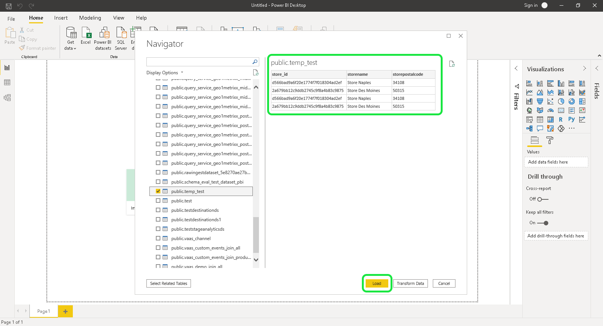

# Connect [!DNL Power BI] 쿼리 서비스

이 문서에서는 연결 단계를 설명합니다 [!DNL Power BI] Adobe Experience Platform 쿼리 서비스가 포함된 데스크탑.

## 시작하기

이 안내서에서는 이미 [!DNL Power BI] 데스크탑 앱과 는 인터페이스를 탐색하는 방법을 잘 알고 있습니다. 다운로드하려면 [!DNL Power BI] 자세한 내용은 [공식 [!DNL Power BI] 설명서](https://docs.microsoft.com/ko-ko/power-bi/).

>[!IMPORTANT]
>
> 다음 [!DNL Power BI] 데스크탑 응용 프로그램 **전용** Windows 장치에서 사용할 수 있습니다.

연결에 필요한 자격 증명을 획득하려면 [!DNL Power BI] Experience Platform을 수행하려면 플랫폼 UI의 쿼리 작업 영역에 액세스할 수 있어야 합니다. 현재 쿼리 작업 영역에 대한 액세스 권한이 없는 경우 IMS 조직 관리자에게 문의하십시오.

설치 후 [!DNL Power BI]를 설치한 후 `Npgsql`: PostgreSQL용 .NET 드라이버 패키지입니다. Npgsql에 대한 자세한 내용은 [Npgsql 설명서](https://www.npgsql.org/doc/index.html).

>[!IMPORTANT]
>
>최신 버전에서 오류가 발생하므로 v4.0.10 이하를 다운로드해야 합니다.

아래에[!DNL Npgsql GAC Installation]&quot;을(를) 사용자 지정 설정 화면에서 선택합니다. **[!DNL Will be installed on local hard drive]**.

Npgsql이 제대로 설치되어 있는지 확인하려면 다음 단계로 진행하기 전에 컴퓨터를 다시 시작하십시오.

## Connect [!DNL Power BI] 쿼리 서비스 {#connect-power-bi}

연결하려면 [!DNL Power BI] Query Service를 실행하려면 [!DNL Power BI] 을(를) 선택합니다. **[!DNL Get Data]** 상단 메뉴 리본 아래에 있습니다.

![다음 [!DNL Power BI] 대시보드 홈 탭이 있고 데이터 가져오기가 강조 표시됩니다.](../images/clients/power-bi/open-power-bi.png)

&quot; 입력[!DNL PostgreSQL]검색 창에서 데이터 소스 목록의 범위를 좁힐 수 있습니다. 표시되는 결과에서 을 선택합니다 **[!DNL PostgreSQL database]**, 그 다음 **[!DNL Connect]**.

![데이터 가져오기 대화 상자 [!DNL PostgreSQL] 데이터베이스와 Connect가 강조 표시됩니다.](../images/clients/power-bi/get-data.png)

다음 [!DNL PostgreSQL] 데이터베이스 대화 상자가 나타나고 서버와 데이터베이스에 대한 값을 요청합니다. 이러한 값은 Adobe Experience Platform 자격 증명에서 가져옵니다. 자격 증명을 찾으려면 Platform UI에 로그인하고 를 선택합니다 **[!UICONTROL 쿼리]** 왼쪽 탐색에서 다음을 차례로 수행합니다 **[!UICONTROL 자격 증명]**. 데이터베이스 이름, 호스트, 포트 및 로그인 자격 증명을 찾는 방법에 대한 자세한 내용은 [자격 증명 안내서](../ui/credentials.md).

대상 **[!DNL Server]** Power BI의 필드에 Query Service Credentials 섹션에 있는 호스트의 값을 입력합니다. 프로덕션의 경우 포트 추가 `:80` 를 호스트 문자열 끝에 추가합니다. 예: `made-up.platform-query.adobe.io:80`.

다음 **[!DNL Database]** 필드는 &quot;모두&quot; 또는 데이터 집합 테이블 이름일 수 있습니다. 예: `prod:all`.

>[!IMPORTANT]
>
>타사 BI 도구의 중첩된 데이터 구조를 병합하여 사용 편의성을 향상시키고 데이터를 검색, 분석, 변환 및 보고하는 데 필요한 작업 로드를 줄일 수 있습니다. 다음 항목에 대한 설명서를 참조하십시오.[`FLATTEN` 기능](../best-practices/flatten-nested-data.md) 데이터베이스에 연결할 때 이 설정을 활성화하는 방법에 대한 지침

![다음 [!DNL Power BI] 서버 및 데이터베이스 입력 필드가 강조 표시된 대시보드](../images/clients/power-bi/postgresql-database-dialog.png)

### 데이터 연결 모드

다음으로, **[!DNL Data Connectivity mode]**. 선택 **[!DNL Import]** 후 **[!DNL OK]** 사용 가능한 모든 테이블 목록을 표시하려면 **[!DNL DirectQuery]** 데이터를 직접 가져오거나 복사하지 않고 데이터 소스를 직접 쿼리하려면 [!DNL Power BI].

에 대해 자세히 알아보려면 **[!DNL Import]** 모드 [표 가져오기](#import). 에 대해 자세히 알아보려면 **[!DNL DirectQuery]** 모드 [데이터를 가져오지 않고 데이터 세트 쿼리](#direct-query).

선택 **[!DNL OK]** 데이터베이스 세부 정보를 확인한 후

![다음 [!DNL PostgreSQL] 데이터 연결 모드가 강조 표시된 데이터베이스 대화 상자](../images/clients/power-bi/connectivity-mode.png)

### 인증

사용자 이름, 암호 및 애플리케이션 설정을 묻는 메시지가 나타납니다. 이 경우 사용자 이름은 조직 ID이고 암호는 인증 토큰입니다. 둘 다 질의 서비스 인증서 페이지에서 찾을 수 있습니다.

다음 세부 사항을 입력한 다음 **[!DNL Connect]** 를 눌러 다음 단계로 진행합니다.

## 표 가져오기 {#import}

을(를) 선택하여 **[!DNL Import]** [!DNL Data Connectivity mode]로 지정하는 경우, 전체 데이터 세트를 가져오므로 [!DNL Power BI] 데스크탑 응용 프로그램을 있는 그대로 사용합니다.

>[!IMPORTANT]
>
>초기 가져오기 이후에 발생한 데이터 변경 사항을 보려면 내에서 데이터를 새로 고쳐야 합니다 [!DNL Power BI] 전체 데이터 세트를 다시 가져오는 방법

테이블을 가져오려면 서버 및 데이터베이스 세부 정보를 입력합니다 [위에 설명된 대로](#connect-power-bi) 을(를) 선택하고 을(를) 선택합니다. **[!DNL Import]** [!DNL Data Connectivity mode], 그 다음 **[!DNL OK]**. 사용 가능한 모든 테이블의 목록을 표시하는 대화 상자가 나타납니다. 미리 보려는 테이블을 선택하고 다음을 수행합니다 **[!DNL Load]** 데이터 세트를 Power BI으로 가져오기 위해

이제 표를 로 가져옵니다 [!DNL Power BI].

![다음 [!DNL Power BI] 강조 표시된 사용자 지정 시각화 만들기에 대한 지침이 있는 대시보드.](../images/clients/power-bi/import-table.png)

### 사용자 지정 SQL을 사용하여 테이블 가져오기

[!DNL Power BI] 및 Tableau와 같은 기타 타사 도구에서는 현재 사용자가 Platform의 XDM 개체와 같은 중첩된 개체를 가져올 수 없습니다. 이것을 설명하기 위해서, [!DNL Power BI] 사용자 지정 SQL을 사용하여 이러한 중첩 필드에 액세스하고 데이터의 플랫 뷰를 만들 수 있습니다. [!DNL Power BI] 그런 다음 이전에 중첩된 데이터의 플랫 뷰를 일반 테이블로 로드합니다.

에서 [!DNL PostgreSQL] 데이터베이스 팝오버로, **[!DNL Advanced options]** 에 사용자 지정 SQL 쿼리를 입력하려면 **[!DNL SQL statement]** 섹션을 참조하십시오. 이 사용자 지정 쿼리는 JSON 이름-값 쌍을 테이블 형식으로 평면화하는 데 사용해야 합니다.

![다음 [!DNL PostgreSQL] 데이터 연결 모드 고급 옵션이 강조 표시된 데이터베이스 대화 상자 이를 통해 사용자 지정 SQL 문을 만들 수 있습니다.](../images/clients/power-bi/custom-sql-statement.png)

사용자 지정 쿼리를 입력한 후 **[!DNL OK]** 데이터베이스 연결을 계속합니다. 자세한 내용은 [인증](#authentication) 위의 섹션을 참조하십시오.

인증이 완료되면 병합된 데이터의 미리 보기가 [!DNL Power BI] 데스크탑 대시보드를 표로 만듭니다. 서버 및 데이터베이스 이름은 대화 상자의 맨 위에 나열됩니다. 선택 **[!DNL Load]** 가져오기 프로세스를 완료합니다.

![에서 가져온 플랫 테이블의 시각화 [!DNL Power BI] 대시보드 .](../images/clients/power-bi/imported-table-preview.png)

이제 시각화를 편집 및 내보낼 수 있습니다 [!DNL Power BI] 데스크탑 앱.

## 데이터를 가져오지 않고 데이터 세트를 쿼리합니다 {#direct-query}

다음 **[!DNL DirectQuery]** [!DNL Data Connectivity mode] 데이터를 로 가져오거나 복사하지 않고 직접 데이터 소스를 쿼리합니다. [!DNL Power BI] 데스크톱. 이 연결 모드를 사용하면 UI를 통해 현재 데이터로 모든 시각화를 새로 고칠 수 있습니다. 하지만 시각화를 만들거나 새로 고치는 데 필요한 시간은 기본 데이터 소스의 성능에 따라 달라집니다.

사용하려면 [!DNL Data Connectivity mode]에서 을(를) 선택합니다. **[!DNL DirectQuery]** 전환 후 **[!DNL Advanced options]** 에 사용자 지정 SQL 쿼리를 입력하려면 **[!DNL SQL statement]** 섹션을 참조하십시오. 확인 **[!DNL Include relationship columns]** 이 선택되어 있습니다. 쿼리를 완료하면 **[!DNL OK]** 계속하십시오.

![다음 [!DNL PostgreSQL] [데이터 연결] 모드를 사용하는 데 필요한 설정이 강조 표시된 데이터베이스 대화 상자](../images/clients/power-bi/direct-query-mode.png)

쿼리의 미리 보기가 나타납니다. 선택 **[!DNL Load]** 쿼리 결과를 확인합니다.

## 다음 단계

이 문서를 읽은 후에는 [!DNL Power BI] 데스크탑 앱과 사용 가능한 다양한 데이터 연결 모드 쿼리를 작성하고 실행하는 방법에 대한 자세한 내용은 [쿼리 실행 지침](../best-practices/writing-queries.md).
