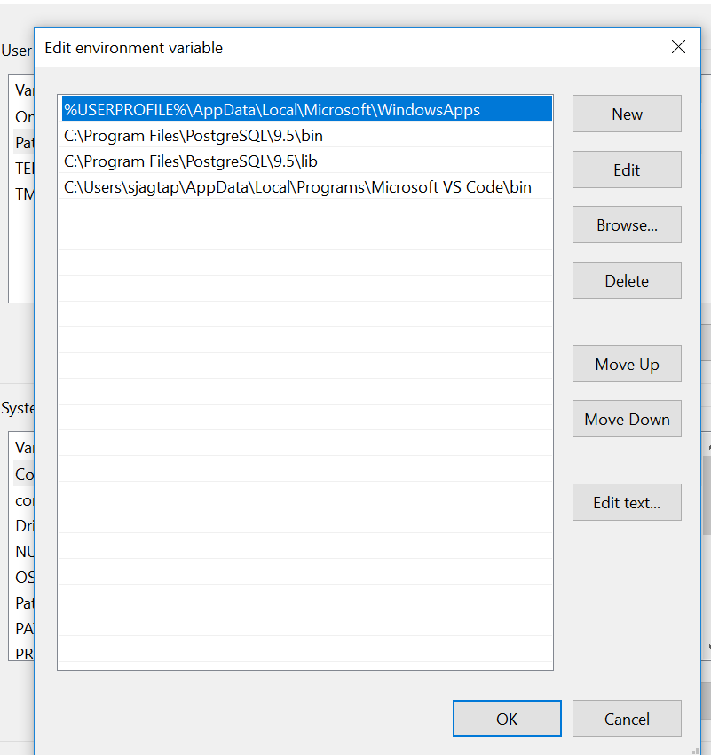

# PSQL과 연결

PSQL은 컴퓨터에 설치할 때 나타나는 명령줄 인터페이스 [!DNL Postgres] 입니다. 다음 지침에 따라 설치할 수 있습니다.

## Mac에 게시물 설치

터미널 창을 열고 다음 세 가지 명령을 실행합니다.

```shell
/usr/bin/ruby -e "$(curl -fsSL https://raw.githubusercontent.com/Homebrew/install/master/install)"
```

```shell
brew install postgres
```

```shell
which psql
```

이러한 명령을 실행한 후 다음을 확인해야 합니다.

```shell
/usr/local/bin/psql
```

## PC [!DNL Postgres] 에 설치

이 [!DNL Postgres] 위치 [에서 다운로드하여 설치합니다](https://www.postgresql.org/download/windows/).

경로 변수 편집:



&quot;[!DNL Postgres].&quot;가 포함된 두 줄을 추가합니다.

업데이트를 저장한 다음 명령 프롬프트를 열고 다음을 입력합니다.

```shell
psql -V
```

다음과 같은 것이 표시됩니다.

```shell
psql (PostgreSQL) 9.5.14
```

## Connect PSQL 및 [!DNL Query Service]

[ [!DNL Platform] Connect BI 도구] 페이지의 **[!UICONTROL UI로]** 돌아갑니다.

[PSQL **[!UICONTROL 명령 복사]** ]를 **[!UICONTROL 클릭합니다]**.


>[!IMPORTANT]
>
>PC를 사용하는 경우 텍스트 편집기를 사용하여 명령 문자열에서 줄 바꿈을 제거한 다음 문자열을 복사합니다. 또한 버전 12.0 이상을 사용하는 경우 연결 문자열 `PGGSSENCMODE=disable` 에 추가해야 합니다.

명령 문자열을 터미널 또는 명령 창에 붙여넣고 Enter 키를 누릅니다.

다음과 같은 결과가 표시됩니다.

```shell
psql (10.5, server 0.1.0)
SSL connection (protocol: TLSv1.2, cipher: ECDHE-RSA-AES256-GCM-SHA384, bits: 256, compression: off)
Type "help" for help.
all=>
```

버전 10.5 이상이 표시되지 않으면 해당 버전 이상을 다운로드해야 합니다.