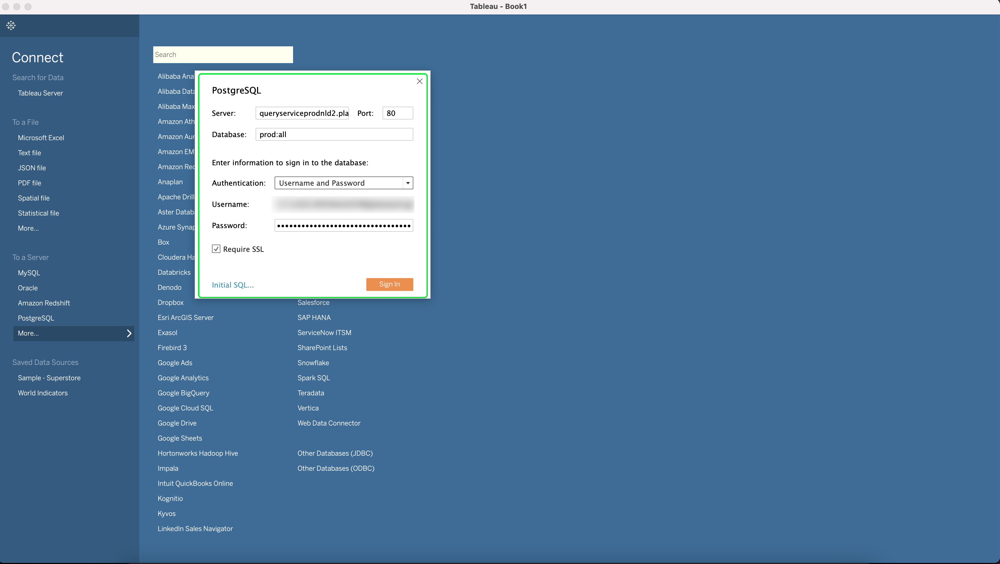

# 쿼리 서비스에 [!DNL Tableau] 연결

이 문서에서는 타블로와 Adobe Experience Platform [!DNL Query Service]을(를) 연결하는 단계를 다룹니다.

>[!NOTE]
>
> 이 안내서에서는 사용자가 이미 [!DNL Tableau]에 액세스할 수 있으며 인터페이스를 탐색하는 방법에 익숙하다고 가정합니다. [!DNL Tableau]에 대한 자세한 내용은 [공식 [!DNL Tableau] 설명서](https://help.tableau.com/current/pro/desktop/en-us/default.htm)에서 확인할 수 있습니다.

[!DNL Tableau]을 [!DNL Query Service]에 연결하려면 [!DNL Tableau]을 열고 **[!DNL To a Server]** 섹션에서 **[!DNL More]** 다음에 **[!DNL PostgreSQL]**&#x200B;를 선택합니다.

이제 Adobe Experience Platform에 연결할 값을 입력할 수 있습니다. 데이터베이스 이름, 호스트, 포트 및 로그인 자격 증명을 찾는 방법에 대한 자세한 내용은 플랫폼](https://platform.adobe.com/query/configuration)의 [자격 증명 페이지를 참조하십시오. 자격 증명을 찾으려면 [!DNL Platform]에 로그인한 다음 **[!UICONTROL Queries]** 뒤에 **[!UICONTROL Credentials]**&#x200B;를 선택합니다.

연결을 시도하기 전에 **[!UICONTROL SSL Required]** 상자를 선택했는지 확인합니다.

모든 자격 증명을 입력한 후 계속하려면 **[!DNL Sign In]**&#x200B;을 선택합니다.

이제 테이블 목록이 표시된 Adobe Experience Platform과 연결되었습니다.

## 다음 단계

이제 [!DNL Query Service]에 연결되었으므로 [!DNL Tableau]를 사용하여 쿼리를 작성할 수 있습니다. 쿼리를 작성하고 실행하는 방법에 대한 자세한 내용은 [쿼리 실행](../best-practices/writing-queries.md)에 대한 안내서를 참조하십시오.
