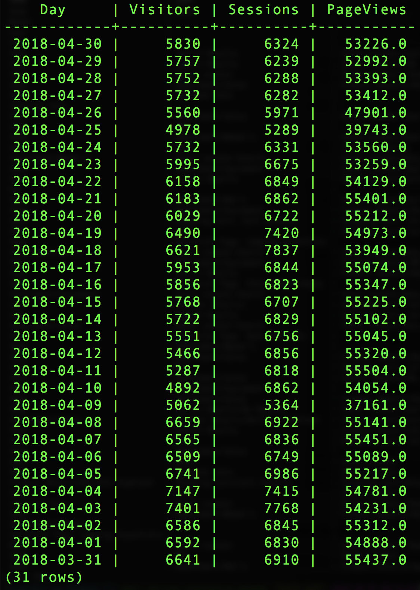

# Adobe 정의 함수 사용

Adobe의 주요 차별화 요소 중 하나는 경험 데이터와 고객이 해당 데이터를 사용하여 수행해야 하는 작업을 파악하는 것입니다. 이러한 이해를 통해 보다 손쉽게 작업을 수행할 수 있는 헬퍼 기능을 구축할 수 있습니다.

이 문서에서는 세 가지 주요 활동을 지원하는 ADF(Adobe 정의 함수)에 대해 [!DNL Analytics] 설명합니다.
- [세션](#sessionization)
- [속성](#attribution)
- [경로 지정](#pathing)

## 세션

이 보고서는 Adobe Analytics과 함께 찾은 방문 그룹을 `SESS_TIMEOUT()` 생성합니다. 시간 기반 그룹화가 비슷하지만 사용자 정의 가능한 매개 변수를 사용하여 수행됩니다.

**구문:**

`SESS_TIMEOUT(timestamp, timeout_in_seconds) OVER ([partition] [order] [frame])`

**반환:**

필드가 있는 구조 `(timestamp_diff, num, is_new, depth)`

### 행 수준 `SESS_TIMEOUT()` 및 출력 살펴보기

```sql
SELECT analyticsVisitor,
      session.is_new,
      session.timestamp_diff,
      session.num,
      session.depth
FROM  (
        SELECT endUserIDs._experience.aaid.id as analyticsVisitor,
        SESS_TIMEOUT(timestamp, 60 * 30)
        OVER (PARTITION BY endUserIDs._experience.aaid.id
        ORDER BY timestamp
        ROWS BETWEEN UNBOUNDED PRECEDING AND CURRENT ROW)
        AS session
        FROM your_analytics_table
        WHERE TIMESTAMP >= to_timestamp('2018-12-01') AND TIMESTAMP <= to_timestamp('2018-12-31')
      )
LIMIT 100;
```


### 방문자, 세션 및 페이지 보기가 있는 새 트렌드 보고서 만들기

```sql
SELECT
      date_format( from_utc_timestamp(timestamp, 'EDT') , 'yyyy-MM-dd') as Day,
      COUNT(DISTINCT analyticsVisitor ) as Visitors,
      COUNT(DISTINCT analyticsVisitor || session.num ) as Sessions,
      SUM( PageViews ) as PageViews
FROM
    (
      SELECT
          timestamp,
          endUserIDs._experience.aaid.id as analyticsVisitor,
          SESS_TIMEOUT(timestamp, 60 * 30)
      OVER (PARTITION BY endUserIDs._experience.aaid.id
      ORDER BY timestamp
      ROWS BETWEEN UNBOUNDED PRECEDING AND CURRENT ROW)
      AS session,
          web.webPageDetails.pageviews.value as PageViews
      FROM your_analytics_table
      WHERE TIMESTAMP >= to_timestamp('2018-12-01') AND TIMESTAMP <= to_timestamp('2018-12-31')
    )
GROUP BY Day 
ORDER BY Day DESC 
LIMIT 31;
```



## 속성

기여도 분석은 매출, 주문 또는 등록과 같은 지표나 전환을 마케팅 활동에 할당하는 방법입니다.

Adobe Analytics에서 속성 설정은 eVar와 같은 변수를 사용하여 구성되며 데이터를 인제스트할 때 생성됩니다.

에 있는 기여도 ADF를 [!DNL Query Service] 사용하면 이러한 할당을 쿼리 시간에 정의하고 생성할 수 있습니다.

이 예에서는 마지막 터치 기여도에 중점을 두지만 Adobe은 첫 번째 터치 속성을 제공합니다.

>[!NOTE]
>
>시간 초과 및 이벤트 기반 만료가 있는 기타 옵션은 향후 버전의 버전에서 사용할 수 있습니다 [!DNL Query Service].

**구문:**

`ATTRIBUTION_LAST_TOUCH(timestamp, [channel_name], column) OVER ([partition] [order] [frame])`

**반환:**

필드가 있는 구조 `(value)`

### 행 수준의 기여도 분석

```sql
SELECT
  endUserIds._experience.aaid.id,
  _experience.analytics.customDimensions.evars.evar10 as MemberLevel,
  ATTRIBUTION_LAST_TOUCH(timestamp, 'eVar10', _experience.analytics.customDimensions.evars.evar10)
      OVER(PARTITION BY endUserIds._experience.aaid.id
           ORDER BY timestamp
           ROWS BETWEEN UNBOUNDED PRECEDING AND CURRENT ROW).value
      AS LastMemberLevel,
  commerce.purchases.value as Orders
FROM your_analytics_table 
WHERE TIMESTAMP >= to_timestamp('2018-04-01') AND TIMESTAMP <= to_timestamp('2018-04-30')
LIMIT 50;
```


### 마지막 멤버 수준별 주문 분류 만들기(eVar10)

```sql
SELECT
  LastMemberLevel,
  SUM(Orders) as MemberLevelOrders
FROM 
(SELECT
  ATTRIBUTION_LAST_TOUCH(timestamp, 'eVar10', _experience.analytics.customDimensions.evars.evar10)
      OVER(PARTITION BY endUserIds._experience.aaid.id
           ORDER BY timestamp
           ROWS BETWEEN UNBOUNDED PRECEDING AND CURRENT ROW).value
      AS LastMemberLevel,
  commerce.purchases.value as Orders
FROM your_analytics_table 
WHERE TIMESTAMP >= to_timestamp('2018-04-01') AND TIMESTAMP <= to_timestamp('2018-04-30')
)
GROUP BY LastMemberLevel 
ORDER BY MemberLevelOrders DESC
LIMIT 25;
```


## 경로 지정

경로 지정은 고객이 사이트를 탐색하는 방법을 이해하는 데 도움이 됩니다. ADF와 `NEXT()` `PREVIOUS()` ADF는 이를 가능하게 합니다.

**구문:**

```sql
NEXT(key, [shift, [ignoreNulls]]) OVER ([partition] [order] [frame])
PREVIOUS(key, [shift, [ignoreNulls]]) OVER ([partition] [order] [frame])
```

**반환:**

필드가 있는 구조 `(value)`

### 현재 페이지 및 다음 페이지 선택

```sql
SELECT 
      endUserIds._experience.aaid.id,
      timestamp,
      web.webPageDetails.name,
      NEXT(web.webPageDetails.name, 1, true)
          OVER(PARTITION BY endUserIds._experience.aaid.id
              ORDER BY timestamp
              ROWS BETWEEN CURRENT ROW AND UNBOUNDED FOLLOWING).value
          AS next_pagename
FROM your_analytics_table
WHERE TIMESTAMP >= to_timestamp('2018-12-01') AND TIMESTAMP <= to_timestamp('2018-12-31') 
LIMIT 10;
```


### 세션 시작 시 상위 5개 페이지 이름에 대한 분류 보고서 만들기

```sql
  SELECT 
    PageName,
    PageName_2,
    PageName_3,
    PageName_4,
    PageName_5,
    SUM(PageViews) as PageViews
  FROM
    (SELECT
      PageName,
      NEXT(PageName, 1, true)
        OVER(PARTITION BY VisitorID, session.num
              ORDER BY timestamp
              ROWS BETWEEN CURRENT ROW AND UNBOUNDED FOLLOWING).value
        AS PageName_2,
      NEXT(PageName, 2, true)
        OVER(PARTITION BY VisitorID, session.num
              ORDER BY timestamp
              ROWS BETWEEN CURRENT ROW AND UNBOUNDED FOLLOWING).value
        AS PageName_3,
      NEXT(PageName, 3, true)
         OVER(PARTITION BY VisitorID, session.num
              ORDER BY timestamp
              ROWS BETWEEN CURRENT ROW AND UNBOUNDED FOLLOWING).value
        AS PageName_4,
      NEXT(PageName, 4, true)
         OVER(PARTITION BY VisitorID, session.num
              ORDER BY timestamp
              ROWS BETWEEN CURRENT ROW AND UNBOUNDED FOLLOWING).value
        AS PageName_5,
      PageViews,
      session.depth AS SessionPageDepth
    FROM
      (SELECT
        endUserIds._experience.aaid.id as VisitorID,
        timestamp,
        web.webPageDetails.pageviews.value AS PageViews,
        web.webPageDetails.name AS PageName,
        SESS_TIMEOUT(timestamp, 60 * 30) 
          OVER (PARTITION BY endUserIDs._experience.aaid.id 
                ORDER BY timestamp 
                ROWS BETWEEN UNBOUNDED PRECEDING AND CURRENT ROW) 
        AS session
      FROM your_analytics_table
      WHERE TIMESTAMP >= to_timestamp('2018-12-01') AND TIMESTAMP <= to_timestamp('2018-12-31')
    )
  WHERE SessionPageDepth=1
  GROUP BY PageName, PageName_2, PageName_3, PageName_4, PageName_5
  ORDER BY PageViews DESC
  LIMIT 100;
```


## Journey Orchestration용

다음 비디오에서는 Adobe Experience Platform 인터페이스와 PSQL 클라이언트에서 쿼리를 실행하는 방법을 보여 줍니다. 또한 이 비디오에서는 XDM 개체의 개별 속성과 관련된 예를 사용하여 Adobe에서 정의된 함수를 사용하고 CREATE TABLE AS SELECT(CTA)를 사용합니다.

>[!VIDEO](https://video.tv.adobe.com/v/29796?quality=12&learn=on)

