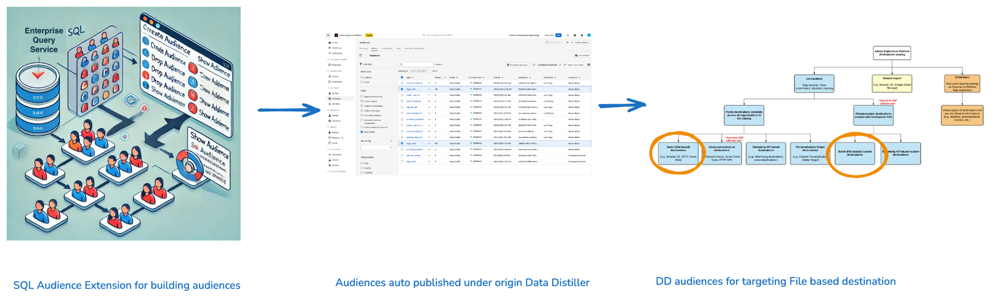

# SQL을 사용하여 대상 작성

이 문서에서는 Adobe Experience Platform의 Data Distiller에서 SQL 대상 확장을 사용하여 SQL 명령을 사용하여 대상을 만들고, 관리하고, 게시하는 방법에 대해 설명합니다.

SQL 대상 확장을 사용하여 기존 차원 엔티티를 포함하여 데이터 레이크의 데이터로 대상을 작성합니다. 이 확장을 사용하면 SQL을 사용하여 대상 세그먼트를 직접 정의할 수 있으므로 프로필에 원시 데이터를 사용하지 않고도 유연성을 확보할 수 있습니다. 이 방법을 사용하여 만든 대상은 Audience 작업 영역에 자동으로 등록되며, 여기에서 파일 기반 대상으로 추가 타깃팅할 수 있습니다.



## Data Distiller의 고객 생성 라이프사이클 {#audience-creation-lifecycle}

대상자를 효과적으로 관리하려면 다음 단계를 따르십시오. 생성된 대상은 대상 흐름에 원활하게 통합되므로 이러한 기본 대상에서 세그먼트를 작성하고 고객 타겟팅을 위한 파일 기반 대상을 타깃팅할 수 있습니다. 다음 SQL 명령을 사용하여 Adobe Experience Platform에서 [create](#create-audience), [modify](#add-profiles-to-audience) 및 [delete](#delete-audience) 대상을 만듭니다.

### 대상자 만들기 {#create-audience}

`CREATE AUDIENCE AS SELECT` 명령을 사용하여 새 대상을 정의합니다. 만든 대상은 데이터 집합에 저장되고 Data Distiller의 [!UICONTROL 대상] 작업 영역에 등록됩니다.

```sql
CREATE AUDIENCE table_name  
WITH (primary_identity='IdentitycolName', identity_namespace='Namespace for the identity used', [schema='target_schema_title']) 
AS (select_query)
```

**매개 변수**

다음 매개 변수를 사용하여 SQL 대상자 만들기 쿼리를 정의합니다.

| 매개변수 | 설명 |
|--------------------|------------------------------------------------------------------|
| `schema` | 선택 사항입니다. 쿼리로 만든 데이터 세트에 대한 XDM 스키마를 정의합니다. |
| `table_name` | 테이블 및 대상자의 이름입니다. |
| `primary_identity` | 대상자의 기본 ID 열을 지정합니다. |
| `identity_namespace` | ID 네임스페이스. |
| `select_query` | 대상을 정의하는 SELECT 문입니다. SELECT 쿼리의 구문은 [SELECT 쿼리](../sql/syntax.md#select-queries) 섹션에 있습니다. |

{style="table-layout:auto"}

**예:**

다음 예제에서는 SQL 대상자 만들기 쿼리를 구성하는 방법을 보여 줍니다.

```sql
CREATE Audience aud_test 
WITH (primary_identity=month, identity_namespace=queryService) 
AS SELECT month FROM profile_dim_date LIMIT 5;
```

**제한 사항:**

대상 생성을 위해 SQL을 사용할 때 다음 제한 사항에 유의하십시오.

- 기본 ID 열 **은(는) 루트 수준에 있어야**&#x200B;합니다.
- 새 배치는 기존 데이터 세트를 덮어씁니다. 추가 기능은 현재 지원되지 않습니다.
- 중첩된 속성은 현재 지원되지 않습니다.

### 기존 대상자에 프로필 추가 {#add-profiles-to-audience}

`INSERT INTO` 명령을 사용하여 기존 대상자에 프로필을 추가합니다.

```sql
INSERT INTO table_name 
SELECT select_query
```

**매개 변수**

아래 표에서는 `INSERT INTO` 명령에 필요한 매개 변수에 대해 설명합니다.

| 매개변수 | 설명 |
|----------------|--------------------------------------------------------------------------------|
| `table_name` | 대상자 만들기 명령의 일부로 만들어진 표의 이름입니다. |
| `select_query` | SELECT 문. SELECT 쿼리의 구문은 SELECT 쿼리 섹션에 있습니다. |

{style="table-layout:auto"}

**예:**

다음 예제에서는 `INSERT INTO` 명령을 사용하여 기존 대상자에 프로필을 추가하는 방법을 보여 줍니다.

```sql
INSERT INTO Audience aud_test 
SELECT month FROM profile_dim_date LIMIT 10;
```

### 대상자 삭제(대상자 삭제) {#delete-audience}

기존 대상자를 삭제하려면 `DROP AUDIENCE` 명령을 사용하십시오. 대상이 없는 경우 `IF EXISTS`을(를) 지정하지 않으면 예외가 발생합니다.

```sql
DROP AUDIENCE [IF EXISTS] [db_name.]table_name
```

**매개 변수**

테이블에 `DROP AUDIENCE` 명령에 필요한 매개 변수가 포함되어 있습니다.

| 매개변수 | 설명 |
|----------------|----------------------------------------------------------------------------------------|
| `IF EXISTS` | 선택 사항입니다. 지정하면 테이블을 찾을 수 없는 경우 예외가 발생하지 않습니다. |
| `db_name` | 대상 데이터 세트를 정규화하는 데 사용되는 데이터 그룹을 지정합니다. |
| `table_name` | 대상자 만들기 명령의 일부로 만들어진 표의 이름입니다. |

{style="table-layout:auto"}

**예:**

다음 예에서는 DROP AUDIENCE 명령을 사용하여 대상을 삭제하는 방법을 보여 줍니다.

```sql
DROP AUDIENCE IF EXISTS aud_test;
```

### 대상자 자동 게시 {#auto-publish-audiences}

SQL 확장을 사용하여 생성된 대상은 대상 작업 영역의 데이터 Distiller에서 자동으로 등록됩니다. 등록되면 이러한 대상을 타깃팅에 사용할 수 있으며 파일 기반 대상에서 사용할 수 있으므로 세그멘테이션 및 타깃팅 전략이 향상됩니다.


## 대상에 대상 활성화 {#activate-audiences}

대상을 [!DNL Amazon S3], [!DNL SFTP] 또는 [!DNL Azure Blob]과(와) 같은 파일 기반 대상으로 타깃팅하여 활성화하십시오. 보강된 대상 속성을 필요에 따라 세분화하고 필터링할 수 있습니다.


## 기능 설명 {#faqs}

이 섹션에서는 Data Distiller에서 SQL을 사용하여 외부 대상을 만들고 관리하는 방법에 대한 FAQ를 설명합니다.

+++질문과 답변을 표시하려면 선택

**질문**:

- 대상 생성은 플랫 데이터 세트에 대해서만 지원됩니까?

+++답변

중첩 데이터 세트도 지원되지만, 대상에서는 플랫 속성만 사용할 수 있습니다.

+++

- 대상을 만들면 단일 데이터 세트 또는 여러 데이터 세트가 발생합니까, 아니면 구성에 따라 달라집니까?

+++답변

대상과 데이터 세트 간에는 일대일 매핑이 있습니다.

+++

- 대상자 생성 중 생성된 데이터 세트가 프로필에 대해 표시됩니까?

+++답변

아니요. 대상자 생성 중에 생성된 데이터 세트는 프로필로 표시되지 않습니다.

+++

- 데이터 레이크에서 데이터 세트가 생성됩니까?

+++답변

예. 데이터 세트는 데이터 레이크에 생성됩니다.

+++

- 대상의 속성은 엔터프라이즈 배치 파일 기반 대상에서만 사용하도록 제한됩니까? (예 또는 아니요)

+++답변

예. 대상의 속성은 엔터프라이즈 배치 파일 기반 대상에서만 사용하도록 제한됩니다.

+++

- 데이터 Distiller 대상을 사용하는 대상의 대상을 만들 수 있습니까?

+++답변

예. 데이터 Distiller 대상을 사용하는 대상자 대상을 만들 수 있습니다.

+++

- 이러한 대상이 Adobe Journey Optimizer에 표시됩니까? 그렇지 않은 경우, 이 대상의 모든 구성원을 포함하는 새 대상을 규칙 빌더에서 만들면 어떻게 됩니까?

+++답변

Data Distiller 대상은 현재 Adobe Journey Optimizer에서 사용할 수 없습니다. Adobe Journey Optimizer에서 사용하려면 Adobe Journey Optimizer 규칙 빌더에서 새 대상을 만들어야 합니다.

+++

- 다른 일정으로 두 개의 데이터 Distiller 대상을 만들려면 어떻게 해야 합니까? 생성된 데이터 세트 수와 프로필에 대해 표시됩니까?

+++답변

각 대상에는 기본 데이터 세트가 있으므로 두 개의 데이터 세트가 만들어집니다. 그러나 이러한 데이터 세트는 프로필로 표시되지 않습니다. 두 데이터 세트는 개별 일정에 따라 관리됩니다.

+++

- 대상자를 삭제하려면 어떻게 해야 합니까?

+++답변

대상을 삭제하려면 명령줄 인터페이스에서 [`DROP AUDIENCE` 명령](#delete-audience)을(를) 사용하거나 [대상 작업 영역 빠른 작업](../../segmentation/ui/audience-portal.md#quick-actions)을(를) 사용합니다. 참고: 다운스트림 대상에 사용되거나 다른 대상에 종속된 대상은 삭제할 수 없습니다.

+++

- 프로필에 대상자를 게시하면 세그먼트 빌더 UI에서 해당 대상자를 얼마나 빨리 사용할 수 있으며 대상자에서는 언제 사용할 수 있습니까?

+++답변

프로필 스냅샷 내보내기가 완료되면 대상에서 프로필을 볼 수 있습니다.

+++

- 데이터 Distiller 대상은 외부 대상이므로 30일마다 삭제됩니까?

+++답변

예. 데이터 Distiller 대상은 외부 대상이므로 30일마다 삭제됩니다.

+++

- 데이터 Distiller 대상이 대상 인벤토리에 표시됩니까?

+++답변

예. 데이터 Distiller 대상은 원본 이름 &#39;데이터 Distiller&#39; 아래의 대상 인벤토리에 표시됩니다.

+++

+++

## 다음 단계

이 문서를 읽은 후에는 Data Distiller에서 SQL 대상 확장을 사용하여 SQL 명령을 사용하여 대상을 효과적으로 만들고, 관리하고, 게시하는 방법에 대해 알아보았습니다. 이제 고유한 비즈니스 요구 사항을 기반으로 대상 정의를 사용자 정의하고 다양한 대상에서 활성화하여 마케팅 전략 및 데이터 기반 결정을 최적화할 수 있습니다.

다음으로, 다음 설명서를 읽어 Platform 대상자 관리 전략을 추가로 개발하고 최적화할 수 있습니다.

- **대상 평가 살펴보기**: Adobe Experience Platform의 [대상 평가 방법에 대해 알아보기](../../segmentation/home.md#evaluate-segments): 실시간 업데이트를 위한 스트리밍 세분화, 예약된 처리나 온디맨드 처리를 위한 일괄 세분화 및 Edge Network에서 즉각적인 평가를 위한 에지 세분화.
- **대상과 통합**: Platform Destinations UI를 사용하여 [필요 시 파일을 일괄 처리 대상으로 내보내기](../../destinations/ui/export-file-now.md)하는 방법에 대한 안내서를 읽어 보십시오.
- **대상 성능 검토**: SQL 정의 대상이 다양한 채널에서 어떻게 작동하는지 분석합니다. 데이터 인사이트를 사용하여 대상 정의 및 타깃팅 전략을 조정하고 개선합니다. [대상 인사이트](../../dashboards/insights/audiences.md)의 문서를 읽고 Adobe Real-time Customer Data Platform의 대상 인사이트에 대한 SQL 쿼리에 액세스하고 조정하는 방법을 알아보십시오. 그런 다음 대상 대시보드를 사용자 정의하여 이러한 인사이트를 효과적으로 시각화하고 사용하여 보다 나은 의사 결정을 위해 고유한 인사이트를 만들고 원시 데이터를 실행 가능한 정보로 변환할 수 있습니다.
