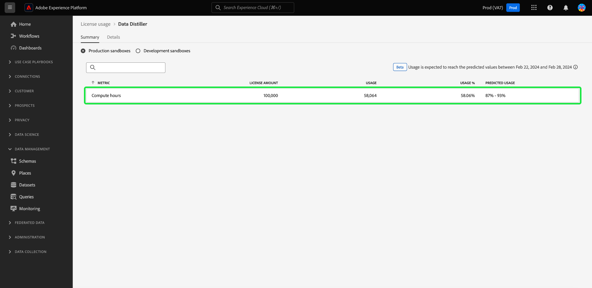

# 일괄 쿼리 라이선스 사용 모니터링 {#monitor-license-usage}

라이선스 사용량 대시보드는 구입한 각 제품에 대한 조직의 Query Service 라이선스 사용량 및 사용량 지표에 대한 세분화된 보고서를 제공합니다. 대시보드에 표시된 사용 가능한 지표에 대한 자세한 내용은 [라이선스 사용 대시보드 안내서](../../dashboards/guides/license-usage.md#available-metrics)를 참조하세요.

대시보드는 구매한 각 제품에 대한 사용 지표, 모든 프로덕션 또는 개발 샌드박스의 통합된 지표 사용 및 특정 샌드박스의 사용 지표를 제공합니다. 여기에 표시되는 정보는 Experience Platform 인스턴스의 일별 스냅샷 중에 캡처됩니다. 관리자는 사용 가능한 추가 세션이 없고 사용자가 유휴(비활성) 세션으로 인해 차단된 경우 유휴 쿼리 서비스 세션을 모니터링하고 종료하여 용량을 확보할 수 있습니다. 자세한 내용은 [쿼리 서비스 세션 관리](../ui/session-management.md)를 참조하십시오.

>[!NOTE]
>
>라이선스 사용 대시보드는 기본적으로 활성화되어 있지 않습니다. 대시보드를 볼 수 있으려면 사용자에게 &quot;라이선스 사용 대시보드 보기&quot; 권한이 부여되어야 합니다. 라이선스 사용 대시보드를 볼 수 있는 액세스 권한을 부여하는 단계는 [대시보드 사용 권한 안내서](../../dashboards/permissions.md)를 참조하세요.

## 시간 계산 {#compute-hours}

[!UICONTROL Compute hours] 지표는 일괄 쿼리용 Data Distiller 라이선스가 있는 고객에게만 적용됩니다. [!UICONTROL Compute hours]은(는) 일괄 처리 쿼리가 실행될 때 쿼리 서비스 엔진에서 데이터를 읽고 처리하고 데이터 레이크에 다시 쓰는 데 걸린 시간 측정값입니다.

조직의 구입한 라이선스를 기반으로 조직에서 사용할 수 있는 지표에 대한 자세한 내용은 [라이선스 사용 대시보드 안내서](../../dashboards/guides/license-usage.md)를 참조하세요.
