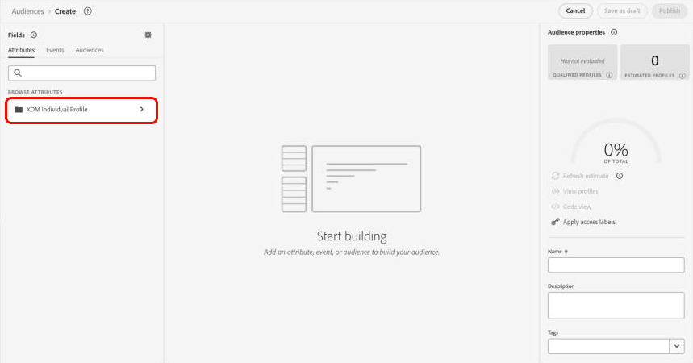

# Adobe Experience Platform Data Distiller으로 가치를 극대화하는 주요 팁 - OS656

이 페이지에는 Adobe Summit 세션 &quot;OS656 - Adobe Experience Platform Data Distiller으로 가치를 극대화하기 위한 주요 팁&quot;에서 학습한 내용을 적용할 수 있는 샘플 데이터 세트가 포함되어 있습니다. 실시간 고객 프로필 데이터를 강화하여 Adobe Real-Time Customer Data Platform 및 Journey Optimizer의 구현을 가속화하는 방법에 대해 알아봅니다. 이러한 풍부한 기능은 고객 행동 패턴에 대한 심층적인 통찰력을 활용하여 경험 전달 및 최적화를 위한 대상을 구축합니다.

Luma 사례 연구를 통해 사용자 행동 데이터를 분석하고 구매 패턴을 기반으로 고객 세분화를 위한 마케팅 분석 기술인 *최신성, 빈도, 통화(RFM)* 모델을 만듭니다.

## 사전 요구 사항

이 사용 사례를 실행하려면 [Data Distiller](./overview.md)에 대해 Adobe Experience Platform 인스턴스에 라이선스를 부여해야 합니다. 자세한 내용은 Adobe 담당자에게 문의하십시오.

쿼리를 실행하는 데 필요한 **조직의 테넌트 ID**&#x200B;도 알고 있어야 합니다. 테넌트 ID는 Experience Platform에 로그인할 때 @ 기호 바로 뒤에 표시되는 URL의 첫 번째 부분입니다.

예를 들면 다음 URL의 경우

```http
https://experience.adobe.com/#/@pfreportingonprod/sname:prod/platform/home
```

테넌트 ID는 `pfreportingonprod`입니다.

## RFM 모델 개요 {#rfm-overview}

최신성(R), 빈도(F) 및 통화(M)의 약자인 RFM은 고객 세분화 및 분석에 대한 데이터 기반 접근 방식입니다. 이 방법론은 고객 행동의 세 가지 주요 측면, 즉 고객이 얼마나 최근에 구매했는지, 얼마나 자주 참여했는지, 얼마나 소비했는지 등을 평가합니다. 이러한 요소를 수량화함으로써 기업은 고객 세그먼트에 대한 실행 가능한 통찰력을 얻고 개별 고객 요구 사항을 보다 잘 충족하는 타기팅된 마케팅 전략을 개발할 수 있습니다.

## RFM 모델을 사용하여 고객 행동 이해 {#understand-customer-behavior}

RFM 모델은 세 가지 주요 매개 변수를 사용하여 트랜잭션 행동을 기반으로 고객을 세그먼트화합니다.

- **최신성**&#x200B;은(는) 고객의 마지막 구매 이후 시간을 측정하여 참여 수준과 향후 구매 가능성을 나타냅니다.
- **빈도**&#x200B;는 고객의 상호 작용 빈도를 추적하여 충성도와 지속적인 참여를 명확하게 보여 줍니다.
- **통화 가치**&#x200B;은(는) 고객의 총 지출을 평가하여 비즈니스에 대한 전반적인 가치를 강조합니다.

이러한 요소를 결합하여 기업은 각 고객에게 숫자 점수(일반적으로 `1`에서 `4` 사이의 범위)를 할당합니다. 점수가 낮을수록 더 유리한 결과를 나타냅니다. 예를 들어, 최근 활동, 높은 참여도 및 상당한 지출을 보여 주는 모든 카테고리에서 `1`을(를) 평가하는 고객이 가장 좋은 점수를 받는 것으로 간주됩니다.

## RFM 모델의 이점 및 제한 사항 {#benefits-and-limitations}

모든 마케팅 모델링 기법에는 장점과 제한 사항을 모두 제공하는 트레이드 오프가 포함됩니다. RFM 모델링은 고객 행동을 이해하고 마케팅 전략을 구체화하는 데 유용한 도구입니다. 이 솔루션의 장점으로는 고객을 세분화하여 메시지를 개인화하고 매출을 최적화하며 응답률, 유지, 만족도 및 CLTV(고객 생애 가치)를 향상시키는 것이 있습니다.

그러나 RFM 모델링에는 한계가 있습니다. 최신성, 빈도 및 통화 가치에 따라 세그먼트 내의 일관성을 가정하므로 고객 행동이 지나치게 단순화될 수 있습니다. 또한 모델은 이러한 요소에 동일한 가중치를 부여하여 고객 가치를 잘못 나타낼 수 있습니다. 또한 제품별 특성이나 고객 선호도 등 컨텍스트를 고려하지 않아 구매 행동이 잘못 해석될 수 있습니다.

## 동적 RFM 점수 기반 SQL 대상자 작성 {#build-a-dynamic-rfm-audience}

다음 인포그래픽에서는 이 자습서에서 설명한 RFM SQL 대상자 만들기 워크플로우에 대한 높은 수준의 개요를 제공합니다.


Luma 사례 연구를 시작하기 전에 샘플 데이터 세트를 수집해야 합니다. 먼저 [링크를 선택하여 `luma_web_data.zip` 데이터 집합을 로컬로 다운로드합니다](../resources/luma_web_data.zip). 샘플 데이터 세트는 사용 사례에 맞게 압축된 .zip 포맷의 csv 파일입니다. Adobe Acrobat 또는 운영 체제의 기본 제공 유틸리티와 같은 신뢰할 수 있는 파일 추출 도구를 사용하여 이 ZIP 파일의 압축을 해제합니다. 일반적으로 Adobe Analytics, Adobe Commerce 또는 Adobe 웹/모바일 SDK에서 데이터를 소스화합니다.

이 자습서에서는 Data Distiller을 사용하여 관련 이벤트 및 필드를 표준화된 CSV 형식으로 추출하게 됩니다. 효율성과 사용 편의성을 위해 평탄한 데이터 구조를 유지하면서 필수 분야만 포함하는 것이 목표다.

### 1단계: CSV 데이터를 Experience Platform에 업로드 {#upload-csv-data}

CSV 파일을 Adobe Experience Platform에 업로드하려면 다음 단계를 따르십시오.

#### CSV 파일에서 데이터 세트 만들기 {#create-a-dataset}

Experience Platform UI의 왼쪽 탐색 레일에서 **[!UICONTROL 데이터 세트]**&#x200B;를 선택한 다음 **[!UICONTROL 데이터 세트 만들기]**&#x200B;를 선택합니다. 그런 다음 사용 가능한 옵션에서 **[!UICONTROL CSV 파일에서 데이터 집합 만들기]**&#x200B;를 선택합니다.

[!UICONTROL 데이터 집합 구성] 패널이 나타납니다. **[!UICONTROL 이름]** 필드에서 데이터 세트 이름을 &quot;luma_web_data&quot;로 입력하고 **[!UICONTROL 다음]**&#x200B;을(를) 선택합니다.

[!UICONTROL 데이터 추가] 패널이 나타납니다. CSV 파일을 **[!UICONTROL 데이터 추가]** 상자로 끌어서 놓거나 **[!UICONTROL 파일 선택]**&#x200B;을 선택하여 파일을 찾아 업로드하십시오.

이 프로세스에 대한 자세한 내용은 데이터 세트 UI 안내서의 [일괄 처리 수집 자습서](../../ingestion/tutorials/ingest-batch-data.md) 및 [데이터 세트 만들기 워크플로우](../../catalog/datasets/user-guide.md#create)를 참조하십시오.

#### 업로드 검토 및 완료 {#review-and-complete-upload}

파일이 업로드되면 UI 하단에 데이터 미리보기가 나타납니다. 업로드를 완료하려면 **[!UICONTROL 완료]**&#x200B;를 선택하십시오.


&quot;luma_web_data&quot; 데이터 세트에 대한 데이터 세트 활동 보기가 나타납니다. CSV 파일의 수동 업로드
은(는) 배치로 수집되고 [!UICONTROL 배치 ID]로 식별됩니다. 오른쪽의 패널에 테이블 이름이 `luma_web_data`(으)로 표시됩니다.

>[!TIP]
>
>Data Distiller에서 쿼리를 작성할 때 데이터 세트 이름 대신 테이블 이름을 사용하십시오. 데이터 세트 이름은 UI에서 탐색하는 데만 사용됩니다.


<!--  
My table name is; luma_web_data_20250312_235611_817 Should we explain the suffix? 
-->

데이터 처리가 완료되면 오른쪽 상단에서 [!UICONTROL 데이터 집합 미리 보기]를 선택하여 데이터 집합을 미리 봅니다. 데이터 세트 미리보기가 표시되는 방식은 다음과 같습니다.


#### 스키마 고려 사항 {#schema-considerations}

데이터를 원시 CSV 파일로 가져오기 때문에 구조화된 XDM 스키마(예: 레코드, 이벤트 또는 B2B 스키마)는 필요하지 않습니다. 대신 데이터 세트는 임시 스키마를 사용합니다.

>[!TIP]
>
>애드혹 스키마는 단일 데이터 세트에서만 사용할 수 있도록 네임스페이스가 지정된 필드가 있는 XDM 스키마입니다. 임시 스키마는 Experience Platform의 다양한 데이터 수집 워크플로우에서 사용되며 특정 종류의 소스 연결을 만듭니다.

Data Distiller은 모든 스키마 유형을 지원하지만, 실시간 고객 프로필에 수집하기 위한 최종 데이터 세트는 레코드 XDM 스키마를 사용합니다.

### 2단계: 데이터 레이크에 연결하고 사용 가능한 데이터 세트를 탐색합니다 {#connect-to-the-data-lake-and-explore-datasets}

다음 단계는 정확성과 무결성을 보장하기 위해 Adobe Experience Platform 데이터 레이크에서 데이터를 탐색하는 것입니다. 의미 있는 통찰력을 만들려면 데이터가 정확하고 완전해야 하지만 데이터 전송 중에 오류, 불일치 또는 누락된 값이 발생할 수 있습니다. 이를 통해 데이터 검증과 탐구가 필수적으로 이루어지게 된다.

>[!TIP]
>
>데이터 레이크는 분석 및 처리를 위해 이벤트 로그, 클릭스트림 데이터 및 대량 수집된 레코드와 같은 처리되지 않은 원시 데이터를 저장합니다. 프로필 스토어에는 실시간 개인화 및 활성화를 지원하기 위해 ID가 결합된 이벤트 및 속성 정보를 포함하여 고객 식별 가능한 데이터가 포함되어 있습니다.

Data Distiller 를 사용하여 다양한 작업을 통해 데이터 세트 품질과 완전성을 확인합니다. 수집 중에 데이터가 정확하게 변환되었는지 확인하려면 `SELECT`개의 쿼리를 실행하여 데이터를 검사, 유효성 검사 및 분석하십시오. 이 프로세스는 불일치, 불일치 또는 누락된 정보를 식별하고 해결하는 데 도움이 됩니다.

#### 기본 탐색 쿼리 수행 {#basic-exploration-queries}

Adobe Experience Platform UI의 왼쪽 탐색 레일에서 **[!UICONTROL 쿼리]**&#x200B;를 선택한 다음 **[!UICONTROL 쿼리 만들기]**&#x200B;를 선택합니다. 쿼리 편집기가 나타납니다.

다음 쿼리를 편집기에 붙여 넣고 실행합니다.

```sql
SELECT * FROM luma_web_data; 
```

쿼리 결과는 **[!UICONTROL 결과]** 탭의 쿼리 편집기 아래에 표시됩니다. 새 대화 상자에서 결과를 확장하려면 **[!UICONTROL 결과 보기]**&#x200B;를 선택합니다. 결과는 아래 이미지와 유사합니다.


자세한 내용은 [쿼리 실행에 대한 일반 지침](../best-practices/writing-queries.md) 문서를 참조하십시오.

#### 주문에 집중하고 취소된 거래 제외 {#focus-orders-exclude-cancelled}

RFM 모형은 완료된 구매를 기준으로 최신성, 빈도수, 통화가치 등을 평가한다. 페이지 보기 수 및 체크아웃 상호 작용과 같은 비트랜잭션 이벤트는 분석에서 제외됩니다. 또한 취소된 주문은 유효한 RFM 계산에 기여하지 않으며 다른 처리 접근 방식이 필요하므로 제거해야 합니다.

정확성을 보장하려면

- 취소와 연결된 구매 ID를 식별하고 `GROUP BY`을(를) 사용하여 그룹화합니다.
- 데이터 세트에서 이러한 구매 ID를 제외합니다.
- 데이터를 필터링하여 완료된 주문만 유지합니다.

다음 쿼리는 데이터 세트에서 취소된 주문을 식별하고 제외하는 방법을 보여 줍니다.

이 첫 번째 쿼리는 취소와 연결된 null이 아닌 모든 구매 ID를 선택하고 `GROUP BY`을(를) 사용하여 집계합니다. 결과 구매 ID는 데이터 세트에서 제외해야 합니다.

```sql
CREATE VIEW orders_cancelled
AS
  SELECT purchase_id
  FROM   luma_web_data
  WHERE  event_type IN ( 'order', 'cancellation' )
         AND purchase_id IS NOT NULL
  GROUP  BY purchase_id
  HAVING Count(DISTINCT event_type) = 2; 
```

두 번째 쿼리는 이 제외된 세트에 없는 구매 ID만 검색합니다.

```sql
SELECT *
FROM   luma_web_data
WHERE  purchase_id NOT IN (SELECT purchase_id
                           FROM   orders_cancelled)
        OR purchase_id IS NULL; 
```

세 번째 쿼리는 데이터 집합에서 모든 비순서 이벤트를 제거합니다.

```sql
SELECT *
FROM   luma_web_data
WHERE  event_type = 'order'
       AND purchase_id NOT IN (SELECT purchase_id
                               FROM   orders_cancelled); 
```

### 3단계: Data Distiller 함수를 사용하여 데이터 강화 {#enrich-the-data}

다음으로, Data Distiller을 사용하여 고객 데이터를 추출 및 변환하고, RFM 점수를 생성하고, 트랜잭션을 집계하고, 구매 행동을 통해 고객을 세그먼트화합니다. 다음 단계에 따라 최신성, 빈도 및 통화(RFM) 값을 계산하고 대상 모델을 빌드하며 활성화를 위한 인사이트를 준비합니다.

#### 각 고유 사용자 ID에 대한 RFM 점수 계산

RFM 점수를 계산하려면 필드 필터링을 사용하여 원시 데이터에서 키 필드를 추출합니다.

모든 주문에는 전자 메일 로그인이 필요하므로 다음 쿼리는 전자 메일을 `userid`(으)로 선택하여 이전 섹션의 논리를 기반으로 합니다. Data Distiller은 `TO_DATE` 함수를 적용하여 타임스탬프를 날짜 형식으로 변환합니다. `total_revenue` 필드는 각 거래의 가격을 나타내며 나중에 각 `userid`에 대해 합산하여 집계됩니다.

```sql
SELECT email AS userid, 
       purchase_id AS purchaseid, 
       price_total AS total_revenue, -- reflects the price for each individual transaction
       TO_DATE(timestamp) AS purchase_date -- converts timestamp to date format
FROM luma_web_data 
WHERE event_type = 'order' 
      AND purchase_id NOT IN (SELECT purchase_id FROM orders_cancelled) 
      AND email IS NOT NULL;
```

결과는 아래 이미지와 같습니다.


그런 다음 `TABLE`을(를) 만들어 파생 데이터 집합에 이전 쿼리의 결과를 저장합니다. `TABLE`을(를) 만들려면 다음 명령을 복사하여 쿼리 편집기에 붙여 넣으십시오.

```sql
CREATE TABLE IF NOT EXISTS order_data AS
  SELECT email              AS userid,
         purchase_id        AS purchaseid,
         price_total        AS total_revenue,
         To_date(timestamp) AS purchase_date
  FROM   luma_web_data
  WHERE  event_type = 'order'
         AND purchase_id NOT IN (SELECT purchase_id FROM orders_cancelled)
         AND email IS NOT NULL; 
```

결과는 다음 이미지와 비슷하게 보이지만 다른 데이터 세트 ID를 사용합니다.


가장 좋은 방법은 간단한 탐색 쿼리를 실행하여 데이터 세트의 데이터를 검사하는 것입니다. 다음 구문을 사용하여 데이터를 볼 수 있습니다.

```sql
SELECT * FROM order_data;
```


#### 트랜잭션을 집계하여 RFM 값 생성 {#aggregate-transactions}

RFM 값을 계산하기 위해 이 쿼리는 각 사용자에 대한 트랜잭션을 집계합니다.

`DATEDIFF(CURRENT_DATE, MAX(purchase_date)) AS days_since_last_purchase` 함수는 각 사용자에 대해 가장 최근 구매한 이후 일 수를 계산합니다.

다음 SQL 쿼리를 사용합니다.

```sql
SELECT 
    userid, 
    DATEDIFF(CURRENT_DATE, MAX(purchase_date)) AS days_since_last_purchase, 
    COUNT(purchaseid) AS orders, 
    SUM(total_revenue) AS total_revenue 
FROM order_data 
GROUP BY userid;
```

결과는 아래 이미지와 같습니다.


쿼리 효율성 및 재사용 가능성을 높이려면 집계된 RFM 값을 저장할 `VIEW`을(를) 만드십시오.

```sql
CREATE VIEW rfm_values
AS
  SELECT userid,
         DATEDIFF(current_date, MAX(purchase_date)) AS days_since_last_purchase,
         COUNT(purchaseid)                          AS orders,
         SUM(total_revenue)                         AS total_revenue
  FROM   order_data
  GROUP BY userid; 
```

결과는 다음 이미지와 유사하지만 ID는 다릅니다.


다시 한 번 가장 좋은 방법은 간단한 탐색 쿼리를 실행하여 보기에서 데이터를 검사하는 것입니다. 다음 문을 사용하십시오.

```sql
SELECT * FROM rfm_values;
```

다음 스크린샷은 각 사용자에 대해 계산된 RFM 값을 표시하는 쿼리의 샘플 결과를 보여 줍니다. 결과는 `CREATE VIEW` 쿼리의 보기 ID에 해당합니다.


#### RFM 다차원 큐브 생성 {#generate-multi-dimensional-cube}

RFM 점수를 기반으로 고객을 세그먼트화하려면 RFM 다차원 큐브를 사용하십시오. `NTILE` 창 함수는 값을 등급 버킷으로 정렬하고 각 차원을 4개의 동일한 그룹(사분위수)으로 나누어 구조화된 세그먼테이션을 허용합니다.

- 최신성: 최근 구매 횟수(`days_since_last_purchase`)로 고객의 순위가 매겨집니다. 가장 최근에 구매한 사람들은 1그룹에 속하며, 가장 오랫동안 구매하지 않은 사람들은 4그룹에 속한다.
- 빈도: 고객은 구매 빈도(`ORDER BY orders DESC`)로 등급이 매겨집니다. 가장 빈도가 높은 구매자는 그룹 1에 속하고, 가장 빈도가 낮은 구매자는 그룹 4에 속한다.
- 통화: 고객은 총 지출(`total_revenue`)로 순위가 매겨집니다. 가장 높은 소비자는 그룹 1에 속하고, 가장 낮은 소비자는 그룹 4에 속합니다.

다음 SQL 쿼리를 실행하여 RFM 다차원 큐브를 생성합니다.

```sql
SELECT userid,
       days_since_last_purchase,
       orders,
       total_revenue,
       5 - NTILE(4)
             OVER (
               ORDER BY days_since_last_purchase DESC) AS recency,
       NTILE(4)
         OVER (
           ORDER BY orders DESC)                       AS frequency,
       NTILE(4)
         OVER (
           ORDER BY total_revenue DESC)                AS monetization
FROM rfm_values; 
```

결과는 아래 이미지와 같습니다.


그런 다음 다음 다음 문을 사용하여 이 데이터에 대한 `VIEW`을(를) 만듭니다.

RFM 다차원 큐브에 대한 `VIEW`을(를) 만들면 미리 세그먼트화된 데이터를 저장하여 효율성을 향상할 수 있으므로 향후 쿼리에서 RFM 점수를 다시 계산할 필요가 없습니다. SQL 문을 단순화하고 데이터 일관성을 보장하며 추가 분석을 위한 재사용성을 향상시킵니다.

```sql
CREATE OR replace VIEW rfm_scores
AS
  SELECT userid,
         days_since_last_purchase,
         orders,
         total_revenue,
         5 - NTILE(4)
               over (
                 ORDER BY days_since_last_purchase DESC) AS recency,
         NTILE(4)
           over (
             ORDER BY orders DESC)                       AS frequency,
         NTILE(4)
           over (
             ORDER BY total_revenue DESC)                AS monetization
  FROM   rfm_values;
```

결과는 다음 이미지와 비슷하게 보이지만 보기 ID는 다릅니다.


#### 모델 RFM 세그먼트 {#model-rfm-segments}

RFM 점수가 계산되면 고객은 다음 6개의 우선 순위 세그먼트로 분류될 수 있습니다.

1. `Core`: 최신성, 빈도 및 통화 가치가 높은 우수 고객(최신성 = 1, 빈도 = 1, 통화 = 1).
1. `Loyal`: 일관되지만 상위 지출자가 아닌 빈번한 고객(빈도 = 1).
1. `Whales`: 최신성 및 빈도에 관계없이 최고 지출자(통화 = 1).
1. `Promising`: 자주 사용하지만 더 적은 지출자(빈도 = 1, 2, 3; 통화 = 2, 3, 4).
1. `Rookies`: 빈도가 낮은 새 고객(최신성 = 1, 빈도 = 4).
1. `Slipping`: 활동이 감소한 이전 단골 고객(최신성 = 2, 3, 4, 빈도 = 4).

액세스 및 재사용을 간소화하려면 RFM 세그먼트, 점수 및 값을 저장하는 `VIEW`을(를) 만드십시오.

다음 SQL의 `CASE` 문은 RFM 점수를 기반으로 고객을 세그먼트로 분류하고 결과를 `RFM_Model` 변수에 할당합니다.

+++SQL을 보려면 선택

```sql
CREATE OR replace VIEW rfm_model_segment
AS
  SELECT userid,
         days_since_last_purchase,
         orders,
         total_revenue,
         recency,
         frequency,
         monetization,
         CASE
           WHEN recency = 1
                AND frequency = 1
                AND monetization = 1 THEN '1. Core - Your Best Customers'
           WHEN recency IN( 1, 2, 3, 4 )
                AND frequency = 1
                AND monetization IN ( 1, 2, 3, 4 ) THEN
           '2. Loyal - Your Most Loyal Customers'
           WHEN recency IN( 1, 2, 3, 4 )
                AND frequency IN ( 1, 2, 3, 4 )
                AND monetization = 1 THEN
           '3. Whales - Your Highest Paying Customers'
           WHEN recency IN( 1, 2, 3, 4 )
                AND frequency IN ( 1, 2, 3 )
                AND monetization IN( 2, 3, 4 ) THEN
           '4. Promising - Faithful customers'
           WHEN recency = 1
                AND frequency = 4
                AND monetization IN ( 1, 2, 3, 4 ) THEN
           '5. Rookies - Your Newest Customers'
           WHEN recency IN ( 2, 3, 4 )
                AND frequency = 4
                AND monetization IN ( 1, 2, 3, 4 ) THEN
           '6. Slipping - Once Loyal, Now Gone'
         END RFM_Model
  FROM   rfm_scores; 
```

+++

생성된 `VIEW`은(는) 이전 생성과 동일한 구조를 따르지만 다른 ID를 사용합니다.

가장 좋은 방법은 간단한 탐색 쿼리를 실행하여 보기에서 데이터를 검사하는 것입니다. 다음 문을 사용하십시오.

<!-- Double check this SQL. I wrote it.- it was absent fom the KT doc. -->

```sql
SELECT * FROM rfm_model_segment;
```

<!-- Perhaps these VIEW results could be chopped? -->

다음 스크린샷에는 세그먼트화된 RFM 모델 데이터를 보여 주는 `SELECT * FROM rfm_model_segment;` 쿼리의 샘플 결과가 표시됩니다. 출력은 RFM 점수를 기반으로 할당된 고객 세그먼트를 포함하여 생성된 `VIEW`의 구조를 반영합니다.


### 4단계: SQL을 사용하여 RFM 데이터를 실시간 고객 프로필로 일괄 수집 {#sql-batch-ingest-rfm-data}

그런 다음 RFM이 풍부한 고객 데이터를 실시간 고객 프로필로 일괄 수집합니다. 먼저 프로필이 활성화된 데이터 세트를 만들고 SQL을 사용하여 변환된 데이터를 삽입합니다.

#### RFM 속성을 저장할 파생 데이터 세트 만들기 {#create-a-derived-dataset}

이 데이터 세트는 프로필 스토어에 수집되므로 파티션 키가 필요합니다.

>[!TIP]
>
>기본 ID 필드는 효율적인 데이터 배포, 검색 및 쿼리 성능을 보장하는 파티션 키 역할을 합니다. ID 네임스페이스로 기본 ID를 할당하면 관련 프로필 레코드가 함께 그룹화되어 프로필 스토어 내에서 조회 및 업데이트가 최적화됩니다.

RFM 속성을 저장하고 기본 ID를 할당하기 위해 빈 데이터 세트를 만듭니다.

이 SQL 문에서는

- `userId TEXT PRIMARY IDENTITY NAMESPACE 'Email'`: &#39;Email&#39; 네임스페이스를 사용하여 userId 열을 기본 ID로 정의합니다&#x200B;.
- `days_since_last_purchase INTEGER`: 사용자의 마지막 구매 이후 일 수를 저장합니다&#x200B;.
- `orders INTEGER`: 사용자가 수행한 총 주문 수를 나타냅니다&#x200B;.
- `total_revenue DECIMAL(18, 2)`: 최대 18자리 및 소수점 두 자리까지 정밀하게 사용자가 생성한 총 매출을 캡처합니다&#x200B;.
- `recency INTEGER, frequency INTEGER, monetization INTEGER`: 사용자의 해당 RFM 점수를 저장합니다&#x200B;.
- `rfm_model TEXT`: 사용자에게 할당된 RFM 세그먼트 분류를 보관합니다&#x200B;.
- `WITH (LABEL = 'PROFILE')`: 수집된 데이터가 실시간 고객 프로필을 빌드하는 데 기여하도록 Experience Platform에서 프로필을 사용할 수 있도록 테이블을 표시합니다&#x200B;.

>[!NOTE]
>
>&#39;이메일&#39; 네임스페이스는 Adobe Experience Platform의 [표준 ID 네임스페이스](../../identity-service/features/namespaces.md#standard)입니다. ID 필드를 정의할 때 정확한 ID 확인을 용이하게 하기 위해 적절한 네임스페이스가 지정되었는지 확인하십시오. &#x200B;
>
>ID 필드 정의 및 ID 네임스페이스 작업에 대한 자세한 내용은 [ID 서비스 설명서](../../identity-service/home.md) 또는 [Adobe Experience Platform UI에서 ID 필드 정의](../../xdm/ui/fields/identity.md)에 대한 안내서를 참조하십시오.

쿼리 편집기는 순차적 실행을 지원하기 때문에 단일 세션에 테이블 만들기 및 데이터 삽입 쿼리를 포함할 수 있습니다. 다음 SQL은 먼저 RFM 속성을 저장할 프로필 사용 테이블을 만듭니다. 그런 다음 `rfm_model_segment`에서 RFM이 풍부한 고객 데이터를 `adls_rfm_profile` 테이블에 삽입하여 실시간 고객 프로필 수집에 필요한 테넌트별 네임스페이스로 각 레코드를 구조화합니다.

쿼리 편집기는 순차적 실행을 지원하기 때문에 단일 세션에서 테이블 만들기 및 데이터 삽입 쿼리를 실행할 수 있습니다. 다음 SQL은 먼저 RFM 속성을 저장할 프로필 사용 테이블을 만듭니다. 그런 다음 `rfm_model_segment`에서 RFM이 풍부한 고객 데이터를 `adls_rfm_profile` 테이블에 삽입하여 각 레코드가 테넌트별 네임스페이스(`_{TENANT_ID}`) 아래에 올바르게 구성되도록 합니다. 이 네임스페이스는 실시간 고객 프로필 수집 및 정확한 ID 해결에 필수적입니다.

>[!IMPORTANT]
>
>`_{TENANT_ID}`을(를) 조직의 테넌트 네임스페이스로 바꾸십시오. 이 네임스페이스는 조직에 고유하며 수집된 모든 데이터가 Adobe Experience Platform에 올바르게 할당되도록 합니다.

```sql
CREATE TABLE IF NOT EXISTS adls_rfm_profile (
    userId TEXT PRIMARY IDENTITY NAMESPACE 'Email',
    days_since_last_purchase INTEGER,
    orders INTEGER,
    total_revenue DECIMAL(18, 2),
    recency INTEGER,
    frequency INTEGER,
    monetization INTEGER,
    rfm_model TEXT
) WITH (LABEL = 'PROFILE');

INSERT INTO adls_rfm_profile
SELECT STRUCT(userId, days_since_last_purchase, orders, total_revenue, recency,
              frequency, monetization, rfm_model) _{TENANT_ID}
FROM rfm_model_segment;
```

이 쿼리의 결과는 이 플레이북의 이전 데이터 세트 생성과 유사하지만 다른 ID를 사용합니다.

데이터 세트를 만든 후 **[!UICONTROL 데이터 세트]** > **[!UICONTROL 찾아보기]** > `adls_rfm_profile`(으)로 이동하여 데이터 세트가 비어 있는지 확인합니다.


**[!UICONTROL 스키마]** > **[!UICONTROL 찾아보기]** > `adls_rfm_profile`(으)로 이동하여 새로 만든 데이터 집합과 해당 사용자 지정 필드 그룹의 XDM 개별 프로필 스키마 다이어그램을 볼 수도 있습니다.


#### 새로 만든 파생 데이터 세트에 데이터 삽입 {#insert-data-into-derived-dataset}

그런 다음 실시간 고객 프로필에 대해 활성화된 `adls_rfm_profile`에 `rfm_model_segment VIEW`의 데이터를 삽입합니다.

`INSERT` 문의 `SELECT` 쿼리에 있는 필드 순서가 `rfm_model_segment`의 구조와 정확히 일치하는지 확인하십시오. 이렇게 정렬하면 `rfm_model_segment`의 값이 대상 테이블의 해당 필드에 올바르게 삽입됩니다. 원본 필드와 대상 필드 간의 정렬이 잘못되면 데이터가 일치하지 않을 수 있습니다.

>[!NOTE]
>
>이 쿼리는 프로세스를 실행하기 위해 클러스터를 회전해야 하는 배치 모드에서 실행됩니다. 이 작업은 데이터 레이크에서 데이터를 읽고 클러스터 내에서 처리한 다음 결과를 데이터 레이크에 다시 기록합니다.

```sql
INSERT INTO adls_rfm_profile
SELECT Struct(userid, days_since_last_purchase, orders, total_revenue, recency,
              frequency, monetization, rfm_model) _{TENANT_ID}
FROM   rfm_model_segment; 
```

완료되면 쿼리 출력이 콘솔에 &quot;쿼리 완료&quot;를 표시합니다.

### 5단계: 일괄 처리를 위해 쿼리 예약 {#schedule-the-query}

이제 SQL 코드에서 파생된 데이터 세트를 생성하여 실시간 고객 프로필에 사용하도록 설정했으므로 다음 단계는 특정 간격으로 쿼리가 실행되도록 예약하여 업데이트를 자동화하는 것입니다. 자동 데이터 세트 업데이트를 통해 수동으로 실행할 필요가 없습니다.

#### 쿼리 실행 예약

SQL을 저장한 후 **[!UICONTROL 템플릿]** 탭으로 이동하여 저장된 쿼리를 보고 예약 프로세스를 시작합니다. 쿼리를 예약하는 방법에는 두 가지가 있습니다.

오른쪽 사이드바에서 **[!UICONTROL 일정 추가]**&#x200B;를 선택합니다.


또는 템플릿 이름 아래에서 **[!UICONTROL 일정]** 탭을 선택한 다음 **[!UICONTROL 일정 추가]**&#x200B;를 선택합니다.


쿼리 예약에 대한 자세한 내용은 [쿼리 일정 설명서](../ui/query-schedules.md)를 참조하세요.

[!UICONTROL 일정 세부 정보] 보기가 나타납니다. 여기에서 다음 세부 정보를 입력하여 일정을 구성합니다.

- **[!UICONTROL 실행 빈도]**: **주별**
- **[!UICONTROL 실행 일]**: **월요일 및 화요일**
- **[!UICONTROL 실행 시간 예약]**: **오전 10:10 UTC**
- **[!UICONTROL 일정 기간]**: **2025년 3월 17일 - 4월 30일**

**[!UICONTROL 저장]**&#x200B;을 선택하여 일정을 확인합니다.

![설정이 구성되어 있고 [저장]이 강조 표시된 예약 세부 정보.](../images/data-distiller/top-tips-to-maximize-value/set-schedule.png)

일정을 저장한 후 언제든지 **[!UICONTROL 예약된 쿼리]** 탭으로 이동하여 예약된 데이터 Distiller 작업을 모니터링할 수 있습니다. [쿼리 실행 상태, 오류 메시지 및 경고 보기](../ui/monitor-queries.md)에 대한 자세한 내용은 예약된 쿼리 모니터링 문서를 참조하십시오.

구성된 SQL 쿼리는 정의된 간격으로 자동 실행되므로 수작업 없이 데이터를 최신 상태로 유지할 수 있습니다.

### 6단계: RFM 기반 대상 만들기 및 활성화

<!-- double check this intro paragraph ... -->

이 자습서에서는 RFM 기반 대상자를 만들고 활성화하는 두 가지 방법이 있습니다.

- 솔루션 1: Data Distiller 및 SQL 쿼리를 사용하여 대상자를 직접 만들고 활성화합니다.
- 솔루션 2: SQL 없이 사전 계산된 RFM 특성을 사용하여 Experience Platform UI에서 대상을 정의하고 관리합니다.

워크플로우에 가장 적합한 접근 방식을 선택합니다.

#### 솔루션 1: Data Distiller을 통한 SQL 대상 {#data-distiller-sql-audience}

`CREATE AUDIENCE AS SELECT` 명령을 사용하여 새 대상을 정의합니다. 만든 대상은 데이터 집합에 저장되고 **[!UICONTROL 데이터 Distiller]**&#x200B;의 **[!UICONTROL 대상]** 작업 영역에 등록됩니다.

SQL 확장을 사용하여 만든 대상은 [!UICONTROL 대상] 작업 영역의 [!UICONTROL 데이터 Distiller] 원본 아래에 자동으로 등록됩니다. [대상 포털](../../segmentation/ui/audience-portal.md)에서 필요에 따라 대상을 보고, 관리하고, 활성화할 수 있습니다.


SQL 대상에 대한 자세한 내용은 [데이터 Distiller 대상 설명서](../data-distiller-audiences/overview.md)를 참조하세요. UI에서 대상을 관리하는 방법을 알아보려면 [대상 포털 개요](../../segmentation/ui/audience-portal.md#audience-list)를 참조하십시오.

#### 대상자 만들기 {#create-an-audience}

대상을 만들려면 다음 SQL 명령을 사용합니다.

```sql
-- Define an audience for best customers based on RFM scores
CREATE AUDIENCE rfm_best_customer 
WITH (
    primary_identity = _{TENANT_ID}.userId, 
    identity_namespace = queryService
) AS ( 
    SELECT * FROM adls_rfm_profile 
    WHERE _{TENANT_ID}.recency = 1 
        AND _{TENANT_ID}.frequency = 1 
        AND _{TENANT_ID}.monetization = 1 
);

-- Define an audience that includes all customers
CREATE AUDIENCE rfm_all_customer 
WITH (
    primary_identity = _{TENANT_ID}.userId, 
    identity_namespace = queryService
) AS ( 
    SELECT * FROM adls_rfm_profile 
);

-- Define an audience for core customers based on email identity
CREATE AUDIENCE rfm_core_customer 
WITH (
    primary_identity = _{TENANT_ID}.userId, 
    identity_namespace = Email
) AS ( 
    SELECT * FROM adls_rfm_profile 
    WHERE _{TENANT_ID}.recency = 1 
        AND _{TENANT_ID}.frequency = 1 
        AND _{TENANT_ID}.monetization = 1 
);
```

#### 빈 대상 데이터 세트 만들기 {#create-empty-audience-dataset}

프로필을 추가하기 전에 대상 레코드를 저장할 빈 데이터 세트를 만듭니다.

```sql
-- Create an empty audience dataset
CREATE AUDIENCE adls_rfm_audience 
WITH (
    primary_identity = userId, 
    identity_namespace = Email
) AS 
SELECT 
    CAST(NULL AS STRING) userId, 
    CAST(NULL AS INTEGER) days_since_last_purchase, 
    CAST(NULL AS INTEGER) orders, 
    CAST(NULL AS DECIMAL(18,2)) total_revenue, 
    CAST(NULL AS INTEGER) recency, 
    CAST(NULL AS INTEGER) frequency, 
    CAST(NULL AS INTEGER) monetization, 
    CAST(NULL AS STRING) rfm_model 
WHERE FALSE;
```

#### 기존 대상자에 프로필 삽입 {#insert-an-audience}

기존 대상자에 프로필을 추가하려면 INSERT INTO 명령을 사용합니다. 이렇게 하면 개별 프로필 또는 전체 대상 세그먼트를 기존 대상 데이터 세트에 추가할 수 있습니다.

```sql
-- Insert profiles into the audience dataset
INSERT INTO AUDIENCE adls_rfm_audience 
SELECT 
    _{TENANT_ID}.userId, 
    _{TENANT_ID}.days_since_last_purchase, 
    _{TENANT_ID}.orders, 
    _{TENANT_ID}.total_revenue, 
    _{TENANT_ID}.recency, 
    _{TENANT_ID}.frequency, 
    _{TENANT_ID}.monetization 
FROM adls_rfm_profile 
WHERE _{TENANT_ID}.rfm_model = '6. Slipping - Once Loyal, Now Gone';
```

#### 대상자 삭제 {#delete-an-audience}

기존 대상을 삭제하려면 DROP AUDIENCE 명령을 사용합니다. 대상이 없는 경우 IF EXISTS를 지정하지 않으면 예외가 발생합니다.

```sql
DROP AUDIENCE IF EXISTS adls_rfm_audience;
```

#### 솔루션 2: RFM 속성을 사용하여 대상 만들기 {#create-audience-with-rfm-attributes}

RFM 속성을 사용하여 사용자의 비헤이비어 및 특성에 따라 사용자를 세그먼트화합니다. 이 섹션에서는 RFM 점수를 사용하여 대상을 정의하는 Adobe Experience Platform UI를 안내합니다.

데이터가 실시간 고객 프로필에 로드되었는지 확인하려면 **[!UICONTROL 고객] > [!UICONTROL 프로필] > [!UICONTROL 찾아보기]**&#x200B;로 이동합니다. **[!UICONTROL ID 네임스페이스]**&#x200B;을(를) `Email`(으)로 선택하고 `user0076@example.com`을(를) 입력하십시오. 프로필 세부 사항을 확인하여 예상 RFM 속성이 포함되어 있는지 확인합니다.


기존 대상자를 찾아보려면 왼쪽 탐색 패널에서 **[!UICONTROL 대상자]**&#x200B;를 선택하고 **[!UICONTROL 찾아보기]** 탭이 선택되어 있는지 확인하십시오. 샌드박스에서 사용 가능한 대상 목록이 나타납니다. 대상을 선택하면 해당 설명, 자격 규칙 및 포함된 프로필 수가 표시됩니다.

새 대상을 만들려면 오른쪽 상단에서 **[!UICONTROL 대상 만들기]**&#x200B;를 선택하십시오. 대화 상자에 두 가지 옵션이 표시됩니다. **[!UICONTROL 규칙 작성]**, **[!UICONTROL 만들기]**&#x200B;를 차례로 선택합니다.

![빌드 규칙을 선택하고 [만들기]가 강조 표시된 대상 만들기 대화 상자.](../images/data-distiller/top-tips-to-maximize-value/create-audience-dialog.png)

대상 구성 UI는 프로필 속성에 대한 액세스를 제공합니다. 사용 가능한 특성을 보려면 **[!UICONTROL 특성] > [!UICONTROL XDM 개인 프로필]**(으)로 이동하십시오.

대상 구성 사용에 대한 자세한 내용은 [대상 구성 UI 안내서](../../segmentation/ui/audience-composition.md)를 참조하십시오. 세그먼트 빌더 사용에 대한 자세한 내용은 [세그먼트 빌더 UI 안내서](../../segmentation/ui/segment-builder.md)를 참조하십시오.



Data Distiller에서 만든 사용자 지정 특성은 샌드박스 이름 옆에 표시되는 테넌트 네임스페이스 이름과 일치하는 폴더에 저장됩니다. 이러한 속성을 사용하여 대상자 세분화 기준을 정의할 수 있습니다.


RFM 특성을 사용하여 대상을 만들려면 `Rfm_Model` 특성을 대상 작성기로 끌어다 놓습니다. 이러한 속성은 Edge, 스트리밍 및 배치 대상에 사용할 수 있습니다.


대상을 확정하려면 오른쪽 상단에서 **[!UICONTROL 저장 및 게시]**&#x200B;를 선택하십시오. 저장한 후 새로 만든 대상자가 [!UICONTROL 대상자] 작업 영역에 나타나고 여기에서 요약 및 자격 조건을 검토할 수 있습니다.

세그먼트 빌더를 사용하여 파생된 RFM 속성에 액세스하고 추가 대상을 디자인할 수 있습니다. RFM 점수를 기반으로 새로 만든 SQL 대상을 활성화하고 Adobe Journey Optimizer을 비롯한 모든 기본 대상으로 보냅니다.
