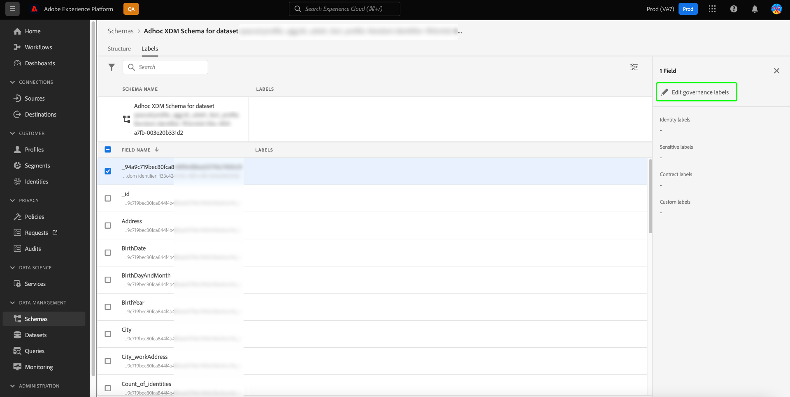

# Ad Hoc 스키마에 대한 속성 기반 액세스 제어 지원

Adobe Experience Platform으로 가져오는 모든 데이터는 XDM(Experience Data Model) 스키마에 의해 캡슐화되며 조직 또는 법적 규정에 의해 정의된 사용 제한이 적용될 수 있습니다.

스키마가 지정되지 않은 경우 쿼리 서비스를 통해 CTAS 쿼리를 실행하면 자동으로 임시 스키마가 생성됩니다. 중요한 개인 데이터와 개인 식별 정보 모두에 대한 액세스를 제어하기 위해 임시 스키마의 특정 필드 또는 데이터 세트의 사용을 제한해야 하는 경우가 많습니다. Adobe Experience Platform은 속성 기반 액세스 제어 기능을 사용하여 Platform UI를 통해 스키마 필드에 레이블을 지정할 수 있도록 함으로써 이 액세스 제어를 용이하게 합니다.

레이블은 언제든지 적용할 수 있으므로 데이터를 제어하는 방법을 유연하게 선택할 수 있습니다. 그러나 데이터를 Platform에 수집하는 즉시 또는 데이터를 Platform에서 사용할 수 있게 되는 즉시 레이블을 지정하는 것이 좋습니다.

스키마 기반 레이블 지정은 사용자 또는 사용자 그룹에 부여된 액세스를 더 잘 관리하기 위한 속성 기반 액세스 제어의 중요한 구성 요소입니다. Adobe Experience Platform을 사용하면 레이블을 만들고 적용하여 Ad Hoc 스키마의 모든 필드에 대한 액세스를 제한할 수 있습니다.

이 문서에서는 쿼리 서비스를 통해 생성된 임시 스키마의 데이터 필드에 레이블을 적용하여 중요한 데이터에 대한 액세스를 관리하는 자습서를 제공합니다.

## 시작하기

이 안내서를 사용하려면 Adobe Experience Platform의 다음 구성 요소에 대해 이해하고 있어야 합니다.

* [경험 데이터 모델(XDM) 시스템](https://experienceleague.adobe.com/docs/experience-platform/xdm/home.html?lang=ko-KR): Experience Platform이 고객 경험 데이터를 구성하는 표준화된 프레임워크입니다.
   * [[!DNL Schema Editor]](https://experienceleague.adobe.com/docs/experience-platform/xdm/ui/overview.html): Platform UI에서 스키마 및 기타 리소스를 만들고 관리하는 방법을 알아봅니다.
* [[!DNL Data Governance]](../../data-governance/home.md): 방법 알아보기 [!DNL Data Governance] 고객 데이터를 관리하고 데이터 사용에 적용되는 규정, 제한 사항 및 정책을 준수할 수 있습니다.
* [속성 기반 액세스 제어](../../access-control/abac/overview.md): 속성 기반 액세스 제어는 관리자가 속성에 따라 특정 개체 및/또는 기능에 대한 액세스를 제어할 수 있도록 해 주는 Adobe Experience Platform의 기능입니다. 속성은 Ad Hoc 또는 일반 스키마 필드에 추가된 레이블과 같이 객체에 추가된 메타데이터일 수 있습니다. 관리자는 사용자 액세스 권한을 관리하기 위해 속성이 포함된 액세스 정책을 정의합니다.

## 애드혹 스키마 만들기

쿼리가 실행되고 결과가 생성되면 Ad Hoc 스키마가 자동으로 생성되고 스키마 인벤토리에 추가됩니다.

데이터 레이블을 추가하려면 다음으로 이동합니다. [!UICONTROL 스키마] 을 선택하여 대시보드 찾아보기 탭 [!UICONTROL 스키마] 플랫폼 UI의 왼쪽 레일에서. 스키마 인벤토리가 표시됩니다.

>[!NOTE]
>
>임시 스키마는 기본적으로 스키마 인벤토리에 표시되지 않습니다.

## Platform UI의 스키마 인벤토리에서 임시 스키마 살펴보기 {#discover-ad-hoc-schemas}

Platform UI에서 임시 스키마 표시를 활성화하려면 필터 아이콘()을 클릭하여 검색 필드의 왼쪽에 있는 다음 을 선택합니다**[!UICONTROL 임시 스키마 표시] 표시되는 왼쪽 레일에

사용 가능한 목록에서 최근에 생성된 임시 스키마의 이름을 선택합니다. 임시 스키마 구조의 시각화가 나타납니다.

## 거버넌스 레이블 편집

임시 스키마에 대한 데이터 레이블을 편집하려면 [!UICONTROL 레이블] 탭. 레이블 작업 영역에서는 임시 스키마 필드에 레이블을 적용, 생성 및 편집하고 UI를 통해 액세스 권한을 제어할 수 있습니다. Ad Hoc 스키마 내의 모든 필드가 여기에 표시됩니다.

## 스키마 또는 필드의 레이블 편집

전체 스키마에 대한 레이블을 편집하려면 연필 아이콘()을 클릭하여 스키마 이름 옆에 추가합니다. [!UICONTROL 레이블] 탭.

기존 필드에 레이블을 적용하려면 목록에서 하나 이상의 필드를 선택한 후 다음을 수행합니다 [!UICONTROL 거버넌스 레이블 편집] 오른쪽 사이드바에서

## 레이블 편집 팝오버

다음 [!UICONTROL 레이블 편집] 팝오버가 표시됩니다. 이 보기에서 UI를 통해 기존 거버넌스 레이블을 만들거나 편집할 수 있습니다.

방법에 대한 지침은 설명서 를 참조하십시오 [선택한 스키마 또는 필드에 대한 레이블 생성 또는 편집](https://experienceleague.adobe.com/docs/experience-platform/xdm/tutorials/labels.html#edit-the-labels-for-the-schema-or-field).

>[!NOTE]
>
>새 레이블을 만들거나 기존 레이블을 편집하려면 조직에 대한 관리자 권한이 필요합니다. 관리자 권한이 없는 경우 시스템 관리자에게 문의하여 액세스 권한을 받으십시오.

권한 작업 영역을 사용하여 레이블을 만들 수도 있습니다. 다음을 참조하십시오. [권한 작업 영역에서 레이블 만들기에 대한 안내서](../../access-control/abac/ui/labels.md) 설명서를 참조하십시오.

적절한 수준의 속성 기반 액세스 제어가 적용되면 사용자가 액세스할 수 없는 데이터에 액세스하려고 할 때 쿼리 서비스를 통해 실행되는 모든 쿼리에 다음과 같은 시스템 동작이 적용됩니다.

1. 사용자가 스키마 내의 필드 중 하나에 대한 액세스를 거부하면 제한된 필드에서 읽거나 쓸 수 없습니다. 이는 다음과 같은 일반적인 시나리오에 적용됩니다.

   * 사용자가 제한된 열로만 쿼리를 실행하려고 하면 열이 존재하지 않는다는 오류가 발생합니다.
   * 사용자가 제한된 열이 포함된 여러 열로 쿼리를 실행하려고 하면 시스템은 제한되지 않은 모든 열에 대한 출력만 반환합니다.

1. 사용자가 계산된 필드에 대한 액세스를 요청하는 경우 사용자는 컴포지션에 사용되는 모든 필드에 대한 액세스 권한이 있어야 합니다. 그렇지 않으면 시스템에서 계산된 필드에 대한 액세스를 거부합니다.

ID 또는 기본 ID가 Ad Hoc 스키마에 설정된 경우 시스템은 연결된 데이터 위생 요청을 자동으로 승인하고 ID 열에 연결된 데이터 세트의 데이터를 정리합니다.

## 다음 단계

이 문서를 읽은 후에는 쿼리 서비스 CTAS 쿼리를 통해 만든 임시 스키마에 데이터 사용 레이블을 추가하는 방법을 더 잘 이해할 수 있습니다. 아직 수행하지 않았다면 다음 문서는 Query Service의 데이터 거버넌스에 대한 이해를 높이는 데 유용합니다.

* [애드혹 스키마 ID](./ad-hoc-schema-identities.md)
* [데이터 거버넌스](https://experienceleague.adobe.com/docs/experience-platform/data-governance/home.html?lang=ko)
