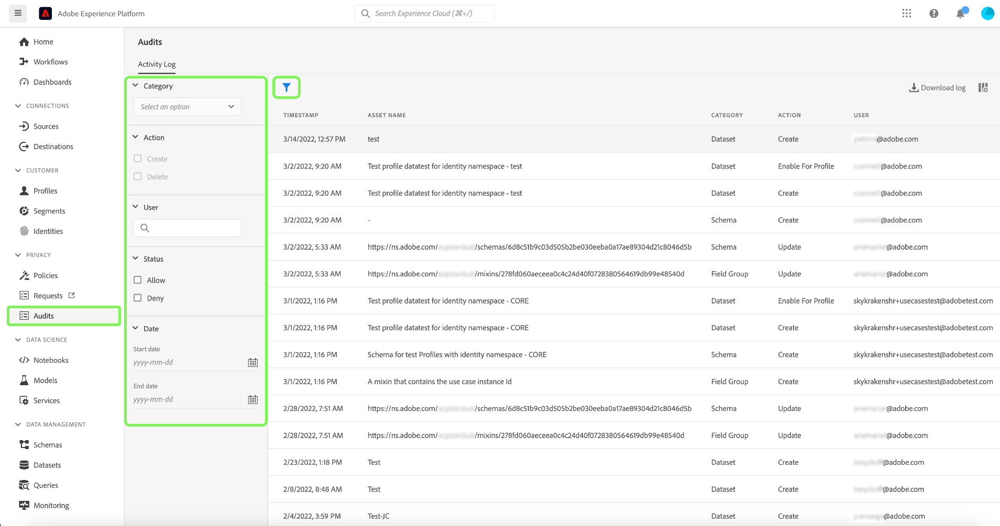
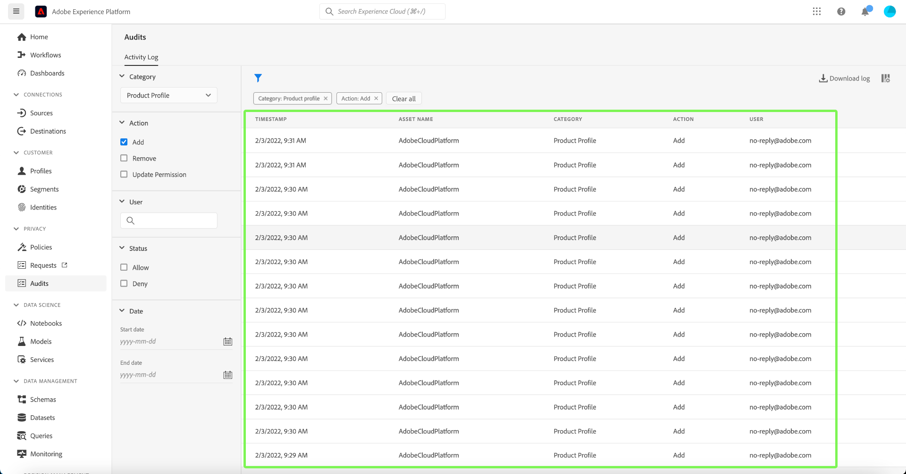

# [!DNL Query Service] 감사 로그 통합

더 Adobe Experience Platform [!DNL Query Service] 감사 로그 통합은 쿼리 관련 사용자 작업의 레코드를 제공합니다. 감사 로그는 기업 데이터 관리 정책 및 규정 요구 사항을 준수하고 문제를 해결하는 데 필수적인 도구입니다. 이 기능을 사용하면 다양한 이벤트 유형에 대한 작업 로그를 반환하고 레코드를 필터링하고 내보낼 수 있습니다. Platform UI 또는 를 통해 로그에 액세스할 수 있습니다. [감사 쿼리 API](https://www.adobe.io/experience-platform-apis/references/audit-query/) CSV 또는 JSON 파일 형식으로 다운로드됩니다.

감사 로그 사용자 인터페이스에 대한 자세한 내용은 [감사 로그 개요 문서](../../landing/governance-privacy-security/audit-logs/overview.md). Platform API를 호출하는 방법에 대한 자세한 내용은 [감사 로그 API 안내서](../../landing/api-guide.md).

## 전제 조건

다음을 보유해야 합니다. [!DNL Data Governance] [!UICONTROL 사용자 활동 로그 보기] platform UI 내에서 감사 로그 대시보드를 볼 수 있는 권한이 활성화되었습니다. 권한은 Adobe을 통해 사용할 수 있습니다. [Admin Console](https://adminconsole.adobe.com/). 이 권한을 활성화하기 위한 관리자 권한이 없는 경우 조직의 관리자에게 문의하십시오. 다음에 대한 액세스 제어 설명서 참조: [Admin Console을 통한 권한 추가에 대한 전체 지침](../../access-control/home.md).

## [!DNL Query Service] 감사 로그 범주 {#audit-log-categories}

다음에서 제공하는 감사 로그 범주 [!DNL Query Service] 는 다음과 같습니다.

| 카테고리 | 설명 |
|---|---|
| [!UICONTROL 쿼리] | 이 범주를 사용하면 쿼리 실행을 감사할 수 있습니다. |
| [!UICONTROL 쿼리 템플릿] | 이 범주를 사용하면 쿼리 템플릿에서 수행한 다양한 작업(만들기, 업데이트 및 삭제)을 감사할 수 있습니다. |
| [!UICONTROL 예약된 쿼리] | 이 범주를 사용하면 내에서 생성, 업데이트 또는 삭제된 일정을 감사할 수 있습니다. [!DNL Query Service]. |

## 수행 [!DNL Query Service] 감사 로그 {#perform-an-audit-log}

감사를 수행하려면 [!DNL Query Service] 활동, 선택 **[!UICONTROL 감사]** 왼쪽 탐색 후 단계 아이콘() 필터 컨트롤 목록을 표시하여 결과의 범위를 좁힐 수 있습니다.

다음에서 [!UICONTROL 감사] 대시보드 [!UICONTROL 활동 로그] 탭에서 다음 중 하나를 수행하여 기록된 모든 플랫폼 작업을 필터링할 수 있습니다. [!DNL Query Service] 카테고리. 로그 결과는 실행된 기간, 수행한 작업/함수 또는 쿼리를 수행한 사용자를 기반으로 추가로 필터링될 수 있습니다. 감사 로그 설명서 참조 [카테고리, 작업, 사용자 및 상태를 기반으로 로그를 필터링하는 방법에 대한 전체 지침](../../landing/governance-privacy-security/audit-logs/overview.md#managing-audit-logs-in-the-ui).

반환된 감사 로그 데이터에는 선택한 필터 기준을 충족하는 모든 쿼리에 대한 다음 정보가 포함됩니다.

| 열 이름 | 설명 |
|---|---|
| [!UICONTROL 타임스탬프] | 에서 수행된 작업의 정확한 날짜 및 시간 `month/day/year hour:minute AM/PM` 포맷. |
| [!UICONTROL 에셋 이름] | 에 대한 값 [!UICONTROL 에셋 이름] 필드는 필터로 선택한 범주에 따라 다릅니다. 사용 시 [!UICONTROL 예약된 쿼리] 카테고리: **일정 이름**. 사용 시 [!UICONTROL 쿼리 템플릿] 범주, 이는 **템플릿 이름**. 사용 시 [!UICONTROL 쿼리] 범주, 이는 **세션 ID** |
| [!UICONTROL 범주] | 이 필드는 필터 드롭다운에서 선택한 범주와 일치합니다. |
| [!UICONTROL 작업] | 작성, 삭제, 업데이트 또는 실행 중 하나일 수 있습니다. 사용 가능한 작업은 필터로 선택한 범주에 따라 다릅니다. |
| [!UICONTROL 사용자] | 이 필드는 쿼리를 실행한 사용자 ID를 제공합니다. |

>[!NOTE]
>
>감사 로그 대시보드에 기본적으로 표시되는 것보다 더 많은 쿼리 세부 정보가 CSV 또는 JSON 파일 형식으로 로그 결과를 다운로드하여 제공됩니다.

## 세부 정보 패널

감사 로그 결과 행을 선택하여 화면 오른쪽에 세부 정보 패널을 엽니다.

세부 정보 패널을 사용하여 [!UICONTROL 자산 ID] 및 [!UICONTROL 이벤트 상태].

값 [!UICONTROL 자산 ID] 감사에 사용된 범주에 따라 변경됩니다.

* 사용 시 [!UICONTROL 쿼리] 범주, [!UICONTROL 자산 ID] 은(는)  **세션 ID**.
* 사용 시 [!UICONTROL 쿼리 템플릿] 범주, [!UICONTROL 자산 ID] 은(는) **템플릿 ID** 접두사가 추가됨 `[!UICONTROL templateID:]`.
* 사용 시 [!UICONTROL 예약된 쿼리] 범주, [!UICONTROL 자산 ID] 은(는)  **일정 ID** 접두사가 추가됨 `[!UICONTROL scheduleID:]`.

값 [!UICONTROL 이벤트 상태] 감사에 사용된 범주에 따라 변경됩니다.

* 사용 시 [!UICONTROL 쿼리] 범주, [!UICONTROL 이벤트 상태] 필드는 모든 항목의 목록을 제공합니다. **쿼리 ID** 해당 세션 내의 사용자에 의해 실행됩니다.
* 사용 시 [!UICONTROL 쿼리 템플릿] 범주, [!UICONTROL 이벤트 상태] 필드는 다음을 제공합니다. **템플릿 이름** 이벤트 상태에 대한 접두사로 사용됩니다.
* 사용 시 [!UICONTROL 쿼리 일정] 범주, [!UICONTROL 이벤트 상태] 필드는 다음을 제공합니다. **일정 이름** 이벤트 상태에 대한 접두사로 사용됩니다.

## 다음에 사용 가능한 필터 [!DNL Query Service] 감사 로그 범주 {#available-filters}

사용 가능한 필터는 드롭다운에서 선택한 카테고리에 따라 다릅니다. 다음 표에서 사용 가능한 필터에 대해 자세히 설명합니다. [[!DNL Query Service] 감사 로그 범주](#audit-log-categories).

| 필터 | 설명 |
|---|---|
| 카테고리 | 다음을 참조하십시오. [[!DNL Query Service] 감사 로그 범주](#audit-log-categories) 섹션 을 참조하십시오. |
| 작업 | 을(를) 참조할 때 [!DNL Query Service] 감사 범주, 업데이트: **기존 양식에 대한 수정**, 삭제 는 **일정 또는 템플릿 제거**, 만드는 것은 **새 일정 또는 템플릿 만들기**, 그리고 실행은 **쿼리 실행**. |
| 사용자 | 사용자별로 필터링할 전체 사용자 ID(예: johndoe@acme.com)를 입력합니다. |
| 상태 | 다음 [!UICONTROL 허용], [!UICONTROL 성공], 및 [!UICONTROL 실패] 옵션은 &quot;상태&quot; 또는 &quot;이벤트 상태&quot;를 기반으로 로그를 필터링하지만 [!UICONTROL 거부] 옵션이 필터링됩니다. **모두** 로그. |
| 날짜 | 시작 날짜 및/또는 종료 날짜를 선택하여 결과를 필터링할 날짜 범위를 정의합니다. |

## 다음 단계

이 문서를 읽으면 다음을 이해할 수 있습니다. [!DNL Query Service] 감사 로그 기능 및 이를 사용하여 다음을 필터링하는 방법 [!DNL Query Service] 사용자 작업.

를 사용하는 경우 [!DNL Query Service] 문제 해결을 위해 감사 로그 기능을 사용할 경우 [문제 해결 안내서](../troubleshooting-guide.md).
