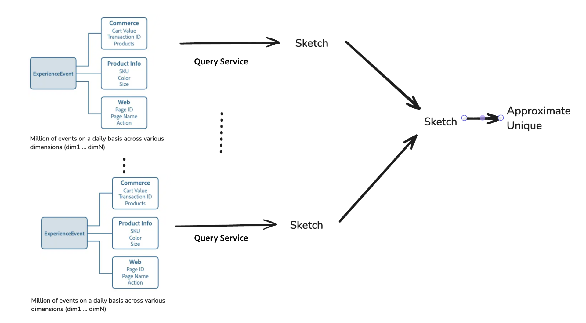

# 하이퍼큐브를 통한 효율적인 빅 데이터 분석

>[!AVAILABILITY]
>
>이 기능은 [Data Distiller SKU](../data-distiller/overview.md)를 구매한 사용자만 사용할 수 있습니다. 자세한 내용은 Adobe 담당자에게 문의하십시오.

Adobe Experience Platform의 Experience Query Service에서 하이퍼큐브를 사용하여 향상된 효율성으로 고급 데이터 분석을 수행하는 방법에 대해 알아봅니다. 이 문서에서는 [[!DNL Apache Datasketches] library](https://datasketches.apache.org/)의 고급 함수를 사용하여 매번 이전 데이터를 다시 처리할 필요 없이 고유 개수 및 복잡한 계산을 증분 처리하는 방법에 대해 설명합니다.

빅 데이터 분석에서 고유 개수, 수량, 가장 빈도가 높은 항목, 조인 및 그래프 분석과 같은 지표를 생성하는 경우 종종 비가산 계산(결과를 하위 그룹에서 간단히 합산할 수 없는 경우)이 포함됩니다. 기존 방법에서는 모든 이전 데이터를 재처리해야 하므로, 자원이 많이 들고 시간이 많이 소요될 수 있습니다. 큰 데이터 세트를 나타내는 확률을 사용하는 간단한 요약인 스케치와 고급 쿼리 서비스 기능을 사용하여 다시 계산할 필요가 줄어들어 이 프로세스를 간소화합니다.

## 하이퍼큐브의 주요 기능 {#key-functions}

하이퍼큐브는 데이터 분석 효율성과 유연성을 높이기 위해 몇 가지 강력한 기능을 제공합니다.

1. **고유 사용자 수 또는 고유 쿼리 수**: 원시 데이터를 반복적으로 재분석하지 않고 제품 보기, 사이트 방문 또는 상거래 활동 등 다양한 데이터 차원과 상호 작용하는 고유 사용자 수를 생성하려면 SQL 기능을 사용하십시오.
2. **증분 처리**: 모든 항목을 처음부터 다시 계산하지 않고 차원 및 시간에 걸쳐 데이터 포인트를 접고 병합하도록 증분 업데이트를 수행합니다.
3. **다차원 분석**: 하이퍼큐브를 통해 다차원 필터링 및 데이터 재정렬을 사용하여 차원의 조합을 나타내는 요약 행을 만들 수 있습니다. 그런 다음 이러한 요약을 사용하여 최소한의 계산 오버헤드로 인사이트를 생성할 수 있습니다.

## 하이퍼큐브에 대한 사용 사례 {#use-cases}

하이퍼큐브를 사용하여 매번 데이터를 완전히 다시 계산하지 않고도 다양한 사용자 상호 작용에 대한 고유 카운트를 효율적으로 생성할 수 있습니다. 다음은 이러한 기능을 사용하기 위한 몇 가지 실제 시나리오입니다.

- 정의된 기간 동안 특정 제품을 보는 고유 방문자를 분석합니다.
- 지정된 기간 동안 여러 제품과 상호 작용하여 교차 판매 분석을 향상시키는 사용자를 식별합니다.
- 한 제품에 참여하는 사용자를 구별하되 시간이 지남에 따라 다른 제품에 참여하지 않도록 하여 기본 설정 패턴을 파악합니다.
- 온라인 및 오프라인 상호 작용 데이터를 결합하여 주어진 기간 동안의 사용자 행동을 종합적으로 볼 수 있습니다.
- 이벤트 내의 다양한 활동에서 사용자 이동을 추적하여 레이아웃 및 서비스를 최적화합니다.

## 하이퍼큐브 사용의 이점

이러한 경우 특정 범주에 대한 기본 정보를 미리 계산할 수 있습니다. 그러나 여러 차원 및 기간에 걸쳐 데이터를 분석할 때 원시 데이터에서 모든 것을 다시 계산하거나 쿼리 서비스 하이퍼큐브를 사용해야 합니다. 하이퍼큐브는 데이터를 효율적으로 구성해 프로세스를 간소화하므로 유연한 필터링과 재처리 없이 다차원 분석이 가능하다. 고급 기능을 사용하여 결과를 빠르고 정확하게 예측하여 복잡한 분석 작업에 대한 향상된 처리 효율성, 확장성 및 적응성과 같은 주요 이점을 제공합니다.

### 쿼리 처리를 위한 데이터 크기 효율성

쿼리 서비스는 수백만 또는 수십억 개의 데이터 포인트(예: 사용자 ID)를 스케치라는 작은 양식으로 압축할 수 있습니다. 이 스케치는 쿼리 처리에 대한 데이터 크기를 크게 줄였으며, 이렇게 하면 확장성을 유지하고 작업을 훨씬 쉽고 빠르게 수행할 수 있습니다. 원본 데이터의 크기가 아무리 커져도 스케치의 크기가 작아 빅데이터 분석이 훨씬 관리 용이하고 효율적이다.

아래 다이어그램은 Commerce, 제품 정보 및 웹 차원 ExperienceEvents가 스케치로 처리된 후 고유한 수를 어림잡는 데 사용되는 방법을 보여 줍니다.

쿼리 서비스를 사용하여 스케치를 만드는 방법을 보여 주는 

### 스케치를 병합하여 데이터 분석을 빠르고 쉽게 만듭니다.

다시 계산하지 않고 처리 속도를 향상시키기 위해 다른 카테고리 또는 그룹의 스케치를 병합할 수 있습니다. 또한 Query Service는 데이터를 하이퍼큐브로 구성하여 디자인을 간소화합니다. 여기서 각 행은 스케치 열과 함께 해당 분할 영역(차원 컬렉션)의 요약이 됩니다. 하이퍼큐브의 각 행에는 차원 조합이 포함되어 있지만 원시 데이터가 없습니다. 쿼리를 실행할 때 추가 지표를 작성하는 데 사용할 차원 열을 지정하고 해당 행에 대한 스케치를 병합합니다.



### 비용 효율성 {#cost-effectiveness}

고객 데이터는 대규모인 경우가 많지만 증분 처리를 사용하여 이전 데이터를 재처리할 필요가 없습니다. 스케치가 훨씬 작고 컴퓨팅 리소스 및 비용을 절감하면서 보다 빠른 실시간 결과를 얻을 수 있습니다. 이러한 데이터 변환은 대화형 쿼리를 더 실현 가능하고 효율적으로 만듭니다.

## 함수 개요

이 섹션에서는 각 기능이 어떻게 데이터 처리를 최적화하고 스케치 및 하이퍼큐브를 효율적으로 사용하여 분석 기능을 향상시키는지 간략하게 설명합니다. 이 섹션에서는 용도, 예: 구문, 매개 변수 및 예상 출력에 대해 자세히 설명합니다.

### HLL 스케치를 사용하여 고유 개수 예측 만들기

`hll_build_agg`은(는) HLL(HyperLogLog) 스케치를 만드는 집계 함수입니다. 이 함수는 그룹화된 데이터 집합에 있는 열 또는 식 내의 고유 값 수를 추정하기 위한 작고 확률론적인 방법입니다.

#### 함수 정의

```sql
hll_build_agg(column [, lgConfigK])
```

**사용량:**

다음 예에서는 함수를 쿼리 내에서 구조화하는 방법을 보여 줍니다.

```sql
SELECT
   [dim1, dim2 ... ,] hll_build_agg(coalesce(col1, col2, col3)) AS sketch_col
FROM fact_sketch_table
  [GROUP BY dimension1, dimension2 ...]
```

#### 매개 변수

| 매개변수 | 설명 |
|---------------------------|---------------------------------------|
| `column` | 스케치를 생성할 열 또는 열 이름입니다. |
| `lgConfigK` | *Int* (선택 사항) K의 log-base-2입니다. 여기서 K는 HLL 스케치의 버킷 또는 슬롯 수입니다. 최소 값: 4. 최대 값: 12. 기본값: 12. |

#### 출력

| 출력 열 | 설명 |
|---------------------------|---------------------------------------|
| `sketch_res` | 문자열 HLL 스케치가 포함된 문자열 유형의 열입니다. |

#### SQL 예

다음 예제에서는 `customer_id` 열에 집계 스케치를 빌드합니다.

```sql
SELECT
  country,
  hll_build_agg(customer_id, 10) AS sketch
FROM
  EXPLODE(
    ARRAY<STRUCT<country STRING, customer_id STRING, invoice_id STRING>>[
      ('UA', 'customer_id_1', 'invoice_id_11'),
      ('CZ', 'customer_id_2', 'invoice_id_22'),
      ('CZ', 'customer_id_2', 'invoice_id_23'),
      ('BR', 'customer_id_3', 'invoice_id_31'),
      ('UA', 'customer_id_2', 'invoice_id_24')
    ])
GROUP BY country;
```

**SQL 예제 출력:**

| 국가 | Sketch |
|---------|------------------------------------------------------------|
| UA | AgEHBAMAAgCR9mUEulKKCQAAAAAAAAAAAAAAAAAAAAAAAAAAAAAAAAAAAAAAAAAAAAAAAAAAAAAAAAAAAAA== |
| CZ | AgEHBAMAAQC6UooJAAAAAAAAAAAAAAAAAAAAAAAAAAAAAAAAAAAAAAAAAAAAAAAAAAAAAAAAAAAAAA== |
| BR | AgEHBAMAAQCcmH0HAAAAAAAAAAAAAAAAAAAAAAAAAAAAAAAAAAAAAAAAAAAAAAAAAAAAAAAAAA== |

### HLL 스케치를 사용하여 고유 개수 예측

`hll_estimate`은(는) 데이터 집합의 각 행 내에서 개별 카운트의 예측을 제공하는 스칼라 함수입니다. 집계 함수와 달리 `hll_estimate`은(는) 행 단위로 작동하며 개별 행 내의 스케치에서 고유 개수를 계산하는 데 사용됩니다.

>[!NOTE]
>
>이 함수는 집계 함수로 사용할 수 없습니다. 집계된 수의 경우 `sketch_count`을(를) 사용합니다.

#### 함수 정의

```sql
hll_estimate(sketch_col)
```

**사용량:**

다음 예에서는 함수를 쿼리 내에서 구조화하는 방법을 보여 줍니다.

```sql
SELECT
   [col1, col2 ... ,] hll_estimate(sketch_column) AS estimate
FROM fact_sketch_table
```

#### 매개 변수

| 매개변수 | 설명 |
|---------------------------|---------------------------------------|
| `sketch_column` | 문자열 HLL 스케치가 포함된 열입니다. 각 행의 스케치에 대한 고유 개수를 예측합니다. |

#### 출력

| 출력 열 | 설명 |
|---------------------------|---------------------------------------|
| `estimate` | 스케치의 추정치를 제공하는 double 유형의 열로서 소수점 두 자리로 반올림됩니다. |

#### SQL 예

다음 예제에서는 HLL 스케치에 대해 `hll_estimate` 함수를 사용하여 국가별로 고유한 고객 수를 예측합니다.

```sql
SELECT
  country,
  hll_estimate(hll_build_agg(customer_id, 10)) AS distinct_customers_by_country
FROM
  (
    SELECT
      country,
      hll_build_agg(customer_id, 10) AS sketch
    FROM 
      EXPLODE(
        ARRAY<STRUCT<country STRING, customer_id STRING, invoice_id STRING>>[
          ('UA', 'customer_id_1', 'invoice_id_11'),
          ('CZ', 'customer_id_2', 'invoice_id_22'),
          ('CZ', 'customer_id_2', 'invoice_id_23'),
          ('BR', 'customer_id_3', 'invoice_id_31'),
          ('UA', 'customer_id_2', 'invoice_id_24')
        ])
    GROUP BY country
  );
```

**SQL 예제 출력:**

| 국가 | distinct_customer_by_country |
|---------|-------------------------------|
| UA | 2.00 |
| CZ | 1.00 |
| BR | 1.00 |

### `hll_merge_agg`과(와) 여러 HLL 스케치 병합

`hll_merge_agg`은(는) 그룹 내에서 여러 개의 HLL 스케치를 병합하여 출력으로 새 스케치를 만드는 집계 함수입니다. 파티션 또는 차원 간에 스케치를 조합할 수 있으므로 데이터 분석 유연성이 향상됩니다.

#### 함수 정의

```sql
hll_merge_agg(sketch_col [, allowDifferentLgConfigK])
```

**사용량:**

다음 예에서는 함수를 쿼리 내에서 구조화하는 방법을 보여 줍니다.

```sql
SELECT
   [dim1, dim2 ... ,] hll_merge_agg(sketch_column.sketch) AS estimate
FROM fact_sketch_table
  [GROUP BY dimension1, dimension2 ...]
```

#### 매개 변수

| 매개변수 | 설명 |
|---------------------------|---------------------------------------|
| `sketch_column` | 문자열 HLL 스케치가 포함된 열입니다. |
| `allowDifferentLgConfigK` | *부울*(선택 사항) true로 설정하면 다른 `lgConfigK` 값을 가진 스케치의 병합을 허용합니다. 기본값은 false입니다. 값이 false이고 스케치에 다른 `lgConfigK` 값이 있는 경우 예외가 throw됩니다. |

>[!NOTE]
>
>`allowDifferentLgConfigK`이(가) false로 설정되어 있으면 다른 `lgConfigK` 값을 가진 스케치를 병합하면 `UnsupportedOperationException`이(가) 됩니다.

#### 출력

| 출력 열 | 설명 |
|----------------|-------------------------------------------------|
| `sketch_res` | 문자열 결합된 HLL 스케치가 포함된 HLL 스케치 유형의 열입니다. |

#### SQL 예

다음 예제에서는 `customer_id` 열에서 여러 HLL 스케치를 병합합니다.

```sql
SELECT
   hll_merge_agg(hll_sketch) AS uniq_customers_with_invoice
FROM
  (
    SELECT
      country,
      hll_build_agg(customer_id) AS hll_sketch
    FROM
      EXPLODE(
        ARRAY<STRUCT<country STRING, customer_id STRING, invoice_id STRING>>[
          ('UA', 'customer_id_1', 'invoice_id_11'),
          ('BR', 'customer_id_3', 'invoice_id_31'),
          ('CZ', 'customer_id_2', 'invoice_id_22'),
          ('CZ', 'customer_id_2', 'invoice_id_23'),
          ('BR', 'customer_id_3', 'invoice_id_31'),
          ('UA', 'customer_id_2', 'invoice_id_24')
        ])
    GROUP BY country
    UNION
    SELECT
      country,
      hll_build_agg(customer_id) AS hll_sketch
    FROM
      EXPLODE(
        ARRAY<STRUCT<country STRING, customer_id STRING, invoice_id STRING>>[
          ('UA', 'customer_id_1', 'invoice_id_21'),
          ('MX', 'customer_id_3', 'invoice_id_31'),
          ('MX', 'customer_id_2', 'invoice_id_21')
        ])
    GROUP BY country
  )
GROUP BY customer_id;
```

**SQL 예제 출력:**

| 국가 | hll_merge_agg(sketch, true) |
|---------|--------------------------------------------|
| UA | AgEHDAMAAwiR9mUEulKKCQAAAAAAAAAAAAAAAAAAAAAAA== |
| CZ | AgEHDAMAAQi6UooJAAAAAAAAAAAAAAAAAAAAAAAAAAAAA== |
| BR | AgEHDAMAAAAAAAAAAAAAAAAAAAAAAAAAAAA== |
| MX | AgEHFQMAAgiGL/kNdAAAAAAAAAAAAAAAAAAAAAAAAAAAAAA== |

### `hll_merge_count_agg`(으)로 카디널리티 예상

`hll_merge_count_agg`은(는) 열 내의 하나 이상의 스케치에서 카디널리티(고유 요소의 수)를 예상하는 집계 함수입니다. 그룹화 내에서 발생한 모든 스케치에 대해 단일 예상치를 반환합니다. 이 함수는 스케치를 집계하는 데 사용되며 행 단위 변환으로 사용할 수 없습니다. 행 단위 추정의 경우 `sketch_estimate`을(를) 사용합니다.

#### 함수 정의

```sql
hll_merge_count_agg(sketch_col [, allowDifferentLgConfigK])
```

**사용량:**

다음 예에서는 함수를 쿼리 내에서 구조화하는 방법을 보여 줍니다.

```sql
SELECT
   [dim1, dim2 ... ,] hll_merge_count_agg(sketch_column) AS estimate
FROM fact_sketch_table
  [GROUP BY dimension1, dimension2 ...]
```

#### 매개 변수

| 매개변수 | 설명 |
|-------------------------|----------------------------------------------|
| `sketch_column` | 문자열 HLL 스케치가 포함된 열입니다. |
| `allowDifferentLgConfigK` | *부울*(선택 사항) 기본값은 false입니다. true로 설정하면 `lgConfigK` 값이 다른 스케치를 병합할 수 있습니다. 그렇지 않으면 `UnsupportedOperationException`이(가) throw됩니다. |

#### 출력

| 출력 열 | 설명 |
|---------------|----------------------------------------------------------|
| `estimate` | 스케치의 추정치를 제공하는 Double 유형의 열. |

#### SQL 예

다음 예제에서는 `hll_merge_count_agg` 함수를 사용하여 송장이 있는 고유 고객 수를 예측합니다.

```sql
SELECT
   hll_merge_count_agg(hll_sketch) AS uniq_customers_with_invoice
FROM
  (
    SELECT
      country,
      hll_build_agg(customer_id) AS hll_sketch
    FROM
      EXPLODE(
        ARRAY<STRUCT<country STRING, customer_id STRING, invoice_id STRING>>[
          ('UA', 'customer_id_1', 'invoice_id_11'),
          ('BR', 'customer_id_3', 'invoice_id_31'),
          ('CZ', 'customer_id_2', 'invoice_id_22'),
          ('CZ', 'customer_id_2', 'invoice_id_23'),
          ('BR', 'customer_id_3', 'invoice_id_31'),
          ('UA', 'customer_id_2', 'invoice_id_24')
        ])
    GROUP BY country
    UNION
    SELECT
      country,
      hll_build_agg(customer_id) AS hll_sketch
    FROM
      EXPLODE(
        ARRAY<STRUCT<country STRING, customer_id STRING, invoice_id STRING>>[
          ('UA', 'customer_id_1', 'invoice_id_21'),
          ('MX', 'customer_id_3', 'invoice_id_31'),
          ('MX', 'customer_id_2', 'invoice_id_21')
        ])
    GROUP BY country
  )
GROUP BY customer_id;
```

**SQL 예제 출력:**

| 국가 | hll_merge_count_agg(sketch, true) |
|---------|----------------------------------|
| UA | 2.0 |
| CZ | 1.0 |
| BR | 1.0 |
| MX | 2.0 |

## 제한 사항

현재 스케치는 한 번 만들면 업데이트할 수 없습니다. 향후 업데이트에서는 스케치를 업데이트하는 기능이 도입됩니다. 이 기능을 사용하면 누락된 실행 및 늦게 도착하는 데이터를 보다 효과적으로 처리할 수 있습니다.

## 다음 단계

이제 이 문서를 읽고 하이퍼큐브 및 관련 스케치 기능을 사용하여 내역 데이터를 재처리할 필요 없이 복잡한 다차원 분석을 위한 효율적인 데이터 처리를 수행하는 방법을 이해할 수 있습니다. 이 접근 방식은 시간을 절약하고 비용을 절감하며 실시간 대화형 쿼리에 필요한 유연성을 제공하여 Adobe Experience Platform의 빅 데이터 분석을 위한 중요한 도구가 됩니다.

다음으로 [증분 로드](../key-concepts/incremental-load.md) 및 [데이터 중복 제거](../key-concepts/deduplication.md)와 같은 다른 주요 개념을 탐색하여 특정 데이터 요구 사항에 맞게 이러한 기능을 효과적으로 사용하는 방법에 대해 더 깊이 있게 이해하십시오.


