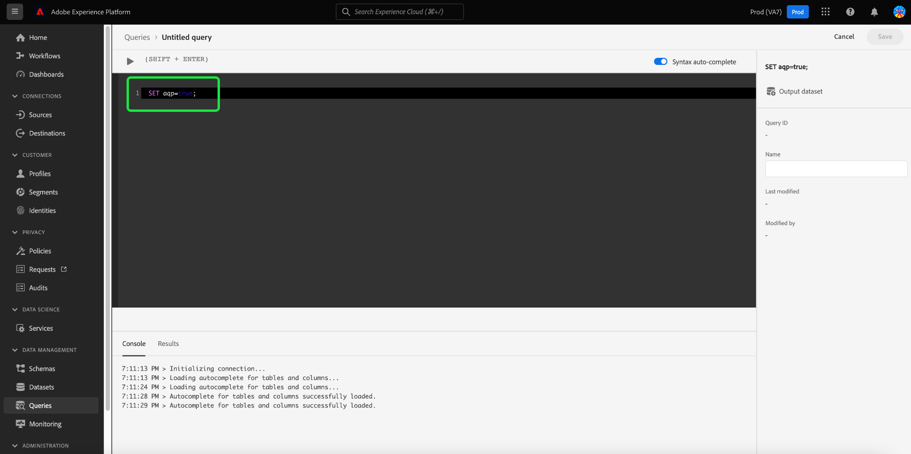

# 데이터 집합 샘플

Adobe Experience Platform Query Service는 대략적인 쿼리 처리 기능의 일부로서 샘플 데이터 세트를 제공합니다. 샘플 데이터 세트는 기존 [!DNL Azure Data Lake Storage] (ADLS) 원래 레코드의 백분율만 사용하는 데이터 세트. 이 비율을 샘플링 속도라고 합니다. 샘플링 속도를 조절하여 정확성 및 처리 시간의 균형을 제어하면 쿼리 정확성 비용으로 처리 시간이 크게 단축된 빅데이터에 대해 예비 쿼리를 수행할 수 있습니다.

많은 사용자가 데이터 집합을 통한 집계 작업에 대한 정확한 답변을 필요로 하지 않으므로 큰 데이터 세트에서 대략적인 답변을 반환하기 위한 대략적인 쿼리를 수행하면 더 효율적인 탐색 쿼리가 가능합니다. 샘플 데이터 세트에는 원래 데이터 세트의 데이터의 백분율만 포함되어 있으므로 향상된 응답 시간을 위해 쿼리 정확도를 교환할 수 있습니다. 읽기 시간에 Query Service는 전체 데이터 세트를 쿼리하는 경우보다 더 빨리 결과를 생성하는 행 수를 스캔해야 합니다.

대략적인 쿼리 처리를 위해 샘플을 관리하는 데 도움이 되도록 Query Service에서는 데이터 세트 샘플에 대해 다음 작업을 지원합니다.

- [균일한 임의 데이터 세트 샘플을 만듭니다.](#create-a-sample)
- [ADLS 테이블의 샘플 목록을 봅니다.](#view-list-of-samples)
- [샘플 데이터 세트를 직접 쿼리합니다.](#query-sample-datasets)
- [샘플을 삭제합니다.](#delete-a-sample)
- 원래 ADLS 테이블이 삭제되면 연관된 샘플을 삭제합니다.

## 시작하기

위에 자세히 설명된 대략적인 쿼리 처리 기능을 사용하려면 세션 플래그를 로 설정해야 합니다 `true`. 쿼리 편집기 또는 PSQL 클라이언트의 명령줄에서 `SET aqp=true;` 명령.

>[!NOTE]
>
>Platform에 로그인할 때마다 세션 플래그를 활성화해야 합니다.



## 균일한 임의 데이터 세트 샘플 만들기 {#create-a-sample}

를 사용하십시오 `ANALYZE TABLE` 해당 데이터 집합에서 균일한 임의 샘플을 만들기 위해 데이터 세트 이름을 사용하는 명령.

샘플 비율은 원래 데이터 집합에서 가져온 레코드의 백분율입니다. 를 사용하여 샘플 속도를 제어할 수 있습니다. `TABLESAMPLE SAMPLERATE` 키워드. 이 예에서 5.0의 값은 50% 샘플 속도와 같습니다. 2.5의 값은 25%와 같습니다.

>[!IMPORTANT]
>
>시스템은 각 데이터 세트에 대해 최대 5개의 샘플을 허용합니다. 여섯 번째 샘플 데이터 세트를 만들려고 하면 샘플 제한에 도달했다는 오류 메시지가 화면에 표시됩니다.

```sql
ANALYZE TABLE example_dataset_name TABLESAMPLE SAMPLERATE 5.0;
```

## 샘플 목록 보기 {#view-list-of-samples}

를 사용하십시오 `sample_meta()` ADLS 테이블과 연관된 샘플 목록을 표시하는 함수입니다.

```sql
SELECT sample_meta('example_dataset_name')
```

데이터 세트 샘플 목록은 아래 예제의 형식으로 표시됩니다.

```shell
                  sample_table_name                  |    sample_dataset_id     |    parent_dataset_id     | sample_type | sampling_rate | sample_num_rows |       created      
-----------------------------------------------------+--------------------------+--------------------------+-------------+---------------+-----------------+---------------------
 x5e5cd8ea0a83c418a8ef0928_uniform_4_0_percent_ughk7 | 62ff19853d338f1c07b18965 | 5e5cd8ea0a83c418a8ef0928 | uniform     |           4.0 |             391 | 19/08/2022 05:03:01
(1 row)
```

## 샘플 데이터 세트 쿼리 {#query-sample-datasets}

를 사용하십시오 `{EXAMPLE_DATASET_NAME}` 샘플 테이블을 직접 쿼리하려면 다음을 수행하십시오. 또는, `WITHAPPROXIMATE` 쿼리 및 쿼리 서비스 끝에 대한 키워드는 최근에 만든 샘플을 자동으로 사용합니다.

```sql
SELECT * FROM example_dataset_name WITHAPPROXIMATE;
```

## 데이터 집합 샘플 삭제 {#delete-a-sample}

삭제 작업을 사용하면 5개의 데이터 세트 샘플의 최대 제한에 도달하면 새 샘플을 만들 수 있습니다.

```sql
DROP TABLE SAMPLE x5e5cd8ea0a83c418a8ef0928_uniform_2_0_percent_bnhmc;
```

>[!NOTE]
>
>원래 ADLS 데이터 세트에서 파생된 샘플 데이터 세트가 여러 개 있는 경우 원본이 삭제되면 연결된 모든 샘플도 삭제됩니다.
