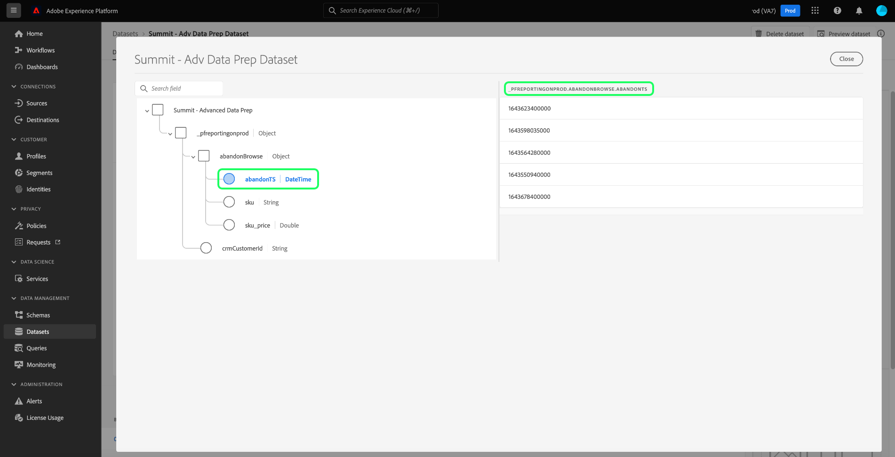

# 자주 묻는 질문

이 문서에서는 Query Service에 대해 자주 묻는 질문에 대한 답변과 Query Service를 사용할 때 일반적으로 표시되는 오류 코드 목록을 제공합니다. Adobe Experience Platform의 기타 서비스와 관련된 질문 및 문제 해결은 다음을 참조하십시오. [Experience Platform 문제 해결 안내서](../landing/troubleshooting.md).

FAQ에 대한 다음 답변 목록은 다음 카테고리로 구분됩니다.

- [일반](#general)
- [데이터 내보내기](#exporting-data)
- [타사 도구](#third-party-tools)
- [PostgreSQL API 오류](#postgresql-api-errors)
- [REST API 오류](#rest-api-errors)

## 일반 쿼리 서비스 질문 {#general}

이 섹션에서는 성능, 제한 및 프로세스에 대해 설명합니다.

### 쿼리 서비스 편집기에서 자동 완성 기능을 끌 수 있습니까?

+++아니요. 자동 완성 기능을 끄는 것은 현재 편집기에서 지원되지 않습니다.
+++

### 쿼리를 입력할 때 쿼리 편집기가 느려지는 이유는 무엇입니까?

+++대답: 자동 완성 기능의 잠재적 원인 중 하나입니다. 이 기능은 쿼리 편집 중에 가끔 편집기의 속도를 저하시킬 수 있는 특정 메타데이터 명령을 처리합니다.
+++

### 사용할 수 있습니까 [!DNL Postman] 쿼리 서비스 API의 경우

+++답변 예, 다음을 사용하여 모든 Adobe API 서비스를 시각화하고 상호 작용할 수 있습니다. [!DNL Postman] (무료 타사 애플리케이션). 시청 [[!DNL Postman] 설치 안내서](https://video.tv.adobe.com/v/28832) Adobe Developer 콘솔에서 프로젝트를 설정하고 과 함께 사용하는 데 필요한 모든 자격 증명을 획득하는 방법에 대한 단계별 지침 [!DNL Postman]. 다음에 대한 공식 설명서 참조: [시작, 실행 및 공유에 대한 지침 [!DNL Postman] 컬렉션](https://learning.postman.com/docs/running-collections/intro-to-collection-runs/).
+++

### UI를 통해 쿼리에서 반환되는 최대 행 수에 제한이 있습니까?

+++답변 예, 명시적인 제한이 외부에서 지정되지 않는 한 쿼리 서비스는 내부적으로 50,000개의 행 제한을 적용합니다. 의 지침을 참조하십시오. [대화형 쿼리 실행](./best-practices/writing-queries.md#interactive-query-execution) 을 참조하십시오.
+++

### 쿼리를 사용하여 행을 업데이트할 수 있습니까?

+++대답 일괄 처리 쿼리에서 데이터 세트 내의 행 업데이트는 지원되지 않습니다.
+++

### 쿼리의 결과 출력에 대한 데이터 크기 제한이 있습니까?

+++아니요. 데이터 크기에는 제한이 없지만 대화형 세션에서 10분의 쿼리 시간 제한이 있습니다. 쿼리가 배치 CTAS로 실행되는 경우 10분 시간 초과는 적용되지 않습니다. 의 지침을 참조하십시오. [대화형 쿼리 실행](./best-practices/writing-queries.md#interactive-query-execution) 을 참조하십시오.
+++

### SELECT 쿼리의 출력 행 수에 대한 제한을 무시하려면 어떻게 해야 합니까?

+++답변 출력 행 제한을 무시하려면 쿼리에 &quot;LIMIT 0&quot;을 적용하십시오. 예:

```sql
SELECT * FROM customers LIMIT 0;
```

+++

### 10분 후에 쿼리가 시간 초과되는 것을 방지하려면 어떻게 해야 합니까?

+++답변 쿼리가 시간 초과된 경우 다음 솔루션 중 하나 이상을 사용하는 것이 좋습니다.

- [쿼리를 CTAS 쿼리로 변환](./sql/syntax.md#create-table-as-select) 실행을 예약합니다. 실행 예약은 다음 중 하나를 수행할 수 있습니다. [UI 사용](./ui/user-guide.md#scheduled-queries) 또는 [API](./api/scheduled-queries.md#create).
- 추가 항목을 적용하여 더 작은 데이터 청크에서 쿼리 실행 [필터 조건](https://spark.apache.org/docs/latest/api/sql/index.html#filter).
- [EXPLAIN 명령 실행](./sql/syntax.md#explain) 을 클릭하여 자세한 내용을 살펴보십시오.
- 데이터 세트 내의 데이터 통계를 검토합니다.
- 쿼리를 간소화된 양식으로 변환하고 다음을 사용하여 다시 실행합니다. [준비된 진술](./sql/prepared-statements.md).
+++

### 여러 쿼리가 동시에 실행되는 경우 쿼리 서비스 성능에 문제가 있습니까?

+++아니요. 쿼리 서비스에는 동시 쿼리가 서비스 성능에 큰 영향을 주지 않도록 하는 자동 크기 조정 기능이 있습니다.
+++

### 예약된 키워드를 열 이름으로 사용할 수 있습니까?

+++대답 다음과 같이 열 이름으로 사용할 수 없는 특정 예약된 키워드가 있습니다. `ORDER`, `GROUP BY`, `WHERE`, `DISTINCT`. 이러한 키워드를 사용하려면 이 열을 이스케이프 처리해야 합니다.
+++

### 계층 구조 데이터 세트에서 열 이름을 찾으려면 어떻게 해야 합니까?

+++답변 다음 단계에서는 중첩된 모든 필드와 열을 병합된 형식으로 포함하여 UI를 통해 데이터 세트의 표 형식으로 보기를 표시하는 방법을 설명합니다.

- Experience Platform에 로그인한 후 다음을 선택합니다 **[!UICONTROL 데이터 세트]** 탐색할 UI의 왼쪽 탐색 [!UICONTROL 데이터 세트] 대시보드입니다.
- 데이터 세트 [!UICONTROL 찾아보기] 탭이 열립니다. 검색 창을 사용하여 사용 가능한 옵션을 구체화할 수 있습니다. 표시된 목록에서 데이터 세트를 선택합니다.


- 다음 [!UICONTROL 데이터 세트 활동] 화면이 나타납니다. 선택 **[!UICONTROL 데이터 세트 미리 보기]** 선택한 데이터 집합에서 병합된 데이터의 XDM 스키마 및 테이블 형식 보기 대화 상자를 엽니다. 자세한 내용은 [데이터 세트 설명서 미리 보기](../catalog/datasets/user-guide.md#preview-a-dataset)


- 스키마에서 필드를 선택하여 해당 내용을 병합된 열에 표시합니다. 열 이름은 페이지 오른쪽의 콘텐츠 위에 표시됩니다. 이 데이터 세트를 쿼리하는 데 사용할 이 이름을 복사해야 합니다.



에 대한 전체 지침은 설명서 를 참조하십시오. [중첩된 데이터 구조를 사용하여 작업하는 방법](./key-concepts/nested-data-structures.md) 쿼리 편집기 또는 타사 클라이언트 사용.
+++

### 배열이 포함된 데이터 세트에서 쿼리 속도를 높이려면 어떻게 해야 합니까?

+++답변 배열이 포함된 데이터 세트에 대한 쿼리 성능을 향상시키려면 [배열 분해](https://spark.apache.org/docs/latest/api/sql/index.html#explode) as a [CTAS 쿼리](./sql/syntax.md#create-table-as-select) 런타임에 이를 탐색하여 처리 시간을 향상시킬 수 있습니다.
+++

### 적은 수의 행에만 여러 시간 후에도 CTAS 쿼리가 계속 처리되는 이유는 무엇입니까?

+++답변 쿼리가 매우 작은 데이터 세트에서 오래 걸린 경우 고객 지원 센터에 문의하십시오.

처리하는 동안 쿼리가 중단되는 원인은 여러 가지가 있을 수 있습니다. 정확한 원인 파악을 위해서는 사례별로 심층적인 분석이 필요하다. [Adobe 고객 지원 문의](#customer-support) 이 프로세스가 되도록 합니다.
+++

### Adobe 고객 지원 센터에 문의하려면 어떻게 해야 합니까? {#customer-support}

+++답변
[Adobe 고객 지원 전화 번호의 전체 목록](https://helpx.adobe.com/ca/contact/phone.html) 은 Adobe 도움말 페이지에서 사용할 수 있습니다. 또는 다음 단계를 완료하여 온라인으로 도움말을 찾을 수 있습니다.

- 다음으로 이동 [https://www.adobe.com/](https://www.adobe.com/kr) 을 클릭합니다.
- 위쪽 탐색 막대의 오른쪽에서 을 선택합니다. **[!UICONTROL 로그인]**.


- Adobe 라이선스에 등록된 Adobe ID 및 암호를 사용합니다.
- 선택 **[!UICONTROL 도움말 및 지원]** 을 클릭합니다.


다음을 포함하는 드롭다운 배너가 나타납니다. [!UICONTROL 도움말 및 지원] 섹션. 선택 **[!UICONTROL 연락처]** Adobe 고객 지원 Virtual Assistant를 열려면 다음을 선택합니다. **[!UICONTROL 엔터프라이즈 지원]** 대규모 조직에 대한 전담 지원.
+++

### 이전 작업이 성공적으로 완료되지 않은 경우 후속 작업을 실행하지 않고 순차적 일련의 작업을 구현하려면 어떻게 해야 합니까?

+++응답 익명 블록 기능을 사용하면 순서대로 실행되는 하나 이상의 SQL 문을 연결할 수 있습니다. 또한 예외 처리 옵션을 사용할 수 있습니다.

다음을 참조하십시오. [익명 블록 설명서](./key-concepts/anonymous-block.md) 을 참조하십시오.
+++

### 쿼리 서비스에서 사용자 지정 속성을 구현하려면 어떻게 해야 합니까?

+++답변 사용자 지정 속성을 구현하는 방법에는 두 가지가 있습니다.

1. 기존 항목의 조합 사용 [Adobe 정의 함수](./sql/adobe-defined-functions.md) 사용 사례 요구 사항이 충족되는지 식별합니다.
1. 이전 제안이 사용 사례를 충족하지 않으면 다음을 조합하여 사용해야 합니다. [창 함수](./sql/adobe-defined-functions.md#window-functions). 창 함수는 시퀀스의 모든 이벤트를 봅니다. 또한 내역 데이터를 검토할 수 있으며 모든 조합으로 사용할 수 있습니다.
+++

### 쿼리를 쉽게 다시 사용할 수 있도록 템플릿화할 수 있습니까?

+++예, 준비된 문을 사용하여 쿼리를 템플릿화할 수 있습니다. 준비된 문은 성능을 최적화하고 쿼리를 반복적으로 다시 구문 분석하지 않도록 할 수 있습니다. 다음을 참조하십시오. [준비된 명령문 설명서](./sql/prepared-statements.md) 을 참조하십시오.
+++

### 쿼리에 대한 오류 로그를 검색하려면 어떻게 합니까? {#error-logs}

+++대답 특정 쿼리에 대한 오류 로그를 검색하려면 먼저 쿼리 서비스 API를 사용하여 쿼리 로그 세부 정보를 가져와야 합니다. HTTP 응답에는 쿼리 오류를 조사하는 데 필요한 쿼리 ID가 포함되어 있습니다.

여러 쿼리를 검색하려면 GET 명령을 사용하십시오. API를 호출하는 방법에 대한 정보는 [샘플 API 호출 설명서](./api/queries.md#sample-api-calls).

응답에서 조사할 쿼리를 식별하고 해당 쿼리를 사용하여 다른 GET 요청을 만듭니다 `id` 값. 전체 지침은 [id로 쿼리 검색 설명서](./api/queries.md#retrieve-a-query-by-id).

성공적인 응답은 HTTP 상태 200을 반환하고 다음을 포함합니다. `errors` 배열입니다. 간결성을 위해 응답이 단축되었습니다.

```json
{
    "isInsertInto": false,
    "request": {
                "dbName": "prod:all",
                "sql": "SELECT *\nFROM\n  accounts\nLIMIT 10\n"
            },
    "clientId": "8c2455819a624534bb665c43c3759877",
    "state": "SUCCESS",
    "rowCount": 0,
    "errors": [{
      'code': '58000', 
      'message': 'Batch query execution gets : [failed reason ErrorCode: 58000 Batch query execution gets : [Analysis error encountered. Reason: [sessionId: f055dc73-1fbd-4c9c-8645-efa609da0a7b Function [varchar] not defined.]]]', 
      'errorType': 'USER_ERROR'
      }],
    "isCTAS": false,
    "version": 1,
    "id": "343388b0-e0dd-4227-a75b-7fc945ef408a",
}
```

다음 [쿼리 서비스 API 참조 설명서](https://www.adobe.io/experience-platform-apis/references/query-service/) 는 사용 가능한 모든 엔드포인트에 대한 자세한 정보를 제공합니다.
+++

### &quot;스키마 유효성 검사 오류&quot;는 무엇을 의미합니까?

+++답변 &quot;스키마 유효성 검사 오류&quot; 메시지는 시스템이 스키마 내에서 필드를 찾을 수 없음을 의미합니다. 의 모범 사례 문서를 읽어야 합니다. [Query Service에서 데이터 자산 구성](./best-practices/organize-data-assets.md) 뒤에 다음 [Select 설명서로 표 만들기](./sql/syntax.md#create-table-as-select).

다음 예에서는 CTAS 구문 및 구조 데이터 형식의 사용을 보여 줍니다.

```sql
CREATE TABLE table_name WITH (SCHEMA='schema_name')

AS SELECT '1' as _id,

 STRUCT

  ('2021-02-17T15:39:29.0Z' AS taskActualCompletionDate,

    '2020-09-09T21:21:16.0Z' AS taskActualStartDate,

    'Consulting' AS taskdescription,

    '5f6527c10011e09b89666c52d9a8c564' AS taskguide,

    'Stakeholder Consulting Engagement' AS taskname, 

    '2020-09-09T15:00:00.0Z' AS taskPlannedStartDate,

    '2021-02-15T11:00:00.0Z' AS taskPlannedCompletionDate

  ) AS _workfront ;
```

+++

### 매일 시스템에 들어오는 새 데이터를 빠르게 처리하려면 어떻게 해야 합니까?

+++답변: [`SNAPSHOT`](./sql/syntax.md#snapshot-clause) 스냅숏 ID를 기반으로 테이블의 데이터를 증분 읽는 데 절을 사용할 수 있습니다. 다음과 함께 사용하기에 이상적입니다 [증분 로드](./key-concepts/incremental-load.md) 마지막 로드 실행 이후 생성 또는 수정된 데이터 세트의 정보만 처리하는 디자인 패턴입니다. 그 결과, 처리 효율을 증가시키고 스트리밍 및 배치 데이터 처리와 함께 사용할 수 있다.
+++

### 프로필 UI에 표시된 숫자와 프로필 내보내기 데이터 세트에서 계산된 숫자 간에 차이가 있는 이유는 무엇입니까?

+++답변 프로필 대시보드에 표시된 숫자는 마지막 스냅샷을 기준으로 정확합니다. 프로필 내보내기 테이블에서 생성된 숫자는 내보내기 쿼리에 전적으로 의존합니다. 따라서 특정 대상에 적합한 프로필 수를 쿼리하는 것은 이러한 불일치의 일반적인 원인입니다.

>[!NOTE]
>
>쿼리에는 내역 데이터가 포함되지만 UI에는 현재 프로필 데이터만 표시됩니다.

+++

### 내 쿼리가 빈 하위 집합을 반환하는 이유는 무엇이며 어떻게 해야 합니까?

+++대답 가장 가능성 있는 원인은 쿼리의 범위가 너무 좁기 때문입니다. 의 섹션을 체계적으로 제거해야 합니다. `WHERE` 일부 데이터가 표시될 때까지의 절입니다.

다음과 같은 작은 쿼리를 사용하여 데이터 세트에 데이터가 포함되어 있는지 확인할 수도 있습니다.

```sql
SELECT count(1) FROM myTableName
```

+++

### 데이터를 샘플링할 수 있습니까?

+++답변 이 기능은 현재 진행 중입니다. 세부 정보는 다음에서 사용할 수 있습니다. [릴리스 정보](../release-notes/latest/latest.md) 기능이 릴리스될 준비가 되면 Platform UI 대화 상자를 통해
+++

### 쿼리 서비스에서 지원하는 도우미 함수는 무엇입니까?

+++Answer Query Service는 SQL 기능을 확장하기 위한 몇 가지 기본 제공 SQL 도우미 함수를 제공합니다. 의 전체 목록은 문서를 참조하십시오. [쿼리 서비스에서 지원하는 SQL 함수](./sql/spark-sql-functions.md).
+++

### 모두 기본 [!DNL Spark SQL] 지원되는 함수 또는 래퍼로만 제한된 사용자입니다. [!DNL Spark SQL] Adobe에서 제공하는 기능

+++아직 답장, 모든 오픈 소스 아님 [!DNL Spark SQL] 함수는 데이터 레이크 데이터에 대해 테스트되었습니다. 테스트 및 확인이 완료되면 지원 목록에 추가됩니다. 다음을 참조하십시오. [지원되는 목록 [!DNL Spark SQL] 함수](./sql/spark-sql-functions.md) 특정 함수를 확인합니다.
+++

### 사용자가 다른 쿼리에서 사용할 수 있는 UDF(사용자 정의 함수)를 직접 정의할 수 있습니까?

+++답변 데이터 보안 고려 사항으로 인해 UDF의 사용자 정의 정의가 허용되지 않습니다.
+++

### 예약된 쿼리가 실패하면 어떻게 해야 합니까?

+++답변 먼저, 로그에서 오류의 세부 정보를 확인하십시오. 의 FAQ 섹션 [로그 내에서 오류 찾기](#error-logs) 은 이 작업을 수행하는 방법에 대한 자세한 정보를 제공합니다.

또한 수행 방법에 대한 지침은 설명서를 확인해야 합니다 [UI의 예약된 쿼리](./ui/user-guide.md#scheduled-queries) 및 [api](./api/scheduled-queries.md).

을(를) 사용할 때 주의하십시오. [!DNL Query Editor] 이미 생성되어 저장된 질의에만 스케줄을 추가할 수 있습니다. 이는 에는 적용되지 않습니다. [!DNL Query Service] API.
+++

### &quot;세션 제한에 도달했습니다.&quot; 오류는 무엇을 의미합니까?

+++응답 &quot;세션 제한에 도달했습니다.&quot;는 조직에 허용된 최대 쿼리 서비스 세션 수에 도달했음을 의미합니다. 조직의 Adobe Experience Platform 관리자에게 문의하십시오.
+++

### 쿼리 로그는 삭제된 데이터 세트와 관련된 쿼리를 어떻게 처리합니까?

+++응답 쿼리 서비스 는 쿼리 기록을 삭제하지 않습니다. 즉, 삭제된 데이터 세트를 참조하는 모든 쿼리는 그 결과로 &quot;유효한 데이터 세트 없음&quot;을 반환합니다.
+++

### 쿼리의 메타데이터만 가져오려면 어떻게 해야 합니까?

+++답변 0 행을 반환하는 쿼리를 실행하여 응답의 메타데이터만 가져올 수 있습니다. 이 예제 쿼리는 지정된 테이블에 대한 메타데이터만 반환합니다.

```sql
SELECT * FROM <table> WHERE 1=0
```

+++

### CTAS(Create Table As Select) 쿼리를 구체화하지 않고 빠르게 반복하려면 어떻게 해야 합니까?

+++대답 사용할 쿼리를 구체화하기 전에 쿼리를 빠르게 반복하고 실험하기 위해 임시 테이블을 만들 수 있습니다. 임시 테이블을 사용하여 쿼리가 작동하는지 확인할 수도 있습니다.

예를 들어 임시 테이블을 만들 수 있습니다.

```sql
CREATE temp TABLE temp_dataset AS
SELECT *
FROM actual_dataset
WHERE 1 = 0;
```

그런 다음 임시 테이블을 다음과 같이 사용할 수 있습니다.

```sql
INSERT INTO temp_dataset
SELECT a._company AS _company,
a._id AS _id,
a.timestamp AS timestamp
FROM actual_dataset a
WHERE timestamp >= TO_TIMESTAMP('2021-01-21 12:00:00')
AND timestamp < TO_TIMESTAMP('2021-01-21 13:00:00')
LIMIT 100;
```

+++

### 시간대를 UTC 타임스탬프에서 및 로 변경하려면 어떻게 합니까?

+++답변 Adobe Experience Platform은 데이터를 UTC(협정 세계시) 타임스탬프 형식으로 유지합니다. UTC 형식의 예는 다음과 같습니다. `2021-12-22T19:52:05Z`

Query Service는 특정 타임스탬프를 UTC 형식으로 변환하는 기본 제공 SQL 함수를 지원합니다. 두 가지 모두 `to_utc_timestamp()` 및 `from_utc_timestamp()` 메서드에는 timestamp와 timezone의 두 매개 변수가 사용됩니다.

| 매개변수 | 설명 |
|-----------|---------------|
| 타임스탬프 | 타임스탬프는 UTC 형식이나 간단한 형식으로 작성할 수 있습니다 `{year-month-day}` 포맷. 시간을 제공하지 않은 경우 기본값은 지정된 날 아침의 자정입니다. |
| 시간대 | 시간대는 `{continent/city})` 포맷. 에 있는 인식된 시간대 코드 중 하나여야 합니다. [공개 도메인 TZ 데이터베이스](https://data.iana.org/time-zones/tz-link.html#tzdb). |

#### UTC 타임스탬프로 변환

다음 `to_utc_timestamp()` 메서드는 지정된 매개 변수를 해석하고 변환합니다. **로컬 시간대의 타임스탬프로** (UTC 형식). 예를 들어, 대한민국 서울의 시간대는 UTC/GMT +9시간입니다. 날짜 전용 타임스탬프를 제공함으로써 메서드에서는 아침 자정의 기본값을 사용합니다. 타임스탬프 및 시간대는 해당 지역의 시간에서 로컬 지역의 UTC 타임스탬프로 UTC 형식으로 변환됩니다.

```SQL
SELECT to_utc_timestamp('2021-08-31', 'Asia/Seoul');
```

쿼리가 사용자의 현지 시간으로 타임스탬프를 반환합니다. 이 경우 서울은 전날 오후 3시가 9시간 앞선다.

```
2021-08-30 15:00:00
```

다른 예로, 지정된 타임스탬프가 `2021-07-14 12:40:00.0` 대상: `Asia/Seoul` 시간대, 반환된 UTC 타임스탬프는 다음과 같습니다. `2021-07-14 03:40:00.0`

쿼리 서비스 UI에서 제공되는 콘솔 출력은 사람이 인식할 수 있는 형식입니다.

```
8/30/2021, 3:00 PM
```

#### UTC 타임스탬프에서 변환

다음 `from_utc_timestamp()` 메서드는 지정된 매개 변수를 해석합니다. **로컬 시간대의 타임스탬프에서** 및 은(는) 원하는 영역의 동등한 타임스탬프를 UTC 형식으로 제공합니다. 아래 예에서 시간은 사용자의 현지 시간대에서 오후 2시 40분입니다. 변수로 통과한 서울 시간대가 현지 시간대보다 9시간 앞선다.

```SQL
SELECT from_utc_timestamp('2021-08-31 14:40:00.0', 'Asia/Seoul');
```

쿼리는 매개 변수로 전달된 시간대에 대해 타임스탬프를 UTC 형식으로 반환합니다. 결과는 쿼리를 실행한 시간대보다 9시간 빠릅니다.

```
8/31/2021, 11:40 PM
```

### 시계열 데이터를 필터링하려면 어떻게 해야 합니까?

+++답변 시계열 데이터로 쿼리할 때는 보다 정확한 분석을 위해 가능하면 타임스탬프 필터를 사용해야 합니다.

>[!NOTE]
>
> 날짜 문자열 **필수** 형식이어야 합니다. `yyyy-mm-ddTHH24:MM:SS`.

타임스탬프 필터를 사용하는 예는 아래에서 볼 수 있습니다.

```sql
SELECT a._company  AS _company,
       a._id       AS _id,
       a.timestamp AS timestamp
FROM   dataset a
WHERE  timestamp >= To_timestamp('2021-01-21 12:00:00')
       AND timestamp < To_timestamp('2021-01-21 13:00:00')
```

+++

### 올바른 사용 방법 `CAST` sql 쿼리에서 내 타임스탬프를 변환하는 연산자

+++사용할 때 답변 `CAST` 연산자를 사용하여 타임스탬프를 변환하려면 두 날짜를 모두 포함해야 합니다. **및** 시간.

예를 들어 아래 표시된 대로 시간 구성 요소가 없으면 오류가 발생합니다.

```sql
SELECT * FROM ABC
WHERE timestamp = CAST('07-29-2021' AS timestamp)
```

의 올바른 사용 `CAST` 연산자는 아래에 표시되어 있습니다.

```sql
SELECT * FROM ABC
WHERE timestamp = CAST('07-29-2021 00:00:00' AS timestamp)
```

+++

### 데이터 세트에서 모든 행을 가져오려면 *와 같은 와일드카드를 사용해야 합니까?

+++답변 쿼리 서비스는 다음과 같이 처리되어야 하므로 와일드카드를 사용하여 행에서 모든 데이터를 가져올 수 없습니다. **열 형식 저장소** 기존의 행 기반 스토어 시스템보다.
+++

### 을 사용해야 합니까? `NOT IN` 내 SQL 쿼리에서?

+++답변: `NOT IN` 연산자는 종종 다른 테이블이나 SQL 문에서 찾을 수 없는 행을 검색하는 데 사용됩니다. 이 연산자는 성능 저하를 초래할 수 있으며 비교되는 열이 수락되는 경우 예기치 않은 결과가 반환될 수 있습니다 `NOT NULL`또는 레코드가 너무 많습니다.

를 사용하지 않고 `NOT IN`, 다음 중 하나를 사용할 수 있습니다 `NOT EXISTS` 또는 `LEFT OUTER JOIN`.

예를 들어 다음 테이블을 만든 경우:

```sql
CREATE TABLE T1 (ID INT)
CREATE TABLE T2 (ID INT)
INSERT INTO T1 VALUES (1)
INSERT INTO T1 VALUES (2)
INSERT INTO T1 VALUES (3)
INSERT INTO T2 VALUES (1)
INSERT INTO T2 VALUES (2)
```

를 사용하는 경우 `NOT EXISTS` 연산자에서는 다음을 사용하여 복제할 수 있습니다. `NOT IN` 다음 쿼리를 사용한 연산자:

```sql
SELECT ID FROM T1
WHERE NOT EXISTS
(SELECT ID FROM T2 WHERE T1.ID = T2.ID)
```

또는 를 사용하는 경우 `LEFT OUTER JOIN` 연산자에서는 다음을 사용하여 복제할 수 있습니다. `NOT IN` 다음 쿼리를 사용한 연산자:

```sql
SELECT T1.ID FROM T1
LEFT OUTER JOIN T2 ON T1.ID = T2.ID
WHERE T2.ID IS NULL
```

+++

### UI에 표시되는 것과 같이 더블 밑줄 이름이 있는 CTAS 쿼리를 사용하여 데이터 세트를 만들 수 있습니까? 예: `test_table_001`.

+++답변 아니요. 이는 쿼리 서비스를 포함한 모든 Adobe 서비스에 적용되는 Experience Platform 전반에 대한 의도적인 제한입니다. 밑줄이 두 개인 이름은 스키마 및 데이터 세트 이름으로 사용할 수 있지만 데이터 세트의 테이블 이름에는 단일 밑줄만 포함할 수 있습니다.
+++

### 한 번에 몇 개의 동시 쿼리를 실행할 수 있습니까?

+++답변 일괄 처리 쿼리가 백엔드 작업으로 실행되므로 쿼리 동시성 제한이 없습니다. 그러나 쿼리 시간 초과 제한은 24시간으로 설정됩니다.
+++

### 쿼리 활동 및 상태를 볼 수 있는 활동 대시보드가 있습니까?

+++답변 쿼리 활동 및 상태를 확인할 수 있는 모니터링 및 경고 기능이 있습니다. 다음을 참조하십시오. [쿼리 서비스 감사 로그 통합](./data-governance/audit-log-guide.md) 및 [쿼리 로그](./ui/overview.md#log) 문서 를 참조하십시오.
+++

### 업데이트를 롤백할 방법이 있습니까? 예를 들어, 오류가 있거나 데이터를 다시 Platform에 쓸 때 일부 계산을 다시 구성해야 하는 경우 해당 시나리오를 어떻게 처리해야 합니까?

+++답변 현재, 당사는 이러한 방식의 롤백이나 업데이트를 지원하지 않습니다.
+++

### Adobe Experience Platform에서 쿼리를 최적화하려면 어떻게 해야 합니까?

+++대답 시스템은 데이터베이스가 아니기 때문에 인덱스가 없지만 데이터 저장소에 연결된 다른 최적화가 있습니다. 쿼리를 조정하는 데 다음 옵션을 사용할 수 있습니다.

- 시계열 데이터를 기반으로 하는 시간 기반 필터.
- 구조 데이터 유형에 대한 푸시 다운이 최적화되었습니다.
- 어레이 및 맵 데이터 유형에 최적화된 비용 및 메모리 푸시 다운
- 스냅샷을 사용한 증분 처리
- 지속된 데이터 형식.
+++

### 로그인을 Query Service의 특정 측면으로 제한할 수 있습니까, 아니면 &quot;all or nothing&quot; 솔루션입니까?

+++응답 쿼리 서비스 는 &quot;all or nothing&quot; 솔루션입니다. 부분 액세스를 제공할 수 없습니다.
+++

### 쿼리 서비스에서 사용할 수 있는 데이터를 제한할 수 있습니까, 아니면 단순히 전체 Adobe Experience Platform 데이터 레이크에 액세스합니까?

+++예, 읽기 전용 액세스 권한을 가진 데이터 세트로 쿼리를 제한할 수 있습니다.
+++

### Query Service에서 액세스할 수 있는 데이터를 제한하는 다른 옵션은 무엇입니까?

+++답변 액세스를 제한하는 방법에는 세 가지가 있습니다. 이는 다음과 같습니다.

- SELECT 문을 사용하고 데이터 세트에 읽기 전용 액세스 권한을 부여합니다. 또한 쿼리 관리 권한을 할당합니다.
- SELECT/INSERT/CREATE 문을 사용하여 데이터 세트에 쓰기 액세스 권한을 부여합니다. 또한 쿼리 관리 권한을 할당합니다.
- 위의 이전 제안과 함께 통합 계정을 사용하고 쿼리 통합 권한을 할당합니다.

+++

### Query Service에서 데이터를 반환하면 Platform에서 보호된 데이터를 반환하지 않았는지 확인하기 위해 실행할 수 있는 검사가 있습니까?

- 쿼리 서비스는 속성 기반 액세스 제어를 지원합니다. 열/리프 수준 및/또는 구조 수준에서 데이터에 대한 액세스를 제한할 수 있습니다. 속성 기반 액세스 제어에 대한 자세한 내용은 설명서를 참조하십시오.

### 서드파티 클라이언트와의 연결에 대한 SSL 모드를 지정할 수 있습니까? 예를 들어 Power BI에 &#39;verify-full&#39;을 사용할 수 있습니까?

+++예, SSL 모드가 지원됩니다. 다음을 참조하십시오. [SSL 모드 설명서](./clients/ssl-modes.md) 사용 가능한 여러 SSL 모드 및 보호 수준에 대한 분류.
+++

### Power BI 클라이언트에서 쿼리 서비스로의 모든 연결에 TLS 1.2를 사용합니까?

+++예 라고 답하십시오. 전송 중인 데이터는 항상 HTTPS를 준수합니다. 현재 지원되는 버전은 TLS1.2입니다.
+++

### 포트 80에서 수행된 연결이 여전히 https를 사용합니까?

+++예, 포트 80에 연결된 연결은 여전히 SSL을 사용합니다. 포트 5432를 사용할 수도 있습니다.
+++

### 특정 연결에 대해 특정 데이터 세트 및 열에 대한 액세스를 제어할 수 있습니까? 어떻게 구성됩니까?

+++예, 구성된 경우 속성 기반 액세스 제어가 적용됩니다. 다음을 참조하십시오. [속성 기반 액세스 제어 개요](../access-control/abac/overview.md) 추가 정보.
+++

### 쿼리 서비스가 &quot;INSERT OVERWRITE INTO&quot; 명령을 지원합니까?

+++아니요, 쿼리 서비스는 &quot;INSERT OVERWRITE INTO&quot; 명령을 지원하지 않습니다.
+++

### 라이선스 사용 대시보드의 사용 데이터는 Data Distiller 계산 시간에 대해 얼마나 자주 업데이트됩니까?

+++답변 Data Distiller 컴퓨터 사용 시간에 대한 라이선스 사용 대시보드는 6시간마다 하루에 4번 업데이트됩니다.
+++

### Data Distiller 액세스 없이 CREATE VIEW 명령을 사용할 수 있습니까?

+++예, 다음을 사용할 수 있습니다. `CREATE VIEW` data Distiller 액세스 권한 없는 명령입니다. 이 명령은 데이터의 논리적 뷰를 제공하지만 데이터 레이크에 다시 쓰지 않습니다.
+++

### DbVisualizer에서 익명 블록을 사용할 수 있습니까?

+++예 라고 답하십시오. 그러나 DbVisualizer와 같은 특정 타사 클라이언트에는 스크립트의 일부를 단일 문으로 처리해야 함을 나타내기 위해 SQL 블록 전후에 별도의 식별자가 필요할 수 있습니다. 자세한 내용은 [익명 블록 설명서](./key-concepts/anonymous-block.md) 또는 [공식 DbVisualizer 설명서](https://confluence.dbvis.com/display/UG120/Executing+Complex+Statements#ExecutingComplexStatements-UsinganSQLDialect).
+++

## 데이터 내보내기 {#exporting-data}

이 섹션에서는 데이터 및 제한 내보내기에 대해 설명합니다.

### 쿼리 처리 후 쿼리 서비스에서 데이터를 추출하고 결과를 CSV 파일로 저장하는 방법이 있습니까? {#export-csv}

+++예 라고 답하십시오. 쿼리 서비스에서 데이터를 추출할 수 있으며 SQL 명령을 통해 결과를 CSV 형식으로 저장하는 옵션도 있습니다.

PSQL 클라이언트를 사용할 때 쿼리 결과를 저장하는 방법에는 두 가지가 있습니다. 다음을 사용할 수 있습니다. `COPY TO` 명령하거나 다음 형식을 사용하여 문을 만듭니다.

```sql
SELECT column1, column2 
FROM <table_name>  
\g <table_name>.out
```

[사용 지침 `COPY TO` 명령](./sql/syntax.md#copy) sql 구문 참조 설명서에서 찾을 수 있습니다.
+++

### CTAS 쿼리를 통해 수집된 최종 데이터 세트의 컨텐츠를 추출할 수 있습니까? (이러한 데이터가 테라바이트 같은 대량의 데이터라고 가정)

+++아니요. 현재 수집된 데이터를 추출하는 데 사용할 수 있는 기능이 없습니다.
+++

### Analytics 데이터 커넥터가 데이터를 반환하지 않는 이유는 무엇입니까?

+++답변 이 문제의 일반적인 원인은 시간 필터 없이 시계열 데이터를 쿼리하는 것입니다. 예:

```sql
SELECT * FROM prod_table LIMIT 1;
```

다음과 같이 작성되어야 합니다.

```sql
SELECT * FROM prod_table
WHERE
timestamp >= to_timestamp('2022-07-22')
and timestamp < to_timestamp('2022-07-23');
```

+++

## 타사 도구 {#third-party-tools}

이 섹션에는 PSQL 및 Power BI과 같은 타사 도구 사용에 대한 정보가 포함되어 있습니다.

### 쿼리 서비스를 서드파티 도구에 연결할 수 있습니까?

+++예, 여러 타사 데스크탑 클라이언트를 쿼리 서비스에 연결할 수 있습니다. 다음 설명서를 참조하십시오. [사용 가능한 클라이언트와 쿼리 서비스에 연결하는 방법에 대한 전체 세부 정보](./clients/overview.md).
+++

### 서드파티 도구에서 계속 사용하기 위해 쿼리 서비스를 한 번 연결하는 방법이 있습니까?

+++예, 타사 데스크탑 클라이언트는 만료되지 않는 자격 증명의 1회 설정을 통해 쿼리 서비스에 연결할 수 있습니다. 만료되지 않는 자격 증명은 승인된 사용자가 생성하고 로컬 컴퓨터에 자동으로 다운로드되는 JSON 파일로 수신할 수 있습니다. 전체 [만료되지 않는 자격 증명을 만들고 다운로드하는 방법에 대한 지침](./ui/credentials.md#non-expiring-credentials) 설명서에서 찾을 수 있습니다.
+++

### 만료되지 않는 자격 증명이 작동하지 않는 이유는 무엇입니까?

+++답변 만료되지 않는 자격 증명의 값은 `technicalAccountID` 및 `credential` 구성 JSON 파일에서 가져옵니다. 암호 값은 다음 형식을 사용합니다. `{{technicalAccountId}:{credential}}`.
자세한 내용은 설명서 를 참조하십시오 [자격 증명을 사용하여 외부 클라이언트에 연결](./ui/credentials.md#using-credentials-to-connect-to-external-clients).
+++

### 쿼리 서비스 편집기에 연결할 수 있는 타사 SQL 편집기 종류

+++PSQL 또는 [!DNL Postgres] 클라이언트 호환을 쿼리 서비스 편집기에 연결할 수 있습니다. 다음 설명서를 참조하십시오. [쿼리 서비스에 클라이언트 연결](./clients/overview.md) 사용 가능한 지침 목록
+++

### Power BI 도구를 쿼리 서비스에 연결할 수 있습니까?

+++예, Power BI을 쿼리 서비스에 연결할 수 있습니다. 다음 설명서를 참조하십시오. [쿼리 서비스에 Power BI 데스크탑 앱 연결에 대한 지침](./clients/power-bi.md).
+++

### 쿼리 서비스에 연결할 때 대시보드를 로드하는 데 시간이 오래 걸리는 이유는 무엇입니까?

+++답변 시스템이 쿼리 서비스에 연결되면 대화형 또는 일괄 처리 엔진에 연결됩니다. 이로 인해 처리된 데이터를 반영하기 위해 로드 시간이 길어질 수 있습니다.

대시보드의 응답 시간을 향상시키려면 Query Service와 BI 도구 간에 Business Intelligence(BI) 서버를 캐싱 레이어로 구현해야 합니다. 일반적으로 대부분의 BI 도구에는 서버를 위한 추가 기능이 있습니다.

캐시 서버 계층을 추가하는 목적은 쿼리 서비스의 데이터를 캐시하고 대시보드에 활용하여 응답 속도를 높이는 것입니다. 이는 실행되는 쿼리의 결과가 매일 BI 서버에서 캐시되기 때문에 가능합니다. 그런 다음 캐싱 서버는 동일한 쿼리가 있는 모든 사용자에 대해 이러한 결과를 제공하여 지연을 줄입니다. 이 설정에 대한 자세한 내용은 사용 중인 유틸리티 또는 서드파티 도구의 설명서를 참조하십시오.
+++

### pgAdmin 연결 도구를 사용하여 쿼리 서비스에 액세스할 수 있습니까?

+++아니요, pgAdmin 연결은 지원되지 않습니다. A [사용 가능한 타사 클라이언트 목록 및 쿼리 서비스에 연결하는 방법에 대한 지침](./clients/overview.md) 설명서에서 찾을 수 있습니다.
+++

## PostgreSQL API 오류 {#postgresql-api-errors}

다음 표에서는 PSQL 오류 코드 및 가능한 원인을 제공합니다.

| 오류 코드 | 연결 상태 | 설명 | 가능한 원인 |
|------------|---------------------------|-------------|----------------|
| **08P01** | N/A | 지원되지 않는 메시지 유형 | 지원되지 않는 메시지 유형 |
| **28P01** | 시작 - 인증 | 잘못된 암호 | 잘못된 인증 토큰 |
| **28000** | 시작 - 인증 | 잘못된 인증 유형 | 잘못된 인증 유형입니다. 은(는) 이어야 합니다. `AuthenticationCleartextPassword`. |
| **42P12** | 시작 - 인증 | 테이블을 찾을 수 없음 | 사용할 테이블을 찾을 수 없음 |
| **42601** | 쿼리 | 구문 오류 | 잘못된 명령 또는 구문 오류 |
| **42P01** | 쿼리 | 테이블을 찾을 수 없음 | 쿼리에 지정된 테이블을 찾을 수 없습니다. |
| **42P07** | 쿼리 | 테이블이 있습니다. | 이름이 같은 테이블이 이미 있습니다(CREATE TABLE). |
| **53400** | 쿼리 | LIMIT가 최대값을 초과합니다. | 사용자가 LIMIT 절을 100,000보다 높게 지정했습니다. |
| **53400** | 쿼리 | 문 시간 초과 | 제출된 라이브 진술은 최대 10분 이상 걸렸습니다. |
| **58000** | 쿼리 | 시스템 오류 | 내부 시스템 오류 |
| **0A000** | 쿼리/명령 | 지원되지 않음 | 쿼리/명령의 기능/기능은 지원되지 않습니다 |
| **42501** | 테이블 삭제 쿼리 | 쿼리 서비스에서 만들지 않은 테이블 삭제 | 삭제 중인 테이블은 쿼리 서비스에서 `CREATE TABLE` 구문 |
| **42501** | 테이블 삭제 쿼리 | 인증된 사용자가 생성하지 않은 테이블 | 삭제 중인 테이블은 현재 로그인한 사용자가 만들지 않았습니다. |
| **42P01** | 테이블 삭제 쿼리 | 테이블을 찾을 수 없음 | 쿼리에 지정된 테이블을 찾을 수 없습니다. |
| **42P12** | 테이블 삭제 쿼리 | 다음에 대한 테이블을 찾을 수 없음: `dbName`: 다음을 확인하십시오. `dbName` | 현재 데이터베이스에 테이블이 없습니다. |

### 테이블에서 history_meta() 메서드를 사용할 때 58000 오류 코드를 수신한 이유는 무엇입니까?

+++답변: `history_meta()` 메서드는 데이터 세트에서 스냅샷에 액세스하는 데 사용됩니다. 이전에는 Azure 데이터 레이크 저장소(ADLS)의 빈 데이터 세트에 대해 쿼리를 실행하려고 하면 데이터 세트가 존재하지 않는다는 58000 오류 코드가 표시되었습니다. 이전 시스템 오류의 예가 아래에 표시됩니다.

```shell
ErrorCode: 58000 Internal System Error [Invalid table your_table_name. historyMeta can be used on datalake tables only.]
```

이 오류는 쿼리에 대한 반환 값이 없기 때문에 발생했습니다. 이 동작은 이제 다음 메시지를 반환하도록 수정되었습니다.

```text
Query complete in {timeframe}. 0 rows returned. 
```

+++

## REST API 오류 {#rest-api-errors}

다음 표에서는 HTTP 오류 코드 및 가능한 원인을 제공합니다.

| HTTP 상태 코드 | 설명 | 가능한 원인 |
|------------------|-----------------------|----------------------------|
| 400 | 잘못된 요청 | 잘못된 쿼리 또는 잘못된 쿼리 |
| 401 | 인증 실패 | 잘못된 인증 토큰 |
| 500 | 내부 서버 오류 | 내부 시스템 오류 |
