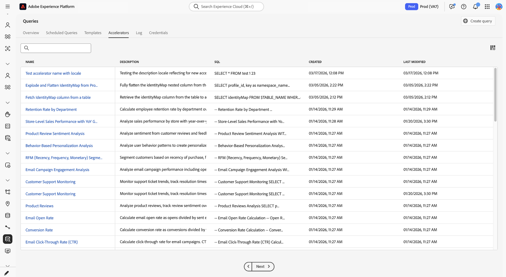

# 데이터 Distiller 액셀러레이터 {#data-distiller-accelerators}

Data Distiller 가속기는 일반적인 분석 시나리오에 맞게 디자인된 Adobe 작성 매개 변수가 있는 SQL 템플릿입니다. 바로 SQL을 작성하지 않고 일반적인 분석을 실행하려면 가속기를 사용합니다. Accelerator 는 읽기 전용이며 Adobe에 의해 유지 관리되므로 전사적으로 일관성을 보장합니다. 하나를 수정해야 하는 경우 사용자 지정 템플릿으로 복제할 수 있습니다.

[!UICONTROL Queries] 작업 영역에서 액셀러레이터를 실행, 예약 및 복제하는 방법에 대해 알아보려면 이 안내서를 참조하십시오.

>[!AVAILABILITY]
>
>Data Distiller Accelerator는 Data Distiller SKU가 있는 조직만 사용할 수 있습니다. [!UICONTROL Accelerators] 탭과 관련 워크플로우에는 데이터 Distiller 추가 기능이 필요합니다. 자세한 내용은 [데이터 Distiller 개요](../data-distiller/overview.md)를 참조하거나 Adobe 담당자에게 문의하십시오.

## 전제 조건 {#prerequisites}

시작하기 전에 다음 요구 사항을 충족하는지 확인하십시오.

* Experience Platform의 [!UICONTROL Queries] 작업 영역에 액세스할 수 있습니다.
* [쿼리 편집기를 사용하고 쿼리를 실행하는 방법](./user-guide.md)을 이해했습니다.
* [매개 변수가 있는 쿼리](./parameterized-queries.md)에 익숙합니다(SQL의 자리 표시자가 런타임 시 대체됨).

## 바로 연결 사용 시기 {#when-to-use}

funnel 분석, 이동 평균 또는 대상 겹침과 같은 일반적인 분석 패턴에 사전 설치된 SQL이 필요한 경우 가속기를 사용하십시오. 사용 사례에 맞는 가속기가 없으면 [쿼리 편집기에서 사용자 지정 쿼리를 작성하거나](./user-guide.md#query-authoring) 새 가속기를 요청하세요([새 가속기를 요청](#request-accelerator) 참조).

작은 가속기 세트는 즉시 분석할 수 있도록 대시보드로 열리는 반면 다른 가속기는 논리를 실행, 예약 또는 조정할 수 있는 쿼리 편집기에서 열립니다. [대시보드 연결 액셀러레이터](#dashboard-accelerators) 섹션을 참조하여 이러한 사전 구성된 시각화가 대상 데이터에 대한 통찰력을 제공하는 방법을 알아보십시오.

바로 연결을 사용하려면 **[!UICONTROL Queries]** 작업 영역으로 이동하여 **[!UICONTROL Accelerators]** 탭 또는 **[!UICONTROL Overview]** 탭을 엽니다.

## 가속기 검색 경로 {#discovery-paths}

전체 카탈로그를 원하는지 권장 템플릿을 원하는지에 따라 쿼리 작업 영역에서 두 가지 방법으로 바로 연결 기능에 액세스할 수 있습니다.

### 바로 연결 탭 사용

사용 가능한 모든 가속기를 탐색하려는 경우 이 경로를 사용합니다. 전체 액셀러레이터 카탈로그를 열려면 왼쪽 탐색에서 **[!UICONTROL Queries]**&#x200B;을(를) 선택한 다음 **[!UICONTROL Accelerators]** 탭을 선택합니다.

작업 공간에는 이름, SQL 미리보기 및 타임스탬프가 있는 가속기의 테이블이 표시됩니다. 액셀러레이터 이름을 선택하여 쿼리 편집기에서 엽니다.

>[!NOTE]
>
>**[!UICONTROL Accelerators]** 탭에서 선택한 모든 바로 연결이 쿼리 편집기에 열립니다.

### 개요 탭 사용

권장 가속기에 빠르게 액세스하려면 이 경로를 사용하십시오. **[!UICONTROL Queries]**(으)로 이동한 다음 **[!UICONTROL Overview]** 탭을 선택합니다. **[!UICONTROL Recommended Data Distiller accelerators]** 섹션에서 카드를 선택합니다.

대부분의 가속기는 쿼리 편집기에서 열립니다. 소규모 가속화 세트는 미리 작성된 시각화가 있는 대시보드로 열립니다. 카드가 쿼리 편집기 대신 대시보드를 여는 경우 [대시보드 연결 액셀러레이터](#dashboard-accelerators)를 참조하세요.

## 쿼리 편집기에서 액셀러레이터 열기 {#open-accelerator}

이 섹션에서는 쿼리 편집기에서 액셀러레이터를 열 때 발생하는 내용과 액셀러레이터 실행, 일정 예약 또는 사용자 지정 템플릿 만들기 등 다음에 수행할 수 있는 작업에 대해 설명합니다.

액셀러레이터를 연 후 결과를 보려면 액셀러레이터를 **실행**&#x200B;하거나, 액셀러레이터를 자동으로 실행하려면 **예약**&#x200B;하거나, SQL을 수정하려면 **사용자 지정 템플릿을 만들기**&#x200B;할 수 있습니다.

>[!NOTE]
>
>쿼리 편집기에서 가속기를 열면 SQL이 읽기 전용 상태로 미리 로드되고 [!UICONTROL Show results], [!UICONTROL Undo text], [!UICONTROL Format text]과(와) 같은 도구 모음 작업이 비활성화됩니다.

오른쪽 패널에는 **[!UICONTROL Accelerator ID]**, **[!UICONTROL Name]** 및 수정 세부 정보와 같은 메타데이터가 표시되며 **[!UICONTROL Add schedule]**&#x200B;을(를) 통해 예약에 액세스할 수 있습니다.

### 매개 변수 제공 및 가속기 실행 {#provide-parameters-execute}

가속기를 실행하려면 먼저 필요한 모든 매개 변수에 대한 값을 제공해야 합니다. 매개 변수는 `${PARAMETER_NAME}` 구문을 사용하고 편집기 아래의 **[!UICONTROL Query parameters]** 탭에 나타납니다. 예를 들어 `${START_DATE}`에는 `YYYY-MM-DD` 형식의 날짜 값(예: `2024-01-01`)이 필요하며 `${AUDIENCE_ID}`에는 특정 대상 식별자가 필요합니다.

가속기를 실행하려면

1. **[!UICONTROL Query parameters]**&#x200B;을(를) 선택하고 각 매개 변수의 값을 입력하십시오.
2. 재생 아이콘()을 선택합니다. 을 클릭합니다.

가속기가 실행되고 **[!UICONTROL Results]** 탭에 결과가 표시됩니다. **[!UICONTROL Run as CTAS]**&#x200B;을(를) 사용하거나 가속기를 예약하지 않으면 이러한 결과가 데이터 집합에 지속되지 않습니다.

매개 변수가 있는 쿼리에 대한 자세한 내용은 [쿼리 편집기의 매개 변수가 있는 쿼리](./parameterized-queries.md)를 참조하십시오.

## 가속기의 결과 유지 {#persist-results}

가속기를 실행하고 결과를 확인한 후 출력을 데이터 세트에 유지할 수 있습니다.

결과에서 데이터 집합을 만들려면 **[!UICONTROL Save]**&#x200B;을(를) 선택하여 액셀러레이터를 템플릿으로 저장한 다음 **[!UICONTROL Run as CTAS]**&#x200B;을(를) 선택합니다. **[!UICONTROL Enter output dataset details]** 대화 상자가 나타납니다. 데이터 세트 이름과 설명(선택 사항)을 입력한 다음 데이터 세트 만들기를 확인합니다. 이 작업은 새 데이터 세트를 만들고 그 결과를 기록합니다.

![데이터 세트 이름과 설명이 채워진 [!UICONTROL Enter output dataset details] 대화 상자.](../images/ui/accelerators/output-dataset-details-dialog.png)

## 액셀러레이터 예약 {#schedule-accelerator}

고정 매개 변수 값으로 자동 실행되도록 가속기를 예약하려면 오른쪽 패널에서 **[!UICONTROL Add schedule]**&#x200B;을(를) 선택합니다.

>[!TIP]
>
>예약하기 전에 필요한 매개 변수 값을 이해해야 합니다. 먼저 가속기를 실행하여 결과를 확인합니다.

구성 예약 대화 상자가 나타납니다.

예약 구성 대화 상자에서 빈도, 일정, 출력 데이터 세트 및 매개 변수 값을 다시 제공해야 합니다. 쿼리 편집기에 입력한 매개 변수 값은 예약 구성으로 전달되지 않습니다. **[!UICONTROL Dataset details]** 섹션에서 **[!UICONTROL Append into existing dataset]** 또는 **[!UICONTROL Create and append into new dataset]** 중 하나를 선택할 수 있습니다. 일정을 구성하고 나면 액셀러레이터가 설정에 따라 자동으로 실행되며 선택한 데이터 세트에 결과를 기록합니다.

전체 단계별 지침은 [쿼리 일정 만들기](./query-schedules.md#create-schedule) 안내서를 참조하십시오.

## 액셀러레이터에서 사용자 지정 템플릿 만들기 {#create-custom-template}

SQL을 수정하거나 자체 구성에서 논리를 재사용해야 하는 경우 가속기에서 사용자 지정 템플릿을 만들 수 있습니다. 먼저 쿼리 편집기에서 액셀러레이터를 연 다음 **[!UICONTROL Create custom template]**&#x200B;을(를) 선택합니다. 필요에 따라 SQL 및 세부 정보를 수정하고 **[!UICONTROL Save]** 또는 **[!UICONTROL Save and close]**&#x200B;을(를) 선택하여 템플릿을 저장합니다.

저장하면 템플릿을 편집할 수 있으며 실행, 예약 또는 CTAS와 함께 사용할 수 있습니다. 템플릿은 **[!UICONTROL Templates]** 탭에 저장되며 다른 템플릿처럼 관리할 수 있습니다. 자세한 내용은 [쿼리 템플릿](./query-templates.md)을 참조하세요.

### 사용자 지정 템플릿을 만들 때 변경되는 사항 {#custom-template-differences}

복제된 템플릿은 SQL을 편집할 수 있고 변경 사항을 저장하고 템플릿을 삭제하고 예약할 수 있으므로 원래 가속기와 다릅니다. **[!UICONTROL Modified by]** 필드에 사용자의 이름이 표시됩니다. 템플릿이 **[!UICONTROL Accelerators]** 대신 **[!UICONTROL Templates]** 탭에 있습니다.

## 대시보드 연결 액셀러레이터 {#dashboard-accelerators}

**[!UICONTROL Overview]** 탭의 일부 가속기가 SQL 쿼리 대신 대시보드로 열립니다. 이러한 가속기는 대상 데이터를 분석하기 위한 사전 작성된 시각화를 제공하며 매개 변수 입력이나 수동 실행이 필요하지 않습니다.

**[!UICONTROL Dashboards]** 작업 영역에서 다음 바로 연결이 열립니다.

**[!UICONTROL Advanced Audience Overlaps]**&#x200B;은(는) 선택한 대상 간의 교차 또는 전체 대상 집합의 교차를 분석하여 겹침 패턴을 식별합니다. 이러한 통찰력을 사용하여 세그먼테이션을 세분화하고 중복 타깃팅을 줄입니다.

**[!UICONTROL Audience Comparison]**&#x200B;은(는) 크기, id 구성 및 시간에 따른 변경 사항을 포함하여 두 대상 간의 주요 지표를 나란히 비교합니다. 이 보기를 사용하여 성과 차이를 평가하고 타깃팅 결정을 알립니다.

**[!UICONTROL Audience Trends]**&#x200B;은(는) 대상 크기 및 id 수를 포함하여 대상 지표가 시간에 따라 변경되는 방식을 추적합니다. 이러한 트렌드를 사용하여 성장을 모니터링하고 세분화 전략의 영향을 평가합니다.

**[!UICONTROL Audience Identity Overlaps]**&#x200B;에서는 ID 관계를 파악하기 위해 선택한 대상 내에서 ID 유형이 어떻게 겹치는지 검사합니다. 이 분석을 사용하여 ID 결합 및 세그멘테이션 정확도를 개선합니다.

대시보드가 열린 후 사용 가능한 컨트롤 및 필터를 사용하여 대상 데이터를 탐색하고 비교합니다. 자세한 내용은 [대시보드 템플릿](../../dashboards/sql-insights-query-pro-mode/templates/overview.md)을 참조하세요.

## 새 액셀러레이터 요청 {#request-accelerator}

기존 액셀러레이터에서 다루지 않는 반복 사용 사례가 있는 경우 Adobe 지원 채널을 통해 요청을 제출하십시오. Adobe은 일반적인 사용 패턴 및 업계 적용 가능성을 기반으로 요청을 평가합니다.

## 다음 단계 {#next-steps}

이제 가속기를 사용하여 일반적인 분석 쿼리를 실행하고 자동화할 수 있습니다.

워크플로우를 확장하려면 [쿼리 템플릿](./query-templates.md#browse)을(를) 만들고 찾아보거나, [매개 변수가 있는 쿼리](./parameterized-queries.md)를 작성하거나, [쿼리](./query-schedules.md)를 예약하거나, [쿼리 서비스 워크플로우](./user-guide.md)를 살펴보세요.
