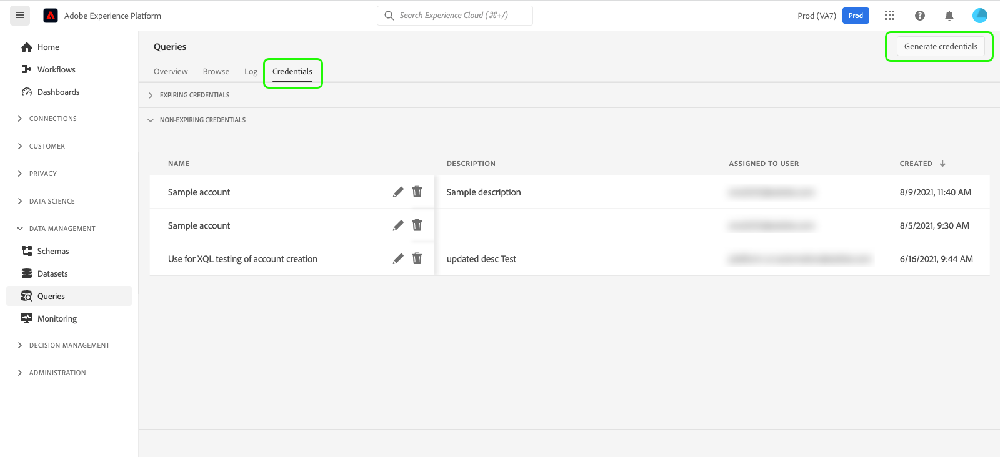

# 자격 증명 안내서

Adobe Experience Platform Query Service를 사용하면 외부 클라이언트와 연결할 수 있습니다. 만료 자격 증명 또는 만료되지 않는 자격 증명을 사용하여 이러한 외부 클라이언트에 연결할 수 있습니다.

>[!NOTE]
>
>자격 증명 패널은 모든 사용자가 자동으로 사용할 수 있는 것은 아닙니다. 필요한 경우 Adobe 계정 팀에 문의하여 [!UICONTROL 자격 증명] 탭을 쿼리 서비스 작업 영역에 포함하도록 요청하십시오. 요청할 경우 이러한 변경은 조직 전체에 적용되며 Adobe 엔지니어링 팀에 의해 수행됩니다. 사용자가 제어하는 설정이 아닙니다.

## 자격 증명 만료 {#expiring-credentials}

>[!CONTEXTUALHELP]
>id="platform_queryservice_credentials_expiringcredentials"
>title="클라이언트의 SSL 모드"
>abstract="쿼리 서비스에 연결된 클라이언트에서 SSL을 활성화해야 합니다. SSL 모드가 “필수”로 설정되어 있는지 확인합니다."

만료되는 자격 증명을 사용하여 외부 클라이언트에 대한 연결을 빠르게 설정할 수 있습니다.


**[!UICONTROL 자격 증명 만료]** 섹션에서 다음 정보를 제공합니다.

- **[!UICONTROL 호스트]**: 클라이언트를 연결할 호스트의 이름입니다. 여기에 Experience Platform UI의 상단 리본에 표시된 조직 이름이 통합됩니다.
- **[!UICONTROL 포트]**: 연결할 호스트의 포트 번호입니다.
- **[!UICONTROL 데이터베이스]**: 클라이언트를 연결할 데이터베이스의 이름입니다.
- **[!UICONTROL 사용자 이름]**: 쿼리 서비스에 연결하는 데 사용되는 사용자 이름입니다.
- **[!UICONTROL 암호]**: 쿼리 서비스에 연결하는 데 사용되는 암호입니다. 보안을 위해 UI의 암호가 해시되었습니다. 복사 아이콘() 해시되지 않은 전체 자격 증명을 클립보드에 복사합니다.
- **[!UICONTROL PSQL 명령]**: 명령줄에서 PSQL을 사용하여 쿼리 서비스에 연결할 수 있도록 관련 정보를 모두 자동으로 삽입한 명령입니다.
- **[!UICONTROL 만료]**: 만료되는 자격 증명의 만료 날짜 및 시간입니다. 토큰의 기본 유효 기간은 24시간이지만 Admin Console의 고급 설정에서 변경할 수 있습니다.

>[!TIP]
>
>만료되는 자격 증명 연결의 세션 수명을 쿼리 서비스로 변경하려면 [Admin Console](https://adminconsole.adobe.com/)&#x200B;(으)로 이동하여 화면에 표시되는 옵션을 선택하십시오. **설정** > **개인 정보 및 보안** > **인증 설정** > **고급 설정** > **최대 세션 수명**.
>
>
>
>Admin Console에서 제공하는 [고급 설정](https://helpx.adobe.com/kr/enterprise/using/authentication-settings.html#advanced-settings)에 대한 자세한 내용은 Adobe 도움말 설명서를 참조하십시오.

### 쿼리 세션 내의 Customer Journey Analytics 데이터에 연결 {#connect-to-customer-journey-analytics}

Power BI 또는 Tableau와 함께 Customer Journey Analytics BI 확장 기능을 사용하여 SQL로 Customer Journey Analytics [데이터 보기](https://experienceleague.adobe.com/ko/docs/analytics-platform/using/cja-dataviews/data-views)에 액세스합니다. Query Service를 BI 확장과 통합하여 Query Service 세션 내에서 직접 데이터 보기에 액세스할 수 있습니다. 이 통합은 쿼리 서비스를 PostgreSQL 인터페이스로 사용하는 BI 도구의 기능을 간소화합니다. 이 기능을 사용하면 BI 도구에서 데이터 보기를 복제할 필요가 없고, 플랫폼 간에 일관된 보고를 보장하며, Customer Journey Analytics 데이터를 BI 플랫폼의 다른 소스와 통합하는 작업을 단순화합니다.

[쿼리 서비스를 다양한 데스크톱 클라이언트 응용 프로그램에 연결](../clients/overview.md)([Power BI](../clients/power-bi.md) 또는 [Tableau](../clients/tableau.md))하는 방법에 대해 알아보려면 설명서를 참조하세요.

>[!IMPORTANT]
>
>이 기능을 사용하려면 Customer Journey Analytics 작업 공간 프로젝트 및 데이터 보기가 필요합니다.

Power BI 또는 Tableau에서 Customer Journey Analytics 데이터에 액세스하려면 [!UICONTROL 데이터베이스] 드롭다운 메뉴를 선택한 다음 사용 가능한 옵션에서 `prod:cja`을(를) 선택하십시오. 그런 다음 Power BI 또는 Tableau 구성에서 사용할 [!DNL Postgres] 자격 증명 매개 변수(호스트, 포트, 데이터베이스, 사용자 이름 등)를 복사합니다.


>[!NOTE]
>
>Power BI 또는 Tableau를 Customer Journey Analytics에 연결하면 쿼리 서비스 &#39;동시 세션&#39; 권한이 사용됩니다. 추가 세션 및 쿼리가 필요한 경우 추가 Ad Hoc Query 사용자 팩 추가 기능을 구매하여 5개의 추가 동시 세션 및 1개의 추가 동시 쿼리를 얻을 수 있습니다.

쿼리 편집기 또는 Postgres CLI에서 직접 Customer Journey Analytics 데이터에 액세스할 수도 있습니다. 이렇게 하려면 쿼리를 작성할 때 `cja` 데이터베이스를 참조하십시오. 쿼리 작성, 실행 및 저장 방법에 대한 자세한 내용은 쿼리 편집기 [쿼리 작성 안내서](./user-guide.md#query-authoring)를 참조하십시오.

SQL을 사용하여 Customer Journey Analytics 데이터 보기에 액세스하는 방법에 대한 자세한 지침은 [BI 확장 안내서](https://experienceleague.adobe.com/ko/docs/analytics-platform/using/cja-dataviews/bi-extension)를 참조하십시오.

## 만료되지 않는 자격 증명 {#non-expiring-credentials}

>[!CONTEXTUALHELP]
>id="platform_queryservice_credentials_migratenonexpiringcredentials"
>title="OAuth 서버 간 자격 증명으로 마이그레이션"
>abstract="JWT 자격 증명은 2025년 6월 30일 이후 더 이상 작동하지 않으므로 이 마이그레이션은 필수입니다. 약 30~40초 정도 소요되며, 시작하면 취소할 수 없습니다. 마이그레이션 후에도 모든 기존 작업과 통합은 OAuth와 함께 계속 작동합니다. 이 화면을 떠나 언제든지 돌아와서 상태를 확인할 수 있습니다."

만료되지 않는 자격 증명을 사용하여 외부 클라이언트에 대한 보다 영구적인 연결을 설정할 수 있습니다.

>[!NOTE]
>
>만료되지 않는 자격 증명에는 다음과 같은 제한이 있습니다.
>
>- 사용자는 사용자 이름과 암호를 사용하여 `{technicalAccountId}:{credential}` 형식으로 로그인해야 합니다. 자세한 내용은 [자격 증명 생성](#generate-credentials) 섹션에서 확인할 수 있습니다.
>- 기본적으로 만료되지 않는 자격 증명에는 `SELECT`개의 쿼리만 실행할 수 있는 권한이 부여됩니다. `CTAS` 또는 `ITAS` 쿼리를 실행하려면 만료되지 않는 자격 증명과 연결된 역할에 &quot;데이터 집합 관리&quot; 및 &quot;스키마 관리&quot; 권한을 수동으로 추가하십시오. &quot;스키마 관리&quot; 권한은 &quot;데이터 모델링&quot; 섹션에서 찾을 수 있으며 &quot;데이터 세트 관리&quot; 권한은 [Adobe Developer Console](<https://developer.adobe.com/console/>)의 &quot;데이터 관리&quot; 섹션 아래에 있습니다.
>- 서드파티 클라이언트는 쿼리 개체를 나열할 때 예상과 다르게 수행할 수 있습니다. 예를 들어 [!DNL DB Visualizer] 같은 일부 타사 클라이언트는 왼쪽 패널에 보기 이름을 표시하지 않습니다. 그러나 `SELECT` 쿼리 내에서 호출되는 경우 보기 이름에 액세스할 수 있습니다. 마찬가지로 [!DNL PowerUI]은(는) 대시보드 만들기에서 선택할 SQL을 통해 만든 임시 보기를 나열하지 않을 수 있습니다.

### 전제 조건

만료되지 않는 자격 증명을 생성하려면 Adobe Admin Console에서 다음 단계를 완료해야 합니다.

1. [Adobe Admin Console](https://adminconsole.adobe.com/)에 로그인한 다음 상단 탐색 모음에서 관련 조직을 선택합니다.
2. [제품 프로필을 선택합니다.](../../access-control/ui/browse.md)
3. [제품 프로필에 대해 **샌드박스** 및 **쿼리 서비스 통합 관리** 권한을 모두 구성](../../access-control/ui/permissions.md)합니다.
4. [새 사용자를 제품 프로필에 추가](../../access-control/ui/users.md)하여 구성된 사용 권한을 부여합니다.
5. [사용자를 제품 프로필 관리자로 추가](https://helpx.adobe.com/kr/enterprise/using/manage-product-profiles.html)하여 활성 제품 프로필에 대한 계정 만들기를 허용합니다.
6. [통합을 만들려면 사용자를 제품 프로필 개발자로 추가](https://helpx.adobe.com/jp/enterprise/using/manage-developers.html)하십시오.

이러한 단계를 수행한 후 [Adobe Developer Console](https://developer.adobe.com/console/)에서 OAuth 서버 간 자격 증명을 생성하고 만료 또는 만료되지 않는 자격 증명 기능을 사용하는 데 필요한 권한이 구성됩니다.

권한 할당에 대한 자세한 내용은 [액세스 제어 설명서](../../access-control/home.md)를 참조하세요.

### 자격 증명 생성 {#generate-credentials}

만료되지 않는 자격 증명 집합을 만들려면 Experience Platform UI로 돌아가서 왼쪽 탐색에서 **[!UICONTROL 쿼리]**&#x200B;를 선택하여 [!UICONTROL 쿼리] 작업 영역에 액세스합니다. **[!UICONTROL 자격 증명]** 탭 다음에 **[!UICONTROL 자격 증명 생성]**&#x200B;을 선택합니다.



자격 증명을 생성할 수 있는 대화 상자가 나타납니다. 만료되지 않는 자격 증명을 만들려면 다음 세부 정보를 제공해야 합니다.

- **[!UICONTROL 이름]**: 생성 중인 자격 증명의 이름입니다.
- **[!UICONTROL 설명]**: (선택 사항) 생성 중인 자격 증명에 대한 설명입니다.
- **[!UICONTROL 할당 대상]**: 자격 증명을 할당할 사용자입니다. 이 값은 자격 증명을 만드는 사용자의 이메일 주소여야 합니다.
- **[!UICONTROL 암호]**(선택 사항) 자격 증명의 선택적 암호입니다. 암호를 설정하지 않으면 Adobe에서 자동으로 암호를 생성합니다.

필요한 모든 세부 정보를 제공했으면 **[!UICONTROL 자격 증명 생성]**&#x200B;을 선택하여 자격 증명을 생성합니다.


>[!IMPORTANT]
>
>**[!UICONTROL 자격 증명 생성]**&#x200B;을 선택하면 구성 JSON 파일이 로컬 컴퓨터에 다운로드됩니다. Adobe은 생성된 자격 증명을 **기록하지**&#x200B;하므로 다운로드한 파일을 안전하게 저장하고 자격 증명의 기록을 보관해야 합니다.
>
>또한 자격 증명을 90일 동안 사용하지 않으면 자격 증명이 삭제됩니다.

구성 JSON 파일에는 기술 계정 이름, 기술 계정 ID 및 자격 증명과 같은 정보가 포함되어 있습니다. 다음 형식으로 제공됩니다.

```json
{"technicalAccountName":"9F0A21EE-B8F3-4165-9871-846D3C8BC49E@TECHACCT.ADOBE.COM","credential":"3d184fa9e0b94f33a7781905c05203ee","technicalAccountId":"4F2611B8613AA3670A495E55"}
```

생성된 자격 증명을 저장한 후 **[!UICONTROL 닫기]**&#x200B;를 선택합니다. 이제 만료되지 않는 모든 자격 증명 목록을 볼 수 있습니다.


만료되지 않는 자격 증명을 편집하거나 삭제할 수 있습니다. 만료되지 않는 자격 증명을 편집하려면 연필 아이콘(). 만료되지 않는 자격 증명을 삭제하려면 삭제 아이콘()을 선택하십시오.

만료되지 않는 자격 증명을 편집할 때 모달이 표시됩니다. 업데이트할 다음 세부 정보를 제공할 수 있습니다.

- **[!UICONTROL 이름]**: 생성 중인 자격 증명의 이름입니다.
- **[!UICONTROL 설명]**: (선택 사항) 생성 중인 자격 증명에 대한 설명입니다.
- **[!UICONTROL 할당 대상]**: 자격 증명을 할당할 사용자입니다. 이 값은 자격 증명을 만드는 사용자의 이메일 주소여야 합니다.


필요한 모든 세부 정보를 제공했으면 **[!UICONTROL 계정 업데이트]**&#x200B;를 선택하여 자격 증명 업데이트를 완료합니다.

### 자격 증명을 OAuth로 마이그레이션 {#migrate-credentials}

만료되지 않는 JWT 자격 증명을 사용하는 경우 서비스 중단을 방지하기 위해 2025년 6월 30일 이전에 각 인증서를 OAuth 서버 간 서버로 마이그레이션해야 합니다.

>[!IMPORTANT]
>
>JWT 자격 증명은 2025년 6월 30일 이후 작동을 중지합니다. 인증을 유지하려면 이 마이그레이션을 수동으로 완료해야 합니다.

영향을 받는 자격 증명을 식별하고 마이그레이션을 완료하는 방법은 [JWT에서 OAuth 서버 간 자격 증명으로 마이그레이션 가이드](./migrate-jwt-to-oauth.md)를 참조하십시오.

일반적인 질문은 [마이그레이션 FAQ](./migrate-jwt-to-oauth.md#faq)를 참조하세요.

## 자격 증명을 사용하여 외부 클라이언트에 연결 {#use-credential-to-connect}

만료 전 또는 만료되지 않는 자격 증명을 사용하여 Aqua Data Studio, Looker 또는 Power BI과 같은 외부 클라이언트와 연결할 수 있습니다. 이러한 자격 증명에 대한 입력 방법은 외부 클라이언트에 따라 달라집니다. 이러한 자격 증명 사용에 대한 특정 지침은 외부 클라이언트의 설명서를 참조하십시오.

이 이미지는 만료되지 않는 자격 증명의 암호를 제외하고 UI에서 발견된 각 매개 변수의 위치를 나타냅니다. 만료되지 않는 자격 증명은 JSON 구성 파일에서 제공되지만, UI의 **자격 증명** 탭에서 만료되는 자격 증명을 볼 수 있습니다.


아래 표에는 일반적으로 외부 클라이언트에 연결하는 데 필요한 매개 변수가 나와 있습니다.

>[!NOTE]
>
>만료되지 않는 자격 증명을 사용하여 호스트에 연결할 때 암호와 사용자 이름을 제외하고 [!UICONTROL 만료되는 자격 증명] 섹션에 나열된 모든 매개 변수를 사용해야 합니다.
>&#x200B;>사용자 이름과 암호를 입력하는 형식은 이 예제 `username:{your_username}` 및 `password:{password_string}`과(와) 같이 콜론으로 구분된 값을 사용합니다.

| 매개변수 | 설명 | 예 |
|---|---|---|
| **서버/호스트** | 접속 중인 서버/호스트의 이름입니다. <ul><li>이 값은 만료 중인 자격 증명과 만료되지 않는 자격 증명 모두에 사용되며 `server.adobe.io` 형식을 사용합니다. **[!UICONTROL 만료 자격 증명]** 섹션의 [!UICONTROL 호스트]에서 값을 찾았습니다.</ul></li> | `acme.platform.adobe.io` |
| **포트** | 연결 중인 서버/호스트의 포트입니다. <ul><li>이 값은 만료되는 자격 증명과 만료되지 않는 자격 증명 모두에 사용되며 **[!UICONTROL 만료되는 자격 증명]** 섹션의 [!UICONTROL 포트]에서 찾을 수 있습니다.</ul></li> | `80` |
| **데이터베이스** | 연결 중인 데이터베이스입니다. <ul><li>이 값은 만료되는 자격 증명과 만료되지 않는 자격 증명 모두에 사용되며 **[!UICONTROL 만료되는 자격 증명]** 섹션의 [!UICONTROL 데이터베이스]에 있습니다. </ul></li> | `prod:all` |
| **사용자 이름** | 외부 클라이언트에 연결하는 사용자의 사용자 이름입니다. <ul><li>이 값은 만료되는 자격 증명과 만료되지 않는 자격 증명 모두에 사용됩니다. `@AdobeOrg` 앞에 영숫자 문자열 형식을 사용합니다. 이 값은 **[!UICONTROL 사용자 이름]**&#x200B;에 있습니다.</li></ul> | `ECBB80245ECFC73E8A095EC9@AdobeOrg` |
| **암호** | 외부 클라이언트에 연결하는 사용자의 암호입니다. <ul><li>만료되는 자격 증명을 사용하는 경우 **[!UICONTROL 만료되는 자격 증명]** 섹션의 [!UICONTROL 암호]에서 찾을 수 있습니다.</li><li>만료되지 않는 자격 증명을 사용하는 경우 이 값은 technicalAccountID의 연결된 인수와 구성 JSON 파일에서 가져온 자격 증명입니다. 암호 값은 `{technicalAccountId}:{credential}` 형식을 사용합니다.</li></ul> | <ul><li>만료될 자격 증명 암호는 1,000자 이상의 영숫자 문자열입니다. 예시는 제공되지 않을 것입니다.</li><li>만료되지 않는 자격 증명 암호는 다음과 같습니다. <br>`4F2611B8613DK3670V495N55:3d182fa9e0b54f33a7881305c06203ee`</li></ul> |

{style="table-layout:auto"}

## 다음 단계

만료될 때까지 및 만료되지 않는 자격 증명이 모두 작동하는 방식을 이해했으므로 이러한 자격 증명을 사용하여 외부 클라이언트에 연결할 수 있습니다. 외부 클라이언트에 대한 자세한 내용은 [클라이언트를 쿼리 서비스에 연결](../clients/overview.md)을 참조하십시오.
