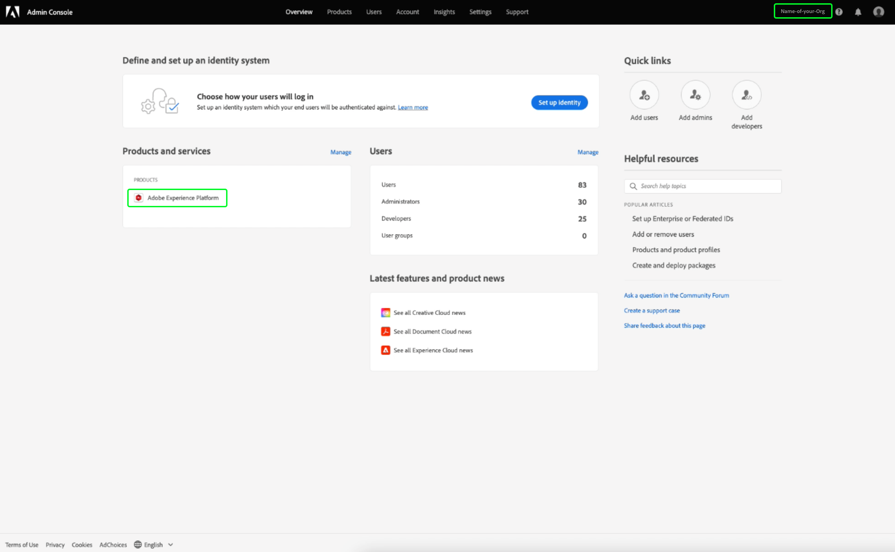

# 자격 증명 안내서

Adobe Experience Platform 쿼리 서비스를 통해 외부 클라이언트와 연결할 수 있습니다. 만료 자격 증명 또는 만료되지 않은 자격 증명을 사용하여 이러한 외부 클라이언트에 연결할 수 있습니다.

## 만료 자격 증명

만료 자격 증명을 사용하여 외부 클라이언트에 대한 연결을 빠르게 설정할 수 있습니다.


**[!UICONTROL 만료 자격 증명]** 섹션에서는 다음 정보를 제공합니다.

- **[!UICONTROL 호스트]**: 연결할 호스트의 이름입니다. 쿼리 서비스에 연결하려면 현재 사용 중인 IMS 조직의 이름이 포함됩니다.
- **[!UICONTROL 포트]**: 연결할 호스트의 포트 번호입니다.
- **[!UICONTROL 데이터베이스]**: 연결할 데이터베이스의 이름입니다.
- **[!UICONTROL 사용자 이름]**: Query Service에 연결하는 데 사용할 사용자 이름입니다.
- **[!UICONTROL 암호]**: Query Service에 연결하는 데 사용할 암호입니다.
- **[!UICONTROL PSQL 명령]**: 명령줄에서 PSQL을 사용하여 Query Service에 연결할 관련 정보를 모두 자동으로 삽입한 명령입니다.
- **[!UICONTROL 만료]**: 만료 자격 증명에 대한 만료 날짜입니다. 자격 증명은 생성된 후 24시간 후에 만료됩니다.

## 만료되지 않은 자격 증명

만료되지 않은 자격 증명을 사용하여 외부 클라이언트에 보다 영구적인 연결을 설정할 수 있습니다.

만료되지 않은 자격 증명을 만들기 전에 Adobe Admin Console에서 조직에 대한 **Sandboxes** 및 **Query Service 통합 관리** 권한을 모두 구성해야 합니다.

[Adobe Admin Console](https://adminconsole.adobe.com/)에 로그인하고 위쪽 탐색 모음에서 관련 조직을 선택합니다.

[!UICONTROL 개요]의 [!UICONTROL 제품 및 서비스] 섹션에서 **Adobe Experience Platform**&#x200B;를 선택합니다.



Adobe Experience Platform 세부 사항 페이지가 나타납니다. 그런 다음 새 프로필을 만듭니다. [!UICONTROL **새 프로필**]&#x200B;을 선택합니다.


프로필 만들기 대화 상자가 나타납니다. 새 프로필에 대해 수사적 이름을 입력하고 [!UICONTROL **저장**]&#x200B;을 선택합니다. 새 프로필에 대한 [!UICONTROL 설정] 페이지가 나타납니다. 사용 가능한 옵션에서 [!UICONTROL **권한**] 탭을 선택합니다.

### 쿼리 서비스 권한 사용

조직에 대해 올바른 쿼리 서비스 권한이 활성화되어 있는지 확인하려면 목록에서 [!UICONTROL **쿼리 서비스**] 카테고리를 찾아 선택합니다.


[!UICONTROL 쿼리 서비스에 대한 권한 편집] 작업 영역이 나타납니다. [!UICONTROL **쿼리 관리**]&#x200B;에 대한 더하기(**+**) 아이콘과 [!UICONTROL **쿼리 서비스 통합 관리**]&#x200B;아이콘을 선택하여 [!UICONTROL 포함된 권한 항목] 열에 추가합니다. 그런 다음 [!UICONTROL **저장**]&#x200B;을 선택하여 변경 사항을 확인합니다.


설정 > 권한 탭으로 돌아갑니다.

### 샌드박스 권한 활성화

조직에 대해 올바른 샌드박스를 선택하려면 목록에서 [!UICONTROL **Sandboxes**] 카테고리를 찾아 선택합니다.


샌드박스 작업 영역이 나타납니다. [!UICONTROL 사용 가능한 권한 항목]에서 이 이미지에서 해당 샌드박스를 찾습니다. 이 샌드박스는 Prod 샌드박스입니다. 더하기(**+**) 아이콘을 선택하여 [!UICONTROL 포함된 권한 항목]에 추가합니다. 그런 다음 [!UICONTROL **저장**]&#x200B;을 선택하여 변경 사항을 확인합니다.


설정 > 권한 탭으로 돌아갑니다.

사용자가 만료되지 않은 계정 기능에 액세스할 수 있도록 하려면 3단계를 더 수행해야 합니다.

- 새 사용자를에 추가하여 새로 만든 권한을 부여합니다. [!UICONTROL **사용자**] 탭을 선택하고 [!UICONTROL **사용자 추가**]&#x200B;를 선택합니다.


사용자 만들기 대화 상자가 나타납니다. 새 사용자의 이름과 전자 메일을 입력하고 [!UICONTROL **저장**]&#x200B;을 선택합니다.

- 그런 다음 활성 제품 프로필에 계정을 만들 수 있도록 사용자로 추가해야 합니다. 새로 만든 사용자를 관리자로 추가하려면 [!UICONTROL **관리자**] 탭을 선택하고 [!UICONTROL **관리자 추가**]&#x200B;를 선택합니다.


관리 추가 대화 상자가 나타납니다. 새 관리자의 세부 사항을 텍스트 필드에 입력하고 [!UICONTROL **저장**]&#x200B;을 선택합니다.

- 그런 다음 통합을 만들려면 사용자를 개발자로 추가해야 합니다. **개발자** 탭을 선택하고 **개발자 추가**&#x200B;를 선택합니다.


개발자 추가 대화 상자가 나타납니다. 새 개발자의 세부 사항을 텍스트 필드에 입력하고 **저장**&#x200B;을 선택합니다.

권한을 할당하는 방법에 대한 자세한 내용은 [Access Control](../../access-control/home.md)에서 설명서를 참조하십시오.

이제 사용자가 만료 자격 증명 기능을 사용할 수 있도록 필요한 모든 권한이 Adobe 개발자 콘솔에 구성됩니다.

만료되지 않은 자격 증명 집합을 만들려면 [쿼리 자격 증명] 작업 영역에서 **[!UICONTROL 자격 증명 생성]**&#x200B;을 선택합니다.


자격 증명 생성 모달이 나타납니다. 만료되지 않은 자격 증명을 작성하려면 다음 세부 정보를 제공해야 합니다.

- **[!UICONTROL 이름]**: 생성 중인 자격 증명의 이름입니다.
- **[!UICONTROL 설명]**: (선택 사항) 생성 중인 자격 증명에 대한 설명입니다.
- ****&#x200B;에 할당됨: 자격 증명이 할당될 사용자입니다. 이 값은 자격 증명을 만드는 사용자의 이메일 주소여야 합니다.
- **[!UICONTROL 암호]** (선택 사항) 자격 증명을 위한 선택적 암호입니다. 암호를 설정하지 않으면 Adobe에서 자동으로 암호를 생성합니다.

필요한 세부 정보를 모두 제공했으면 **[!UICONTROL 자격 증명 생성]**&#x200B;을 선택하여 자격 증명을 생성합니다.


>[!IMPORTANT]
>
>**[!UICONTROL 자격 증명 생성]** 단추를 선택하면 구성 JSON 파일이 로컬 시스템에 다운로드됩니다. Adobe은 생성된 자격 증명을 기록하지 **않습니다. 따라서**&#x200B;은(는) 다운로드한 파일을 안전하게 저장하고 자격 증명 레코드를 유지해야 합니다.****
>
>또한 자격 증명이 90일 동안 사용되지 않으면 자격 증명이 정리됩니다.

구성 JSON 파일에는 기술 계정 이름, 기술 계정 ID 및 자격 증명과 같은 정보가 포함되어 있습니다. 다음 형식으로 제공됩니다.

```json
{"technicalAccountName":"9F0A21EE-B8F3-4165-9871-846D3C8BC49E@TECHACCT.ADOBE.COM","credential":"3d184fa9e0b94f33a7781905c05203ee","technicalAccountId":"4F2611B8613AA3670A495E55"}
```

생성된 자격 증명을 저장했으므로 **[!UICONTROL 닫기]**&#x200B;를 선택하십시오. 이제 만료되지 않은 자격 증명 목록을 볼 수 있습니다.


만료되지 않은 자격 증명을 편집하거나 삭제할 수 있습니다. 만료되지 않은 자격 증명을 편집하려면 연필 아이콘()을 선택합니다. 만료되지 않은 자격 증명을 삭제하려면 삭제 아이콘()을 선택합니다.

만료되지 않은 자격 증명을 편집할 때 모달이 나타납니다. 업데이트할 다음 세부 정보를 제공할 수 있습니다.

- **[!UICONTROL 이름]**: 생성 중인 자격 증명의 이름입니다.
- **[!UICONTROL 설명]**: (선택 사항) 생성 중인 자격 증명에 대한 설명입니다.
- ****&#x200B;에 할당됨: 자격 증명이 할당될 사용자입니다. 이 값은 자격 증명을 만드는 사용자의 이메일 주소여야 합니다.


필요한 세부 정보를 모두 제공했으면 **[!UICONTROL 계정 업데이트]**&#x200B;를 선택하여 자격 증명에 대한 업데이트를 완료합니다.

## 자격 증명을 사용하여 외부 클라이언트에 연결

만료되거나 만료되지 않은 자격 증명을 사용하여 Aqua Data Studio, Looker 또는 Power BI과 같은 외부 클라이언트와 연결할 수 있습니다.

아래 표에는 일반적으로 외부 클라이언트에 연결하는 데 필요한 매개 변수 목록과 해당 설명이 포함되어 있습니다.

>[!NOTE]
>
>만료되지 않은 자격 증명을 사용하여 호스트에 연결할 때는 암호를 제외하고 [!UICONTROL EXPIRING CREDENTIALS] 섹션에 나열된 모든 매개 변수를 사용해야 합니다.

| 매개 변수 | 설명 |
|---|---|
| **서버/호스트** | 연결할 서버/호스트의 이름입니다. 이 값은 `server.adobe.io` 형식을 사용하며 **[!UICONTROL Host]**&#x200B;에서 찾을 수 있습니다. |
| **포트** | 연결할 서버/호스트의 포트입니다. 이 값은 **[!UICONTROL 포트]**&#x200B;에서 찾을 수 있습니다. 포트의 예제 값은 `80`입니다. |
| **데이터베이스** | 연결할 데이터베이스입니다. 이 값은 **[!UICONTROL 데이터베이스]**&#x200B;에서 찾을 수 있습니다. 데이터베이스의 예제 값은 `prod:all`입니다. |
| **사용자 이름** | 외부 클라이언트에 연결하는 사용자의 사용자 이름입니다. 이 작업은 `@AdobeOrg` 앞에 있는 영숫자 문자열 형식을 사용합니다. 이 값은 **[!UICONTROL 사용자 이름]**&#x200B;에 있습니다. |
| **암호** | 외부 클라이언트에 연결하는 사용자의 암호입니다. <ul><li>만료 자격 증명을 사용하는 경우, 만료 자격 증명 섹션 내의 **[!UICONTROL 암호]**&#x200B;에서 찾을 수 있습니다.</li><li>만료되지 않은 자격 증명을 사용하는 경우 이 값은 technicalAccountID의 인수와 구성 JSON 파일에서 가져온 자격 증명으로 구성됩니다. 암호 값은 다음 형식을 사용합니다. `{technicalAccountId}:{credential}`</li></ul> |

## 다음 단계

만료 자격 증명과 만료 전 자격 증명이 모두 작동하는 방식을 이해하므로 이러한 자격 증명을 사용하여 외부 클라이언트에 연결할 수 있습니다. 외부 클라이언트에 대한 자세한 내용은 [클라이언트 연결을 Query Service 안내서](../clients/overview.md)를 참조하십시오.
