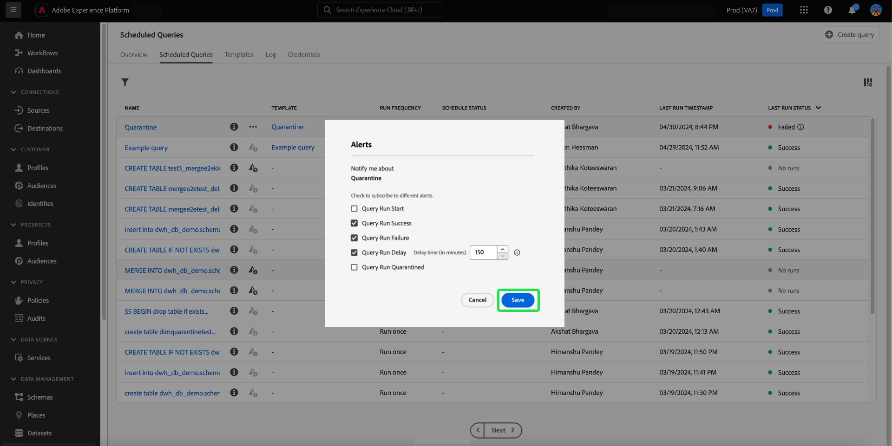
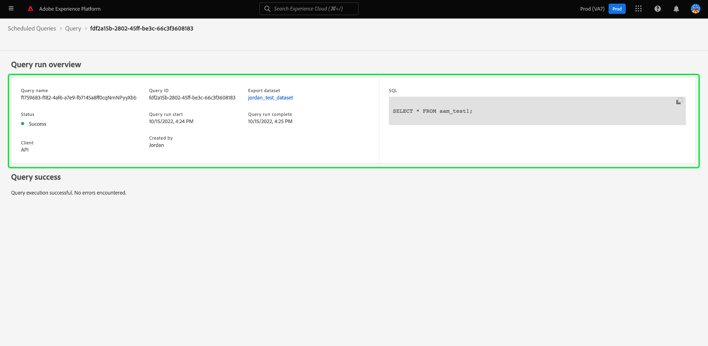

# 예약된 쿼리 모니터링

Adobe Experience Platform은 UI를 통해 모든 쿼리 작업의 상태에 대한 향상된 가시성을 제공합니다. 다음에서 [!UICONTROL 예약된 쿼리] 탭에서는 이제 상태, 일정 세부 정보 및 오류 메시지/코드가 실패할 경우 이를 포함하는 쿼리 실행에 대한 중요한 정보를 찾을 수 있습니다. 다음 작업을 통해 이러한 쿼리에 대한 UI를 통해 해당 상태에 따라 쿼리에 대한 경고를 구독할 수도 있습니다. [!UICONTROL 예약된 쿼리] 탭.

## [!UICONTROL 예약된 쿼리]

다음 [!UICONTROL 예약된 쿼리] 탭에서는 모든 예약된 CTAS 및 ITAS 쿼리에 대한 개요를 제공합니다. 모든 예약된 쿼리와 실패한 쿼리에 대한 오류 코드 및 메시지에 대한 실행 세부 정보를 찾을 수 있습니다.

로 이동하려면 [!UICONTROL 예약된 쿼리] 탭, 선택 **[!UICONTROL 쿼리]** 왼쪽 탐색 모음 뒤에 오는 **[!UICONTROL 예약된 쿼리]**

아래 표에서는 사용 가능한 각 열에 대해 설명합니다.

>[!NOTE]
>
>경고 구독 아이콘은 제목 없는 열의 각 행에 포함됩니다. 다음을 참조하십시오. [경고 구독](#alert-subscription) 섹션에 자세히 설명되어 있습니다.

| 열 | 설명 |
|---|---|
| **[!UICONTROL 이름]** | 이름 필드는 템플릿 이름 또는 SQL 쿼리의 처음 몇 문자입니다. UI를 통해 쿼리 편집기로 만든 모든 쿼리의 이름은 처음 만들 때 로 지정됩니다. API를 통해 쿼리를 만든 경우 해당 이름은 쿼리를 만드는 데 사용되는 초기 SQL 코드 조각이 됩니다. 쿼리와 연결된 모든 실행 목록을 보려면 [!UICONTROL 이름] 열. 자세한 내용은 [쿼리 실행 일정 세부 정보](#query-runs) 섹션. |
| **[!UICONTROL 템플릿]** | 쿼리의 템플릿 이름입니다. 템플릿 이름을 선택하여 쿼리 편집기로 이동합니다. 쿼리 템플릿은 편의를 위해 쿼리 편집기에 표시됩니다. 템플릿 이름이 없는 경우 행은 하이픈으로 표시되며 쿼리를 보기 위해 쿼리 편집기로 리디렉션할 수 없습니다. |
| **[!UICONTROL SQL]** | SQL 쿼리의 코드 조각입니다. |
| **[!UICONTROL 실행 빈도]** | 쿼리가 실행되도록 설정된 케이던스입니다. 사용 가능한 값은 다음과 같습니다 `Run once` 및 `Scheduled`. 쿼리는 실행 빈도에 따라 필터링될 수 있습니다. |
| **[!UICONTROL 작성자]** | 쿼리를 만든 사용자의 이름입니다. |
| **[!UICONTROL 생성일]** | 쿼리가 생성된 타임스탬프(UTC 형식)입니다. |
| **[!UICONTROL 마지막 실행 타임스탬프]** | 쿼리가 실행된 가장 최근 타임스탬프입니다. 이 열에서는 쿼리가 현재 예약에 따라 실행되었는지 여부를 강조 표시합니다. |
| **[!UICONTROL 마지막 실행 상태]** | 가장 최근 쿼리 실행의 상태입니다. 상태 값: `Success`, `Failed`, `In progress`, 및 `No runs`. |
| **[!UICONTROL 일정 상태]** | 예약된 쿼리의 현재 상태입니다. 5개의 잠재적 값이 있습니다. [!UICONTROL 등록 중], [!UICONTROL 활성], [!UICONTROL 비활성], [!UICONTROL 삭제됨]및 하이픈입니다. <ul><li>하이픈은 예약된 쿼리가 반복되지 않는 일회성 쿼리임을 나타냅니다.</li><li>다음 [!UICONTROL 등록 중] 상태는 시스템이 계속해서 쿼리에 대한 새 일정 생성을 처리하고 있음을 나타냅니다. 예약된 쿼리가 등록되는 동안에는 비활성화하거나 삭제할 수 없습니다.</li><li>다음 [!UICONTROL 활성] 상태는 예약된 쿼리에 이 있음을 나타냅니다. **아직 전달되지 않음** 완료 날짜 및 시간입니다.</li><li>다음 [!UICONTROL 비활성] 상태는 예약된 쿼리에 이 있음을 나타냅니다. **전달됨** 완료 날짜 및 시간입니다.</li><li>다음 [!UICONTROL 삭제됨] 상태는 쿼리 일정이 삭제되었음을 나타냅니다.</li></ul> |

>[!TIP]
>
>쿼리 편집기로 이동하면 다음을 선택할 수 있습니다 **[!UICONTROL 쿼리]** (으)로 돌아가기 [!UICONTROL 템플릿] 탭.

## 예약된 쿼리에 대한 표 설정 사용자 지정 {#customize-table}

에서 열을 조정할 수 있습니다. [!UICONTROL 예약된 쿼리] 탭하여 필요에 맞게 변경합니다. 을(를) 열려면 [!UICONTROL 표 맞춤화] 설정 대화 상자를 열고 사용 가능한 열을 편집하려면 설정 아이콘()을 클릭하여 제품에서 사용할 수 있습니다.

>[!NOTE]
>
>다음 [!UICONTROL 생성됨] 일정이 생성된 날짜를 참조하는 열은 기본적으로 숨겨집니다.

관련 확인란을 전환하여 테이블 열을 제거하거나 추가합니다. 그런 다음 을 선택합니다. **[!UICONTROL 적용]** 을 클릭하여 선택 항목을 확인합니다.

>[!NOTE]
>
>UI를 통해 생성된 모든 쿼리는 작성 프로세스의 일부로 이름이 지정된 템플릿이 됩니다. 템플릿 이름은 템플릿 열에 표시됩니다. API를 통해 쿼리를 만든 경우 템플릿 열이 비어 있습니다.

## 인라인 작업으로 예약된 쿼리 관리 {#inline-actions}

다음 [!UICONTROL 예약된 쿼리] 보기 는 한 위치에서 모든 예약된 쿼리를 관리하기 위한 다양한 인라인 작업을 제공합니다. 인라인 작업은 줄임표가 있는 각 행에 표시됩니다. 관리할 예약된 쿼리의 줄임표를 선택하여 팝업 메뉴에서 사용 가능한 옵션을 확인합니다. 사용 가능한 옵션은 다음과 같습니다 [[!UICONTROL 일정 비활성화]](#disable) 또는 [!UICONTROL 일정 활성화], [[!UICONTROL 일정 삭제]](#delete), 및 [[!UICONTROL 구독]](#alert-subscription) 경고 쿼리.

### 예약된 쿼리 비활성화 또는 활성화 {#disable}

예약된 쿼리를 비활성화하려면 관리할 예약된 쿼리의 생략 부호를 선택한 다음 을 선택합니다 **[!UICONTROL 일정 비활성화]** 을 클릭하여 제품에서 사용할 수 있습니다. 작업을 확인하는 대화 상자가 나타납니다. 선택 **[!UICONTROL 사용 안 함]** 설정을 확인합니다.

예약된 쿼리가 비활성화되면 동일한 프로세스를 통해 일정을 활성화할 수 있습니다. 줄임표를 선택한 다음 을 선택합니다. **[!UICONTROL 일정 활성화]** 사용 가능한 옵션에서

### 예약된 쿼리 삭제 {#delete}

예약된 쿼리를 삭제하려면 관리하려는 예약된 쿼리의 생략 부호를 선택한 다음 을 선택합니다 **[!UICONTROL 일정 삭제]** 을 클릭하여 제품에서 사용할 수 있습니다. 작업을 확인하는 대화 상자가 나타납니다. 선택 **[!UICONTROL 삭제]** 설정을 확인합니다.

예약된 쿼리가 삭제되면 **아님** 이(가) 예약된 쿼리 목록에서 제거되었습니다. 타원에서 제공한 인라인 작업은 제거되고 회색으로 표시된 경고 추가 아이콘으로 대체됩니다. 삭제된 일정에 대한 경고는 구독할 수 없습니다. 행은 예약된 쿼리의 일부로 수행된 실행에 대한 정보를 제공하기 위해 UI에 유지됩니다.

해당 쿼리 템플릿에 대한 실행을 예약하려면 해당 행에서 템플릿 이름을 선택하여 쿼리 편집기로 이동한 다음 [쿼리에 일정을 추가하는 지침](./query-schedules.md#create-schedule) 설명서에 설명된 대로.

### 경고 구독 {#alert-subscription}

예약된 쿼리 실행에 대한 경고를 구독하려면 관리할 예약된 쿼리의 생략 부호를 선택한 다음 을 선택합니다 **[!UICONTROL 구독]** 을 클릭하여 제품에서 사용할 수 있습니다.

다음 [!UICONTROL 경고] 대화 상자가 열립니다. 다음 [!UICONTROL 경고] 대화 상자는 UI 알림 및 이메일 경고를 모두 구독합니다. 경고는 쿼리 상태를 기반으로 합니다. 다음 세 가지 옵션을 사용할 수 있습니다. `start`, `success`, 및 `failure`. 해당 상자를 선택하고 **[!UICONTROL 저장]** 구독하기. 알림에 알림이 없는 한 구독할 수 있습니다. [!UICONTROL 마지막 실행 타임스탬프] 값.

다음을 참조하십시오. [경고 구독 API 설명서](../api/alert-subscriptions.md) 추가 정보.

### 쿼리 세부 정보 보기 {#query-details}

정보 아이콘()을 클릭하여 쿼리에 대한 세부 정보 패널을 확인합니다. 세부 정보 패널에는 예약된 쿼리 테이블에 포함된 사실 외에 쿼리의 모든 관련 정보가 포함됩니다. 추가 정보에는 쿼리 ID, 마지막으로 수정한 날짜, 쿼리의 SQL, 일정 ID 및 현재 설정된 일정이 포함됩니다.

## 쿼리 필터링 {#filter}

실행 빈도에 따라 쿼리를 필터링할 수 있습니다. 다음에서 [!UICONTROL 예약된 쿼리] 탭에서 필터 아이콘()을 클릭하여 필터 사이드바를 엽니다.

실행 빈도에 따라 쿼리 목록을 필터링하려면 다음 중 하나를 선택합니다. **[!UICONTROL 예약됨]** 또는 **[!UICONTROL 한 번 실행]** 확인란을 필터링합니다.

>[!NOTE]
>
>실행되었지만 예약되지 않은 모든 쿼리는 [!UICONTROL 한 번 실행].

필터 기준을 활성화했으면 다음을 선택합니다. **[!UICONTROL 필터 숨기기]** 필터 패널을 닫습니다.

## 쿼리 실행 일정 세부 정보 {#query-runs}

일정 세부 정보 페이지를 열려면 다음에서 쿼리 이름을 선택합니다. [!UICONTROL 예약된 쿼리] 탭. 이 보기는 예약된 쿼리의 일부로 실행된 모든 실행의 목록을 제공합니다. 제공되는 정보에는 시작 및 종료 시간, 상태 및 사용된 데이터 세트가 포함됩니다.

이 정보는 5열 표로 제공됩니다. 각 행은 쿼리 실행을 나타냅니다.

| 열 이름 | 설명 |
|---|---|
| **[!UICONTROL 쿼리 실행 ID]** | 일별 실행에 대한 쿼리 실행 ID입니다. 다음 항목 선택 **[!UICONTROL 쿼리 실행 ID]** 을 클릭하여 다음 위치로 이동합니다. [!UICONTROL 쿼리 실행 개요]. |
| **[!UICONTROL 쿼리 실행 시작]** | 쿼리가 실행된 타임스탬프. 타임스탬프는 UTC 형식입니다. |
| **[!UICONTROL 쿼리 실행 완료]** | 쿼리가 완료된 타임스탬프. 타임스탬프는 UTC 형식입니다. |
| **[!UICONTROL 상태]** | 가장 최근 쿼리 실행의 상태입니다. 세 가지 상태 값은 다음과 같습니다. `successful` `failed` 또는 `in progress`. |
| **[!UICONTROL 데이터 세트]** | 실행과 관련된 데이터 세트입니다. |

예약되는 쿼리에 대한 세부 정보는 다음에서 볼 수 있습니다. [!UICONTROL 속성] 패널. 이 패널에는 초기 쿼리 ID, 클라이언트 유형, 템플릿 이름, 쿼리 SQL 및 일정의 케이던스가 포함됩니다.

쿼리 실행 ID를 선택하여 실행 세부 정보 페이지로 이동하고 쿼리 정보를 확인합니다.

## 쿼리 실행 개요 {#query-run-overview}

다음 [!UICONTROL 쿼리 실행 개요] 은(는) 이 예약된 쿼리의 개별 실행에 대한 정보와 실행 상태에 대한 보다 자세한 분류를 제공합니다. 이 페이지에는 또한 클라이언트 정보와 쿼리 실패의 원인이 될 수 있는 모든 오류에 대한 세부 정보가 포함되어 있습니다.

쿼리 상태 섹션은 쿼리가 실패한 경우 오류 코드와 오류 메시지를 제공합니다.

이 보기에서 쿼리 SQL을 클립보드에 복사할 수 있습니다. 쿼리를 복사하려면 SQL 코드 조각의 오른쪽 상단에서 복사 아이콘을 선택합니다. 코드가 복사되었음을 확인하는 팝업 메시지가 표시됩니다.

### 익명 블록이 있는 쿼리에 대한 세부 정보 실행 {#anonymous-block-queries}

익명 블록을 사용하여 SQL 문을 구성하는 쿼리는 개별 하위 쿼리로 구분됩니다. 하위 쿼리로 구분하면 각 쿼리 블록에 대한 실행 세부 사항을 개별적으로 검사할 수 있습니다.

>[!NOTE]
>
>DROP 명령을 사용하는 익명 블록의 실행 세부 정보는 **아님** 별도의 하위 쿼리로 보고됩니다. 익명 블록 하위 쿼리로 사용되는 CTAS 쿼리, ITAS 쿼리 및 COPY 문에 대해 별도의 실행 세부 정보를 사용할 수 있습니다. DROP 명령에 대한 실행 세부 정보는 현재 지원되지 않습니다.

익명 블록은 `$$` 접두사를 쿼리 앞에 추가합니다. 쿼리 서비스의 익명 블록에 대한 자세한 내용은 [익명 블록 문서](../essential-concepts/anonymous-block.md).

익명 블록 하위 쿼리는 실행 상태 왼쪽에 탭이 있습니다. 실행 세부 정보를 표시하려면 탭을 선택합니다.

익명 블록 쿼리가 실패할 경우 이 UI를 통해 해당 특정 블록에 대한 오류 코드를 찾을 수 있습니다.

선택 **[!UICONTROL 쿼리]** 일정 세부 정보 화면으로 돌아가려면 **[!UICONTROL 예약된 쿼리]** (으)로 돌아가기 [!UICONTROL 예약된 쿼리] 탭.

<!-- Details required to complete this section below:
### Run details for queries with parameterized queries {#parameterized-queries}

Queries that use parameterized values to make up the SQL statement are ... 
-->
