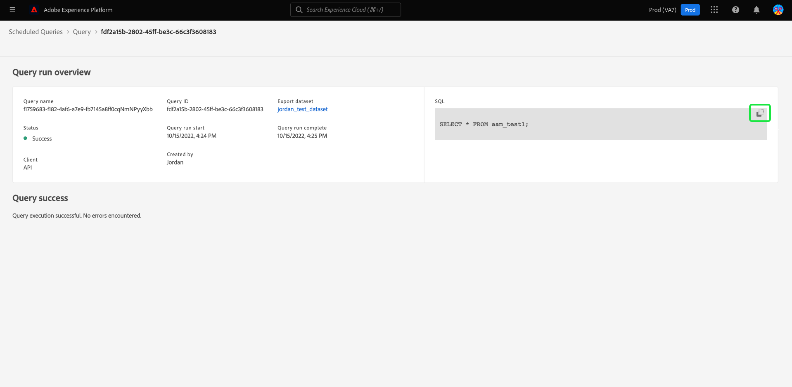

# 예약된 쿼리 모니터링

Adobe Experience Platform은 UI를 통해 모든 쿼리 작업의 상태에 대한 가시성을 개선합니다. From [!UICONTROL 예약된 쿼리] 이제 실패 시 상태, 예약 세부 사항 및 오류 메시지/코드가 포함된 쿼리 실행에 대한 중요한 정보를 찾을 수 있습니다. UI를 통해 이러한 쿼리에 대한 해당 상태에 따른 쿼리에 대한 경고를 구독할 수도 있습니다 [!UICONTROL 예약된 쿼리] 탭.

## [!UICONTROL 예약된 쿼리]

다음 [!UICONTROL 예약된 쿼리] 탭에서는 예약된 모든 CTAS 및 ITAS 쿼리에 대한 개요를 제공합니다. 모든 예약된 쿼리에 대한 실행 세부 정보와 실패한 쿼리에 대한 오류 코드 및 메시지를 찾을 수 있습니다.

로 이동하려면 다음을 수행하십시오. [!UICONTROL 예약된 쿼리] 탭, 선택 **[!UICONTROL 쿼리]** 왼쪽 탐색 막대에서 **[!UICONTROL 예약된 쿼리]**

아래 표에서는 사용 가능한 각 열에 대해 설명합니다.

>[!NOTE]
>
>경고 구독 아이콘은 제목 없는 열의 각 행에 포함되어 있습니다. 자세한 내용은 [구독 경고](#alert-subscription) 섹션을 참조하십시오.

| 열 | 설명 |
|---|---|
| **[!UICONTROL 이름]** | 이름 필드는 템플릿 이름 또는 SQL 쿼리의 처음 몇 문자입니다. 쿼리 편집기를 사용하여 UI를 통해 생성된 모든 쿼리는 시작 시 이름이 지정됩니다. API를 통해 쿼리를 만든 경우 해당 이름은 쿼리를 만드는 데 사용되는 초기 SQL의 코드 조각이 됩니다. 에서 항목을 선택합니다 [!UICONTROL 이름] 열에서 쿼리와 연관된 모든 실행 목록을 확인합니다. 자세한 내용은 [쿼리 실행 예약 세부 정보](#query-runs) 섹션을 참조하십시오. |
| **[!UICONTROL 템플릿]** | 쿼리의 템플릿 이름입니다. 템플릿 이름을 선택하여 쿼리 편집기로 이동합니다. 편의를 위해 쿼리 템플릿이 쿼리 편집기에 표시됩니다. 템플릿 이름이 없는 경우 행은 하이픈으로 표시되고 쿼리 편집기로 리디렉션하여 쿼리를 볼 수 없습니다. |
| **[!UICONTROL SQL]** | SQL 쿼리의 코드 조각입니다. |
| **[!UICONTROL 실행 빈도]** | 쿼리가 실행되도록 설정된 케이던스입니다. 사용 가능한 값은 다음과 같습니다 `Run once` 및 `Scheduled`. 쿼리는 실행 빈도에 따라 필터링할 수 있습니다. |
| **[!UICONTROL 작성자]** | 쿼리를 만든 사용자의 이름입니다. |
| **[!UICONTROL 생성됨]** | UTC 형식으로 쿼리를 만들 때의 타임스탬프. |
| **[!UICONTROL 마지막 실행 타임스탬프]** | 쿼리를 실행할 때의 가장 최근 타임스탬프입니다. 이 열에는 현재 일정에 따라 쿼리가 실행되었는지 여부가 강조 표시됩니다. |
| **[!UICONTROL 마지막 실행 상태]** | 가장 최근 쿼리 실행의 상태입니다. 상태 값은 다음과 같습니다. `Success`, `Failed`, `In progress`, 및 `No runs`. |

>[!TIP]
>
>쿼리 편집기로 이동하는 경우 **[!UICONTROL 쿼리]** 로 돌아가기 [!UICONTROL 템플릿] 탭.

### 예약된 쿼리에 대한 테이블 설정 사용자 지정

여기에서 열을 조정할 수 있습니다 [!UICONTROL 예약된 쿼리] 원하는 대로 탭합니다. 설정 아이콘( )을 선택합니다) 를 클릭하여 엽니다. [!UICONTROL 테이블 사용자 지정] 설정 대화 상자 및 사용 가능한 열 편집

테이블 열을 제거하거나 추가하려면 관련 확인란을 전환합니다. 다음 을 선택합니다. **[!UICONTROL 적용]** 선택 사항을 확인합니다.

>[!NOTE]
>
>UI를 통해 생성된 모든 쿼리는 작성 프로세스의 일부로 이름이 지정된 템플릿이 됩니다. 템플릿 이름이 템플릿 열에 표시됩니다. API를 통해 쿼리를 만든 경우 템플릿 열이 비어 있습니다.

### 경고 구독 {#alert-subscription}

다음에서 경고를 구독할 수 있습니다 [!UICONTROL 예약된 쿼리] 탭. 경고 알림 아이콘()을 클릭하여 [!UICONTROL 경고] 대화 상자. 다음 [!UICONTROL 경고] 대화 상자는 UI 알림과 이메일 경고를 모두 구독합니다. 경고는 쿼리의 상태를 기반으로 합니다. 다음 세 가지 옵션을 사용할 수 있습니다. `start`, `success`, 및 `failure`. 해당 상자 또는 상자를 선택하고 을 선택합니다 **[!UICONTROL 저장]** 가입하려면

자세한 내용은 [경고 구독 API 설명서](../api/alert-subscriptions.md) 추가 정보.

### 쿼리 필터링 {#filter}

실행 빈도에 따라 쿼리를 필터링할 수 있습니다. 에서 [!UICONTROL 예약된 쿼리] 탭에서 필터 아이콘( )을 선택합니다) 필터 사이드바를 엽니다.

다음 중 하나를 선택합니다 **[!UICONTROL 예약됨]** 또는 **[!UICONTROL 한 번 실행]** 빈도 필터 확인란을 실행하여 쿼리 목록을 필터링합니다.

>[!NOTE]
>
>실행되었지만 예약되지 않은 모든 쿼리는 [!UICONTROL 한 번 실행].

필터 기준을 활성화한 후에는 **[!UICONTROL 필터 숨기기]** 를 클릭하여 필터 패널을 닫습니다.

## 쿼리 실행 예약 세부 정보 {#query-runs}

질의 이름을 선택하여 예약 세부 사항 페이지로 이동합니다. 이 보기는 예약된 쿼리의 일부로 실행된 모든 실행 목록을 제공합니다. 제공된 정보에는 사용된 시작 및 종료 시간, 상태 및 데이터 세트가 포함됩니다.

이 정보는 5열 테이블에 제공됩니다. 각 행은 쿼리 실행을 나타냅니다.

| 열 이름 | 설명 |
|---|---|
| **[!UICONTROL 쿼리 실행 ID]** | 일별 실행에 대한 쿼리 실행 ID입니다. 을(를) 선택합니다 **[!UICONTROL 쿼리 실행 ID]** 로 이동 [!UICONTROL 쿼리 실행 개요]. |
| **[!UICONTROL 쿼리 실행 시작]** | 쿼리가 실행된 타임스탬프입니다. UTC 형식입니다. |
| **[!UICONTROL 쿼리 실행 완료]** | 쿼리가 완료된 타임스탬프입니다. UTC 형식입니다. |
| **[!UICONTROL 상태]** | 가장 최근 쿼리 실행의 상태입니다. 세 가지 상태 값은 다음과 같습니다. `successful` `failed` 또는 `in progress`. |
| **[!UICONTROL 데이터 세트]** | 실행에 관련된 데이터 세트입니다. |

예약되는 쿼리의 세부 사항은 [!UICONTROL 속성] 패널. 이 패널에는 초기 쿼리 ID, 클라이언트 유형, 템플릿 이름, 쿼리 SQL 및 일정 cadence가 포함됩니다.

쿼리 실행 ID를 선택하여 실행 세부 사항 페이지로 이동하고 쿼리 정보를 봅니다.

## 쿼리 실행 개요 {#query-run-overview}

다음 [!UICONTROL 쿼리 실행 개요] 이 예약된 쿼리에 대한 개별 실행에 대한 정보와 실행 상태에 대한 보다 자세한 분류를 제공합니다. 이 페이지에는 클라이언트정보 및 쿼리가 실패할 수 있는 오류의 세부 정보도 포함되어 있습니다.

쿼리 상태 섹션은 쿼리가 실패한 경우 오류 코드와 오류 메시지를 제공합니다.

이 보기에서 쿼리 SQL을 클립보드에 복사할 수 있습니다. SQL 코드 조각의 오른쪽 상단에 있는 복사 아이콘을 선택하여 쿼리를 복사합니다. 팝업 메시지가 코드가 복사되었는지 확인합니다.

### 익명 블록이 있는 쿼리에 대한 세부 정보 실행 {#anonymous-block-queries}

익명 블록을 사용하여 SQL 문을 구성하는 쿼리는 개별 쿼리로 구분됩니다. 이렇게 하면 각 쿼리 블록에 대한 실행 세부 사항을 개별적으로 검사할 수 있습니다.

익명 블록은 `$$` 접두사를 쿼리 앞에 추가합니다. 자세한 내용은 [익명 블록 문서](../essential-concepts/anonymous-block.md) 쿼리 서비스에서 익명 블록에 대해 자세히 알아보십시오.

익명 블록 쿼리에는 실행 상태 왼쪽에 탭이 있습니다. 탭을 선택하여 실행 세부 사항을 표시합니다.

익명 블록 쿼리가 실패할 경우 이 UI를 통해 해당 특정 블록에 대한 오류 코드를 찾을 수 있습니다.

선택 **[!UICONTROL 쿼리]** 일정 세부 사항 화면으로 돌아가려면 또는 **[!UICONTROL 예약된 쿼리]** 로 돌아가기 [!UICONTROL 예약된 쿼리] 탭.

