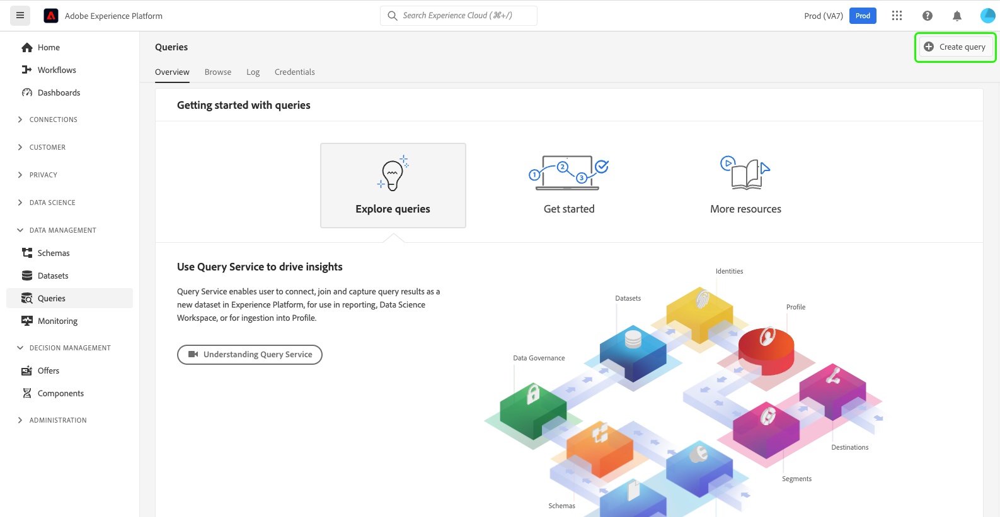

# [!DNL Query Service] UI 안내서

Adobe Experience Platform [!DNL Query Service]은(는) 쿼리를 작성하여 실행하고, 이전에 실행한 쿼리를 보고, 조직 내에서 사용자가 저장한 쿼리에 액세스하는 데 사용할 수 있는 사용자 인터페이스를 제공합니다. [Adobe Experience Platform](https://platform.adobe.com) 내의 UI에 액세스하려면 왼쪽 탐색에서 **[!UICONTROL 쿼리]**&#x200B;를 선택하십시오.

## [!DNL Query Editor]

[!DNL Query Editor]을(를) 사용하면 외부 클라이언트를 사용하지 않고도 쿼리를 작성하고 실행할 수 있습니다. [!DNL Query Editor]을(를) 열고 새 쿼리를 만들려면 **[!UICONTROL 쿼리 만들기]**&#x200B;를 선택하십시오. **[!UICONTROL 로그]** 또는 **[!UICONTROL 템플릿]** 탭에서 쿼리를 선택하여 [!DNL Query Editor]에 액세스할 수도 있습니다. 이전에 실행했거나 저장한 쿼리를 선택하면 [!DNL Query Editor]이(가) 열리고 선택한 쿼리에 대한 SQL이 표시됩니다.

[!DNL Query Editor]은(는) 쿼리 입력을 시작할 수 있는 편집 공간을 제공합니다. 입력하면 SQL 예약어, 테이블 및 테이블 내 필드 이름이 자동으로 완료됩니다. 쿼리 쓰기가 완료되면 **재생** 단추를 선택하여 쿼리를 실행합니다. 편집기 아래의 **[!UICONTROL 콘솔]** 탭에는 쿼리가 반환되는 시기를 나타내는 [!DNL Query Service]이(가) 현재 수행 중인 작업이 표시됩니다. 콘솔 옆의 **[!UICONTROL 결과]** 탭에는 쿼리 결과가 표시됩니다. [!DNL Query Editor] 사용에 대한 자세한 내용은 [쿼리 편집기 안내서](./user-guide.md)를 참조하십시오.

![확대/축소된 [!DNL Query Editor] 보기.](../images/ui/overview/query-editor.png)

## 예약된 쿼리 {#scheduled-queries}

이미 템플릿으로 저장된 쿼리는 일반 케이던스에서 실행되도록 예약할 수 있습니다. 쿼리를 예약할 때 실행 빈도, 시작 및 종료 날짜, 예약된 쿼리가 실행되는 요일 및 쿼리를 내보낼 데이터 세트를 선택할 수 있습니다. 쿼리 일정은 쿼리 편집기를 사용하여 설정됩니다.

UI를 통해 쿼리를 예약하는 방법을 알아보려면 [예약된 쿼리 안내서](./user-guide.md#scheduled-queries)를 참조하십시오. API를 사용하여 일정을 추가하는 방법에 대해 알아보려면 [예약된 쿼리 끝점 안내서](../api/scheduled-queries.md)를 읽어 보십시오.

쿼리가 예약되면 [!UICONTROL 예약된 쿼리] 탭의 예약된 쿼리 목록에 나타납니다. 쿼리, 실행, 작성자 및 시간에 대한 전체 세부 정보는 목록에서 예약된 쿼리를 선택하여 찾을 수 있습니다.

| 열 | 설명 |
| --- | --- |
| **[!UICONTROL 이름]** | 이름 필드는 템플릿 이름 또는 SQL 쿼리의 처음 몇 문자입니다. UI를 통해 쿼리 편집기로 만든 모든 쿼리의 이름은 처음 만들 때 로 지정됩니다. API를 통해 쿼리를 만든 경우 쿼리 이름은 쿼리를 만드는 데 사용된 초기 SQL 코드 조각입니다. |
| **[!UICONTROL 템플릿]** | 쿼리의 템플릿 이름입니다. 템플릿 이름을 선택하여 쿼리 편집기로 이동합니다. 쿼리 템플릿은 편의를 위해 쿼리 편집기에 표시됩니다. 템플릿 이름이 없는 경우 행은 하이픈으로 표시되며 쿼리를 보기 위해 쿼리 편집기로 리디렉션할 수 없습니다. |
| **[!UICONTROL SQL]** | SQL 쿼리의 코드 조각입니다. |
| **[!UICONTROL 실행 빈도]** | 쿼리가 실행되도록 설정된 케이던스입니다. 사용 가능한 값은 `Run once` 및 `Scheduled`입니다. 쿼리는 실행 빈도에 따라 필터링될 수 있습니다. |
| **[!UICONTROL 만든 사람]** | 쿼리를 만든 사용자의 이름입니다. |
| **[!UICONTROL 생성일]** | 쿼리가 생성된 타임스탬프(UTC 형식)입니다. |
| **[!UICONTROL 마지막 실행 타임스탬프]** | 쿼리가 실행된 가장 최근 타임스탬프입니다. 이 열에서는 쿼리가 현재 예약에 따라 실행되었는지 여부를 강조 표시합니다. |
| **[!UICONTROL 마지막 실행 상태]** | 가장 최근 쿼리 실행의 상태입니다. 세 가지 상태 값은 `successful` `failed` 또는 `in progress`입니다. |

[쿼리 서비스 UI를 통해 쿼리를 모니터링](./monitor-queries.md)하는 방법에 대한 자세한 내용은 설명서를 참조하세요.

## 템플릿 {#browse}

**[!UICONTROL 템플릿]** 탭에는 조직의 사용자가 저장한 쿼리가 표시됩니다. 여기에 저장된 쿼리가 아직 생성 중일 수 있으므로 이를 쿼리 프로젝트로 고려하는 것이 유용합니다. **[!UICONTROL 템플릿]** 탭에 표시된 쿼리는 이전에 [!DNL Query Service]에서 실행한 경우 **[!UICONTROL 로그]** 탭에서도 실행 쿼리로 표시됩니다.

| 열 | 설명 |
| --- | --- |
| **[!UICONTROL 이름]** | 이름 필드는 사용자가 만든 쿼리 이름 또는 SQL 쿼리의 처음 몇 문자입니다. UI를 통해 쿼리 편집기로 만든 모든 쿼리의 이름은 처음 만들 때 로 지정됩니다. API를 통해 쿼리를 만든 경우 쿼리 이름은 쿼리를 만드는 데 사용된 초기 SQL 코드 조각입니다. 쿼리 이름을 선택하여 [!DNL Query Editor]에서 쿼리를 열 수 있습니다. 검색 창을 사용하여 쿼리의 [!UICONTROL 이름]을(를) 검색할 수도 있습니다. 검색은 대/소문자를 구분합니다. |
| **[!UICONTROL SQL]** | SQL 쿼리의 처음 몇 문자입니다. 코드 위로 마우스를 가져가면 전체 쿼리가 표시됩니다. |
| **[!UICONTROL 수정한 사람]** | 쿼리를 마지막으로 수정한 사용자입니다. [!DNL Query Service]에 대한 액세스 권한이 있는 조직의 모든 사용자가 쿼리를 수정할 수 있습니다. |
| **[!UICONTROL 마지막 수정일]** | 브라우저의 표준 시간대에 있는 쿼리를 마지막으로 수정한 날짜 및 시간입니다. |

Platform UI의 템플릿에 대한 자세한 내용은 [쿼리 템플릿](./query-templates.md) 설명서를 참조하십시오.

## 로그 {#log}

**[!UICONTROL 로그]** 탭은 이전에 실행된 쿼리 목록을 제공합니다. 기본적으로 로그에는 쿼리가 역연기로 나열됩니다.

| 열 | 설명 |
| --- | --- |
| **[!UICONTROL 이름]** | SQL 쿼리의 처음 여러 문자로 구성된 쿼리 이름입니다. 해당 실행에 대한 [!UICONTROL 쿼리 로그 세부 정보] 보기를 열려면 템플릿 이름을 선택하십시오. 검색 창을 사용하여 쿼리 이름을 검색할 수 있습니다. 검색은 대/소문자를 구분합니다. |
| **[!UICONTROL 시작 시간]** | 쿼리가 실행된 시간입니다. |
| **[!UICONTROL 완료 시간]** | 쿼리 실행이 완료된 시간입니다. |
| **[!UICONTROL 상태]** | 쿼리의 현재 상태입니다. |
| **[!UICONTROL 데이터 집합]** | 쿼리에서 사용하는 입력 데이터 세트입니다. 데이터 세트를 선택하여 입력 데이터 세트 세부 사항 화면으로 이동합니다. |
| **[!UICONTROL 클라이언트]** | 쿼리에 사용되는 클라이언트입니다. |
| **[!UICONTROL 만든 사람]** | 쿼리를 만든 사람의 이름입니다. |

>
>
>연필 아이콘() 쿼리 로그의 모든 행에서 [!DNL Query Editor](으)로 이동합니다. 편리한 편집을 위해 쿼리가 미리 채워집니다.

쿼리 이벤트에 의해 자동으로 생성된 로그 파일에 대한 자세한 내용은 [쿼리 로그 설명서](./query-logs.md)를 참조하십시오.

## 자격 증명

**[!UICONTROL 자격 증명]** 탭에는 만료될 자격 증명과 만료되지 않을 자격 증명이 모두 표시됩니다. 이러한 자격 증명을 사용하여 외부 클라이언트에 연결하는 방법에 대한 자세한 내용은 [자격 증명 안내서](../clients/overview.md)를 참조하십시오.

## 다음 단계

이제 [!DNL Platform]의 [!DNL Query Service] 사용자 인터페이스에 익숙해졌으므로 [!DNL Query Editor]에 액세스하여 조직의 다른 사용자와 공유할 자체 쿼리 프로젝트를 만들 수 있습니다. [!DNL Query Editor]에서 쿼리를 작성 및 실행하는 방법에 대한 자세한 내용은 [[!DNL Query Editor] 사용 안내서](./user-guide.md)를 참조하십시오.
