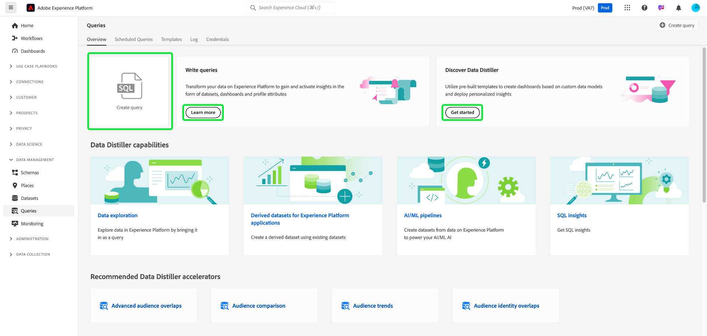
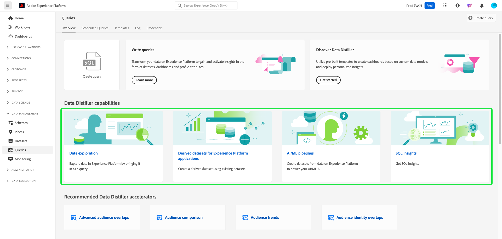

# 쿼리 서비스 UI 안내서

Adobe Experience Platform 쿼리 서비스는 쿼리를 작성 및 실행하고, 이전에 실행한 쿼리를 보고, 조직 내에서 사용자가 저장한 쿼리에 액세스하는 데 사용할 수 있는 사용자 인터페이스를 제공합니다. [Adobe Experience Platform](https://platform.adobe.com) 내의 UI에 액세스하려면 왼쪽 탐색에서 **[!UICONTROL 쿼리]**&#x200B;를 선택하십시오. [!UICONTROL 쿼리] [!UICONTROL 개요]가 나타납니다.

## 개요 {#overview}

[!UICONTROL 개요] 탭은 쿼리 및 Data Distiller 템플릿 작업을 위한 간소화된 진입점을 제공합니다. 여기에서 쿼리를 작성하고, 데이터 세트를 탐색하고, 대상 데이터를 분석하는 데 필요한 모든 기능에 액세스하여 데이터 분석 및 대상 통찰력을 위한 원활한 워크플로우를 확보할 수 있습니다. 이 개요를 사용하여 Data Distiller으로 달성할 수 있는 작업을 학습하고 쿼리 서비스 사용에 대한 주요 지표를 살펴보십시오.

### 기본 패널 {#main-panels}

[!UICONTROL 개요] 페이지에는 시작하는 데 도움이 되는 몇 가지 기본 섹션이 있습니다.

1. 새 쿼리를 작성하여 실행하려면 쿼리 편집기로 빠르게 이동하려면 **[!UICONTROL 쿼리 만들기]**&#x200B;를 선택하십시오.
2. **[!UICONTROL 쿼리 작성]**&#x200B;에 대한 자세한 설명서를 보려면 **[!UICONTROL 자세히 알아보기]**&#x200B;를 선택하십시오.
3. **[!UICONTROL 데이터 Distiller 검색]** 섹션에서 **[!UICONTROL 시작]**&#x200B;을(를) 선택하여 데이터 Distiller 개요를 열고 사용 가능한 기능에 대해 알아봅니다.

### Data Distiller 기능 {#data-distiller-capabilities}

[!UICONTROL 데이터 Distiller 기능] 섹션에서는 고급 데이터 Distiller 기능에 대한 설명서 링크를 제공합니다.

- **[[!UICONTROL 데이터 탐색]](../use-cases/data-exploration.md)**: SQL을 사용하여 일괄 수집된 데이터를 탐색, 문제 해결 및 확인하는 방법을 알아봅니다.
- **[[!UICONTROL Experience Platform 응용 프로그램에 대해 파생된 데이터 세트]](../data-distiller/derived-datasets/overview.md)**: 파생된 데이터 세트를 만들어 데이터 유틸리티를 최대화하는 복잡하고 다양한 사용 사례를 지원하는 방법에 대해 알아봅니다.
- **[[!UICONTROL AI/ML 파이프라인]](../data-distiller/ml-feature-pipelines/overview.md)**: 기본 머신 러닝 도구에 숨겨진 중요한 개념과 마케팅 사용 사례를 지원하는 사용자 지정 모델을 만드는 방법에 대해 알아봅니다. 이 일련의 안내서에서는 머신 러닝 환경에서 Experience Platform에서 사용자 정의 모델을 피드하도록 데이터를 준비하는 기능 파이프라인을 빌드하는 데 필요한 단계를 설명합니다.
- **[[!UICONTROL SQL 인사이트]](../data-distiller/sql-insights/overview.md)**: Data Distiller을 사용하여 SQL에서 인사이트 대시보드를 개발하는 데 필요한 주요 기능과 단계에 대해 알아봅니다.

### 추천 Data Distiller 액셀러레이터 {#recommended-accelerators}

빠른 링크를 선택하여 관련 Data Distiller 대시보드 [!UICONTROL 템플릿](으)로 이동합니다. 각 가속기는 대상 데이터를 분석하고, 세그먼테이션을 최적화하고, 타깃팅 전략을 향상시키는 데 도움이 되는 강력한 도구와 시각화를 제공합니다.

- **[[!UICONTROL 고급 대상 겹침]](../../dashboards/sql-insights-query-pro-mode/templates/overlaps.md)**: 이 대시보드에서 여러 대상 세그먼트 간의 대상 교차를 분석하여 중요한 통찰력을 발견하고 세그멘테이션 전략을 최적화할 수 있습니다. 추가적인 오프라인 분석 또는 보고 목적으로 인사이트를 내보낼 수도 있습니다.
- **[[!UICONTROL 대상 비교]](../../dashboards/sql-insights-query-pro-mode/templates/comparison.md)**: 이 대시보드에서 주요 대상 지표를 나란히 비교 및 대조하여 두 대상 그룹을 자세히 분석할 수 있습니다. 이러한 통찰력을 통해 대상자 크기, 증가 및 기타 주요 성과 지표를 이해하여 세분화를 세분화하고 데이터 기반 결정으로 타기팅 전략을 최적화할 수 있습니다.
- **[[!UICONTROL 대상 트렌드]](../../dashboards/sql-insights-query-pro-mode/templates/trends.md)**: [!UICONTROL 대상 트렌드] 대시보드를 사용하여 대상 증가, ID 수 및 단일 ID 프로필과 같은 주요 지표를 통해 시간이 지남에 따라 대상이 어떻게 진화하는지 시각화하십시오. 트렌드를 추적하여 대상자 행동에 대한 중요한 통찰력을 발견하고, 세분화를 세분화하고, 참여를 강화하고, 보다 효과적인 캠페인을 위해 타깃팅 전략을 최적화할 수 있습니다.
시간 경과에 따른 대상 지표를 추적하여 대상 규모, ID 증가 및 전체 참여의 변화를 모니터링합니다.
- **[[!UICONTROL 대상 ID 중복]](../../dashboards/sql-insights-query-pro-mode/templates/identity-overlaps.md)**: 대상 ID 중복 대시보드를 사용하여 선택한 대상 내에서 ID 중복을 분석하십시오. 시각화 및 표로 작성된 데이터는 ID 결합을 최적화하고, 중복을 줄이고, 세그멘테이션을 개선하는 통찰력을 제공합니다. 이러한 통찰력을 통해 보다 효과적인 타겟팅, 향상된 개인화 및 간소화된 고객 상호 작용을 수행할 수 있습니다.

### Data Distiller 예시 {#data-distiller-examples}

Data Distiller을 최대한 활용할 수 있는 설명서 가이드 및 예제를 열려면 카드를 선택하십시오.

- **[[!UICONTROL 십분위수 기반 파생 데이터 세트]](../use-cases/deciles-use-case.md)**: Adobe Experience Platform에서 세분화 및 대상 생성을 위해 십분위수 기반 파생 데이터 세트를 만드는 방법을 알아봅니다. 항공사 충성도 시나리오를 사용하여 데이터의 순위 및 집계를 위한 스키마 디자인, 십분위수 계산 및 쿼리 예제를 다룹니다.
- **[[!UICONTROL 고객 생애 가치]](../use-cases/customer-lifetime-value.md)**: Real-Time CDP 및 사용자 지정 대시보드를 사용하여 고객 생애 가치를 추적하고 시각화하는 방법에 대해 알아봅니다. 이러한 통찰력을 사용하여 새로운 고객을 확보하기 위한 전략을 개발하고 기존 고객을 유지하며 이윤을 극대화하십시오.
- **[[!UICONTROL 성향 점수]](../use-cases/propensity-score.md)**: 머신 러닝 예측 모델을 사용하여 성향 점수를 결정하는 방법을 알아봅니다. 이 안내서에서는 교육을 위한 데이터 전송, SQL로 교육된 모델 적용 및 고객 구매 가능성 예측을 다룹니다.
- **[[!UICONTROL 동의 분석]](../../dashboards/insights-use-cases/consent-analysis.md)**: Real-Time CDP, 쿼리 서비스 및 Data Distiller을 사용하여 고객 동의를 분석하고 추적하는 방법에 대해 알아봅니다. 이 안내서에서는 동의 대시보드 구축, 세분화, 추적 트렌드 및 규정 준수를 포함하여 신뢰를 구축하고 개인화된 경험을 제공하는 데 도움이 됩니다.
- **[[!UICONTROL 유사 항목 일치]](../use-cases/fuzzy-match.md)**: Experience Platform 데이터에 대해 &#39;유사 항목 일치&#39;를 수행하여 대략적인 일치 항목을 찾고 데이터 세트 간 문자열 유사성을 분석하는 방법을 알아봅니다. 이 안내서를 따라 시간을 절약하고 데이터에 보다 쉽게 액세스할 수 있습니다. 이 예는 일관성과 정확성을 위해 크고 복잡한 데이터 세트를 효율적으로 일치, 비교 및 조정하는 방법을 보여 주는 두 여행사 데이터 세트 간 호텔 객실 속성을 일치시키는 방법을 보여 줍니다.

### 주요 지표 {#key-metrics}

주요 지표 섹션에는 쿼리 서비스 사용을 모니터링하는 데 도움이 되는 중요한 데이터의 시각화가 표시됩니다. 각 차트에 대해 오른쪽 상단의 생략 부호(`...`)를 선택한 다음 [!UICONTROL 자세히 보기]를 선택하여 표 형식의 결과를 보거나 데이터를 CSV 파일로 다운로드하여 스프레드시트에서 볼 수 있습니다. 자세한 내용은 [자세한 정보 보기](../../dashboards/sql-insights-query-pro-mode/view-more.md)를 참조하세요.

#### 날짜 필터 설정 {#set-date-filter}

이러한 시각화에 대한 전역 날짜 필터를 적용하려면 필터 아이콘() 및 **[!UICONTROL 필터]** 대화 상자에서 날짜 범위를 조정합니다. 이 필터를 적용하여 표시된 지표를 특정 시간대에 맞게 조정하고 분석의 관련성을 높입니다.

#### [!UICONTROL Distiller 일괄 처리 쿼리] {#distiller-batch-queries}

[!UICONTROL Distiller 일괄 처리 쿼리] 차트는 처리된 CTAS 및 ITAS(대화형 및 예약된) 쿼리 수를 강조 표시하여 일별 쿼리 활동 분류를 제공합니다. 이 차트는 특정 날짜의 대화형 쿼리 급증 및 예약된 쿼리의 드물게 사용과 같은 패턴을 강조 표시합니다. 이러한 통찰력을 사용하여 최대 활동 기간을 식별하고, 예약 전략을 구체화하고, 쿼리 실행을 조정하여 워크플로우 효율성과 리소스 활용률을 향상시켜 성능을 최적화합니다.

#### [!UICONTROL 사용한 시간 계산] {#compute-hours-consumed}

[!UICONTROL 사용한 계산 시간] 차트는 쿼리 서비스 작업을 처리하는 데 사용되는 계산 시간을 일별로 시각화합니다. 이러한 계산 시간 트렌드를 사용하여 리소스 소비를 모니터링하고, 수요가 많은 기간을 식별하고, 쿼리 실행을 최적화하여 리소스 할당 및 성능을 효율적으로 관리할 수 있습니다.

#### [!UICONTROL 데이터 탐색 쿼리]

[!UICONTROL 데이터 탐색 쿼리] 차트는 매일 요청 시 처리된 SELECT 쿼리 수를 표시합니다. 이 시각화는 특정 일의 사용량 급증과 같은 쿼리 활동 트렌드를 강조 표시하여 데이터 탐색 노력이 가장 활발한 시기를 이해하는 데 도움이 됩니다. 이러한 통찰력을 사용하여 쿼리 사용 패턴을 모니터링하고, 워크로드의 균형을 맞추고, 탐색적 데이터 분석을 위해 리소스 할당을 최적화합니다. 이 분석을 통해 쿼리 서비스를 보다 효율적으로 사용하고 수요가 많은 기간에 대한 계획을 개선할 수 있습니다.

## 쿼리 편집기

쿼리 편집기를 사용하여 외부 클라이언트를 사용하지 않고 쿼리를 작성하여 실행할 수 있습니다. **[!UICONTROL 쿼리 만들기]**&#x200B;를 선택하여 쿼리 편집기를 열고 새 쿼리를 만듭니다. **[!UICONTROL 로그]** 또는 **[!UICONTROL 템플릿]** 탭에서 쿼리를 선택하여 쿼리 편집기에 액세스할 수도 있습니다. 이전에 실행되었거나 저장된 질의를 선택하면 질의 편집기가 열리고 선택한 질의에 대한 SQL이 표시됩니다.

쿼리 편집기에 입력하면 SQL 예약어, 테이블 및 테이블 내 필드 이름이 자동으로 완료됩니다. 쿼리 쓰기가 끝나면 재생 아이콘()을(를) 사용하여 쿼리를 실행합니다. 편집기 아래의 **[!UICONTROL 콘솔]** 탭에는 현재 쿼리 서비스가 수행 중인 작업과 쿼리가 반환된 시기가 표시됩니다. [!UICONTROL 콘솔] 옆의 **[!UICONTROL 결과]** 탭에 쿼리 결과가 표시됩니다. 쿼리 편집기 사용에 대한 자세한 내용은 [쿼리 편집기 안내서](./user-guide.md)를 참조하십시오.

## 예약된 쿼리 {#scheduled-queries}

이미 템플릿으로 저장된 쿼리는 일반 케이던스에서 실행되도록 예약할 수 있습니다. 쿼리를 예약할 때 실행 빈도, 시작 및 종료 날짜, 예약된 쿼리가 실행되는 요일 및 쿼리를 내보낼 데이터 세트를 선택할 수 있습니다. 쿼리 일정은 쿼리 편집기를 사용하여 설정됩니다.

UI를 통해 쿼리를 예약하는 방법을 알아보려면 [예약된 쿼리 안내서](./user-guide.md#scheduled-queries)를 참조하십시오. API를 사용하여 일정을 추가하는 방법에 대해 알아보려면 [예약된 쿼리 끝점 안내서](../api/scheduled-queries.md)를 읽어 보십시오.

쿼리가 예약되면 [!UICONTROL 예약된 쿼리] 탭의 예약된 쿼리 목록에 나타납니다. 쿼리, 실행, 작성자 및 시간에 대한 전체 세부 정보는 목록에서 예약된 쿼리를 선택하여 찾을 수 있습니다.

<!--  -->

| 열 | 설명 |
| --- | --- |
| **[!UICONTROL 이름]** | 이름 필드는 템플릿 이름 또는 SQL 쿼리의 처음 몇 문자입니다. UI를 통해 쿼리 편집기로 만든 모든 쿼리의 이름은 처음 만들 때 로 지정됩니다. API를 통해 쿼리를 만든 경우 쿼리 이름은 쿼리를 만드는 데 사용된 초기 SQL 코드 조각입니다. |
| **[!UICONTROL 템플릿]** | 쿼리의 템플릿 이름입니다. 템플릿 이름을 선택하여 쿼리 편집기로 이동합니다. 쿼리 템플릿은 편의를 위해 쿼리 편집기에 표시됩니다. 템플릿 이름이 없는 경우 행은 하이픈으로 표시되며 쿼리를 보기 위해 쿼리 편집기로 리디렉션할 수 없습니다. |
| **[!UICONTROL SQL]** | SQL 쿼리의 코드 조각입니다. |
| **[!UICONTROL 실행 빈도]** | 이 열은 쿼리가 실행되도록 설정된 케이던스를 나타냅니다. 사용 가능한 값은 `Run once` 및 `Scheduled`입니다. 쿼리는 실행 빈도에 따라 필터링될 수 있습니다. |
| **[!UICONTROL 만든 사람]** | 쿼리를 만든 사용자의 이름입니다. |
| **[!UICONTROL 생성일]** | 쿼리가 생성된 타임스탬프(UTC 형식)입니다. |
| **[!UICONTROL 마지막 실행 타임스탬프]** | 쿼리가 실행된 가장 최근 타임스탬프입니다. 이 열에서는 쿼리가 현재 예약에 따라 실행되었는지 여부를 강조 표시합니다. |
| **[!UICONTROL 마지막 실행 상태]** | 가장 최근 쿼리 실행의 상태입니다. 세 가지 상태 값은 `successful` `failed` 또는 `in progress`입니다. |

[쿼리 서비스 UI를 통해 쿼리를 모니터링](./monitor-queries.md)하는 방법에 대한 자세한 내용은 설명서를 참조하세요.

## 템플릿 {#browse}

**[!UICONTROL 템플릿]** 탭에는 조직의 사용자가 저장한 쿼리가 표시됩니다. 여기에 저장된 쿼리가 아직 생성 중일 수 있으므로 이를 쿼리 프로젝트로 고려하는 것이 유용합니다. **[!UICONTROL 템플릿]** 탭에 표시되는 쿼리는 이전에 쿼리 서비스에서 실행한 경우 **[!UICONTROL 로그]** 탭에서 실행 쿼리로 표시됩니다.

| 열 | 설명 |
| --- | --- |
| **[!UICONTROL 이름]** | 이름 필드는 사용자가 만든 쿼리 이름 또는 SQL 쿼리의 처음 몇 문자입니다. UI를 통해 쿼리 편집기로 만든 모든 쿼리의 이름은 처음 만들 때 로 지정됩니다. API를 통해 쿼리를 만든 경우 쿼리 이름은 쿼리를 만드는 데 사용된 초기 SQL 코드 조각입니다. 쿼리 이름을 선택하여 쿼리 편집기에서 쿼리를 열 수 있습니다. 검색 창을 사용하여 쿼리의 [!UICONTROL 이름]을(를) 검색할 수도 있습니다. 검색은 대/소문자를 구분합니다. |
| **[!UICONTROL SQL]** | SQL 쿼리의 처음 몇 문자입니다. 코드 위로 마우스를 가져가면 전체 쿼리가 표시됩니다. |
| **[!UICONTROL 수정한 사람]** | 쿼리를 마지막으로 수정한 사용자입니다. Query Service에 액세스할 수 있는 조직의 모든 사용자는 쿼리를 수정할 수 있습니다. |
| **[!UICONTROL 마지막 수정일]** | 브라우저의 표준 시간대에 있는 쿼리를 마지막으로 수정한 날짜 및 시간입니다. |

Platform UI의 템플릿에 대한 자세한 내용은 [쿼리 템플릿](./query-templates.md) 설명서를 참조하십시오.

## 로그 {#log}

**[!UICONTROL 로그]** 탭은 이전에 실행된 쿼리 목록을 제공합니다. 기본적으로 로그에는 쿼리가 역연기로 나열됩니다.

| 열 | 설명 |
| --- | --- |
| **[!UICONTROL 이름]** | SQL 쿼리의 처음 여러 문자로 구성된 쿼리 이름입니다. 해당 실행에 대한 [!UICONTROL 쿼리 로그 세부 정보] 보기를 열려면 템플릿 이름을 선택하십시오. 검색 창을 사용하여 쿼리 이름을 검색할 수 있습니다. 검색은 대/소문자를 구분합니다. |
| **[!UICONTROL 시작 시간]** | 쿼리가 실행된 시간입니다. |
| **[!UICONTROL 완료 시간]** | 쿼리 실행이 완료된 시간입니다. |
| **[!UICONTROL 상태]** | 쿼리의 현재 상태입니다. |
| **[!UICONTROL 데이터 집합]** | 쿼리에서 사용하는 입력 데이터 세트입니다. 데이터 세트를 선택하여 입력 데이터 세트 세부 사항 화면으로 이동합니다. |
| **[!UICONTROL 클라이언트]** | 쿼리에 사용되는 클라이언트입니다. |
| **[!UICONTROL 만든 사람]** | 쿼리를 만든 사람의 이름입니다. |

>
>
>연필 아이콘() 쿼리 로그의 모든 행에서 쿼리 편집기로 이동합니다. 편리한 편집을 위해 쿼리가 미리 채워집니다.

쿼리 이벤트에 의해 자동으로 생성된 로그 파일에 대한 자세한 내용은 [쿼리 로그 설명서](./query-logs.md)를 참조하십시오.

## 자격 증명

**[!UICONTROL 자격 증명]** 탭에는 만료될 자격 증명과 만료되지 않을 자격 증명이 모두 표시됩니다. 이러한 자격 증명을 사용하여 외부 클라이언트에 연결하는 방법에 대한 자세한 내용은 [자격 증명 안내서](../clients/overview.md)를 참조하십시오.

## 다음 단계

[!DNL Platform]의 쿼리 서비스 사용자 인터페이스에 익숙해졌으므로 쿼리 편집기에 액세스하여 조직의 다른 사용자와 공유할 자체 쿼리 프로젝트를 만들 수 있습니다. 쿼리 편집기에서 쿼리를 작성 및 실행하는 방법에 대한 자세한 내용은 [쿼리 편집기 사용 안내서](./user-guide.md)를 참조하십시오.
