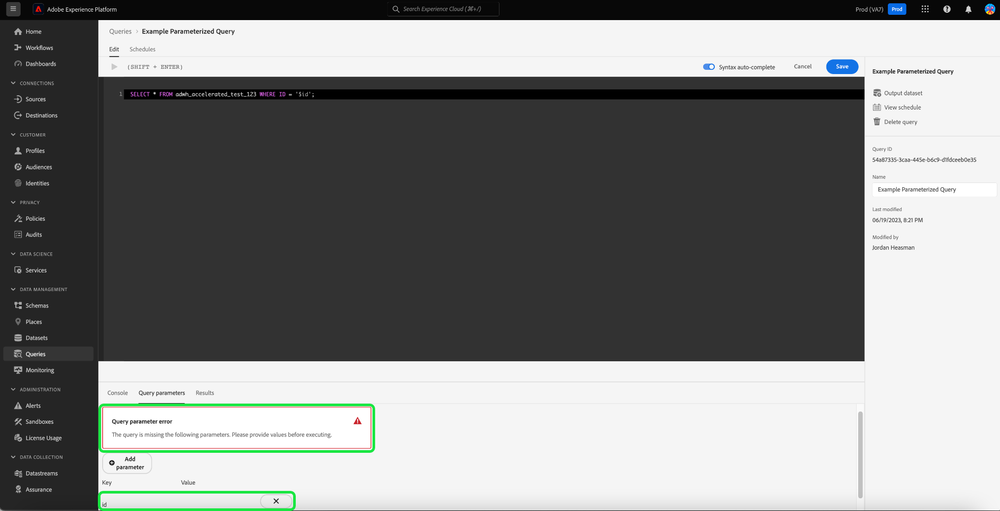

# 매개 변수가 있는 쿼리(제한된 릴리스)

>[!IMPORTANT]
>
>매개 변수가 있는 쿼리 UI 기능은 **제한된 릴리스 전용** 일부 고객은 사용할 수 없습니다.

쿼리 서비스는 쿼리 편집기에서 매개 변수가 있는 쿼리 사용을 지원합니다. 이제 매개 변수가 있는 쿼리를 사용하여 매개 변수에 자리 표시자를 사용하고 실행 시 매개 변수 값을 추가할 수 있습니다. 자리 표시자를 사용하면 명령문이 실행될 때까지 값이 무엇인지 모르는 동적 데이터로 작업할 수 있습니다. 쿼리를 미리 준비하여 비슷한 용도로 다시 사용할 수도 있습니다. 각 사용 사례에 대해 별도의 SQL 쿼리를 만들지 않으므로 쿼리를 재사용하면 상당한 노력을 절약할 수 있습니다.

## 사전 요구 사항

이 안내서를 계속하기 전에 [쿼리 편집기 UI 안내서](./user-guide.md). 쿼리 편집기 안내서에서는 Experience Platform 사용자 인터페이스 내에서 고객 경험 데이터에 대한 쿼리를 작성, 유효성 검사 및 실행하는 방법에 대한 자세한 정보를 제공합니다.

>[!NOTE]
>
>Adobe Experience Platform UI 내에서 매개 변수가 있는 쿼리는 인라인 템플릿의 상위 수준에서만 지원됩니다. 즉, 매개 변수가 있는 쿼리는 원래 템플릿에서 사용할 때만 작동합니다. 하위 템플릿은 정적 템플릿이어야 하며 동적 매개 변수를 가질 수 없습니다. 다음을 참조하십시오. [인라인 템플릿 설명서](../essential-concepts/inline-templates.md) 자세히 알아보십시오.

## 매개 변수가 있는 쿼리 구문 {#syntax}

매개 변수가 있는 쿼리는 형식을 사용합니다 `'$YOUR_PARAMETER_NAME'` 점 표기법을 사용하여 와 를 연결할 수 있습니다. 매개 변수가 있는 쿼리를 사용하는 예제 SQL 문은 아래에 나와 있습니다.

```sql
INSERT INTO
   $Database_Name.Schema_Name.adwh_lkup_process_delta_log
   (process_name, merge_policy_id, process_status, process_date, create_ts, change_ts)
SELECT
   '$Table_Process_Name' process_name,
   hash('$Merge_PolicyID') merge_policy_id,
   '$process_status' process_status,
   to_date('$date_key') process_date,
   CURRENT_TIMESTAMP create_ts,
   CURRENT_TIMESTAMP change_ts;
```

## 매개 변수가 있는 쿼리 만들기 {#create}

UI에서 매개 변수가 있는 쿼리를 만들려면 쿼리 편집기로 이동합니다. 의 섹션을 참조하십시오. [쿼리 편집기 액세스](./user-guide.md#accessing-query-editor) 추가 지침을 참조하십시오.

사용 `'$'` 텍스트 편집기에서 쿼리에 쿼리 매개 변수를 입력하도록 접두사를 사용합니다. 그런 다음 의 키에 대해 누락된 값을 추가합니다. [!UICONTROL 쿼리 매개 변수] 편집기 아래의 섹션입니다. 필요한 키에 값을 추가하지 않으면 쿼리를 실행할 수 없습니다. 경고 아이콘()가 쿼리 매개 변수 섹션에 표시됩니다 [!UICONTROL 값] 입력 필드.


>[!TIP]
>
>다음에서 탭 변경 [!UICONTROL 쿼리 매개 변수] 끝 [!UICONTROL 콘솔] 쿼리의 콘솔 출력을 봅니다.

매개 변수를 제거하고 쿼리가 이미 실행된 후 다시 실행하려고 하면 [!UICONTROL 쿼리 매개 변수] 섹션을 참조하십시오.

>[!NOTE]
>
>쿼리에서 매개 변수를 사용하지 않는 경우에도 쿼리 편집기 내에 불필요한 매개 변수를 입력할 수 있습니다. 쿼리 편집기는 불필요한 키-값 쌍을 모두 무시하므로 쿼리 실행 또는 결과에 영향을 주지 않습니다.



## 쿼리 로그 세부 정보를 사용하여 매개 변수 값 확인 {#check-parameter-values}

사용된 값이 지속적이지 않으므로 템플릿 내에 매개 변수를 저장할 수 없습니다. 하지만 다음을 확인할 수 있습니다. [!UICONTROL 쿼리 로그 세부 정보] 쿼리 실행에 사용되는 매개 변수 값을 찾는 페이지입니다. 이 경우, 로그는 쿼리가 매개 변수가 있는 쿼리임을 나타내지 않습니다. 다음을 참조하십시오. [쿼리 로그 설명서](./query-logs.md) 사용된 값을 찾는 방법에 대한 지침입니다.


<!-- improve screenshot above ^ I am waiting for a scheduled run to complete -->

## 매개 변수가 있는 쿼리 예약 {#schedule}

매개 변수가 있는 쿼리를 예약하면 매개 변수 값이 저장됩니다. 매개 변수가 있는 쿼리를 예약하려면 다음 안내서에 설명된 대로 일반적인 프로세스에 따라 예약된 쿼리를 만듭니다. [쿼리 일정 만들기](./query-schedules.md#create-schedule)를 실행한 다음 쿼리 실행에 사용할 매개 변수 값을 입력합니다. 이 UI 섹션은 매개 변수가 있는 쿼리에만 나타납니다. 의 섹션을 참조하십시오. [예약된 매개 변수가 있는 쿼리에 대해 매개 변수 설정](./query-schedules.md#set-parameters) 특정 지침.

>[!TIP]
>
>쿼리 서비스는 매개 변수가 있는 쿼리를 사용하여 준비된 문을 지원합니다. 다음을 참조하십시오. [준비된 문 구문 안내서](../sql/prepared-statements.md) 관련 SQL 구문에 대한 자세한 내용을 보려면

## 다음 단계

이 문서를 읽은 후에는 Adobe Experience Platform UI에서 쿼리를 매개 변수화하고 예약된 쿼리 실행에 사용하는 방법에 대해 알아보았습니다. 이 문서에서는 쿼리 실행에 사용되는 매개 변수 값에 대한 로그를 확인하는 방법도 강조했습니다.

다음으로, 의 안내서를 읽어 보시기 바랍니다. [예약된 쿼리 모니터링](./monitor-queries.md) Platform UI를 통해 모든 쿼리 작업의 상태를 더 잘 이해할 수 있습니다.
