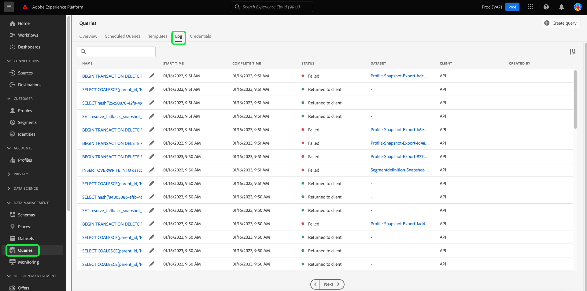

# 쿼리 로그

>[!IMPORTANT]
>
>특정 쿼리 로그 기능은 현재 제한된 릴리스에 있으며 일부 고객은 사용할 수 없습니다. 편집 아이콘이 없으면 UI가 약간 다르게 표시될 수 있습니다. 또한 쿼리 이름을 선택하는 프로세스는 [!UICONTROL 쿼리 로그 세부 정보] 보기 대신 쿼리 편집기로 이동할 수 있습니다.

Adobe Experience Platform은 API 및 UI를 통해 발생하는 모든 쿼리 이벤트의 로그를 유지 관리합니다. 이 정보는 쿼리 서비스 UI의 [!UICONTROL 로그] 탭에서 사용할 수 있습니다.

로그 파일은 모든 쿼리 이벤트에 의해 자동으로 생성되며 사용된 SQL, 쿼리 상태, 소요 시간 및 마지막 실행 시간 등의 정보를 포함합니다. 쿼리 로그 데이터를 비효율적이거나 문제가 있는 쿼리 문제를 해결하는 강력한 도구로 사용할 수 있습니다. 보다 포괄적인 로그 정보는 감사 로그 기능의 일부로 유지되며 [감사 로그 설명서](../../landing/governance-privacy-security/audit-logs/overview.md)에서 찾을 수 있습니다.

## 쿼리 로그 확인 {#check-query-logs}

쿼리 로그를 확인하려면 [!UICONTROL 쿼리]를 선택하여 쿼리 서비스 작업 영역으로 이동하고 사용 가능한 옵션에서 [!UICONTROL 로그]를 선택하십시오.

>[!NOTE]
>
>시스템 쿼리와 대시보드 쿼리는 모두 기본적으로 제외됩니다. 설정에 따라 표시된 로그를 구체화하는 방법에 대한 자세한 내용은 [필터](#filter-logs) 섹션을 참조하십시오.

## 사용자 지정 및 검색 {#customize-and-search}

쿼리 서비스 로그는 사용자 지정 가능한 테이블 형식으로 표시됩니다. 표 열을 사용자 지정하려면 설정 아이콘()이(가) 화면 오른쪽에 있습니다. 각 열을 선택 취소할 수 있는 [!UICONTROL 표 사용자 지정] 대화 상자가 나타납니다.

검색 필드에 템플릿 이름을 입력하여 특정 쿼리 템플릿과 관련된 로그를 검색할 수도 있습니다.

각 로그 테이블 열에 대한 [설명](./overview.md#log)은(는) 쿼리 서비스 개요의 로그 섹션에서 찾을 수 있습니다.

## 로그 데이터 검색

각 행은 쿼리 템플릿과 연관된 쿼리 실행에 대한 로그 데이터를 나타냅니다. 테이블에서 임의 행을 선택하여 해당 실행에 대한 로그 데이터로 오른쪽 사이드바를 채웁니다.

로그 세부 정보 패널에서 다양한 작업을 수행할 수 있습니다. 쿼리를 CTAS로 실행하여 새 출력 데이터 세트를 만들거나 실행에 사용된 전체 SQL 쿼리를 보거나 복사하거나 쿼리를 삭제할 수 있습니다.

>[!NOTE]
>
>[!UICONTROL CTAS로 실행] 옵션은 SELECT 쿼리에만 사용할 수 있습니다.

>[!IMPORTANT]
>
>특정 쿼리 로그 기능은 현재 제한된 릴리스에 있으며 일부 고객은 사용할 수 없습니다.

[!UICONTROL 이름] 열에서 쿼리 템플릿 이름을 선택하여 [!UICONTROL 쿼리 로그 세부 정보] 보기로 바로 이동할 수도 있습니다.

>[!NOTE]
>
>API를 사용하여 쿼리를 만들었는데 초기화 중에 템플릿 이름이 제공되지 않은 경우, SQL 쿼리의 처음 수십 문자가 대신 표시됩니다.

## 로그 편집 {#edit-logs}

각 행의 템플릿 이름 또는 SQL 코드 조각 옆에 연필 아이콘() 쿼리 편집기로 이동하는 데 사용할 수 있습니다. 그런 다음 편집기에서 편집을 위해 쿼리를 미리 채웁니다.

## 로그 필터링 {#filter-logs}

다양한 설정을 기반으로 쿼리 로그 목록을 필터링할 수 있습니다. 필터 아이콘() 작업 영역의 왼쪽 상단에서 왼쪽 레일에서 필터 옵션 집합을 엽니다.

사용 가능한 필터 목록이 표시됩니다.

다음 표는 각 필터에 대한 설명을 제공합니다.

| 필터 | 설명 |
| ------ | ----------- |
| [!UICONTROL 대시보드 쿼리 제외] | 이 확인란은 기본적으로 활성화되어 있으며 인사이트 생성에 사용된 쿼리에서 생성된 로그를 제외합니다. 이러한 쿼리는 시스템에서 생성되며 모니터링, 관리 및 문제 해결에 필요한 사용자 생성 로그의 레코드를 숨깁니다. 시스템에서 생성한 로그를 보려면 확인란을 선택 취소합니다. |
| [!UICONTROL 시스템 쿼리 제외] | 이 확인란은 기본적으로 활성화되어 있으며 시스템에서 생성된 로그는 제외됩니다. 시스템 생성 쿼리에는 종종 사용자 모니터링, 관리 또는 문제 해결 목적과 관련이 없을 수 있는 백그라운드 작업 또는 유지 관리 작업이 포함됩니다. 시스템 생성 로그를 검사해야 하는 경우 이 확인란을 선택 취소하여 로그 보기에 포함하십시오. |
| [!UICONTROL 시작 날짜] | 특정 기간 동안 생성된 쿼리에 대한 로그를 필터링하려면 [!UICONTROL 시작 날짜] 섹션에서 [!UICONTROL 시작] 및 [!UICONTROL 종료] 날짜를 설정하십시오. |
| [!UICONTROL 완료 날짜] | 특정 기간 동안 완료된 쿼리에 대한 로그를 필터링하려면 [!UICONTROL 완료 날짜] 섹션에서 [!UICONTROL 시작] 및 [!UICONTROL 종료] 날짜를 설정하십시오. |
| [!UICONTROL 상태] | 쿼리의 [!UICONTROL 상태]를 기반으로 로그를 필터링하려면 해당 라디오 단추를 선택합니다. 사용 가능한 옵션에는 [!UICONTROL 제출됨], [!UICONTROL 진행 중], [!UICONTROL 성공] 및 [!UICONTROL 실패]가 있습니다. 한 번에 하나의 상태 조건을 기준으로 로그만 필터링할 수 있습니다. |
| [!UICONTROL 클라이언트] | 사용된 쿼리 클라이언트를 기반으로 로그를 필터링하려면 허용되는 다음 값 중 하나를 자유 텍스트 필드에 입력하십시오. `API`, `Adobe Query Service UI` 또는 `QsAccel`. |
| [!UICONTROL 내 쿼리] | [!UICONTROL 내 쿼리] 토글을 사용하여 사용자가 실행한 쿼리에 대한 로그를 필터링합니다. |
| [!UICONTROL 쿼리 로그 ID] | 쿼리의 고유 로그 ID를 기준으로 필터링하려면 사용 가능한 텍스트 필드에 로그 ID를 입력합니다. 이 정보는 [!UICONTROL 로그 세부 정보]에서 찾을 수 있습니다. |

적용된 모든 필터는 필터링된 로그 결과 위에 표시됩니다.

## 다음 단계

이제 이 문서를 읽고 쿼리 서비스 UI에서 쿼리 로그에 액세스하고 사용하는 방법을 더 잘 이해할 수 있습니다.

쿼리 서비스 기능에 대한 자세한 내용은 [UI 개요](./overview.md) 또는 [쿼리 서비스 API 안내서](../api/getting-started.md)를 참조하십시오.

쿼리 서비스가 예약된 쿼리 실행의 가시성을 향상시키는 방법에 대해 알아보려면 [쿼리 모니터링 문서](./monitor-queries.md)를 참조하십시오.
