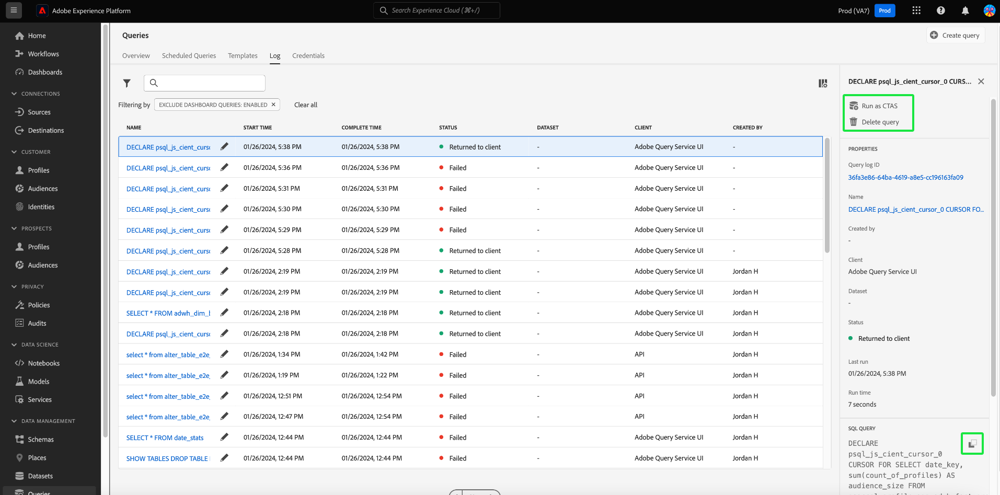

# 쿼리 로그

Adobe Experience Platform은 API와 UI를 모두 통해 발생하는 모든 쿼리 이벤트의 로그를 유지합니다. 이 정보는 [!UICONTROL 로그] 탭.

로그 파일은 모든 쿼리 이벤트에 의해 자동으로 생성되며 사용되는 SQL, 쿼리 상태, 소요 시간 및 마지막 실행 시간을 포함한 정보가 포함됩니다. 쿼리 로그 데이터를 비효율성 또는 문제 쿼리를 해결하는 강력한 도구로 사용할 수 있습니다. 보다 포괄적인 로그 정보는 감사 로그 기능의 일부로 유지되며 [감사 로그 설명서](../../landing/governance-privacy-security/audit-logs/overview.md).

## 쿼리 로그 확인

쿼리 로그를 확인하려면 [!UICONTROL 쿼리] 질의 서비스 작업공간으로 이동하여 [!UICONTROL 로그] 사용 가능한 옵션에서

## 사용자 지정 및 검색 {#customize-and-search}

쿼리 서비스 로그는 사용자 정의 가능한 테이블 형식으로 제공됩니다. 테이블 열을 사용자 지정하려면 설정 아이콘()을 클릭하여 제품에서 사용할 수 있습니다. A [!UICONTROL 테이블 사용자 지정] 각 열을 선택 취소할 수 있는 대화 상자가 나타납니다.

검색 필드에 템플릿 이름을 입력하여 특정 쿼리 템플릿과 관련된 로그를 검색할 수도 있습니다.

A [각 로그 테이블 열에 대한 설명](./overview.md#log) 은 쿼리 서비스 개요의 로그 섹션에서 찾을 수 있습니다.

## 로그 데이터 검색

각 행은 쿼리 템플릿과 연관된 쿼리 실행에 대한 로그 데이터를 나타냅니다. 테이블에서 임의 행을 선택하여 해당 실행에 대한 로그 데이터로 오른쪽 사이드바를 채웁니다.

로그 세부 정보 패널에서 새 출력 데이터 세트를 선택하고 실행에서 사용된 전체 SQL 쿼리를 보거나 복사할 수 있습니다.

쿼리 템플릿 이름을 [!UICONTROL 이름] 열로 바로 이동할 수 있습니다. [!UICONTROL 쿼리 로그 세부 정보] 보기.

>[!NOTE]
>
>API를 사용하여 쿼리를 만들고 초기화 중에 템플릿 이름을 제공하지 않은 경우 SQL 쿼리의 처음 수십 개의 문자가 대신 표시됩니다.

각 행의 템플릿 이름 또는 SQL 코드 조각 옆에 연필 아이콘()을 클릭하여 쿼리 편집기로 이동할 수 있습니다. 그런 다음 편집할 편집기에서 쿼리가 미리 채워집니다.

## 다음 단계

이 문서를 읽은 후에는 Query Service UI에서 쿼리 로그에 액세스하고 사용하는 방법을 더 잘 이해할 수 있습니다.

자세한 내용은 [UI 개요](./overview.md)또는 [Query Service API 안내서](../api/getting-started.md) 쿼리 서비스 기능에 대해 자세히 알아보십시오.

자세한 내용은 [쿼리 문서 모니터링](./monitor-queries.md) Query Service가 예약된 쿼리 실행의 가시성을 향상시키는 방법을 알아봅니다.
