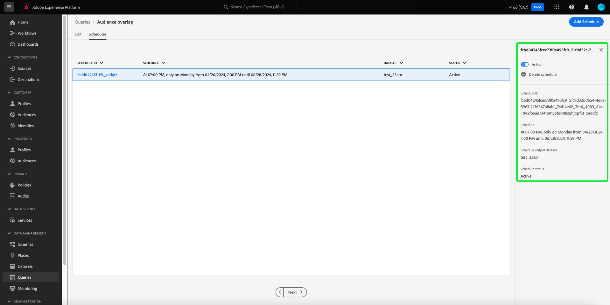

# 쿼리 일정

쿼리 일정을 생성하여 쿼리 실행을 자동화할 수 있습니다. 예약된 쿼리는 사용자 지정 케이던스에서 실행되어 빈도, 날짜 및 시간을 기준으로 데이터를 관리합니다. 필요한 경우 결과에 대한 출력 데이터 세트를 선택할 수도 있습니다. 템플릿으로 저장된 쿼리는 쿼리 편집기에서 예약할 수 있습니다.

>[!IMPORTANT]
>
>이미 생성되어 저장된 질의에만 스케줄을 추가할 수 있습니다.

예약된 쿼리는 모두 의 목록에 추가됩니다. [!UICONTROL 예약된 쿼리] 탭. 해당 작업 영역에서 UI를 통해 예약된 모든 쿼리 작업의 상태를 모니터링할 수 있습니다. 다음에서 [!UICONTROL 예약된 쿼리] 탭에서는 쿼리 실행에 대한 중요한 정보를 찾고 경고를 구독할 수 있습니다. 실행 실패 시 사용 가능한 정보에는 상태, 일정 세부 정보 및 오류 메시지/코드가 포함됩니다. 다음을 참조하십시오. [예약된 쿼리 문서 모니터링](./monitor-queries.md) 추가 정보.

이 워크플로우는 쿼리 서비스 UI의 예약 프로세스를 다룹니다. API를 사용하여 일정을 추가하는 방법을 알아보려면 다음을 참조하십시오. [예약된 쿼리 끝점 안내서](../api/scheduled-queries.md).

## 쿼리 일정 만들기 {#create-schedule}

쿼리를 예약하려면 다음 중 하나에서 쿼리 템플릿을 선택합니다. [!UICONTROL 템플릿] 탭 또는 [!UICONTROL 템플릿] 열 [!UICONTROL 예약된 쿼리] 탭. 템플릿 이름을 선택하면 쿼리 편집기로 이동합니다.

쿼리 편집기에서 저장된 쿼리에 액세스하는 경우 쿼리에 대한 일정을 만들거나 세부 정보 패널에서 쿼리의 일정을 볼 수 있습니다.

>[!TIP]
>
>선택 **[!UICONTROL 일정 보기]** 예약 작업 영역으로 이동하여 예약된 쿼리가 실행되는 것을 한눈에 확인합니다.

![쿼리 편집기 [!UICONTROL 일정 보기] 및 [!UICONTROL 일정 추가] 강조 표시됨.](../images/ui/query-schedules/view-add-schedule.png)

선택 **[!UICONTROL 일정 추가]** 을 클릭하여 다음 위치로 이동합니다. [일정 세부 정보 페이지](#schedule-details).

또는 **[!UICONTROL 일정]** 쿼리 이름 아래의 탭입니다.

스케줄 작업 공간이 나타납니다. UI에 템플릿과 연결된 모든 예약된 실행 목록이 표시됩니다. 선택 **[!UICONTROL 일정 추가]** 예약을 만듭니다.

![[일정 추가]가 강조 표시된 쿼리 편집기 일정 작업 영역입니다.](../images/ui/query-schedules/add-schedule.png)

### 일정 세부 정보 추가 {#schedule-details}

[일정 세부 정보] 페이지가 나타납니다. 이 페이지에서 예약된 쿼리에 대한 다양한 세부 정보를 편집할 수 있습니다. 세부 사항은 다음과 같습니다. [예약된 쿼리의 빈도 및 요일](#scheduled-query-frequency) 실행, 시작 및 종료 날짜, 결과를 내보낼 데이터 세트, [쿼리 상태 경고](#alerts-for-query-status).

![[예약 세부 정보] 패널이 강조 표시됩니다.](../images/ui/query-schedules/schedule-details.png)

#### 예약된 쿼리 빈도 {#scheduled-query-frequency}

다음 옵션을 선택할 수 있습니다. **[!UICONTROL 빈도]**:

- **[!UICONTROL 시간별]**: 예약된 쿼리는 선택한 날짜 기간 동안 매시간마다 실행됩니다.
- **[!UICONTROL 매일]**: 예약된 쿼리는 선택한 시간 및 날짜 기간에 X일마다 실행됩니다. 선택한 시간이 다음 내에 있습니다. **UTC**, 로컬 표준 시간대가 아님.
- **[!UICONTROL 매주]**: 선택한 쿼리가 선택한 요일, 시간 및 날짜 기간에 실행됩니다. 선택한 시간이 다음 내에 있습니다. **UTC**, 로컬 표준 시간대가 아님.
- **[!UICONTROL 월별]**: 선택한 쿼리는 매월 선택한 일, 시간 및 날짜 기간에 실행됩니다. 선택한 시간이 다음 내에 있습니다. **UTC**, 로컬 표준 시간대가 아님.
- **[!UICONTROL 연간]**: 선택한 쿼리는 매년 선택한 일, 월, 시간 및 날짜 기간에 실행됩니다. 선택한 시간이 다음 내에 있습니다. **UTC**, 로컬 표준 시간대가 아님.

### 데이터 세트 세부 정보 제공 {#dataset-details}

기존 데이터 세트에 데이터를 추가하거나 새 데이터 세트를 생성하고 여기에 데이터를 추가하여 쿼리 결과를 관리합니다.

선택 **[!UICONTROL 새 데이터 세트 만들기 및 추가]** 쿼리를 처음 실행할 때 데이터 세트를 만들려면 후속 실행은 해당 데이터 세트에 데이터를 계속 삽입합니다. 마지막으로 데이터 세트의 이름과 설명을 입력합니다.

>[!IMPORTANT]
>
> 기존 데이터 세트를 사용하거나 새 데이터 세트를 만들기 때문에 **아님** 다음 중 하나를 포함해야 함 `INSERT INTO` 또는 `CREATE TABLE AS SELECT` 데이터 세트가 이미 설정되었기 때문에 쿼리의 일부로 사용됩니다. 다음 중 하나 포함 `INSERT INTO` 또는 `CREATE TABLE AS SELECT` 예약된 쿼리의 일부로 오류가 발생합니다.

![데이터 세트 세부 정보 및 가 포함된 예약 세부 정보 패널 [!UICONTROL 새 데이터 세트 만들기 및 추가] 강조 표시된 옵션입니다.](../images/ui/query-schedules/dataset-details-create-and-append.png)

또는 을 선택합니다. **[!UICONTROL 기존 데이터 세트에 추가]** 뒤에 데이터 세트 아이콘().

![[데이터 세트 세부 정보] 및 [기존 데이터 세트에 추가]가 강조 표시된 [예약 세부 정보] 패널](../images/ui/query-schedules/dataset-details-existing.png)

다음 **[!UICONTROL 출력 데이터 세트 선택]** 대화 상자가 나타납니다.

그런 다음 기존 데이터 세트를 찾아보거나 검색 필드를 사용하여 옵션을 필터링합니다. 사용하려는 데이터 세트 행을 선택합니다. 데이터 세트 세부 사항이 오른쪽 패널에 표시됩니다. 선택 **[!UICONTROL 완료]** 선택을 확인합니다.

### 계속 실패할 경우 쿼리 격리 {#quarantine}

일정을 만들 때 시스템 리소스를 보호하고 잠재적인 중단을 방지하기 위해 격리 기능에 쿼리를 등록할 수 있습니다. 격리 기능은 반복적으로 실패하는 쿼리를 [!UICONTROL 격리됨] 주. 10회 연속 실패 후 쿼리를 격리하면 문제를 개입, 검토 및 수정한 후 추가 실행을 허용할 수 있습니다. 이를 통해 운영 효율성과 데이터 무결성을 유지할 수 있습니다.

![쿼리 는 로 작업 영역을 예약합니다. [!UICONTROL 쿼리 격리] 강조 표시 및 예 선택.](../images/ui/query-schedules/quarantine-enroll.png)

쿼리가 격리 기능에 등록되면 이 쿼리 상태 변경에 대한 경고를 구독할 수 있습니다. 예약된 쿼리가 격리에 등록되지 않은 경우에서 옵션으로 표시되지 않습니다. [경고 대화 상자](./monitor-queries.md#alert-subscription).

의 인라인 작업에서 예약된 쿼리를 격리 기능에 등록할 수도 있습니다. [!UICONTROL 예약된 쿼리] 탭. 다음을 참조하십시오. [쿼리 모니터링 설명서](./monitor-queries.md#alert-subscription) 을 참조하십시오.

### 예약된 쿼리 상태에 대한 경고 설정 {#alerts-for-query-status}

예약된 쿼리 설정의 일부로 쿼리 경고에 가입할 수도 있습니다. 다양한 상황에 대한 알림을 받도록 설정을 구성할 수 있습니다. 격리된 상태, 쿼리 처리 지연 또는 쿼리 상태 변경에 대해 경고를 설정할 수 있습니다. 사용 가능한 쿼리 상태 경고 옵션에는 시작, 성공 및 실패가 포함됩니다. 경고는 팝업 알림 또는 이메일로 받을 수 있습니다. 예약된 쿼리의 해당 상태에 대한 경고를 구독하려면 확인란을 선택합니다.

![[경고] 옵션이 강조 표시된 [예약 세부 정보] 패널](../images/ui/query-editor/alerts.png)

아래 표에서는 지원되는 쿼리 경고 유형에 대해 설명합니다.

| 경고 유형 | 설명 |
|---|---|
| `start` | 이 경고는 예약된 쿼리 실행이 시작되거나 처리를 시작할 때 알려줍니다. |
| `success` | 이 경고는 예약된 쿼리 실행이 성공적으로 완료되면 사용자에게 알려 주며 이는 쿼리가 오류 없이 실행되었음을 나타냅니다. |
| `failed` | 이 경고는 예약된 쿼리 실행에 오류가 발생하거나 성공적으로 실행되지 않을 때 트리거됩니다. 문제를 신속하게 식별하고 해결하는 데 도움이 됩니다. |
| `quarantine` | 이 경고는 예약된 쿼리 실행이 격리된 상태로 전환되면 활성화됩니다. 쿼리가 다음과 같은 경우 [격리 기능에 등록됨](#quarantine), 10번의 연속 실행에 실패한 모든 예약된 쿼리는 자동으로 [!UICONTROL 격리됨] 주. 그러면 격리된 쿼리에서 더 이상의 실행이 수행되기 전에 사용자의 개입이 필요합니다. 참고: 격리 경고를 구독하려면 격리 기능에 쿼리를 등록해야 합니다. |
| `delay` | 이 경고는 다음 항목이 있는 경우 사용자에게 알립니다. [예약된 쿼리 실행의 결과 지연](./monitor-queries.md#query-run-delay) 지정된 임계값을 초과합니다. 완료하거나 실패하지 않고 해당 기간 동안 쿼리가 실행될 때 경고를 트리거하는 사용자 지정 시간을 설정할 수 있습니다. 기본 동작은 쿼리 처리가 시작된 후 150분 동안 경고를 설정합니다. |

>[!NOTE]
>
>을(를) 설정하기로 선택한 경우 [!UICONTROL 쿼리 실행 지연] 경고: Platform UI에서 원하는 지연 시간을 분 단위로 설정해야 합니다. 기간을 분 단위로 입력하십시오. 최대 지연은 24시간(1440분)입니다.

경고 규칙 정의 구조를 포함하여 Adobe Experience Platform의 경고에 대한 개요는 다음을 참조하십시오. [경고 개요](../../observability/alerts/overview.md). Adobe Experience Platform UI 내에서 경고 및 경고 규칙을 관리하는 방법에 대한 지침은 [경고 UI 안내서](../../observability/alerts/ui.md).

### 예약된 매개 변수가 있는 쿼리에 대해 매개 변수 설정 {#set-parameters}

>[!IMPORTANT]
>
>매개 변수가 있는 쿼리 UI 기능은 현재 **제한된 릴리스 전용** 일부 고객은 사용할 수 없습니다. 매개 변수가 있는 쿼리에 대한 액세스 권한이 없는 경우 [일정 삭제 또는 비활성화](#delete-schedule) 섹션.

매개 변수가 있는 쿼리에 대해 예약된 쿼리를 만드는 경우 이제 이러한 쿼리 실행에 대한 매개 변수 값을 설정해야 합니다.

일정 세부 사항을 확인한 후 다음을 선택합니다. **[!UICONTROL 저장]** 예약을 만듭니다. 템플릿의 일정 탭으로 돌아갑니다. 이 작업 공간에는 일정 ID, 일정 자체 및 일정의 출력 데이터 세트를 포함하여 새로 만든 일정의 세부 사항이 표시됩니다.

## 예약된 쿼리 실행 보기 {#scheduled-query-runs}

템플릿에서 [!UICONTROL 일정] 탭에서 예약 ID를 선택하여 새로 예약된 쿼리에 대한 쿼리 실행 목록으로 이동합니다.

또는 쿼리 템플릿의 예약된 실행 목록을 보려면 **[!UICONTROL 예약된 쿼리]** 을(를) 탭하고 사용 가능한 목록에서 템플릿 이름을 선택합니다.

예약된 해당 쿼리에 대한 쿼리 실행 목록이 나타납니다.

다음을 참조하십시오. [예약된 쿼리 가이드 모니터링](./monitor-queries.md#inline-actions) UI를 통해 모든 쿼리 작업의 상태를 모니터링하는 방법에 대한 전체 정보입니다.

선택 **[!UICONTROL 쿼리 실행 ID]** 목록에서 쿼리 실행 개요로 이동합니다. 에서 사용할 수 있는 정보에 대한 전체 분류 [쿼리 실행 개요](./monitor-queries.md#query-run-overview)예약된 쿼리 모니터링 설명서를 참조하십시오.

쿼리 서비스 API를 사용하여 예약된 쿼리를 모니터링하려면 다음을 참조하십시오. [예약된 쿼리 실행 끝점 안내서](../api/runs-scheduled-queries.md).

## 일정 활성화, 비활성화 또는 삭제 {#delete-schedule}

특정 쿼리의 일정 작업 공간이나 [!UICONTROL 예약된 쿼리] 모든 예약된 쿼리를 나열하는 작업 영역입니다.

에 액세스하려면 [!UICONTROL 일정] 선택한 쿼리의 탭에서 다음 중 하나에서 쿼리 템플릿의 이름을 선택해야 합니다. [!UICONTROL 템플릿] 탭 또는 [!UICONTROL 예약된 쿼리] 탭. 해당 쿼리에 대한 쿼리 편집기로 이동합니다. 쿼리 편집기에서 **[!UICONTROL 일정]** 예약 작업 공간에 액세스합니다.

사용 가능한 일정 행에서 일정을 선택하여 세부 정보 패널을 채웁니다. 예약된 쿼리를 비활성화(또는 활성화)하려면 토글을 사용합니다.

### 비활성화된 쿼리 삭제

>[!IMPORTANT]
>
>쿼리에 대한 일정을 삭제하려면 먼저 일정을 비활성화해야 합니다.

확인 대화 상자가 나타납니다. 선택 **[!UICONTROL 사용 안 함]** 작업을 확인합니다.

선택 **[!UICONTROL 일정 삭제]** 비활성화된 일정을 삭제하려면

또는 [!UICONTROL 예약된 쿼리] 탭에서는 각 예약된 쿼리에 대한 인라인 작업 컬렉션을 제공합니다. 사용 가능한 인라인 작업에는 다음이 포함됩니다 [!UICONTROL 일정 비활성화] 또는 [!UICONTROL 일정 활성화], [!UICONTROL 일정 삭제], 및 [!UICONTROL 구독] 예약된 쿼리에 대해 경고합니다. 예약된 쿼리 탭을 통해 예약된 쿼리를 삭제하거나 비활성화하는 방법에 대한 전체 지침은 다음을 참조하십시오. [예약된 쿼리 가이드 모니터링](./monitor-queries.md#inline-actions).
