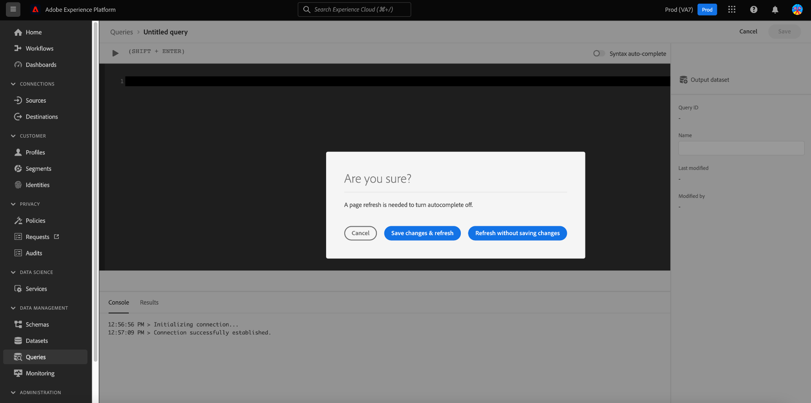

# [!DNL Query Editor] UI 안내서

[!DNL Query Editor] 는 Adobe Experience Platform에서 제공하는 대화형 도구입니다 [!DNL Query Service]를 사용하여 내에서 고객 경험 데이터에 대한 쿼리를 작성하고, 유효성을 확인하고, 실행할 수 있습니다 [!DNL Experience Platform] 사용자 인터페이스. [!DNL Query Editor] 는 분석 및 데이터 탐색을 위한 쿼리 개발을 지원하며, 이를 통해 개발 목적으로 대화형 쿼리를 실행하고 데이터 세트를 채울 수 있습니다. [!DNL Experience Platform].

의 개념 및 기능에 대한 자세한 내용 [!DNL Query Service], 다음을 참조하십시오. [쿼리 서비스 개요](../home.md). 에서 쿼리 서비스 사용자 인터페이스를 탐색하는 방법에 대해 자세히 알아보려면 [!DNL Platform], 다음을 참조하십시오. [쿼리 서비스 UI 개요](./overview.md).

>[!NOTE]
>
>특정 쿼리 서비스 기능은 쿼리 편집기의 이전 버전에서 제공되지 않습니다. 이 문서에 사용된 스크린샷은 별도로 명시되지 않는 한 쿼리 편집기의 향상된 버전을 사용하여 찍은 것입니다. 다음에서 섹션을 참조하십시오. [향상된 쿼리 편집기](#enhanced-editor-toggle) 을 참조하십시오.

## 시작하기 {#getting-started}

[!DNL Query Editor] 을에 연결하여 유연한 쿼리 실행 제공 [!DNL Query Service]및 쿼리는 이 연결이 활성화된 동안에만 실행됩니다.

## [!DNL Query Editor]에 액세스 {#accessing-query-editor}

다음에서 [!DNL Experience Platform] UI, 선택 **[!UICONTROL 쿼리]** 을(를) 클릭하여 왼쪽 탐색 메뉴에서 [!DNL Query Service] 작업 영역. 그런 다음 쿼리 작성을 시작하려면 다음을 선택합니다. **[!UICONTROL 쿼리 만들기]** 화면 오른쪽 상단에 있습니다. 이 링크는 의 페이지에서 사용할 수 있습니다. [!DNL Query Service] 작업 영역.

### 에 연결 중 [!DNL Query Service] {#connecting-to-query-service}

쿼리 편집기를 열 때 초기화하고 쿼리 서비스에 연결하는 데 몇 초 정도 걸립니다. 콘솔은 아래와 같이 연결되면 알려 줍니다. 편집기가 연결되기 전에 쿼리를 실행하려고 하면 연결이 완료될 때까지 실행이 지연됩니다.

### 쿼리를 실행하는 방법 [!DNL Query Editor] {#run-a-query}

다음에서 실행된 쿼리 [!DNL Query Editor] 대화식으로 실행 : 브라우저를 닫거나 다른 곳으로 이동하면 쿼리가 취소됩니다. 쿼리 출력에서 데이터 세트를 생성하기 위해 만들어진 쿼리의 경우에도 마찬가지입니다.

쿼리 편집기의 고급 버전에서는 쿼리 편집기에 두 개 이상의 쿼리를 작성하고 모든 쿼리를 순차적으로 실행할 수 있습니다. 의 섹션을 참조하십시오. [여러 순차적 쿼리 실행](#execute-multiple-sequential-queries) 추가 정보.

## 를 사용하여 쿼리 작성 [!DNL Query Editor] {#query-authoring}

사용 [!DNL Query Editor], 고객 경험 데이터에 대한 쿼리를 작성, 실행 및 저장할 수 있습니다. 실행되거나 저장된 모든 쿼리 [!DNL Query Editor] 에 대한 액세스 권한이 있는 조직의 모든 사용자가 사용할 수 있습니다. [!DNL Query Service].

>[!IMPORTANT]
>
>기존 편집기는 2024년 4월 1일에 사용이 중단되며 더 이상 사용할 수 없습니다.

## 향상된 쿼리 편집기 토글 {#enhanced-editor-toggle}

>[!CONTEXTUALHELP]
>id="platform_queryService_queryEditor_enhancedEditorToggle"
>title="향상된 편집기 토글"
>abstract="쿼리 편집기의 기존 버전과 고급 버전 간에 전환합니다. 기존 버전은 기본적으로 활성화되어 있으나 향상된 버전은 더 나은 접근성과 다중 테마 지원을 제공합니다. 이러한 변경 사항에 대한 자세한 내용은 설명서를 참조하십시오."

UI 토글을 사용하면 쿼리 편집기의 기존 버전과 향상된 버전 간을 전환할 수 있습니다. 기존 버전은 기본적으로 활성화되어 있으나 향상된 버전은 더 나은 접근성과 다중 테마 지원을 제공합니다. 향상된 버전을 활성화하여 쿼리 편집기 설정에 액세스할 수 있습니다.

토글을 활성화하면 편집기가 밝은 테마로 전환되고 구문의 가독성이 향상됩니다. 설정 아이콘은 자동 완성 토글을 통합하는 쿼리 편집기 입력 필드 위에도 표시됩니다. 설정 아이콘에서 어두운 테마를 활성화하거나 자동 완성을 비활성화/활성화할 수 있습니다.

>[!TIP]
>
>향상된 쿼리 편집기를 사용하여 다음 작업을 수행할 수 있습니다 [!UICONTROL 구문 자동 완성 비활성화] 진행률을 잃지 않고 쿼리를 작성하는 동안 일반적으로 편집하는 동안 자동 완성 기능을 비활성화하면 쿼리에 대한 모든 변경 사항이 손실됩니다.

어두운 테마 또는 밝은 테마를 활성화하려면 설정 아이콘() 다음에 나타나는 드롭다운 메뉴의 옵션이 표시됩니다.

### 여러 순차적 쿼리 실행 {#execute-multiple-sequential-queries}

쿼리 편집기의 고급 버전에서는 쿼리 편집기에 두 개 이상의 쿼리를 작성하고 모든 쿼리를 순차적 방식으로 실행할 수 있습니다.

시퀀스에서 여러 쿼리를 실행하면 각각 로그 항목이 생성됩니다. 그러나 첫 번째 쿼리의 결과만 쿼리 편집기 콘솔에 표시됩니다. 실행된 쿼리의 문제를 해결하거나 확인해야 하는 경우 쿼리 로그를 확인합니다. 다음을 참조하십시오. [쿼리 로그 설명서](./query-logs.md) 추가 정보.

>[!NOTE]
> 
>CTAS 쿼리가 쿼리 편집기에서 첫 번째 쿼리 이후에 실행되는 경우에도 쿼리 편집기 콘솔에 출력이 없어도 테이블이 만들어집니다.

### 선택한 쿼리 실행 {#execute-selected-query}

여러 개의 쿼리를 작성했지만 하나의 쿼리만 실행해야 하는 경우 선택한 쿼리를 강조 표시하고
[!UICONTROL 선택한 쿼리 실행] 아이콘. 편집기 내에서 쿼리 구문을 선택할 때까지 이 아이콘이 기본적으로 비활성화됩니다.

![를 사용하는 쿼리 편집기 [!UICONTROL 선택한 쿼리 실행] 아이콘이 강조 표시되었습니다.](../images/ui/query-editor/run-selected-query.png)

### 결과 카운트 {#result-count}

쿼리 편집기에는 최대 50,000개의 행 출력이 있습니다. 쿼리 편집기 콘솔에서 한 번에 표시되는 행 수를 선택할 수 있습니다. 콘솔에 표시되는 행 수를 변경하려면 **[!UICONTROL 결과 카운트]** 드롭다운을 클릭하고 50, 100, 150, 300 및 500 옵션 중에서 선택합니다.

## 쿼리 작성 {#writing-queries}

[!UICONTROL 쿼리 편집기] 는 가능한 한 쉽게 쿼리를 작성할 수 있도록 구성됩니다. 아래 스크린샷은 SQL 항목 필드와 함께 편집기가 UI에 표시되는 방식을 보여 줍니다. **재생** 강조 표시됨.

![[SQL 입력] 필드 및 [재생]이 강조 표시된 쿼리 편집기.](../images/ui/query-editor/editor.png)

개발 시간을 최소화하려면 반환되는 행 수를 제한하여 쿼리를 개발하는 것이 좋습니다. 예, `SELECT fields FROM table WHERE conditions LIMIT number_of_rows`. 쿼리에서 예상 출력이 생성되는지 확인했으면 제한을 제거하고 를 사용하여 쿼리를 실행합니다 `CREATE TABLE tablename AS SELECT` 을 클릭하여 출력으로 데이터 세트를 생성합니다.

## 에서 쓰기 도구 [!DNL Query Editor] {#writing-tools}

- **자동 구문 강조 표시:** SQL을 보다 쉽게 읽고 구성할 수 있습니다.

- **SQL 키워드 자동 완성:** 쿼리를 입력한 다음 화살표 키를 사용하여 원하는 용어로 이동하고 키를 누릅니다 **입력**.

- **테이블 및 필드 자동 완성:** 원하는 테이블 이름을 입력하십시오. `SELECT` 에서 화살표 키를 사용하여 원하는 테이블로 이동한 다음 키를 누릅니다 **입력**. 테이블을 선택하면 자동 완성 기능이 해당 테이블의 필드를 인식합니다.

### 텍스트 서식 지정 {#format-text}

다음 [!UICONTROL 텍스트 서식 지정] 기능을 사용하면 표준화된 구문 스타일을 추가하여 쿼리를 보다 쉽게 읽을 수 있습니다. 선택 **[!UICONTROL 텍스트 서식 지정]** 를 사용하여 쿼리 편집기 내의 모든 텍스트를 표준화합니다.

![쿼리 편집기 [!UICONTROL 텍스트 서식 지정] 강조 표시된 SQL 문](../images/ui/query-editor/format-text.png)

<!-- ### Undo text {#undo-text}

If you format your SQL in the Query Editor, you can undo the formatting applied by the [!UICONTROL Format text] feature. To return your SQL back to its original form, select **[!UICONTROL Undo text]**.

![The Query Editor with [!UICONTROL Undo text] and the SQL statements highlighted.](../images/ui/query-editor/undo-text.png) -->

### SQL 복사 {#copy-sql}

복사 아이콘을 선택하여 쿼리 편집기에서 클립보드로 SQL을 복사합니다. 이 복사 기능은 쿼리 템플릿과 쿼리 편집기에서 새로 만든 쿼리 모두에 사용할 수 있습니다.

### 자동 완성 UI 구성 전환 {#auto-complete}

다음 [!DNL Query Editor] 쿼리를 작성할 때 테이블 또는 열 세부 정보와 함께 잠재적 SQL 키워드를 자동으로 제안합니다. 자동 완성 기능은 기본적으로 활성화되어 있으며, 언제든지 을 선택하여 비활성화하거나 활성화할 수 있습니다. [!UICONTROL 구문 자동 완성] 쿼리 편집기의 오른쪽 상단으로 전환합니다.

자동 완성 구성 설정은 사용자별로 지정되며 해당 사용자에 대한 연속 로그인 동안 기억됩니다.

>[!NOTE]
>
>구문 자동 완성 토글은 쿼리 편집기의 이전 버전에만 사용할 수 있습니다.

이 기능을 비활성화하면 여러 메타데이터 명령이 처리되지 않고 일반적으로 쿼리를 편집할 때 작성자의 속도에 도움이 되는 권장 사항을 제공할 수 있습니다.

토글을 사용하여 자동 완성 기능을 활성화하면 잠시 후에 테이블 및 열 이름과 SQL 키워드에 대한 권장 제안을 사용할 수 있습니다. 쿼리 편집기 아래의 콘솔에 성공 메시지가 표시되면 해당 기능이 활성 상태임을 알 수 있습니다.

자동 완성 기능을 사용하지 않도록 설정하면 기능을 적용하려면 페이지를 새로 고쳐야 합니다. 을 비활성화하면 세 가지 옵션이 있는 확인 대화 상자가 나타납니다. [!UICONTROL 구문 자동 완성] 전환 :

- [!UICONTROL 취소]
- [!UICONTROL 변경 내용 저장 및 새로 고침]
- [!UICONTROL 변경 내용을 저장하지 않고 새로 고침]

>[!IMPORTANT]
>
>이 기능을 사용하지 않도록 설정할 때 쿼리를 작성하거나 편집하는 경우 페이지를 새로 고치기 전에 쿼리에 대한 변경 사항을 저장해야 합니다. 그렇지 않으면 진행률이 모두 손실됩니다.

자동 완성 기능을 비활성화하려면 적절한 확인 옵션을 선택합니다.

### 오류 감지 {#error-detection}

[!DNL Query Editor] 쿼리를 작성할 때 일반 SQL 유효성 검사와 특정 실행 유효성 검사를 제공하여 쿼리를 자동으로 확인합니다. 아래 이미지에 표시된 대로 쿼리 아래에 빨간색 밑줄이 표시되면 쿼리 내의 오류를 나타냅니다.

<!-- ... Image below needs updating couldn't replicate the effect -->

오류가 감지되면 SQL 코드 위로 마우스를 가져가면 특정 오류 메시지를 볼 수 있습니다.

<!-- ... Image below needs updating couldn't replicate the effect -->

### 쿼리 세부 정보 {#query-details}

쿼리 편집기에서 쿼리를 보려면 [!UICONTROL 템플릿] 탭. 쿼리 세부 정보 패널에서는 선택한 쿼리를 관리하기 위한 자세한 정보와 도구를 제공합니다. 또한 쿼리가 마지막으로 수정된 시간과 해당되는 경우 이를 수정한 사람과 같은 유용한 메타데이터도 표시합니다.

>[!NOTE]
>
>다음 [!UICONTROL 일정 보기], [!UICONTROL 일정 추가] 및 [!UICONTROL 쿼리 삭제] 옵션은 쿼리가 템플릿으로 저장된 후에만 사용할 수 있습니다. 다음 [!UICONTROL 일정 추가] 옵션을 사용하면 쿼리 편집기에서 예약 빌더로 바로 이동합니다. 다음 [!UICONTROL 일정 보기] 옵션을 사용하면 해당 쿼리에 대한 예약 인벤토리로 바로 이동합니다. 방법을 알아보려면 쿼리 일정 설명서 를 참조하십시오 [ui에서 쿼리 일정 만들기](./query-schedules.md#create-schedule).

![[쿼리 세부 정보] 패널이 강조 표시된 쿼리 편집기.](../images/ui/query-editor/query-details.png)

세부 정보 패널에서 UI에서 직접 출력 데이터 세트를 생성하고, 표시된 쿼리를 삭제하거나 이름을 지정하고, 쿼리 실행 일정을 보고, 쿼리를 일정에 추가할 수 있습니다.

출력 데이터 세트를 생성하려면 다음을 선택합니다. **[!UICONTROL CTAS로 실행]**. 다음 **[!UICONTROL 출력 데이터 세트 세부 정보 입력]** 대화 상자가 나타납니다. 이름과 설명을 입력한 다음 을(를) 선택합니다 **[!UICONTROL CTAS로 실행]**. 새 데이터 세트가에 표시됩니다. **[!UICONTROL 데이터 세트]** 찾아보기 탭. 다음을 참조하십시오 [데이터 세트 보기 설명서](../../catalog/datasets/user-guide.md#view-datasets) 조직의 사용 가능한 데이터 세트에 대해 자세히 알아보십시오.

>[!NOTE]
>
>다음 [!UICONTROL CTAS로 실행] 옵션은 쿼리에 이 있는 경우에만 사용할 수 있습니다. **아님** 예약되었습니다.

![다음 [!UICONTROL 출력 데이터 세트 세부 정보 입력] 대화 상자.](../images/ui/query-editor/output-dataset-details.png)

를 실행한 후 **[!UICONTROL CTAS로 실행]** 작업, 성공 작업을 알리는 확인 메시지가 표시됩니다. 이 팝업 메시지에는 쿼리 로그 작업 영역으로 이동하는 편리한 방법을 제공하는 링크가 포함되어 있습니다. 다음을 참조하십시오. [쿼리 로그 설명서](./query-logs.md) 쿼리 로그에 대한 자세한 정보입니다.

### 쿼리 저장 중 {#saving-queries}

다음 [!DNL Query Editor] 는 쿼리를 저장하고 나중에 작업할 수 있도록 해주는 저장 기능을 제공합니다. 쿼리를 저장하려면 을 선택합니다. **[!UICONTROL 저장]** 의 오른쪽 위 모서리 [!DNL Query Editor]. 쿼리를 저장하려면 먼저 **[!UICONTROL 쿼리 세부 정보]** 패널.

>[!NOTE]
>
>쿼리 편집기 를 사용하여에 이름이 지정되고 저장된 쿼리는 쿼리 대시보드 내에서 템플릿으로 사용할 수 있습니다 [!UICONTROL 템플릿] 탭. 다음을 참조하십시오. [템플릿 설명서](./query-templates.md) 추가 정보.

쿼리 편집기에 쿼리를 저장하면 성공 작업을 알리는 확인 메시지가 표시됩니다. 이 팝업 메시지에는 쿼리 예약 작업 공간으로 편리하게 이동할 수 있는 방법을 제공하는 링크가 포함되어 있습니다. 다음을 참조하십시오. [일정 쿼리 설명서](./query-schedules.md) 사용자 지정 케이던스에서 쿼리를 실행하는 방법에 대해 알아봅니다.

### 예약된 쿼리 {#scheduled-queries}

템플릿으로 저장된 쿼리는 쿼리 편집기에서 예약할 수 있습니다. 쿼리 예약을 사용하면 사용자 지정 케이던스에서 쿼리 실행을 자동화할 수 있습니다. 빈도, 날짜 및 시간에 따라 쿼리를 예약할 수 있으며 필요한 경우 결과에 대한 출력 데이터 세트를 선택할 수도 있습니다. UI를 통해 쿼리 일정을 비활성화하거나 삭제할 수도 있습니다.

예약은 쿼리 편집기에서 설정됩니다. 쿼리 편집기를 사용하는 경우 이미 생성, 저장 및 실행된 쿼리에 대한 예약만 추가할 수 있습니다. 동일한 제한이 에는 적용되지 않습니다. [!DNL Query Service] API:

방법을 알아보려면 쿼리 일정 설명서 를 참조하십시오 [ui에서 쿼리 일정 만들기](./query-schedules.md). 또는 API를 사용하여 일정을 추가하는 방법을 배우려면 다음을 참조하십시오. [예약된 쿼리 끝점 안내서](../api/scheduled-queries.md).

예약된 쿼리는 모두 의 목록에 추가됩니다. [!UICONTROL 예약된 쿼리] 탭. 해당 작업 영역에서 UI를 통해 예약된 모든 쿼리 작업의 상태를 모니터링할 수 있습니다. 다음에서 [!UICONTROL 예약된 쿼리] 탭에서 쿼리 실행에 대한 중요한 정보를 찾아 경고를 구독할 수 있습니다. 사용 가능한 정보에는 실행이 실패한 경우 상태, 일정 세부 정보 및 오류 메시지/코드가 포함됩니다. 다음을 참조하십시오. [예약된 쿼리 문서 모니터링](./monitor-queries.md) 추가 정보.

### 이전 쿼리를 찾는 방법 {#previous-queries}

다음에서 실행된 모든 쿼리 [!DNL Query Editor] 로그 표에 캡처됩니다. 다음에서 검색 기능을 사용할 수 있습니다. **[!UICONTROL 로그]** 탭을 사용하여 쿼리 실행을 찾을 수 있습니다. 저장된 쿼리는 **[!UICONTROL 템플릿]** 탭.

쿼리가 예약된 경우 [!UICONTROL 예약된 쿼리] 탭은 UI를 통해 이러한 쿼리 작업에 대한 향상된 가시성을 제공합니다. 다음을 참조하십시오. [쿼리 모니터링 설명서](./monitor-queries.md) 추가 정보.

>[!NOTE]
>
>실행되지 않는 쿼리는 로그에 저장되지 않습니다. 에서 쿼리를 사용할 수 있도록 하려면 [!DNL Query Service], 실행 또는 저장 위치 [!DNL Query Editor].

## 쿼리 편집기를 사용하여 쿼리 실행 {#executing-queries}

에서 쿼리를 실행하려면 [!DNL Query Editor], 편집기에 SQL을 입력하거나 **[!UICONTROL 로그]** 또는 **[!UICONTROL 템플릿]** 탭을 클릭하고 다음을 선택합니다 **재생**. 쿼리 실행 상태가 **[!UICONTROL 콘솔]** 아래 탭과 출력 데이터가 **[!UICONTROL 결과]** 탭.

### 콘솔 {#console}

콘솔은 의 상태 및 작업에 대한 정보를 제공합니다. [!DNL Query Service]. 콘솔에 대한 연결 상태가 표시됩니다. [!DNL Query Service], 실행 중인 쿼리 작업 및 이러한 쿼리로 인한 오류 메시지.

>[!NOTE]
>
>콘솔에는 쿼리 실행으로 인해 발생한 오류만 표시됩니다. 쿼리가 실행되기 전에 발생하는 쿼리 유효성 검사 오류는 표시되지 않습니다.

### 쿼리 결과 {#query-results}

쿼리가 완료되면 결과가 **[!UICONTROL 결과]** 탭, 다음 옆에 있음 **[!UICONTROL 콘솔]** 탭. 이 보기는 쿼리의 테이블 형식 출력을 보여주며 선택한 항목에 따라 50~500개 사이의 결과 행을 표시합니다 [결과 카운트](#result-count). 이 보기를 통해 쿼리가 예상 출력을 생성하는지 확인할 수 있습니다. 쿼리를 사용하여 데이터 세트를 생성하려면 반환된 행에 대한 제한을 제거하고 `CREATE TABLE tablename AS SELECT` 을 클릭하여 출력으로 데이터 세트를 생성합니다. 다음을 참조하십시오. [데이터 세트 생성 자습서](./create-datasets.md) 쿼리 결과에서 데이터 세트를 생성하는 방법에 대한 지침은 [!DNL Query Editor].

## 쿼리 실행 [!DNL Query Service] 튜토리얼 비디오 {#query-tutorial-video}

다음 비디오는 Adobe Experience Platform 인터페이스 및 PSQL 클라이언트에서 쿼리를 실행하는 방법을 보여 줍니다. 또한 이 비디오에서는 XDM 개체에서 개별 속성을 사용하는 방법, Adobe 정의 함수 및 CREATE TABLE AS SELECT(CTAS) 쿼리를 사용하는 방법에 대해 설명합니다.

>[!VIDEO](https://video.tv.adobe.com/v/29796?quality=12&learn=on)

## 다음 단계

이제에서 사용할 수 있는 기능을 알게 되었습니다. [!DNL Query Editor] 또한 응용 프로그램을 탐색하는 방법은에서 직접 쿼리 작성을 시작할 수 있습니다. [!DNL Platform]. 의 데이터 세트에 대해 SQL 쿼리를 실행하는 방법에 대한 자세한 정보 [!DNL Data Lake], 의 안내서를 참조하십시오. [쿼리 실행 중](../best-practices/writing-queries.md).
