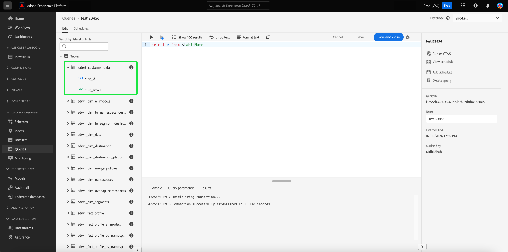
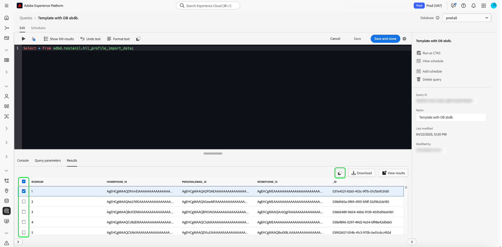

# 쿼리 편집기 UI 안내서

쿼리 편집기는 Adobe Experience Platform 쿼리 서비스에서 제공하는 대화형 도구로서, [!DNL Experience Platform] 사용자 인터페이스 내에서 고객 경험 데이터에 대한 쿼리를 작성, 유효성 검사 및 실행할 수 있습니다. 쿼리 편집기는 분석 및 데이터 탐색을 위한 쿼리 개발을 지원하며, 이를 통해 개발 목적으로 대화형 쿼리를 실행하고 비대화형 쿼리를 실행하여 [!DNL Experience Platform]의 데이터 세트를 채울 수 있습니다.

Query Service의 개념과 기능에 대한 자세한 내용은 [Query Service 개요](../home.md)를 참조하십시오. [!DNL Experience Platform]에서 쿼리 서비스 사용자 인터페이스를 탐색하는 방법에 대한 자세한 내용은 [쿼리 서비스 UI 개요](./overview.md)를 참조하십시오.

## 시작하기 {#getting-started}

쿼리 편집기는 쿼리 서비스에 연결하여 유연한 쿼리 실행을 제공하며 쿼리는 이 연결이 활성화된 동안에만 실행됩니다.

## 쿼리 편집기 액세스 {#accessing-query-editor}

[!DNL Experience Platform] UI의 왼쪽 탐색 메뉴에서 **[!UICONTROL 쿼리]**&#x200B;를 선택하여 쿼리 서비스 작업 영역을 엽니다. 그런 다음 쿼리 작성을 시작하려면 화면 오른쪽 상단에서 **[!UICONTROL 쿼리 만들기]**&#x200B;를 선택합니다. 이 링크는 쿼리 서비스 작업 영역의 모든 페이지에서 사용할 수 있습니다.

### 쿼리 서비스에 연결 중 {#connecting-to-query-service}

쿼리 편집기를 열 때 초기화하고 쿼리 서비스에 연결하는 데 몇 초 정도 걸립니다. 콘솔은 아래와 같이 연결되면 알려 줍니다. 편집기가 연결되기 전에 쿼리를 실행하려고 하면 연결이 완료될 때까지 실행이 지연됩니다.

### 쿼리 편집기에서 쿼리를 실행하는 방법 {#run-a-query}

쿼리 편집기에서 실행된 쿼리는 대화식으로 실행되므로 브라우저를 닫거나 다른 곳으로 이동하면 쿼리가 취소됩니다. 쿼리 출력에서 데이터 세트를 생성하기 위해 만들어진 쿼리의 경우에도 마찬가지입니다.

## 향상된 쿼리 편집기를 사용한 쿼리 작성 {#query-authoring}

쿼리 편집기를 사용하여 고객 경험 데이터에 대한 쿼리를 작성, 실행 및 저장할 수 있습니다. 쿼리 편집기에서 실행되거나 저장된 모든 쿼리는 쿼리 서비스에 대한 액세스 권한이 있는 조직의 모든 사용자가 사용할 수 있습니다.

### 데이터베이스 선택기 {#database-selector}

쿼리 편집기의 오른쪽 상단에 있는 드롭다운 메뉴에서 쿼리할 데이터베이스를 선택합니다. 선택한 데이터베이스가 드롭다운에 표시됩니다.

### 설정 {#settings}

쿼리 편집기 입력 필드 위의 설정 아이콘에는 어두운 테마를 활성화/비활성화하거나 자동 완성을 비활성화/활성화하는 옵션이 포함됩니다.

>[!TIP]
>
>진행률을 잃지 않고 쿼리를 작성하는 동안 [!UICONTROL 구문 자동 완성을 사용하지 않도록 설정]할 수 있습니다.

어두운 테마나 밝은 테마를 활성화하려면 설정 아이콘() 다음에 드롭다운 메뉴의 옵션이 나타납니다.

#### 자동 완성 {#auto-complete}

쿼리를 작성할 때 쿼리 편집기에서 테이블 또는 열 세부 정보와 함께 잠재적 SQL 키워드를 자동으로 제안합니다. 자동 완성 기능은 기본적으로 활성화되어 있으며, 쿼리 편집기 설정의 어느 지점에서든 비활성화하거나 활성화할 수 있습니다.

자동 완성 구성 설정은 사용자별로 지정되며 해당 사용자에 대한 연속 로그인 동안 기억됩니다. 이 기능을 비활성화하면 여러 메타데이터 명령이 처리되지 않고 일반적으로 쿼리를 편집할 때 작성자의 속도에 도움이 되는 권장 사항을 제공할 수 있습니다.

### 여러 순차적 쿼리 실행 {#execute-multiple-sequential-queries}

향상된 쿼리 편집기를 사용하여 두 개 이상의 쿼리를 작성하고 모든 쿼리를 순차적 방식으로 실행합니다. 시퀀스에서 여러 쿼리를 실행하면 각각 로그 항목이 생성됩니다. 그러나 첫 번째 쿼리의 결과만 쿼리 편집기 콘솔에 표시됩니다. 실행된 쿼리의 문제를 해결하거나 확인해야 하는 경우 쿼리 로그를 확인합니다. 자세한 내용은 [쿼리 로그 설명서](./query-logs.md)를 참조하세요.

>[!NOTE]
> 
>CTAS 쿼리가 쿼리 편집기에서 첫 번째 쿼리 이후에 실행되는 경우에도 쿼리 편집기 콘솔에 출력이 없어도 테이블이 만들어집니다.

### 선택한 쿼리 실행 {#execute-selected-query}

여러 개의 쿼리를 작성했지만 하나의 쿼리만 실행해야 하는 경우 선택한 쿼리를 강조 표시하고
[!UICONTROL 선택한 쿼리 실행] 아이콘. 편집기 내에서 쿼리 구문을 선택할 때까지 이 아이콘이 기본적으로 비활성화됩니다.

![선택한 쿼리 실행] 아이콘이 강조 표시된 쿼리 편집기.](../images/ui/query-editor/run-selected-query.png)[!UICONTROL 

### 쿼리 편집기 세션 취소 {#cancel-query}

쿼리 실행을 제어하고 오래 실행되는 쿼리를 취소하여 생산성을 향상시킵니다. 이 작업을 수행하면 쿼리 실행 중에 쿼리 편집기가 지워집니다. 쿼리는 백그라운드에서 계속 실행됩니다. CTAS 쿼리인 경우에도 출력 데이터 세트가 생성됩니다. 편집기에서 실행을 취소하고 SQL 문을 계속 작성하려면 쿼리를 실행한 후 **[!UICONTROL 쿼리 취소]**&#x200B;를 선택하십시오.

![쿼리 편집기([!UICONTROL 쿼리 취소])가 강조 표시되었습니다.](../images/ui/query-editor/cancel-query-run.png)

확인 대화 상자가 나타납니다. 쿼리 실행을 취소하려면 **[!UICONTROL 확인]**&#x200B;을 선택하십시오.

### 결과 개수 {#result-count}

쿼리 편집기에는 최대 50,000개의 행 출력이 있습니다. 쿼리 편집기 콘솔에서 한 번에 표시되는 행 수를 선택할 수 있습니다. 콘솔에 표시되는 행 수를 변경하려면 **[!UICONTROL 결과 개수]** 드롭다운을 선택하고 50개, 100개, 150개, 300개, 500개 및 1000개 옵션 중에서 선택합니다.

>[!NOTE]
>
>Experience Platform UI는 최대 1000개의 행을 지원할 수 있으므로 1000개를 초과하는 LIMIT 값 전달은 무시됩니다.

## 쿼리 작성 {#writing-queries}

[!UICONTROL 쿼리 편집기]를 구성하여 쿼리를 가능한 한 쉽게 작성할 수 있습니다. 아래 스크린샷은 SQL 항목 필드와 **재생**&#x200B;이 강조 표시된 상태에서 편집기가 UI에 표시되는 방식을 보여 줍니다.

개발 시간을 최소화하려면 반환되는 행 수를 제한하여 쿼리를 개발하는 것이 좋습니다. 예, `SELECT fields FROM table WHERE conditions LIMIT number_of_rows`. 쿼리에서 예상 출력이 생성되는지 확인한 후 제한을 제거하고 `CREATE TABLE tablename AS SELECT`(으)로 쿼리를 실행하여 출력이 포함된 데이터 집합을 생성합니다.

## 쿼리 편집기의 쓰기 도구 {#writing-tools}

쿼리 편집기의 쓰기 도구를 사용하여 쿼리 작성 프로세스를 향상시킬 수 있습니다. 기능에는 텍스트 서식 지정, SQL 복사, 쿼리 세부 정보 관리, 진행 중인 작업 저장 또는 예약 옵션이 포함됩니다.

### 텍스트 서식 지정 {#format-text}

[!UICONTROL 텍스트 서식] 기능을 사용하면 표준화된 구문 스타일을 추가하여 쿼리를 보다 쉽게 읽을 수 있습니다. 쿼리 편집기 내의 모든 텍스트를 표준화하려면 **[!UICONTROL 텍스트 서식]**&#x200B;을 선택하십시오.

>[!NOTE]
>
>[!UICONTROL 텍스트 서식] 기능이 익명 블록에서 작동하지 않습니다. 하나 이상의 SQL 문을 순차적으로 연결하는 방법은 [익명 블록 설명서](../key-concepts/anonymous-block.md)를 참조하세요.

![쿼리 편집기([!UICONTROL Format text] 및 강조 표시된 SQL 문).](../images/ui/query-editor/format-text.png)

<!-- ### Undo text {#undo-text}

If you format your SQL in the Query Editor, you can undo the formatting applied by the [!UICONTROL Format text] feature. To return your SQL back to its original form, select **[!UICONTROL Undo text]**.

![The Query Editor with [!UICONTROL Undo text] and the SQL statements highlighted.](../images/ui/query-editor/undo-text.png) -->

### SQL 복사 {#copy-sql}

복사 아이콘을 선택하여 쿼리 편집기에서 클립보드로 SQL을 복사합니다. 이 복사 기능은 쿼리 템플릿과 쿼리 편집기에서 새로 만든 쿼리 모두에 사용할 수 있습니다.

### 쿼리 세부 정보 {#query-details}

쿼리 편집기에서 쿼리를 보려면 [!UICONTROL 템플릿] 탭에서 저장된 템플릿을 선택합니다. 쿼리 세부 정보 패널에서는 선택한 쿼리를 관리하기 위한 자세한 정보와 도구를 제공합니다. 또한 쿼리가 마지막으로 수정된 시간과 해당되는 경우 이를 수정한 사람과 같은 유용한 메타데이터도 표시합니다.

>[!NOTE]
>
>[!UICONTROL 일정 보기], [!UICONTROL 일정 추가] 및 [!UICONTROL 쿼리 삭제] 옵션은 쿼리를 템플릿으로 저장한 후에만 사용할 수 있습니다. [!UICONTROL 일정 추가] 옵션을 사용하면 쿼리 편집기에서 일정 빌더로 바로 이동합니다. [!UICONTROL 일정 보기] 옵션을 사용하면 해당 쿼리에 대한 일정 인벤토리로 바로 이동할 수 있습니다. [UI에서 쿼리 일정을 만드는 방법](./query-schedules.md#create-schedule)을 알아보려면 쿼리 일정 설명서를 참조하세요.

세부 정보 패널에서 UI에서 직접 출력 데이터 세트를 생성하고, 표시된 쿼리를 삭제하거나 이름을 지정하고, 쿼리 실행 일정을 보고, 쿼리를 일정에 추가할 수 있습니다.

출력 데이터 집합을 생성하려면 **[!UICONTROL CTAS로 실행]**&#x200B;을 선택하십시오. **[!UICONTROL 출력 데이터 세트 세부 정보 입력]** 대화 상자가 나타납니다. 이름과 설명을 입력한 다음 **[!UICONTROL CTAS로 실행]**&#x200B;을 선택합니다. 새 데이터 세트가 **[!UICONTROL 데이터 세트]** 검색 탭에 표시됩니다. 조직에서 사용 가능한 데이터 세트에 대한 자세한 내용은 [데이터 세트 보기 설명서](../../catalog/datasets/user-guide.md#view-datasets)를 참조하십시오.

>[!NOTE]
>
>[!UICONTROL CTAS로 실행] 옵션은 쿼리에 **not**&#x200B;이(가) 예약된 경우에만 사용할 수 있습니다.

![[!UICONTROL 출력 데이터 세트 정보 입력] 대화 상자](../images/ui/query-editor/output-dataset-details.png)

**[!UICONTROL CTAS로 실행]** 작업을 실행한 후 확인 메시지가 나타나 작업을 성공적으로 완료했음을 알려줍니다. 이 팝업 메시지에는 쿼리 로그 작업 영역으로 이동하는 편리한 방법을 제공하는 링크가 포함되어 있습니다. 쿼리 로그에 대한 자세한 내용은 [쿼리 로그 설명서](./query-logs.md)를 참조하세요.

### 쿼리 저장 중 {#saving-queries}

쿼리 편집기는 쿼리를 저장하고 나중에 작업할 수 있는 저장 기능을 제공합니다. 쿼리를 저장하려면 쿼리 편집기의 오른쪽 상단 모서리에서 **[!UICONTROL 저장]**&#x200B;을 선택합니다. 쿼리를 저장하려면 **[!UICONTROL 쿼리 세부 정보]** 패널을 사용하여 쿼리에 대한 이름을 지정해야 합니다.

>[!NOTE]
>
>쿼리 편집기를 사용하여에 이름이 지정되고 저장된 쿼리는 쿼리 대시보드 [!UICONTROL 템플릿] 탭에서 템플릿으로 사용할 수 있습니다. 자세한 내용은 [템플릿 설명서](./query-templates.md)를 참조하세요.

쿼리 편집기에 쿼리를 저장하면 성공 작업을 알리는 확인 메시지가 표시됩니다. 이 팝업 메시지에는 쿼리 예약 작업 공간으로 편리하게 이동할 수 있는 방법을 제공하는 링크가 포함되어 있습니다. 사용자 지정 케이던스에서 쿼리를 실행하는 방법은 [쿼리 예약 설명서](./query-schedules.md)를 참조하세요.

### 예약된 쿼리 {#scheduled-queries}

템플릿으로 저장된 쿼리는 쿼리 편집기에서 예약할 수 있습니다. 쿼리 예약을 사용하면 사용자 지정 케이던스에서 쿼리 실행을 자동화할 수 있습니다. 빈도, 날짜 및 시간에 따라 쿼리를 예약할 수 있으며 필요한 경우 결과에 대한 출력 데이터 세트를 선택할 수도 있습니다. UI를 통해 쿼리 일정을 비활성화하거나 삭제할 수도 있습니다.

예약은 쿼리 편집기에서 설정됩니다. 쿼리 편집기를 사용하는 경우 이미 생성 및 저장된 쿼리에만 일정을 추가할 수 있습니다. 쿼리 서비스 API에는 동일한 제한이 적용되지 않습니다.

>[!NOTE]
>
>연속 10회 실행에 실패한 예약된 쿼리는 자동으로 [!UICONTROL 격리됨] 상태에 놓입니다. 이 상태의 쿼리는 더 이상 실행되기 전에 사용자의 개입이 필요합니다. 자세한 내용은 [격리된 쿼리](./monitor-queries.md#quarantined-queries) 설명서를 참조하십시오.

[UI에서 쿼리 일정을 만드는 방법](./query-schedules.md)을 알아보려면 쿼리 일정 설명서를 참조하세요. 또는 API를 사용하여 일정을 추가하는 방법에 대해 알아보려면 [예약된 쿼리 끝점 안내서](../api/scheduled-queries.md)를 읽어 보십시오.

예약된 쿼리가 [!UICONTROL 예약된 쿼리] 탭의 목록에 추가됩니다. 해당 작업 영역에서 UI를 통해 예약된 모든 쿼리 작업의 상태를 모니터링할 수 있습니다. [!UICONTROL 예약된 쿼리] 탭에서 쿼리 실행에 대한 중요한 정보를 찾아 경고를 구독할 수 있습니다. 사용 가능한 정보에는 실행이 실패한 경우 상태, 일정 세부 정보 및 오류 메시지/코드가 포함됩니다. 자세한 내용은 [예약된 쿼리 모니터링 문서](./monitor-queries.md)를 참조하십시오.

### 이전 쿼리를 찾는 방법 {#previous-queries}

쿼리 편집기에서 실행되는 모든 쿼리는 로그 테이블에 캡처됩니다. **[!UICONTROL 로그]** 탭의 검색 기능을 사용하여 쿼리 실행을 찾을 수 있습니다. 저장된 쿼리는 **[!UICONTROL 템플릿]** 탭에 나열됩니다.

쿼리가 예약된 경우 [!UICONTROL 예약된 쿼리] 탭에서 UI를 통해 해당 쿼리 작업의 가시성을 향상시킬 수 있습니다. 자세한 내용은 [쿼리 모니터링 설명서](./monitor-queries.md)를 참조하세요.

>[!NOTE]
>
>실행되지 않는 쿼리는 로그에 저장되지 않습니다. 쿼리 서비스에서 쿼리를 사용할 수 있으려면 쿼리를 실행하거나 쿼리 편집기에 저장해야 합니다.

### 개체 브라우저 {#object-browser}

개체 브라우저를 사용하여 데이터 세트를 쉽게 검색하고 필터링할 수 있습니다. 개체 브라우저는 데이터 세트가 많은 대규모 환경에서 테이블 및 데이터 세트를 검색하는 데 소요되는 시간을 줄입니다. 관련 데이터 및 메타데이터에 대한 액세스 간소화를 통해 쿼리 작성에 더 많은 집중할 수 있으며 탐색에는 더 적은 시간을 할애할 수 있습니다.

개체 브라우저를 사용하여 데이터베이스를 탐색하려면 검색 필드에 테이블 이름을 입력하거나, **[!UICONTROL 테이블]**&#x200B;을 선택하여 사용 가능한 데이터 세트 및 테이블 목록을 확장합니다. 검색 필드를 사용할 때 사용 가능한 테이블 목록은 입력에 따라 동적으로 필터링됩니다.

[선택한 데이터베이스](#database-dropdown)에 포함된 모든 데이터 집합은 쿼리 편집기 왼쪽의 탐색 레일에 나열됩니다.

객체 브라우저에 표시되는 스키마는 관찰 가능한 스키마입니다. 즉, 변경 사항이 즉시 표시되므로 이를 사용하여 변경 사항 및 업데이트를 실시간으로 모니터링할 수 있습니다. 관찰 가능한 스키마는 데이터 동기화를 확인하고 디버깅 또는 분석 작업을 지원하는 데 도움이 됩니다.

#### 현재 제한 사항 {#current-limitation}

시스템은 쿼리를 순차적으로 처리합니다. 즉, 한 번에 하나의 쿼리만 실행할 수 있습니다. 쿼리가 진행되는 동안에는 왼쪽 탐색에서 추가 테이블에 액세스할 수 없습니다.

#### 테이블 메타데이터 액세스 {#table-metadata}

이제 빠른 검색 외에도 테이블 이름 옆에 있는 &#39;i&#39; 아이콘을 선택하여 모든 테이블에 대한 메타데이터에 쉽게 액세스할 수 있습니다. 이렇게 하면 쿼리를 작성할 때 정보에 입각한 결정을 내리는 데 도움이 되는 선택한 테이블에 대한 자세한 정보를 제공합니다.

#### 하위 표 탐색

하위 테이블 또는 연결된 테이블을 탐색하려면 목록에서 테이블 이름 옆에 있는 드롭다운 화살표를 선택합니다. 이렇게 하면 테이블이 확장되어 연결된 자식 테이블이 표시되고, 데이터 구조를 명확하게 볼 수 있으므로 쿼리 구성이 더욱 복잡해집니다. 필드 이름 옆에 있는 아이콘은 복잡한 쿼리 중에 열의 데이터 유형을 식별하는 데 도움이 됩니다.

## 쿼리 편집기를 사용하여 쿼리 실행 {#executing-queries}

쿼리 편집기에서 쿼리를 실행하려면 편집기에 SQL을 입력하거나 **[!UICONTROL 로그]** 또는 **[!UICONTROL 템플릿]** 탭에서 이전 쿼리를 로드한 다음 **재생**&#x200B;을 선택하세요. 쿼리 실행 상태가 아래 **[!UICONTROL 콘솔]** 탭에 표시되고 출력 데이터가 **[!UICONTROL 결과]** 탭에 표시됩니다.

### 콘솔 {#console}

콘솔에서는 쿼리 서비스의 상태 및 작업에 대한 정보를 제공합니다. 콘솔에는 쿼리 서비스에 대한 연결 상태, 실행 중인 쿼리 작업 및 이러한 쿼리로 인해 발생하는 모든 오류 메시지가 표시됩니다.

>[!NOTE]
>
>콘솔에는 쿼리 실행으로 인해 발생한 오류만 표시됩니다. 쿼리가 실행되기 전에 발생하는 쿼리 유효성 검사 오류는 표시되지 않습니다.

## 쿼리 결과 {#query-results}

쿼리가 완료되면 결과가 **[!UICONTROL 콘솔]** 탭 옆의 **[!UICONTROL 결과]** 탭에 표시됩니다. 이 보기는 쿼리의 테이블 형식 출력을 보여주며 선택한 [결과 개수](#result-count)에 따라 50~1000개의 결과 행을 표시합니다. 이 보기를 통해 쿼리가 예상 출력을 생성하는지 확인할 수 있습니다. 쿼리를 사용하여 데이터 집합을 생성하려면 반환된 행에 대한 제한을 제거하고 `CREATE TABLE tablename AS SELECT`(으)로 쿼리를 실행하여 출력이 포함된 데이터 집합을 생성합니다. 쿼리 편집기의 쿼리 결과에서 데이터 집합을 생성하는 방법에 대한 지침은 [데이터 집합 생성 자습서](./create-datasets.md)를 참조하십시오.

### 쿼리 결과 다운로드 {#download-query-results}

>[!AVAILABILITY]
>
>다운로드 기능은 데이터 Distiller 추가 기능이 있는 고객만 사용할 수 있습니다. Data Distiller에 대해 자세히 알아보려면 Adobe 담당자에게 문의하십시오.

성공적인 쿼리를 실행한 후 결과를 CSV, XLSX 또는 JSON 형식으로 다운로드하여 오프라인 분석, 보고 또는 스프레드시트 워크플로우에서 사용합니다. 이 기능을 사용하면 오프라인 분석, 보고 및 Excel 기반 프로세스에 대한 쿼리 결과에 즉시 액세스할 수 있으므로 마케팅 및 분석 팀의 워크플로를 간소화합니다.

쿼리 결과를 다운로드하려면 쿼리 편집기 **[!UICONTROL 결과]** 탭의 오른쪽 상단 모서리에서 **[!UICONTROL 다운로드]**&#x200B;를 선택하십시오. 그런 다음 드롭다운 메뉴에서 **[!UICONTROL CSV]**, **[!UICONTROL XLSX]** 또는 **[!UICONTROL JSON]**&#x200B;을(를) 선택합니다. 파일은 로컬 컴퓨터에 자동으로 다운로드됩니다. 사용 사례에 맞는 포맷을 선택하십시오. 가벼운 내보내기의 경우 CSV를 선택하고, 형식이 지정된 스프레드시트의 경우 XLSX를 선택하고, 구조화된 데이터의 경우 JSON을 선택하십시오.

>[!NOTE]
>
>**[!UICONTROL 다운로드]** 단추가 없으면 쿼리 결과를 확인하십시오. 레코드가 반환될 때만 단추가 표시됩니다. 반환된 레코드가 없으면 **[!UICONTROL 결과]** 탭에 &#39;결과 없음&#39; 메시지가 표시되고 다운로드 옵션이 비활성화됩니다.

>[!NOTE]
>
>Excel에서 CSV 파일을 열 때 다음 경고가 표시될 수 있습니다.  &quot;데이터 손실이 발생할 수 있습니다. 이 통합 문서를 쉼표로 구분된(.csv) 형식으로 저장하면 일부 기능이 손실될 수 있습니다. 이러한 기능을 유지하려면 Excel 파일 형식으로 저장하십시오.&quot; 또한 파일 형식에따라 날짜 및 시간 형식이 다를 수 있습니다. CSV 파일은 쿼리 결과에 표시된 형식을 유지하는 반면, XLSX 파일은 Excel에서 현지화된 형식을 자동으로 적용할 수 있습니다. 이 경고가 나타나면 안전하게 작업을 계속할 수 있습니다. Excel별 서식을 유지하려면 파일을 대신 XLSX로 저장하십시오.

### 전체 화면으로 결과 보기 {#view-results}

쿼리를 성공적으로 실행한 후 **[!UICONTROL 결과]** 탭에서 **[!UICONTROL 결과 보기]**&#x200B;를 선택하여 전체 화면으로 표시되는 테이블 보기를 엽니다.

전체 화면 미리 보기를 사용하여 가로 스크롤 없이 넓은 테이블을 쉽게 스캔하고 행 수준 세부 정보를 검사할 수 있습니다. 전체 화면 보기는 크기를 조정할 수 있는 그리드에 출력을 표시하므로 큰 데이터 세트를 쉽게 검토하고 열을 스캔할 수 있습니다.

>[!NOTE]
>
>미리보기는 읽기 전용이며 쿼리 또는 데이터 세트를 수정하지 않습니다.

### 결과 복사 {#copy-results}

쿼리 편집기의 향상된 복사 기능을 사용하여 쿼리 결과를 쉼표로 구분된 값(CSV)으로 복사하고, 즉시 유효성 검사나 보고를 위해 Excel과 같은 스프레드시트 도구에 붙여넣으십시오. 이 기능은 가독성을 높이고 서식을 유지하며 서드파티 도구에 의존하지 않고 워크플로를 간소화합니다.

[!UICONTROL 결과] 탭 또는 전체 화면 결과 미리 보기에서 쿼리 결과를 복사할 수 있습니다. **[!UICONTROL 결과]** 탭에서 복사 아이콘()을 클릭하여 모든 쿼리 결과를 클립보드에 복사합니다. 복사 아이콘을 활성화하려면 먼저 행을 선택합니다. 개별 행을 선택하거나 맨 위의 확인란을 사용하여 모든 행을 한 번에 선택할 수 있습니다.

또는 **[!UICONTROL 결과 보기]**&#x200B;를 선택하여 전체 화면 미리 보기를 엽니다. 이 대화 상자에서 개별 행을 선택하거나 왼쪽 상단 모서리의 확인란을 사용하여 모든 행을 선택한 다음 복사 아이콘()을(를) 클릭하여 선택한 데이터를 복사합니다.

### 기존 결과 테이블(제한된 가용성) {#legacy-results-table}

>[!AVAILABILITY]
>
>기존 결과 테이블은 기능 플래그를 통해 사용자를 선택하는 데만 사용할 수 있으며 현재 쿼리 편집기 경험에 표시되지 않을 수 있습니다. 팀이 드래그하여 선택 워크플로우를 사용하는 경우 Adobe 담당자에게 문의하여 액세스 권한을 요청하십시오.

쿼리 편집기의 레거시 버전은 QA 또는 스프레드시트 기반 검토와 같은 유연하고 수동적인 데이터 워크플로에 의존하는 사용자를 위한 것입니다.

기본 브라우저 기반 드래그 선택을 지원하므로 표준 선택 동작을 사용하여 개별 셀이나 블록을 포함하여 출력의 모든 부분을 강조 표시하고 복사할 수 있습니다. 구조화된 행 선택 및 전용 복사 작업을 사용하는 향상된 테이블과 대조됩니다.

복사한 데이터는 탭으로 구분되므로 Excel과 같은 도구에 붙여넣으면 열이 정렬되고 읽을 수 있습니다. 열 머리글은 머리글 행에서 드래그하여 선택할 때도 포함됩니다.

## 예시 {#examples}

쿼리 서비스는 업계 및 비즈니스 시나리오 전반에 걸쳐 다양한 사용 사례에 대한 솔루션을 제공합니다. 이러한 사례는 다양한 요구 사항을 해결할 때 서비스의 유연성과 효과를 보여 줍니다. [Query Service가 특정 비즈니스 요구 사항에 가치를 부여하는 방법을 확인하려면](../use-cases/overview.md) 사용 사례 문서의 포괄적인 컬렉션을 살펴보십시오. 쿼리 서비스를 사용하여 향상된 운영 효율성 및 비즈니스 성공을 위한 통찰력과 솔루션을 제공하는 방법에 대해 알아봅니다.

<!-- This video is from 2019. The logic is sounds but the workflow is too outdated. -->

## 쿼리 서비스로 쿼리 실행 튜토리얼 비디오 {#query-tutorial-video}

다음 비디오는 Adobe Experience Platform 인터페이스 및 PSQL 클라이언트에서 쿼리를 실행하는 방법을 보여 줍니다. 또한 이 비디오에서는 XDM 개체에서의 개별 속성 사용, Adobe 정의 함수 및 CREATE TABLE AS SELECT(CTAS) 쿼리를 사용하는 방법을 보여 줍니다.

>[!NOTE]
>
>비디오에 표시된 UI는 오래되었지만 워크플로우에 사용된 로직은 그대로 유지됩니다.

>[!VIDEO](https://video.tv.adobe.com/v/29796?quality=12&learn=on)

## 다음 단계

이제 쿼리 편집기에서 사용할 수 있는 기능과 응용 프로그램을 탐색하는 방법을 알았으므로 [!DNL Experience Platform]에서 직접 쿼리 작성을 시작할 수 있습니다. [!DNL Data Lake]의 데이터 세트에 대해 SQL 쿼리를 실행하는 방법에 대한 자세한 내용은 [쿼리 실행](../best-practices/writing-queries.md)에 대한 안내서를 참조하십시오.
