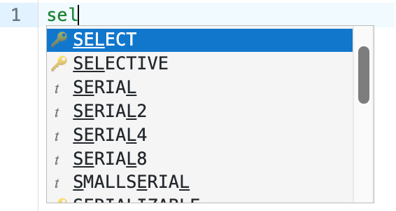
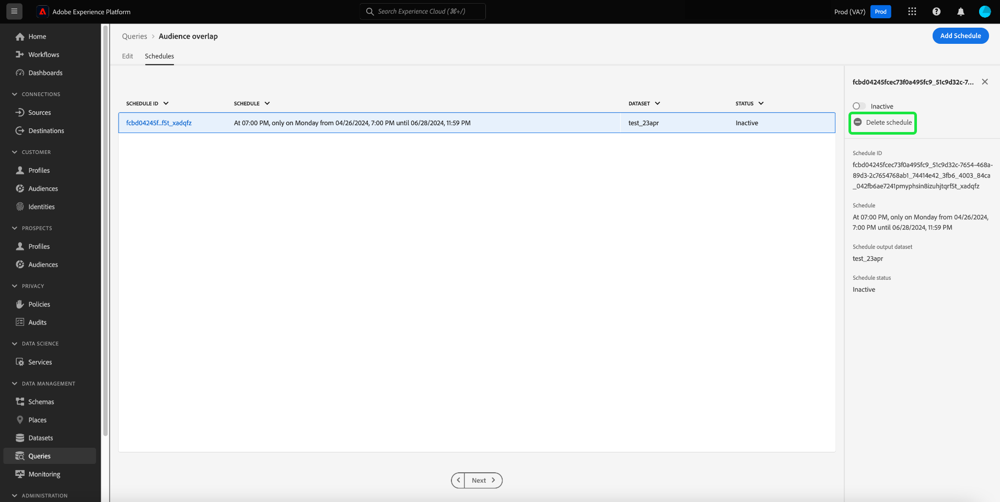

# [!DNL Query Editor] UI 안내서

[!DNL Query Editor] 는  [!DNL Query Service]  [!DNL Experience Platform] 사용자 인터페이스 내에서 고객 경험 데이터에 대한 쿼리를 작성, 유효성 검사 및 실행할 수 있도록 Adobe Experience Platform에서 제공하는 대화형 도구입니다. [!DNL Query Editor] 은 분석 및 데이터 탐색을 위한 쿼리 개발을 지원하며, 개발 목적으로 대화형 쿼리를 실행하고 데이터 세트를 채울 수 있는 비대화형 쿼리를 실행할 수  [!DNL Experience Platform]있습니다.

[!DNL Query Service]의 개념 및 기능에 대한 자세한 내용은 [쿼리 서비스 개요](../home.md)를 참조하십시오. [!DNL Platform]에서 Query Service 사용자 인터페이스를 탐색하는 방법에 대한 자세한 내용은 [Query Service UI 개요](./overview.md)를 참조하십시오.

## 시작하기

[!DNL Query Editor] 에 연결하여 유연한 쿼리 실행 [!DNL Query Service]을 제공하며 이 연결이 활성화된 동안에만 쿼리가 실행됩니다.

### [!DNL Query Service]에 연결

[!DNL Query Editor] 초기화하고 열었을  [!DNL Query Service] 때 연결하는 데 몇 초 걸립니다. 콘솔은 아래와 같이 언제 연결되는지 알려줍니다. 편집기가 연결되기 전에 쿼리를 실행하려고 하면 연결이 완료될 때까지 실행이 지연됩니다.

### [!DNL Query Editor]에서 쿼리를 실행하는 방법

[!DNL Query Editor]에서 실행된 쿼리는 대화식으로 실행됩니다. 즉, 브라우저를 닫거나 다른 곳으로 이동하는 경우 쿼리가 취소됩니다. 쿼리 출력에서 데이터 세트를 생성하기 위한 쿼리에도 적용됩니다.

## [!DNL Query Editor]을 사용하여 쿼리 작성

[!DNL Query Editor]을 사용하여 고객 경험 데이터에 대한 쿼리를 작성, 실행 및 저장할 수 있습니다. [!DNL Query Editor]에서 실행되거나 저장된 모든 쿼리는 [!DNL Query Service]에 액세스할 수 있는 조직의 모든 사용자가 사용할 수 있습니다.

### [!DNL Query Editor]에 액세스 

[!DNL Experience Platform] UI의 왼쪽 탐색 메뉴에서 **[!UICONTROL 쿼리]**&#x200B;를 선택하여 [!DNL Query Service] 작업 공간을 엽니다. 그런 다음 화면 오른쪽 상단에 있는 **[!UICONTROL 쿼리 만들기]**&#x200B;를 선택하여 쿼리 작성을 시작합니다. 이 링크는 [!DNL Query Service] 작업 공간의 페이지에서 사용할 수 있습니다.

### 쿼리 쓰기

[!UICONTROL 쿼리 ] 편집기는 가능한 한 쉽게 쓰기 쿼리를 만들 수 있도록 구성되어 있습니다. 아래 스크린샷에서는 **Play** 단추 및 SQL 항목 필드가 강조 표시된 채 편집기가 UI에 표시되는 방식을 보여줍니다.

개발 시간을 최소화하려면 반환된 행에 제한이 있는 쿼리를 개발하는 것이 좋습니다. 예, `SELECT fields FROM table WHERE conditions LIMIT number_of_rows`. 쿼리에서 예상 출력을 생성하는지 확인한 후 제한을 제거하고 `CREATE TABLE tablename AS SELECT` 을 사용하여 쿼리를 실행하여 출력이 있는 데이터 세트를 생성합니다.

### [!DNL Query Editor]에 도구 쓰기

- **자동 구문 강조 표시:** SQL을 쉽게 읽고 구성할 수 있습니다.

- **SQL 키 단어 자동 완성:** 쿼리 입력을 시작한 다음 화살표 키를 사용하여 원하는 용어로 이동한 다음 Enter  **키를 누릅니다**.

- **표 및 필드 자동 완료:** 원하는 테이블 이름 입력 `SELECT` 을 시작한 다음 화살표 키를 사용하여 찾고 있는 테이블로 이동한 다음  **Enter** 키를 누릅니다. 테이블을 선택하면 자동 완성 기능이 해당 테이블의 필드를 인식합니다.

### 오류 감지

[!DNL Query Editor] 작성할 때 자동으로 쿼리의 유효성을 검사하여 일반 SQL 유효성 검사 및 특정 실행 유효성 검사를 제공합니다. 쿼리 아래에 빨간색 밑줄이 나타나면(아래 이미지에 표시) 쿼리 내의 오류를 나타냅니다.

오류가 감지되면 SQL 코드를 마우스로 가리키면 특정 오류 메시지를 볼 수 있습니다.

### 쿼리 세부 사항

[!DNL Query Editor]에서 쿼리를 보는 동안 **[!UICONTROL 쿼리 세부 정보]** 패널에서는 선택한 쿼리를 관리하는 도구를 제공합니다.

이 패널을 사용하면 UI에서 직접 출력 데이터 세트를 생성하고, 표시된 쿼리를 삭제하거나 이름을 지정하고, 쿼리에 예약을 추가할 수 있습니다.

또한 이 패널에는 마지막으로 쿼리를 수정한 시간과 쿼리를 수정한 사람(해당하는 경우)과 같은 유용한 메타데이터도 표시됩니다. 데이터 집합을 생성하려면 **[!UICONTROL 출력 데이터 집합]**&#x200B;을 선택합니다. **[!UICONTROL 출력 데이터 세트]** 대화 상자가 나타납니다. 이름과 설명을 입력한 다음 **[!UICONTROL 쿼리 실행]**&#x200B;을 선택합니다. 새 데이터 세트가 [!DNL Platform]의 [!DNL Query Service] 사용자 인터페이스의 **[!UICONTROL 데이터 세트]** 탭에 표시됩니다.

### 예약된 쿼리 {#scheduled-queries}

>[!NOTE]
>
> 이미 생성, 저장 및 실행된 쿼리에 예약만 추가할 수 있습니다. 또한 **매개 변수가 있는 쿼리에 일정을 추가할 수 없습니다.**

쿼리에 일정을 추가하려면 **[!UICONTROL 예약 추가]**&#x200B;를 선택합니다.

**[!UICONTROL 예약 세부 정보]** 페이지가 나타납니다. 이 페이지에서 예약된 쿼리의 빈도, 예약된 쿼리가 실행될 날짜 및 쿼리를 내보낼 데이터 세트를 선택할 수 있습니다.

**[!UICONTROL 빈도]**&#x200B;에 대해 다음 옵션을 선택할 수 있습니다.

- **[!UICONTROL 시간별]**: 선택한 날짜 기간에 대해 매시간마다 예약된 쿼리가 실행됩니다.
- **[!UICONTROL 일별]**: 예약된 쿼리는 선택한 시간 및 기간에 X일마다 실행됩니다. 선택한 시간은 로컬 시간대가 아니라 **UTC**&#x200B;에 있습니다.
- **[!UICONTROL 주별]**: 선택한 쿼리는 선택한 요일, 시간 및 기간에 실행됩니다. 선택한 시간은 로컬 시간대가 아니라 **UTC**&#x200B;에 있습니다.
- **[!UICONTROL 월별]**: 선택한 쿼리는 선택한 일, 시간 및 기간에 매달 실행됩니다. 선택한 시간은 로컬 시간대가 아니라 **UTC**&#x200B;에 있습니다.
- **[!UICONTROL 연간]**: 선택한 쿼리는 선택한 일, 월, 시간 및 기간에 매년 실행됩니다. 선택한 시간은 로컬 시간대가 아니라 **UTC**&#x200B;에 있습니다.

데이터 세트에 대해 기존 데이터 세트를 사용하거나 새 데이터 세트를 만들 수 있는 옵션이 있습니다.

>[!IMPORTANT]
>
> 기존 데이터 세트를 사용하거나 새 데이터 세트를 만드는 중이므로 데이터 세트가 이미 설정되어 있으므로 `INSERT INTO` 또는 `CREATE TABLE AS SELECT`을 쿼리의 일부로 포함할 필요가 없습니다&#x200B;**.** 예약된 쿼리의 일부로 `INSERT INTO` 또는 `CREATE TABLE AS SELECT`을 포함하면 오류가 발생합니다.

이러한 세부 사항을 모두 확인한 후 **[!UICONTROL 저장]**&#x200B;을 선택하여 일정을 만듭니다.

쿼리 세부 정보 페이지가 다시 나타나고 예약 ID, 예약 자체 및 예약의 출력 데이터 세트를 포함하여 새로 만든 예약의 세부 정보가 표시됩니다. 예약 ID를 사용하여 예약된 쿼리 자체의 실행에 대한 자세한 정보를 조회할 수 있습니다. 자세한 내용은 [예약된 쿼리 실행 끝점 안내서](../api/runs-scheduled-queries.md)를 참조하십시오.

>[!NOTE]
>
> UI를 사용하여 **하나의** 쿼리 템플릿만 예약할 수 있습니다. 쿼리 템플릿에 예약을 더 추가하려면 API를 사용해야 합니다. API를 사용하여 이미 일정을 추가한 경우 UI를 사용하여 **더 이상 예약을 추가하지 않아도 됩니다.** 여러 개의 일정이 이미 쿼리 템플릿에 첨부된 경우 가장 오래된 일정만 표시됩니다. API를 사용하여 일정을 추가하는 방법에 대해 알아보려면 [예약된 쿼리 엔드포인트 가이드](../api/scheduled-queries.md)를 참조하십시오.
>
> 또한 보고 있는 예약에 대한 최신 상태가 있는지 확인하려면 페이지를 새로 고쳐야 합니다.

#### 일정 삭제

**[!UICONTROL 일정 삭제]**&#x200B;를 선택하여 일정을 삭제할 수 있습니다.

>[!IMPORTANT]
>
> 쿼리의 예약을 삭제하려면 먼저 스케줄을 비활성화해야 합니다.

### 쿼리 저장

[!DNL Query Editor] 은 쿼리를 저장하고 나중에 작업할 수 있는 저장 함수를 제공합니다. 쿼리를 저장하려면 [!DNL Query Editor]의 오른쪽 상단 모서리에서 **[!UICONTROL 저장]**&#x200B;을 선택합니다. 쿼리를 저장하려면 먼저 **[!UICONTROL 쿼리 세부 정보]** 패널을 사용하여 쿼리에 사용할 이름을 제공해야 합니다.

### 이전 쿼리를 찾는 방법

[!DNL Query Editor]에서 실행된 모든 쿼리는 로그 테이블에 캡처됩니다. **[!UICONTROL 로그]** 탭의 검색 기능을 사용하여 쿼리 실행을 찾을 수 있습니다. 저장된 쿼리는 **[!UICONTROL 찾아보기]** 탭에 나열됩니다.

자세한 내용은 [Query Service UI 개요](./overview.md)를 참조하십시오.

>[!NOTE]
>
>실행되지 않는 쿼리는 로그에 저장되지 않습니다. [!DNL Query Service]에서 쿼리를 사용할 수 있으려면 [!DNL Query Editor]에서 실행하거나 저장해야 합니다.

## 쿼리 편집기를 사용하여 쿼리 실행

[!DNL Query Editor]에서 쿼리를 실행하려면 편집기에 SQL을 입력하거나 **[!UICONTROL Log]** 또는 **[!UICONTROL Browse]** 탭에서 이전 쿼리를 로드하고 **Play**&#x200B;를 선택할 수 있습니다. 쿼리 실행 상태는 아래의 **[!UICONTROL 콘솔]** 탭에 표시되고 출력 데이터가 **[!UICONTROL 결과]** 탭에 표시됩니다.

### 콘솔

콘솔은 [!DNL Query Service] 의 상태 및 작업에 대한 정보를 제공합니다. 콘솔에는 [!DNL Query Service]에 대한 연결 상태, 실행 중인 쿼리 작업 및 이러한 쿼리에서 발생하는 오류 메시지가 표시됩니다.

>[!NOTE]
>
>콘솔에는 쿼리 실행으로 인한 오류만 표시됩니다. 쿼리를 실행하기 전에 쿼리 유효성 검사 오류가 표시되지 않습니다.

### 쿼리 결과

쿼리가 완료되면 결과가 **[!UICONTROL Console]** 탭 옆에 있는 **[!UICONTROL 결과]** 탭에 표시됩니다. 이 보기는 쿼리의 테이블 형식 출력을 보여주며 최대 100개의 행을 표시합니다. 이 보기에서는 쿼리가 예상 출력을 생성하는지 확인할 수 있습니다. 쿼리를 사용하여 데이터 집합을 생성하려면 반환된 행의 제한을 제거하고 `CREATE TABLE tablename AS SELECT`을 사용하여 쿼리를 실행하여 출력이 있는 데이터 집합을 생성합니다. [!DNL Query Editor]의 쿼리 결과에서 데이터 세트를 생성하는 방법에 대한 지침은 [데이터 세트 생성 자습서](./create-datasets.md)를 참조하십시오.

## [!DNL Query Service] 튜토리얼 비디오를 사용하여 쿼리 실행

다음 비디오에서는 Adobe Experience Platform 인터페이스와 PSQL 클라이언트에서 쿼리를 실행하는 방법을 보여 줍니다. 또한 XDM 개체에서 개별 속성을 사용하고 Adobe 정의 함수를 사용하고 CREATE TABLE AS SELECT(CTAS)를 사용하는 것이 나와 있습니다.

>[!VIDEO](https://video.tv.adobe.com/v/29796?quality=12&learn=on)

## 다음 단계

[!DNL Query Editor]에서 사용할 수 있는 기능과 응용 프로그램을 탐색하는 방법을 알고 있으므로 [!DNL Platform]에서 직접 고유한 쿼리 작성을 시작할 수 있습니다. [!DNL Data Lake]의 데이터 세트에 대한 SQL 쿼리 실행에 대한 자세한 내용은 [쿼리 실행](../best-practices/writing-queries.md)에 대한 안내서를 참조하십시오.
