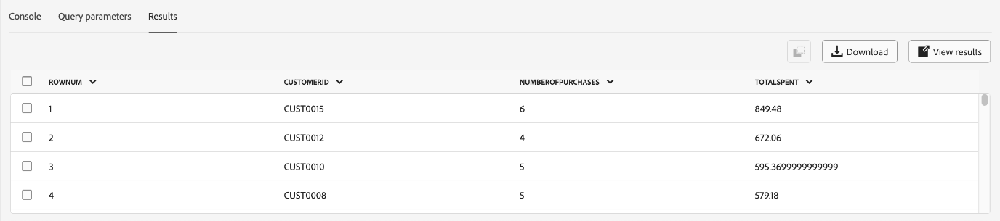

# 쿼리 편집기 UI 안내서

>[!NOTE]
>
>기존 편집기는 2024년 5월 24일에 사용이 중단되었습니다. 더 이상 사용할 수 없습니다. 이제 [향상된 쿼리 편집기](#enhanced-editor-toggle)를 사용하여 쿼리를 작성, 유효성 검사 및 실행할 수 있습니다

쿼리 편집기는 Adobe Experience Platform 쿼리 서비스에서 제공하는 대화형 도구로서, [!DNL Experience Platform] 사용자 인터페이스 내에서 고객 경험 데이터에 대한 쿼리를 작성, 유효성 검사 및 실행할 수 있습니다. 쿼리 편집기는 분석 및 데이터 탐색을 위한 쿼리 개발을 지원하며, 이를 통해 개발 목적으로 대화형 쿼리를 실행하고 비대화형 쿼리를 실행하여 [!DNL Experience Platform]의 데이터 세트를 채울 수 있습니다.

Query Service의 개념과 기능에 대한 자세한 내용은 [Query Service 개요](../home.md)를 참조하십시오. [!DNL Platform]에서 쿼리 서비스 사용자 인터페이스를 탐색하는 방법에 대한 자세한 내용은 [쿼리 서비스 UI 개요](./overview.md)를 참조하십시오.

## 시작하기 {#getting-started}

쿼리 편집기는 쿼리 서비스에 연결하여 유연한 쿼리 실행을 제공하며 쿼리는 이 연결이 활성화된 동안에만 실행됩니다.

## 쿼리 편집기 액세스 {#accessing-query-editor}

[!DNL Experience Platform] UI의 왼쪽 탐색 메뉴에서 **[!UICONTROL 쿼리]**&#x200B;를 선택하여 쿼리 서비스 작업 영역을 엽니다. 그런 다음 쿼리 작성을 시작하려면 화면 오른쪽 상단에서 **[!UICONTROL 쿼리 만들기]**&#x200B;를 선택합니다. 이 링크는 쿼리 서비스 작업 영역의 모든 페이지에서 사용할 수 있습니다.

### 쿼리 서비스에 연결 중 {#connecting-to-query-service}

쿼리 편집기를 열 때 초기화하고 쿼리 서비스에 연결하는 데 몇 초 정도 걸립니다. 콘솔은 아래와 같이 연결되면 알려 줍니다. 편집기가 연결되기 전에 쿼리를 실행하려고 하면 연결이 완료될 때까지 실행이 지연됩니다.

### 쿼리 편집기에서 쿼리를 실행하는 방법 {#run-a-query}

쿼리 편집기에서 실행된 쿼리는 대화식으로 실행되므로 브라우저를 닫거나 다른 곳으로 이동하면 쿼리가 취소됩니다. 쿼리 출력에서 데이터 세트를 생성하기 위해 만들어진 쿼리의 경우에도 마찬가지입니다.

## 향상된 쿼리 편집기를 사용한 쿼리 작성 {#query-authoring}

>[!NOTE]
>
>기존 편집기는 2024년 5월 24일에 사용이 중단되었습니다. 더 이상 사용할 수 없습니다. 이제 향상된 쿼리 편집기를 사용하여 쿼리를 작성, 유효성 검사 및 실행할 수 있습니다.

쿼리 편집기를 사용하여 고객 경험 데이터에 대한 쿼리를 작성, 실행 및 저장할 수 있습니다. 쿼리 편집기에서 실행되거나 저장된 모든 쿼리는 쿼리 서비스에 대한 액세스 권한이 있는 조직의 모든 사용자가 사용할 수 있습니다.

### 설정 {#settings}

쿼리 편집기 입력 필드 위의 설정 아이콘에는 어두운 테마를 활성화/비활성화하거나 자동 완성을 비활성화/활성화하는 옵션이 포함됩니다.

>[!TIP]
>
>진행률을 잃지 않고 쿼리를 작성하는 동안 [!UICONTROL 구문 자동 완성을 사용하지 않도록 설정]할 수 있습니다.

어두운 테마나 밝은 테마를 활성화하려면 설정 아이콘() 다음에 드롭다운 메뉴의 옵션이 나타납니다.

#### 자동 완성 {#auto-complete}

쿼리를 작성할 때 쿼리 편집기에서 테이블 또는 열 세부 정보와 함께 잠재적 SQL 키워드를 자동으로 제안합니다. 자동 완성 기능은 기본적으로 활성화되어 있으며, 쿼리 편집기 설정의 어느 지점에서든 비활성화하거나 활성화할 수 있습니다.

자동 완성 구성 설정은 사용자별로 지정되며 해당 사용자에 대한 연속 로그인 동안 기억됩니다. 이 기능을 비활성화하면 여러 메타데이터 명령이 처리되지 않고 일반적으로 쿼리를 편집할 때 작성자의 속도에 도움이 되는 권장 사항을 제공할 수 있습니다.

<!-- Currently editing the auto complete setting info. -->

### 여러 순차적 쿼리 실행 {#execute-multiple-sequential-queries}

향상된 쿼리 편집기를 사용하여 두 개 이상의 쿼리를 작성하고 모든 쿼리를 순차적 방식으로 실행합니다. 시퀀스에서 여러 쿼리를 실행하면 각각 로그 항목이 생성됩니다. 그러나 첫 번째 쿼리의 결과만 쿼리 편집기 콘솔에 표시됩니다. 실행된 쿼리의 문제를 해결하거나 확인해야 하는 경우 쿼리 로그를 확인합니다. 자세한 내용은 [쿼리 로그 설명서](./query-logs.md)를 참조하세요.

>[!NOTE]
> 
>CTAS 쿼리가 쿼리 편집기에서 첫 번째 쿼리 이후에 실행되는 경우에도 쿼리 편집기 콘솔에 출력이 없어도 테이블이 만들어집니다.

### 선택한 쿼리 실행 {#execute-selected-query}

여러 개의 쿼리를 작성했지만 하나의 쿼리만 실행해야 하는 경우 선택한 쿼리를 강조 표시하고
[!UICONTROL 선택한 쿼리 실행] 아이콘. 편집기 내에서 쿼리 구문을 선택할 때까지 이 아이콘이 기본적으로 비활성화됩니다.

![선택한 쿼리 실행] 아이콘이 강조 표시된 쿼리 편집기.](../images/ui/query-editor/run-selected-query.png)[!UICONTROL 

### 쿼리 편집기 세션 취소 {#cancel-query}

쿼리 실행을 제어하고 오래 실행되는 쿼리를 취소하여 생산성을 향상시킵니다. 이 작업을 수행하면 쿼리 실행 중에 쿼리 편집기가 지워집니다. 쿼리는 백그라운드에서 계속 실행됩니다. CTAS 쿼리인 경우에도 출력 데이터 세트가 생성됩니다. 편집기에서 실행을 취소하고 SQL 문을 계속 작성하려면 쿼리를 실행한 후 **[!UICONTROL 쿼리 취소]**&#x200B;를 선택하십시오.

![쿼리 편집기([!UICONTROL 쿼리 취소])가 강조 표시되었습니다.](../images/ui/query-editor/cancel-query-run.png)

확인 대화 상자가 나타납니다. 쿼리 실행을 취소하려면 **[!UICONTROL 확인]**&#x200B;을 선택하십시오.

### 결과 개수 {#result-count}

쿼리 편집기에는 최대 50,000개의 행 출력이 있습니다. 쿼리 편집기 콘솔에서 한 번에 표시되는 행 수를 선택할 수 있습니다. 콘솔에 표시되는 행 수를 변경하려면 **[!UICONTROL 결과 개수]** 드롭다운을 선택하고 50개, 100개, 150개, 300개 및 500개 옵션 중에서 선택합니다.

## 쿼리 작성 {#writing-queries}

[!UICONTROL 쿼리 편집기]를 구성하여 쿼리를 가능한 한 쉽게 작성할 수 있습니다. 아래 스크린샷은 SQL 항목 필드와 **재생**&#x200B;이 강조 표시된 상태에서 편집기가 UI에 표시되는 방식을 보여 줍니다.

개발 시간을 최소화하려면 반환되는 행 수를 제한하여 쿼리를 개발하는 것이 좋습니다. 예, `SELECT fields FROM table WHERE conditions LIMIT number_of_rows`. 쿼리에서 예상 출력이 생성되는지 확인한 후 제한을 제거하고 `CREATE TABLE tablename AS SELECT`(으)로 쿼리를 실행하여 출력이 포함된 데이터 집합을 생성합니다.

## 쿼리 편집기의 쓰기 도구 {#writing-tools}

- **자동 구문 강조 표시:** SQL을 더 쉽게 읽고 구성할 수 있습니다.

- **SQL 키워드 자동 완성:** 쿼리를 입력한 다음 화살표 키를 사용하여 원하는 용어로 이동한 다음 **Enter**&#x200B;를 누르십시오.

- **테이블 및 필드 자동 완성:** `SELECT`을(를) 시작할 테이블 이름을 입력한 다음 화살표 키를 사용하여 원하는 테이블로 이동한 다음 **Enter**&#x200B;를 누릅니다. 테이블을 선택하면 자동 완성 기능이 해당 테이블의 필드를 인식합니다.

### 텍스트 서식 지정 {#format-text}

[!UICONTROL 텍스트 서식] 기능을 사용하면 표준화된 구문 스타일을 추가하여 쿼리를 보다 쉽게 읽을 수 있습니다. 쿼리 편집기 내의 모든 텍스트를 표준화하려면 **[!UICONTROL 텍스트 서식]**&#x200B;을 선택하십시오.

>[!NOTE]
>
>[!UICONTROL 텍스트 서식] 기능이 익명 블록에서 작동하지 않습니다. 하나 이상의 SQL 문을 순차적으로 연결하는 방법은 [익명 블록 설명서](../key-concepts/anonymous-block.md)를 참조하세요.

![쿼리 편집기([!UICONTROL Format text] 및 강조 표시된 SQL 문).](../images/ui/query-editor/format-text.png)

<!-- ### Undo text {#undo-text}

If you format your SQL in the Query Editor, you can undo the formatting applied by the [!UICONTROL Format text] feature. To return your SQL back to its original form, select **[!UICONTROL Undo text]**.

![The Query Editor with [!UICONTROL Undo text] and the SQL statements highlighted.](../images/ui/query-editor/undo-text.png) -->

### SQL 복사 {#copy-sql}

복사 아이콘을 선택하여 쿼리 편집기에서 클립보드로 SQL을 복사합니다. 이 복사 기능은 쿼리 템플릿과 쿼리 편집기에서 새로 만든 쿼리 모두에 사용할 수 있습니다.

### 쿼리 세부 정보 {#query-details}

쿼리 편집기에서 쿼리를 보려면 [!UICONTROL 템플릿] 탭에서 저장된 템플릿을 선택합니다. 쿼리 세부 정보 패널에서는 선택한 쿼리를 관리하기 위한 자세한 정보와 도구를 제공합니다. 또한 쿼리가 마지막으로 수정된 시간과 해당되는 경우 이를 수정한 사람과 같은 유용한 메타데이터도 표시합니다.

>[!NOTE]
>
>[!UICONTROL 일정 보기], [!UICONTROL 일정 추가] 및 [!UICONTROL 쿼리 삭제] 옵션은 쿼리를 템플릿으로 저장한 후에만 사용할 수 있습니다. [!UICONTROL 일정 추가] 옵션을 사용하면 쿼리 편집기에서 일정 빌더로 바로 이동합니다. [!UICONTROL 일정 보기] 옵션을 사용하면 해당 쿼리에 대한 일정 인벤토리로 바로 이동할 수 있습니다. [UI에서 쿼리 일정을 만드는 방법](./query-schedules.md#create-schedule)을 알아보려면 쿼리 일정 설명서를 참조하세요.

세부 정보 패널에서 UI에서 직접 출력 데이터 세트를 생성하고, 표시된 쿼리를 삭제하거나 이름을 지정하고, 쿼리 실행 일정을 보고, 쿼리를 일정에 추가할 수 있습니다.

출력 데이터 집합을 생성하려면 **[!UICONTROL CTAS로 실행]**&#x200B;을 선택하십시오. **[!UICONTROL 출력 데이터 세트 세부 정보 입력]** 대화 상자가 나타납니다. 이름과 설명을 입력한 다음 **[!UICONTROL CTAS로 실행]**&#x200B;을 선택합니다. 새 데이터 세트가 **[!UICONTROL 데이터 세트]** 검색 탭에 표시됩니다. 조직에서 사용 가능한 데이터 세트에 대한 자세한 내용은 [데이터 세트 보기 설명서](../../catalog/datasets/user-guide.md#view-datasets)를 참조하십시오.

>[!NOTE]
>
>[!UICONTROL CTAS로 실행] 옵션은 쿼리에 **not**&#x200B;이(가) 예약된 경우에만 사용할 수 있습니다.

![[!UICONTROL 출력 데이터 세트 정보 입력] 대화 상자](../images/ui/query-editor/output-dataset-details.png)

**[!UICONTROL CTAS로 실행]** 작업을 실행한 후 확인 메시지가 나타나 작업을 성공적으로 완료했음을 알려줍니다. 이 팝업 메시지에는 쿼리 로그 작업 영역으로 이동하는 편리한 방법을 제공하는 링크가 포함되어 있습니다. 쿼리 로그에 대한 자세한 내용은 [쿼리 로그 설명서](./query-logs.md)를 참조하세요.

### 쿼리 저장 중 {#saving-queries}

쿼리 편집기는 쿼리를 저장하고 나중에 작업할 수 있는 저장 기능을 제공합니다. 쿼리를 저장하려면 쿼리 편집기의 오른쪽 상단 모서리에서 **[!UICONTROL 저장]**&#x200B;을 선택합니다. 쿼리를 저장하려면 **[!UICONTROL 쿼리 세부 정보]** 패널을 사용하여 쿼리에 대한 이름을 지정해야 합니다.

>[!NOTE]
>
>쿼리 편집기를 사용하여에 이름이 지정되고 저장된 쿼리는 쿼리 대시보드 [!UICONTROL 템플릿] 탭에서 템플릿으로 사용할 수 있습니다. 자세한 내용은 [템플릿 설명서](./query-templates.md)를 참조하세요.

쿼리 편집기에 쿼리를 저장하면 성공 작업을 알리는 확인 메시지가 표시됩니다. 이 팝업 메시지에는 쿼리 예약 작업 공간으로 편리하게 이동할 수 있는 방법을 제공하는 링크가 포함되어 있습니다. 사용자 지정 케이던스에서 쿼리를 실행하는 방법은 [쿼리 예약 설명서](./query-schedules.md)를 참조하세요.

### 예약된 쿼리 {#scheduled-queries}

템플릿으로 저장된 쿼리는 쿼리 편집기에서 예약할 수 있습니다. 쿼리 예약을 사용하면 사용자 지정 케이던스에서 쿼리 실행을 자동화할 수 있습니다. 빈도, 날짜 및 시간에 따라 쿼리를 예약할 수 있으며 필요한 경우 결과에 대한 출력 데이터 세트를 선택할 수도 있습니다. UI를 통해 쿼리 일정을 비활성화하거나 삭제할 수도 있습니다.

예약은 쿼리 편집기에서 설정됩니다. 쿼리 편집기를 사용하는 경우 이미 생성 및 저장된 쿼리에만 일정을 추가할 수 있습니다. 쿼리 서비스 API에는 동일한 제한이 적용되지 않습니다.

>[!NOTE]
>
>연속 10회 실행에 실패한 예약된 쿼리는 자동으로 [!UICONTROL 격리됨] 상태에 놓입니다. 이 상태의 쿼리는 더 이상 실행되기 전에 사용자의 개입이 필요합니다. 자세한 내용은 [격리된 쿼리](./monitor-queries.md#quarantined-queries) 설명서를 참조하십시오.

[UI에서 쿼리 일정을 만드는 방법](./query-schedules.md)을 알아보려면 쿼리 일정 설명서를 참조하세요. 또는 API를 사용하여 일정을 추가하는 방법에 대해 알아보려면 [예약된 쿼리 끝점 안내서](../api/scheduled-queries.md)를 읽어 보십시오.

예약된 쿼리가 [!UICONTROL 예약된 쿼리] 탭의 목록에 추가됩니다. 해당 작업 영역에서 UI를 통해 예약된 모든 쿼리 작업의 상태를 모니터링할 수 있습니다. [!UICONTROL 예약된 쿼리] 탭에서 쿼리 실행에 대한 중요한 정보를 찾아 경고를 구독할 수 있습니다. 사용 가능한 정보에는 실행이 실패한 경우 상태, 일정 세부 정보 및 오류 메시지/코드가 포함됩니다. 자세한 내용은 [예약된 쿼리 모니터링 문서](./monitor-queries.md)를 참조하십시오.

### 이전 쿼리를 찾는 방법 {#previous-queries}

쿼리 편집기에서 실행되는 모든 쿼리는 로그 테이블에 캡처됩니다. **[!UICONTROL 로그]** 탭의 검색 기능을 사용하여 쿼리 실행을 찾을 수 있습니다. 저장된 쿼리는 **[!UICONTROL 템플릿]** 탭에 나열됩니다.

쿼리가 예약된 경우 [!UICONTROL 예약된 쿼리] 탭에서 UI를 통해 해당 쿼리 작업의 가시성을 향상시킬 수 있습니다. 자세한 내용은 [쿼리 모니터링 설명서](./monitor-queries.md)를 참조하세요.

>[!NOTE]
>
>실행되지 않는 쿼리는 로그에 저장되지 않습니다. 쿼리 서비스에서 쿼리를 사용할 수 있으려면 쿼리를 실행하거나 쿼리 편집기에 저장해야 합니다.

## 쿼리 편집기를 사용하여 쿼리 실행 {#executing-queries}

쿼리 편집기에서 쿼리를 실행하려면 편집기에 SQL을 입력하거나 **[!UICONTROL 로그]** 또는 **[!UICONTROL 템플릿]** 탭에서 이전 쿼리를 로드한 다음 **재생**&#x200B;을 선택하세요. 쿼리 실행 상태가 아래 **[!UICONTROL 콘솔]** 탭에 표시되고 출력 데이터가 **[!UICONTROL 결과]** 탭에 표시됩니다.

### 콘솔 {#console}

콘솔에서는 쿼리 서비스의 상태 및 작업에 대한 정보를 제공합니다. 콘솔에는 쿼리 서비스에 대한 연결 상태, 실행 중인 쿼리 작업 및 이러한 쿼리로 인해 발생하는 모든 오류 메시지가 표시됩니다.

>[!NOTE]
>
>콘솔에는 쿼리 실행으로 인해 발생한 오류만 표시됩니다. 쿼리가 실행되기 전에 발생하는 쿼리 유효성 검사 오류는 표시되지 않습니다.

### 쿼리 결과 {#query-results}

쿼리가 완료되면 결과가 **[!UICONTROL 콘솔]** 탭 옆의 **[!UICONTROL 결과]** 탭에 표시됩니다. 이 보기는 쿼리의 테이블 형식 출력을 보여주며 선택한 [결과 개수](#result-count)에 따라 50~500개의 결과 행을 표시합니다. 이 보기를 통해 쿼리가 예상 출력을 생성하는지 확인할 수 있습니다. 쿼리를 사용하여 데이터 집합을 생성하려면 반환된 행에 대한 제한을 제거하고 `CREATE TABLE tablename AS SELECT`(으)로 쿼리를 실행하여 출력이 포함된 데이터 집합을 생성합니다. 쿼리 편집기의 쿼리 결과에서 데이터 집합을 생성하는 방법에 대한 지침은 [데이터 집합 생성 자습서](./create-datasets.md)를 참조하십시오.

## 사용 사례 {#use-cases}

쿼리 서비스는 업계 및 비즈니스 시나리오 전반에 걸쳐 다양한 사용 사례에 대한 솔루션을 제공합니다. 이러한 실제 사례는 다양한 요구 사항을 해결하는 데 있어 서비스의 유연성과 효과를 보여 줍니다. [Query Service가 특정 비즈니스 요구 사항에 가치를 부여하는 방법을 확인하려면](../use-cases/overview.md) 사용 사례 문서의 포괄적인 컬렉션을 살펴보십시오. 쿼리 서비스를 사용하여 향상된 운영 효율성 및 비즈니스 성공을 위한 통찰력과 솔루션을 제공하는 방법에 대해 알아봅니다.

<!-- This video is from 2019. The logic is sounds but the workflow is too outdated. -->

## 쿼리 서비스로 쿼리 실행 튜토리얼 비디오 {#query-tutorial-video}

다음 비디오는 Adobe Experience Platform 인터페이스 및 PSQL 클라이언트에서 쿼리를 실행하는 방법을 보여 줍니다. 또한 이 비디오에서는 XDM 개체에서 개별 속성을 사용하는 방법, Adobe 정의 함수 및 CREATE TABLE AS SELECT(CTAS) 쿼리를 사용하는 방법에 대해 설명합니다.

>[!NOTE]
>
>비디오에 표시된 UI는 오래되었지만 워크플로우에 사용된 로직은 그대로 유지됩니다.

>[!VIDEO](https://video.tv.adobe.com/v/29796?quality=12&learn=on)

## 다음 단계

이제 쿼리 편집기에서 사용할 수 있는 기능과 응용 프로그램을 탐색하는 방법을 알았으므로 [!DNL Platform]에서 직접 쿼리 작성을 시작할 수 있습니다. [!DNL Data Lake]의 데이터 세트에 대해 SQL 쿼리를 실행하는 방법에 대한 자세한 내용은 [쿼리 실행](../best-practices/writing-queries.md)에 대한 안내서를 참조하십시오.
