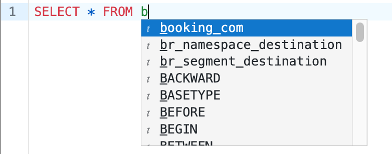

# [!DNL Query Editor] UI 안내서

[!DNL Query Editor] 은 Adobe Experience Platform에서 제공하는 대화형 도구입니다 [!DNL Query Service]: 내에서 고객 경험 데이터에 대한 쿼리를 작성, 유효성 검사 및 실행할 수 있습니다 [!DNL Experience Platform] 사용자 인터페이스. [!DNL Query Editor] 은 분석 및 데이터 탐색을 위한 쿼리 개발을 지원하며, 개발 목적으로 대화형 쿼리를 실행할 수 있을 뿐만 아니라 의 데이터 세트를 채울 비대화형 쿼리를 사용할 수 있습니다. [!DNL Experience Platform].

의 개념 및 기능에 대한 자세한 내용 [!DNL Query Service]를 참조하고 [쿼리 서비스 개요](../home.md). Query Service 사용자 인터페이스를 탐색하는 방법에 대해 자세히 알아보려면 [!DNL Platform]를 참조하고 [Query Service UI 개요](./overview.md).

## 시작하기 {#getting-started}

[!DNL Query Editor] 에서는 을 연결하여 유연한 쿼리 실행 기능을 제공합니다 [!DNL Query Service], 및 쿼리는 이 연결이 활성화된 동안에만 실행됩니다.

### 연결 대상 [!DNL Query Service] {#connecting-to-query-service}

[!DNL Query Editor] 를 초기화하고 연결하는 데 몇 초 걸립니다. [!DNL Query Service] 열려 있을 때 콘솔은 아래와 같이 언제 연결되는지 알려줍니다. 편집기가 연결되기 전에 쿼리를 실행하려고 하면 연결이 완료될 때까지 실행이 지연됩니다.

### 쿼리 실행 방법 [!DNL Query Editor] {#run-a-query}

다음에서 실행된 쿼리 [!DNL Query Editor] 대화식으로 실행. 즉, 브라우저를 닫거나 다른 곳으로 이동하는 경우 쿼리가 취소됩니다. 쿼리 출력에서 데이터 세트를 생성하기 위한 쿼리에도 적용됩니다.

## 을 사용하여 쿼리 작성 [!DNL Query Editor] {#query-authoring}

사용 [!DNL Query Editor], 고객 경험 데이터에 대한 쿼리를 작성, 실행 및 저장할 수 있습니다. 실행 또는 저장된 모든 쿼리 [!DNL Query Editor] 조직의 모든 사용자가 [!DNL Query Service].

### [!DNL Query Editor]에 액세스 {#accessing-query-editor}

에서 [!DNL Experience Platform] UI, 선택 **[!UICONTROL 쿼리]** 왼쪽 탐색 메뉴에서 를 클릭하여 [!DNL Query Service] 작업 공간. 다음 을 선택합니다. **[!UICONTROL 쿼리 만들기]** 화면 오른쪽 상단에서 쿼리 작성을 시작합니다. 이 링크는 [!DNL Query Service] 작업 공간.

### 쿼리 쓰기 {#writing-queries}

[!UICONTROL 쿼리 편집기] 는 가능한 한 쉽게 쓰기 쿼리를 만들도록 구성됩니다. 아래 스크린샷에서는 SQL 항목 필드와 함께 UI에 편집기가 표시되는 방법을 보여줍니다. **재생** 강조 표시되어 있습니다.

개발 시간을 최소화하려면 반환된 행에 제한이 있는 쿼리를 개발하는 것이 좋습니다. 예, `SELECT fields FROM table WHERE conditions LIMIT number_of_rows`. 쿼리에서 예상 출력을 생성하는지 확인한 후 제한을 제거하고 쿼리를 `CREATE TABLE tablename AS SELECT` 를 입력하여 해당 출력으로 데이터 세트를 생성합니다.

### 쓰기 도구 [!DNL Query Editor] {#writing-tools}

- **자동 구문 강조 표시:** SQL을 보다 쉽게 읽고 구성할 수 있습니다.

- **SQL 키워드 자동 완료:** 쿼리 입력을 시작한 다음 화살표 키를 사용하여 원하는 용어로 이동한 다음 키를 누릅니다 **Enter 키**.

- **테이블 및 필드 자동 완료:** 원하는 테이블 이름 입력 시작 `SELECT` 에서 화살표 키를 사용하여 원하는 테이블로 이동한 다음 키를 누릅니다 **Enter 키**. 테이블을 선택하면 자동 완성 기능이 해당 테이블의 필드를 인식합니다.

### 자동 완료 UI 구성 전환 {#auto-complete}

다음 [!DNL Query Editor] 은(는) 생성할 때 쿼리에 대한 테이블 또는 열 세부 정보와 함께 잠재적 SQL 키워드를 자동으로 제안합니다. 자동 완성 기능은 기본적으로 활성화되어 있으며, [!UICONTROL 구문 자동 완성] 쿼리 편집기의 오른쪽 상단으로 전환합니다.

자동 완료 구성 설정은 사용자별로 설정되며 해당 사용자에 대한 연속 로그인을 위해 기억됩니다.

이 기능을 비활성화하면 여러 메타데이터 명령이 처리되지 않고 쿼리를 편집할 때 일반적으로 작성자의 속도에 도움이 되는 권장 사항을 제공할 수 없습니다.

토글을 사용하여 자동 완료 기능을 활성화하면 짧은 일시 중지 후에 테이블 및 열 이름과 SQL 키워드를 위한 권장 제안을 사용할 수 있습니다. 쿼리 편집기 아래의 콘솔에 있는 성공 메시지는 기능이 활성화되어 있음을 나타냅니다.

자동 완료 기능을 비활성화하는 경우 기능을 적용하려면 페이지를 새로 고쳐야 합니다. 을 비활성화하면 세 가지 옵션이 있는 확인 대화 상자가 나타납니다 [!UICONTROL 구문 자동 완성] 전환 :

- [!UICONTROL 취소]
- [!UICONTROL 변경 내용 저장 및 새로 고침]
- [!UICONTROL 변경 내용을 저장하지 않고 새로 고침]

>[!IMPORTANT]
>
>이 기능을 비활성화할 때 쿼리를 작성하거나 편집하는 경우 페이지를 새로 고치기 전에 쿼리에 변경 내용을 저장해야 합니다. 그렇지 않으면 모든 진행 상태가 손실됩니다.

자동 완료 기능을 비활성화하려면 적절한 옵션을 선택합니다.

### 오류 감지 {#error-detection}

[!DNL Query Editor] 작성할 때 자동으로 쿼리의 유효성을 검사하여 일반 SQL 유효성 검사 및 특정 실행 유효성 검사를 제공합니다. 쿼리 아래에 빨간색 밑줄이 나타나면(아래 이미지에 표시) 쿼리 내의 오류를 나타냅니다.

오류가 감지되면 SQL 코드를 마우스로 가리키면 특정 오류 메시지를 볼 수 있습니다.

### 쿼리 세부 사항 {#query-details}

에서 저장한 템플릿을 선택합니다 [!UICONTROL 템플릿] 탭을 클릭하여 쿼리 편집기에서 봅니다. 쿼리 세부 정보 패널에서는 선택한 쿼리를 관리하는 추가 정보 및 도구를 제공합니다.

이 패널을 사용하면 UI에서 직접 출력 데이터 세트를 생성하고, 표시된 쿼리를 삭제하거나 이름을 지정하고, 쿼리에 예약을 추가할 수 있습니다.

또한 이 패널에는 마지막으로 쿼리를 수정한 시간과 쿼리를 수정한 사람(해당하는 경우)과 같은 유용한 메타데이터도 표시됩니다. 데이터 세트를 생성하려면 다음을 선택합니다 **[!UICONTROL 출력 데이터 세트]**. 다음 **[!UICONTROL 출력 데이터 세트]** 대화 상자가 나타납니다. 이름과 설명을 입력한 다음 **[!UICONTROL 쿼리 실행]**. 새 데이터 세트는 **[!UICONTROL 데이터 세트]** 탭에서 다음을 수행합니다. [!DNL Query Service] 사용자 인터페이스 [!DNL Platform].

### 예약된 쿼리 {#scheduled-queries}

>[!IMPORTANT]
>
>다음은 쿼리 편집기를 사용할 때 예약된 쿼리에 대한 제한 사항 목록입니다. 에는 적용되지 않습니다 [!DNL Query Service] API: 이미 생성, 저장 및 실행된 쿼리에 예약만 추가할 수 있습니다. 사용자 **사용할 수 없음** 매개 변수가 있는 쿼리에 일정을 추가합니다. 예약된 쿼리 **사용할 수 없음** 익명 블록을 포함합니다.

예약은 쿼리 편집기에서 설정됩니다. 그러나 이미 템플릿으로 저장된 질의만 예약할 수 있습니다. 쿼리에 일정을 추가하려면 다음 중 하나에서 쿼리 템플릿을 선택합니다 [!UICONTROL 템플릿] 탭 또는 [!UICONTROL 예약된 쿼리] 탭으로 이동하여 쿼리 편집기로 이동합니다.

API를 사용하여 일정을 추가하는 방법에 대해 알아보려면 [예약된 쿼리 엔드포인트 가이드](../api/scheduled-queries.md).

쿼리 편집기에서 저장한 쿼리에 액세스하면 [!UICONTROL 예약] 탭이 쿼리 이름 아래에 나타납니다. 선택 **[!UICONTROL 예약]**.

예약 작업 공간이 나타납니다. 선택 **[!UICONTROL 예약 추가]** 일정을 만들려면

![[추가] 일정이 강조 표시된 쿼리 편집기 예약 작업 영역.](../images/ui/query-editor/add-schedule.png)

스케줄 세부 사항 페이지가 나타납니다. 이 페이지에서는 예약된 쿼리의 빈도, 시작 및 종료 날짜, 예약된 쿼리가 실행될 요일 및 쿼리를 내보낼 데이터 세트를 선택할 수 있습니다.

![[예약 세부 사항] 패널이 강조 표시되어 있습니다.](../images/ui/query-editor/schedule-details.png)

다음 옵션을 선택할 수 있습니다 **[!UICONTROL 빈도]**:

- **[!UICONTROL 시간별]**: 선택한 날짜 기간에 대해 매시간마다 예약된 쿼리가 실행됩니다.
- **[!UICONTROL 일별]**: 예약된 쿼리는 선택한 시간 및 기간에 X일마다 실행됩니다. 선택한 시간이 다음과 같습니다 **UTC**&#x200B;를 설정하는 것이 좋습니다.
- **[!UICONTROL 주별]**: 선택한 쿼리는 선택한 요일, 시간 및 기간에 실행됩니다. 선택한 시간이 다음과 같습니다 **UTC**&#x200B;를 설정하는 것이 좋습니다.
- **[!UICONTROL 월별]**: 선택한 쿼리는 선택한 일, 시간 및 기간에 매달 실행됩니다. 선택한 시간이 다음과 같습니다 **UTC**&#x200B;를 설정하는 것이 좋습니다.
- **[!UICONTROL 연간]**: 선택한 쿼리는 선택한 일, 월, 시간 및 기간에 매년 실행됩니다. 선택한 시간이 다음과 같습니다 **UTC**&#x200B;를 설정하는 것이 좋습니다.

데이터 세트에 대해 기존 데이터 세트를 사용하거나 새 데이터 세트를 만들 수 있는 옵션이 있습니다.

>[!IMPORTANT]
>
> 기존 데이터 세트를 사용하거나 새 데이터 세트를 만들려면 다음을 수행합니다 **not** 다음 중 하나를 포함해야 합니다. `INSERT INTO` 또는 `CREATE TABLE AS SELECT` 데이터 세트가 이미 설정되어 있으므로 쿼리의 일부로 사용됩니다. 다음 중 하나를 포함합니다 `INSERT INTO` 또는 `CREATE TABLE AS SELECT` 예약된 쿼리의 일부로 인해 오류가 발생합니다.

이러한 세부 사항을 모두 확인한 후 **[!UICONTROL 저장]** 일정을 만들려면 예약 ID, 예약 자체 및 예약의 출력 데이터 세트를 포함하여 새로 생성된 예약의 세부 사항을 표시하는 예약 작업 공간으로 돌아갑니다. 예약 ID를 사용하여 예약된 쿼리 자체의 실행에 대한 자세한 정보를 조회할 수 있습니다. 자세한 내용은 [예약된 쿼리 실행 끝점 안내서](../api/runs-scheduled-queries.md).

#### 일정 삭제 또는 비활성화 {#delete-schedule}

예약 작업 공간에서 일정을 삭제하거나 비활성화할 수 있습니다. 다음 중 하나에서 쿼리 템플릿을 선택해야 합니다 [!UICONTROL 템플릿] 탭 또는 [!UICONTROL 예약된 쿼리] 탭으로 이동하여 쿼리 편집기를 선택하고 을 선택합니다 **[!UICONTROL 예약]** 스케줄 작업공간에 액세스하려면

사용 가능한 스케줄 행에서 스케줄을 선택합니다. 토글을 사용하여 예약된 쿼리를 비활성화하거나 활성화할 수 있습니다.

>[!IMPORTANT]
>
>쿼리 일정을 삭제하려면 먼저 예약을 비활성화해야 합니다.

선택 **[!UICONTROL 일정 삭제]** 비활성화된 일정을 삭제하려면

### 쿼리 저장 {#saving-queries}

다음 [!DNL Query Editor] 은 쿼리를 저장하고 나중에 작업할 수 있는 저장 함수를 제공합니다. 쿼리를 저장하려면 **[!UICONTROL 저장]** 의 오른쪽 상단 모서리에서 [!DNL Query Editor]. 쿼리를 저장하려면 먼저 **[!UICONTROL 쿼리 세부 정보]** 패널.

>[!NOTE]
>
>쿼리 편집기를 사용하여 이름이 지정되고 저장된 쿼리는 쿼리 대시보드 내에서 템플릿으로 사용할 수 있습니다 [!UICONTROL 템플릿] 탭. 자세한 내용은 [템플릿 설명서](./query-templates.md) 추가 정보.

### 이전 쿼리를 찾는 방법 {#previous-queries}

에서 실행된 모든 쿼리 [!DNL Query Editor] 로그 테이블에서 캡처됩니다. 에서 검색 기능을 사용할 수 있습니다 **[!UICONTROL 로그]** 탭을 클릭하여 쿼리 실행을 찾습니다. 저장된 쿼리는 **[!UICONTROL 템플릿]** 탭.

자세한 내용은 [Query Service UI 개요](./overview.md) 추가 정보.

>[!NOTE]
>
>실행되지 않는 쿼리는 로그에 저장되지 않습니다. 쿼리를 사용할 수 있도록 하려면 [!DNL Query Service]를 실행해야 합니다. [!DNL Query Editor].

## 쿼리 편집기를 사용하여 쿼리 실행 {#executing-queries}

에서 쿼리를 실행하려면 [!DNL Query Editor]편집기에서 SQL을 입력하거나 **[!UICONTROL 로그]** 또는 **[!UICONTROL 템플릿]** 탭을 선택하고 **재생**. 쿼리 실행 상태는 **[!UICONTROL 콘솔]** 아래 탭에 출력 데이터가 **[!UICONTROL 결과]** 탭.

### 콘솔 {#console}

콘솔은 의 상태 및 작업에 대한 정보를 제공합니다 [!DNL Query Service]. 콘솔에 연결 상태가 표시됩니다 [!DNL Query Service], 실행 중인 쿼리 작업과 이러한 쿼리에서 발생하는 모든 오류 메시지

>[!NOTE]
>
>콘솔에는 쿼리 실행으로 인한 오류만 표시됩니다. 쿼리를 실행하기 전에 쿼리 유효성 검사 오류가 표시되지 않습니다.

### 쿼리 결과 {#query-results}

쿼리가 완료되면 결과는 **[!UICONTROL 결과]** 탭, 옆에 있습니다. **[!UICONTROL 콘솔]** 탭. 이 보기는 쿼리의 테이블 형식 출력을 보여주며 최대 100개의 행을 표시합니다. 이 보기에서는 쿼리가 예상 출력을 생성하는지 확인할 수 있습니다. 쿼리를 사용하여 데이터 세트를 생성하려면 반환된 행의 제한을 제거하고 `CREATE TABLE tablename AS SELECT` 를 입력하여 해당 출력으로 데이터 세트를 생성합니다. 자세한 내용은 [데이터 세트 생성 자습서](./create-datasets.md) 쿼리에서 데이터 세트를 생성하는 방법에 대한 지침은 [!DNL Query Editor].

## 쿼리 실행 [!DNL Query Service] 튜토리얼 비디오 {#query-tutorial-video}

다음 비디오에서는 Adobe Experience Platform 인터페이스와 PSQL 클라이언트에서 쿼리를 실행하는 방법을 보여 줍니다. 또한 XDM 개체에서 개별 속성을 사용하고 Adobe 정의 함수를 사용하고 CREATE TABLE AS SELECT(CTAS)를 사용하는 것이 나와 있습니다.

>[!VIDEO](https://video.tv.adobe.com/v/29796?quality=12&learn=on)

## 다음 단계

이제 사용 가능한 기능을 알 수 있습니다 [!DNL Query Editor] 응용 프로그램을 탐색하는 방법에서 직접 고유한 쿼리 작성을 시작할 수 있습니다 [!DNL Platform]. 의 데이터 세트에 대해 SQL 쿼리 실행에 대한 자세한 내용은 [!DNL Data Lake]에 대해서는 안내서를 참조하십시오. [쿼리 실행](../best-practices/writing-queries.md).
