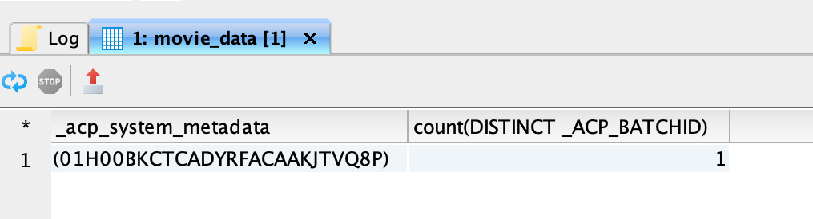
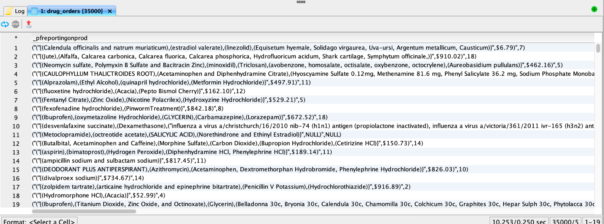

# SQL로 일괄 처리 수집 탐색, 문제 해결 및 확인

이 문서에서는 SQL을 사용하여 수집된 일괄 처리의 레코드를 확인하고 검증하는 방법을 설명합니다. 이 문서에서는 다음 방법을 설명합니다.

- 데이터 세트 일괄 처리 메타데이터 액세스
- 일괄 처리를 쿼리하여 데이터 무결성 문제 해결 및 보장

>[!NOTE]
>
>이 안내서의 일부 스크린샷은 [!DNL DBVisualizer]에서 찍은 것입니다. [쿼리 서비스를 DBVisualizer](../clients/dbvisulaizer.md) 또는 기타 [타사 BI 도구](../clients/overview.md)와 연결하는 방법에 대해 알아보려면 연결된 설명서를 참조하십시오.

## 전제 조건

이 문서에서 설명하는 개념을 이해하려면 다음 항목에 대한 지식이 있어야 합니다.

- **데이터 수집**: 관련된 다양한 방법 및 프로세스를 포함하여 Experience Platform에 데이터를 수집하는 방법에 대한 기본 사항을 알아보려면 [데이터 수집 개요](../../ingestion/home.md)를 참조하십시오.
- **일괄 처리 수집**: 일괄 처리 수집의 기본 개념에 대해 알아보려면 [일괄 처리 수집 API 개요](../../ingestion/batch-ingestion/overview.md)를 참조하십시오. 특히 &quot;배치&quot;란 무엇이며 Experience Platform의 데이터 수집 프로세스 내에서 어떻게 작동하는지 설명합니다.
- **데이터 세트의 시스템 메타데이터**: 시스템 메타데이터 필드를 사용하여 수집된 데이터를 추적하고 쿼리하는 방법에 대해 알아보려면 [카탈로그 서비스 개요](../../catalog/home.md)를 참조하십시오.
- **XDM(경험 데이터 모델)**: XDM 스키마와 Experience Platform에 수집된 데이터의 구조 및 형식을 나타내고 확인하는 방법에 대해 알아보려면 [스키마 UI 개요](../../xdm/ui/overview.md) 및 [의 스키마 구성 기본 사항](../../xdm/schema/composition.md)을 참조하세요.

## 데이터 세트 일괄 처리 메타데이터 액세스 {#access-dataset-batch-metadata}

시스템 열(메타데이터 열)이 쿼리 결과에 포함되도록 하려면 쿼리 편집기에서 SQL 명령 `set drop_system_columns=false`을(를) 사용하십시오. SQL 쿼리 세션의 동작을 구성합니다. 새 세션을 시작하는 경우 이 입력을 반복해야 합니다.

그런 다음 데이터 집합의 시스템 필드를 보려면 SELECT all 문을 실행하여 데이터 집합의 결과를 표시합니다(예: `select * from movie_data`). 오른쪽의 `_acp_system_metadata` 및 `_ACP_BATCHID`에 새 열이 두 개 있습니다. 메타데이터 열 `_acp_system_metadata` 및 `_ACP_BATCHID`은(는) 수집된 데이터의 논리적 및 물리적 파티션을 식별하는 데 도움이 됩니다.


데이터가 Experience Platform으로 수집되면 들어오는 데이터를 기반으로 논리 파티션에 할당됩니다. 이 논리 파티션은 `_acp_system_metadata.sourceBatchId`(으)로 표시됩니다. 이 ID는 데이터 배치를 처리하고 저장하기 전에 논리적으로 그룹화하고 식별하는 데 도움이 됩니다.

데이터가 처리되고 데이터 레이크로 수집되면 `_ACP_BATCHID`(으)로 표현되는 실제 파티션이 할당됩니다. 이 ID는 수집된 데이터가 있는 데이터 레이크의 실제 저장소 파티션을 반영합니다.

### SQL을 사용하여 논리적 및 물리적 분할 영역 이해 {#understand-partitions}

수집 후 데이터를 그룹화하고 배포하는 방법을 이해하려면 다음 쿼리를 사용하여 각 논리 파티션(`_acp_system_metadata.sourceBatchId`)에 대해 고유한 실제 파티션(`_ACP_BATCHID`)의 수를 계산하십시오.

```SQL
SELECT  _acp_system_metadata, COUNT(DISTINCT _ACP_BATCHID) FROM movie_data
GROUP BY _acp_system_metadata
```

이 쿼리의 결과는 아래 이미지에 표시됩니다.



이러한 결과는 시스템이 데이터를 데이터 레이크에 배치 및 저장하는 가장 효율적인 방법을 결정하므로 입력 배치 수가 출력 배치 수와 반드시 일치하지 않는다는 것을 보여 줍니다.

이 예제에서는 CSV 파일을 Experience Platform으로 수집한 후 `drug_checkout_data`(이)라는 데이터 세트를 만든 것으로 가정합니다.

`drug_checkout_data` 파일은 35,000개의 레코드로 구성된 많이 중첩된 집합입니다. SQL 문 `SELECT * FROM drug_orders;`을(를) 사용하여 JSON 기반 `drug_orders` 데이터 집합에서 첫 번째 레코드 집합을 미리 봅니다.

아래 이미지는 파일 및 해당 레코드의 미리 보기를 보여 줍니다.



### SQL을 사용하여 일괄 처리 수집 프로세스에 대한 통찰력 생성 {#sql-insights-on-batch-ingestion}

아래의 SQL 문을 사용하여 데이터 수집 프로세스가 입력 레코드를 그룹화하고 일괄 처리하는 방법에 대한 통찰력을 제공합니다.

```sql
SELECT _acp_system_metadata,
       Count(DISTINCT _acp_batchid) AS numoutputbatches,
       Count(_acp_batchid)          AS recordcount
FROM   drug_orders
GROUP  BY _acp_system_metadata 
```

쿼리 결과는 아래 이미지에 표시됩니다.


이 결과는 데이터 수집 프로세스의 효율성과 비헤이비어를 보여 줍니다. 각각 2000개, 24000개 및 9000개의 레코드를 포함하는 3개의 입력 배치가 생성되었지만 레코드를 결합하고 중복 제거할 때 하나의 고유 배치만 남았습니다.

>[!NOTE]
>
>데이터 세트 내에 표시되는 모든 레코드는 성공적으로 수집된 레코드입니다. 일괄 처리 수집이 성공했다고 해서 소스 입력에서 전송된 모든 레코드가 존재하는 것은 아닙니다. 데이터 수집 실패를 확인하여 실패한 배치/레코드를 찾아야 합니다.

## SQL을 사용하여 배치 유효성 검사 {#validate-a-batch-with-SQL}

그런 다음 SQL을 사용하여 데이터 세트에 수집된 레코드의 유효성을 검사하고 확인합니다.

>[!TIP]
>
>배치 ID 및 해당 배치 ID와 연관된 쿼리 레코드를 검색하려면 먼저 Experience Platform 내에서 배치를 생성해야 합니다. 프로세스를 직접 테스트하려면 CSV 데이터를 Experience Platform으로 수집하면 됩니다. AI가 생성한 권장 사항을 사용하여 [CSV 파일을 기존 XDM 스키마에 매핑](../../ingestion/tutorials/map-csv/recommendations.md)하는 방법에 대한 안내서를 읽어 보십시오.

일괄 처리를 수집했으면 데이터를 수집한 데이터 세트의 [!UICONTROL 데이터 세트 활동 탭]&#x200B;(으)로 이동해야 합니다.

Experience Platform UI의 왼쪽 탐색에서 **[!UICONTROL 데이터 세트]**&#x200B;를 선택하여 [!UICONTROL 데이터 세트] 대시보드를 엽니다. 그런 다음 [!UICONTROL 찾아보기] 탭에서 데이터 세트 이름을 선택하여 [!UICONTROL 데이터 세트 활동] 화면에 액세스합니다.


[!UICONTROL 데이터 집합 활동] 보기가 나타납니다. 이 보기에는 선택한 데이터 세트에 대한 세부 정보가 포함되어 있습니다. 여기에는 테이블 형식으로 표시되는 수집된 일괄 처리가 포함됩니다.

사용 가능한 일괄 처리 목록에서 일괄 처리를 선택하고 오른쪽의 세부 정보 패널에서 [!UICONTROL 일괄 처리 ID]를 복사합니다.


그런 다음 다음 쿼리를 사용하여 데이터 세트에 해당 배치의 일부로 포함된 모든 레코드를 검색합니다.

```sql
SELECT * FROM movie_data
WHERE  _acp_batchid='01H00BKCTCADYRFACAAKJTVQ8P' 
LIMIT 1;
```

`_ACP_BATCHID` 키워드는 [!UICONTROL 일괄 처리 ID]을(를) 필터링하는 데 사용됩니다.

>[!TIP]
>
>`LIMIT` 절은 표시되는 행 수를 제한하려는 경우에 유용하지만 필터 조건이 더 좋습니다.

쿼리 편집기에서 이 쿼리를 실행하면 결과가 100개의 행으로 잘립니다. 쿼리 편집기는 빠른 미리 보기 및 조사를 위해 설계되었습니다. 최대 50,000개의 행을 검색하려면 DBVisualizer 또는 DBeaver와 같은 서드파티 도구를 사용할 수 있습니다.

## 다음 단계 {#next-steps}

이 문서를 읽은 후에는 데이터 수집 프로세스의 일부로 수집된 배치의 레코드를 확인하고 확인하는 데 필요한 핵심 사항에 대해 알아보았습니다. 또한 데이터 세트 배치 메타데이터에 액세스하고, 논리 및 물리적 파티션을 이해하고, SQL 명령을 사용하여 특정 배치를 쿼리하는 통찰력을 얻었습니다. 이 지식을 통해 데이터 무결성을 보장하고 Experience Platform에서 데이터 저장소를 최적화할 수 있습니다.

다음으로 학습한 개념을 적용하기 위해 데이터 수집을 연습해야 한다. 제공된 샘플 파일 또는 고유한 데이터를 사용하여 샘플 데이터 세트를 Experience Platform에 수집합니다. 아직 수행하지 않았다면 [데이터를 Adobe Experience Platform으로 수집](../../ingestion/tutorials/ingest-batch-data.md)하는 방법에 대한 자습서를 읽어 보십시오.

또는 데이터 분석 기능을 향상시키기 위해 [다양한 데스크톱 클라이언트 응용 프로그램과 쿼리 서비스를 연결 및 확인](../clients/overview.md)하는 방법에 대해 알아볼 수 있습니다.
