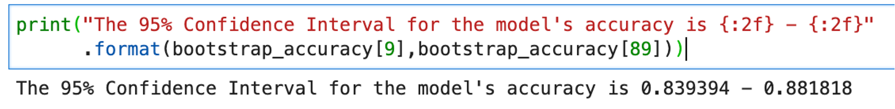

# 기계 학습에서 생성된 예측 모델을 사용하여 성향 점수를 결정합니다

쿼리 서비스를 사용하여 기계 학습 플랫폼의 Experience Platform 데이터를 활용하여 성향 점수와 같은 예측 모델을 생성할 수 있습니다. 이 안내서에서는 계산 전자 필기장에서 모델을 교육하기 위해 Query Service를 사용하여 데이터를 기계 학습 플랫폼으로 보내는 방법을 설명합니다. 숙련된 모델은 SQL을 사용하여 데이터에 적용되어 각 방문에 대해 고객의 구매 성향을 예측할 수 있습니다.

## 시작하기

이 프로세스의 일부로 기계 학습 모델을 교육해야 하므로 이 문서에서는 하나 이상의 기계 학습 환경에 대한 작업 지식을 가정합니다.

이 예에서는 을 사용합니다 [!DNL Jupyter Notebook] 를 개발 환경으로 설정합니다. 여러 가지 옵션을 사용할 수 있지만, [!DNL Jupyter Notebook] 계산 요구 사항이 낮은 오픈 소스 웹 애플리케이션이므로 를 사용하는 것이 좋습니다. 그럴 수 있습니다 [공식 사이트에서 다운로드](https://jupyter.org/).

아직 수행하지 않았다면 다음 단계를 수행하십시오. [connect [!DNL Jupyter Notebook] Adobe Experience Platform 쿼리 서비스 사용](../clients/jupyter-notebook.md) 이 안내서를 계속하기 전에

이 예제에 사용되는 라이브러리는 다음과 같습니다.

```console
python=3.6.7
psycopg2
sklearn
pandas
matplotlib
numpy
tqdm
```

## Platform에서 로 분석 테이블 가져오기 [!DNL Jupyter Notebook] {#import-analytics-tables}

성향 점수 모델을 생성하려면 Platform에 저장된 Analytics 데이터의 프로젝션을 [!DNL Jupyter Notebook]. 보낸 사람 [!DNL Python] 3 [!DNL Jupyter Notebook] query Service에 연결된 다음 명령은 가상 의류 저장소인 Luma에서 고객 행동 데이터 세트를 가져옵니다. 플랫폼 데이터는 XDM(Experience Data Model) 형식을 사용하여 저장되므로 스키마의 구조를 준수하는 샘플 JSON 개체를 생성해야 합니다. 방법에 대한 지침은 설명서를 참조하십시오 [샘플 JSON 개체 생성](../../xdm/ui/sample.md).

![다음 [!DNL Jupyter Notebook] 여러 명령이 강조 표시된 대시보드](../images/use-cases/jupyter-commands.png)

출력에는 Luma의 행동 데이터 세트에서 포함된 모든 열의 테이블 분할 보기가 표시됩니다 [!DNL Jupyter Notebook] 대시보드 .

![내에서 Luma의 가져온 고객 행동 데이터 세트에 대한 표 화된 출력 [!DNL Jupyter Notebook].](../images/use-cases/behavioural-dataset-results.png)

## 기계 학습을 위한 데이터 준비 {#prepare-data-for-machine-learning}

기계 학습 모델을 교육하려면 대상 열을 식별해야 합니다. 구매 성향 이 사용 사례의 목표는 다음과 같습니다. `analytic_action` 열이 Luma 결과에서 target 열로 선택됩니다. 값 `productPurchase` 은 고객 구매의 지표입니다. 다음 `purchase_value` 및 `purchase_num` 열이 제품 구매 작업과 직접 관련되어 있어 제거됩니다.

이러한 작업을 수행하는 명령은 다음과 같습니다.

```python
#define the target label for prediction
df['target'] = (df['analytic_action'] == 'productPurchase').astype(int)
#remove columns that are dependent on the label
df.drop(['analytic_action','purchase_value'],axis=1,inplace=True)
```

그런 다음 Luma 데이터 세트의 데이터를 적절한 표현으로 변환해야 합니다. 다음 두 단계가 필요합니다.

1. 숫자를 나타내는 열을 숫자 열로 변환합니다. 이렇게 하려면 `dataframe`.
1. 카테고리 열을 숫자 열로 변환합니다.

```python
#convert columns that represent numbers
num_cols = ['purchase_num', 'value_cart', 'value_lifetime']
df[num_cols] = df[num_cols].apply(pd.to_numeric, errors='coerce')
```

이름이 *핫 인코딩* 는 기계 및 딥 학습 알고리즘에서 사용할 카테고리적 데이터 변수를 변환하는 데 사용됩니다. 이렇게 하면 모델의 분류 정확도와 예측이 향상됩니다. 를 사용하십시오 `Sklearn` 라이브러리 를 사용하여 별도의 열에 각 카테고리적 값을 나타냅니다.

```python
from sklearn.preprocessing import OneHotEncoder

#get the categorical columns
cat_columns = list(set(df.columns) - set(num_cols + ['target']))

#get the dataframe with categorical columns only
df_cat = df.loc[:,cat_columns]

#initialize sklearn's OneHotEncoder
enc = OneHotEncoder(handle_unknown='ignore')

#fit the data into the encoder
enc.fit(df_cat)

#define OneHotEncoder's columns names
ohc_columns = [[c+'='+c_ for c_ in cat] for c,cat in zip(cat_columns,enc.categories_)]
ohc_columns = [item for sublist in ohc_columns for item in sublist]

#finalize the data input to the ML models
X = pd.DataFrame( np.concatenate((enc.transform(df_cat).toarray(),df[num_cols]),axis=1),
                 columns =  ohc_columns + num_cols)

#define target column
y = df['target']
```

로 정의된 데이터 `X` 는 테이블 분할되고 아래와 같이 표시됩니다.

![내의 X의 테이블 분할 출력 [!DNL Jupyter Notebook].](../images/use-cases/x-output-table.png)


이제 기계 학습을 위해 필요한 데이터를 사용할 수 있으므로 미리 구성된 기계 학습 모델에 [!DNL Python]s `sklearn` 라이브러리. [!DNL Logistics Regression] 는 성향 모델을 교육하는 데 사용되며 테스트 데이터의 정확도를 볼 수 있습니다. 이 경우 약 85%입니다.

다음 [!DNL Logistic Regression] 기계 학습 알고리즘의 성능을 추정하기 위해 사용되는 알고리즘 및 열차 테스트 분할 방법은 아래 코드 블록에 가져옵니다.

```python
from sklearn.linear_model import LogisticRegression
from sklearn.model_selection import train_test_split

X_train, X_test, y_train, y_test = train_test_split(
    X, y, test_size=0.33, random_state=42)

clf = LogisticRegression(max_iter=2000, random_state=0).fit(X_train, y_train)

print("Test data accuracy: {}".format(clf.score(X_test, y_test)))
```

테스트 데이터 정확도는 0.8518518518518519입니다.

물류 회귀 사용을 통해 구매의 이유를 시각화하고 내림차순에서 등급 중요도에 따라 성향을 결정하는 기능을 정렬할 수 있습니다. 첫 번째 열은 구매 행동을 유도하는 더 높은 원인을 나타냅니다. 후자 열은 구매 행동을 초래하지 않는 요소를 나타냅니다.

결과를 두 개의 막대 차트로 시각화하는 코드는 다음과 같습니다.

```python
from matplotlib import pyplot as plt

#get feature importance as a sorted list of columns
feature_importance = np.argsort(-clf.coef_[0])
top_10_features_purchase_names = X.columns[feature_importance[:10]]
top_10_features_purchase_values = clf.coef_[0][feature_importance[:10]]
top_10_features_not_purchase_names = X.columns[feature_importance[-10:]]
top_10_features_not_purchase_values = clf.coef_[0][feature_importance[-10:]]

#plot the figures
fig, (ax1, ax2) = plt.subplots(1, 2,figsize=(10,5))

ax1.bar(np.arange(10),top_10_features_purchase_values)
ax1.set_xticks(np.arange(10))
ax1.set_xticklabels(top_10_features_purchase_names,rotation = 90)
ax1.set_ylim([np.min(clf.coef_[0])-0.1,np.max(clf.coef_[0])+0.1])
ax1.set_title("Top 10 features to define \n a propensity to purchase")

ax2.bar(np.arange(10),top_10_features_not_purchase_values, color='#E15750')
ax2.set_xticks(np.arange(10))
ax2.set_xticklabels(top_10_features_not_purchase_names,rotation = 90)
ax2.set_ylim([np.min(clf.coef_[0])-0.1,np.max(clf.coef_[0])+0.1])
ax2.set_title("Top 10 features to define \n a propensity to NOT purchase")

plt.show()
```

아래에 결과의 세로 막대 차트 시각화가 표시됩니다.


막대 차트에서 몇 가지 패턴을 식별할 수 있습니다. POS(Point of Sale) 및 환급 관련 통화 항목은 구매 행동을 결정하는 가장 중요한 요소입니다. 하지만 반항 및 송장으로 통화 항목을 사용할 경우 구매 행동을 정의할 수 있는 중요한 역할이 됩니다. 이러한 통찰력은 마케터가 이러한 고객의 구매 성향을 해결하기 위해 마케팅 캠페인을 수행하는 데 활용할 수 있는 수량적이고 실행 가능한 통찰력입니다.

## Query Service를 사용하여 교육된 모델을 적용합니다 {#use-query-service-to-apply-trained-model}

숙련된 모델이 만들어지면 Experience Platform에 있는 데이터에 적용되어야 합니다. 이렇게 하려면 기계 학습 파이프라인의 논리를 SQL으로 변환해야 합니다. 이 전환의 두 주요 구성 요소는 다음과 같습니다.

- 먼저 SQL이 [!DNL Logistics Regression] 예측 레이블의 확률을 얻는 모듈입니다. 물류 회귀에서 생성한 모델은 회귀 모델을 생성했습니다 `y = wX + c`  가중치 `w` 및 절편 `c` 는 모델의 출력입니다. SQL 기능은 가중치를 곱하는 데 사용하여 확률을 얻을 수 있습니다.

- 둘째로, 공학 프로세스는 [!DNL Python] 핫 인코딩을 한 개 사용하는 SQL에도 통합해야 합니다. 예를 들어, 원래 데이터베이스에는 `geo_county` 열을 사용하여 카운티를 저장하지만 열이 `geo_county=Bexar`, `geo_county=Dallas`, `geo_county=DeKalb`. 다음 SQL 문은 동일한 변환을 수행합니다. 여기서 `w1`, `w2`, 및 `w3` 에서 배운 가중치로 치환할 수 있습니다 [!DNL Python]:

```sql
SELECT  CASE WHEN geo_state = 'Bexar' THEN FLOAT(w1) ELSE 0 END AS f1,
        CASE WHEN geo_state = 'Dallas' THEN FLOAT(w2) ELSE 0 END AS f2,
        CASE WHEN geo_state = 'Bexar' THEN FLOAT(w3) ELSE 0 END AS f3,
```

숫자 기능의 경우 아래 SQL 문과 같이 가중치가 있는 열에 직접 곱할 수 있습니다.

```sql
SELECT FLOAT(purchase_num) * FLOAT(w4) AS f4,
```

숫자를 얻은 후, 물류 회귀 알고리즘에서 최종 예측을 생성하는 신호 처리 기능으로 포팅할 수 있습니다. 아래 설명서에서 `intercept` 회귀에서 절편 수입니다.
        

```sql
SELECT CASE WHEN 1 / (1 + EXP(- (f1 + f2 + f3 + f4 + FLOAT(intercept)))) > 0.5 THEN 1 ELSE 0 END AS Prediction;
```
 
### 종단 간 예

두 개의 열(`c1` 및 `c2`) `c1` 두 가지 카테고리가 있습니다. [!DNL Logistic Regression] 알고리즘은 다음 함수를 사용하여 교육됩니다.
 

```python
y = 0.1 * "c1=category 1"+ 0.2 * "c1=category 2" +0.3 * c2+0.4
```
 
SQL의 해당 값은 다음과 같습니다.

```sql
SELECT
  CASE WHEN 1 / (1 + EXP(- (f1 + f2 + f3 + FLOAT(0.4)))) > 0.5 THEN 1 ELSE 0 END AS Prediction
FROM
  (
    SELECT
      CASE WHEN c1 = 'Cateogry 1' THEN FLOAT(0.1) ELSE 0 END AS f1,
      CASE WHEN c1 = 'Cateogry 2' THEN FLOAT(0.2) ELSE 0 END AS f2,
      FLOAT(c2) * FLOAT(0.3) AS f3
    FROM TABLE
  )
```
 
다음 [!DNL Python] 번역 프로세스를 자동화하는 코드는 다음과 같습니다.

```python
def generate_lr_inference_sql(ohc_columns, num_cols, clf, db):
    features_sql = []
    category_sql_text = "case when {col} = '{val}' then float({coef}) else 0 end as f{name}"
    numerical_sql_text = "float({col}) * float({coef}) as f{name}"
    for i, (column, coef) in enumerate(zip(ohc_columns+num_cols, clf.coef_[0])):
        if i < len(ohc_columns):
            col,val = column.split('=')
            val = val.replace("'","%''%")
            sql = category_sql_text.format(col=col,val=val,coef=coef,name=i+1)
        else:
            sql = numerical_sql_text.format(col=column,coef=coef,name=i+1)
        features_sql.append(sql)
    features_sum = '+'.join(['f{}'.format(i) for i in range(1,len(features_sql)+1)])
    final_sql = '''
    select case when 1/(1 + EXP(-({features} + float({intercept})))) > 0.5 then 1 else 0 end as Prediction
    from
        (select {cols}
        from {db})
    '''.format(features=features_sum,cols=",".join(features_sql),intercept=clf.intercept_[0],db=db)
    return final_sql
```

SQL을 사용하여 데이터베이스를 유추하면 출력은 다음과 같습니다.

```python
sql = generate_lr_inference_sql(ohc_columns, num_cols, clf, "fdu_luma_raw")
cur.execute(sql)    
samples = [r for r in cur]
colnames = [desc[0] for desc in cur.description]
pd.DataFrame(samples,columns=colnames)
```

테이블 분석 결과는 `0` 구매 성향 없음 `1` 확실한 구매 성향을 의미합니다.


## 샘플링된 데이터 작업: 부트스트랩 {#working-on-sampled-data}

데이터 크기가 너무 커서 로컬 시스템에서 모델 교육을 위한 데이터를 저장할 수 없는 경우 쿼리 서비스의 전체 데이터 대신 샘플을 가져올 수 있습니다. 쿼리 서비스에서 샘플링하는 데 필요한 데이터의 양을 알기 위해 부트스트래핑이라는 기술을 적용할 수 있습니다. 이러한 경우 부트스트랩은 모델이 다양한 샘플로 여러 번 교육되고 다른 샘플들 간의 모델의 정확성 차이가 검사됨을 의미합니다. 위에 제시된 성향 모델 예를 조정하려면 먼저 전체 기계 학습 워크플로우를 함수로 캡슐화합니다. 코드는 다음과 같습니다.

```python
def end_to_end_pipeline(df):
    
    #define the target label for prediction
    df['target'] = (df['analytic_action'] == 'productPurchase').astype(int)
    #remove columns that are dependent on the label
    df.drop(['analytic_action','purchase_value'],axis=1,inplace=True)
    
    num_cols = ['purchase_num','value_cart','value_lifetime']
    df[num_cols] = df[num_cols].apply(pd.to_numeric, errors='coerce')
    
    #get the categorical columns
    cat_columns = list(set(df.columns) - set(num_cols + ['target']))

    #get the dataframe with categorical columns only
    df_cat = df.loc[:,cat_columns]

    #initialize sklearn's One Hot Encoder
    enc = OneHotEncoder(handle_unknown='ignore')

    #fit the data into the encoder
    enc.fit(df_cat)

    #define one hot encoder's columns names
    ohc_columns = [[c+'='+c_ for c_ in cat] for c,cat in zip(cat_columns,enc.categories_)]
    ohc_columns = [item for sublist in ohc_columns for item in sublist]

    #finalize the data input to the ML models
    X = pd.DataFrame( np.concatenate((enc.transform(df_cat).toarray(),df[num_cols]),axis=1),
                     columns =  ohc_columns + num_cols)

    #define target column
    y = df['target']
    
    X_train, X_test, y_train, y_test = train_test_split(
    X, y, test_size=0.33, random_state=42)

    clf = LogisticRegression(max_iter=2000,random_state=0).fit(X_train, y_train)

    return clf.score(X_test, y_test)
```

그런 다음 이 함수는 한 루프에서 여러 번 실행할 수 있습니다(예: 10회). 이전 코드의 차이점은 이제 샘플이 전체 표에서 가져오지 않고 행 샘플만 가져왔다는 것입니다. 예를 들어 아래 샘플 코드는 1000개의 행만 사용합니다. 각 반복에 대한 정확도를 저장할 수 있습니다.

```python
from tqdm import tqdm

bootstrap_accuracy = []
for i in tqdm(range(100)):
    
    #sample data from QS
    cur.execute('''SELECT *
    FROM fdu_luma_raw
    ORDER BY random()
    LIMIT 1000
    ''')    
    samples = [r for r in cur]
    colnames = [desc[0] for desc in cur.description]
    df_samples = pd.DataFrame(samples,columns=colnames)
    df_samples.fillna(0,inplace=True)
    
    #train the propensity model with sampled data and output its accuracy
    bootstrap_accuracy.append(end_to_end_pipeline(df_samples))
    
bootstrap_accuracy = np.sort(bootstrap_accuracy)
```

그러면 부트스트랩된 모델의 정확성이 정렬됩니다. 그런 다음 모델의 정확성 10번째와 90번째 수량을 지정한 샘플 크기로 모델의 정확성에 대한 95% 신뢰 구간이 됩니다.



위의 그림에서 모델을 교육하기 위해 1000개의 행만 사용하는 경우 약 84%와 88% 사이에 정확도가 떨어질 것으로 예상할 수 있습니다. 을 조정할 수 있습니다 `LIMIT` 모델의 성능을 보장하기 위해 필요에 따라 쿼리 서비스 쿼리의 절을 참조하십시오.


