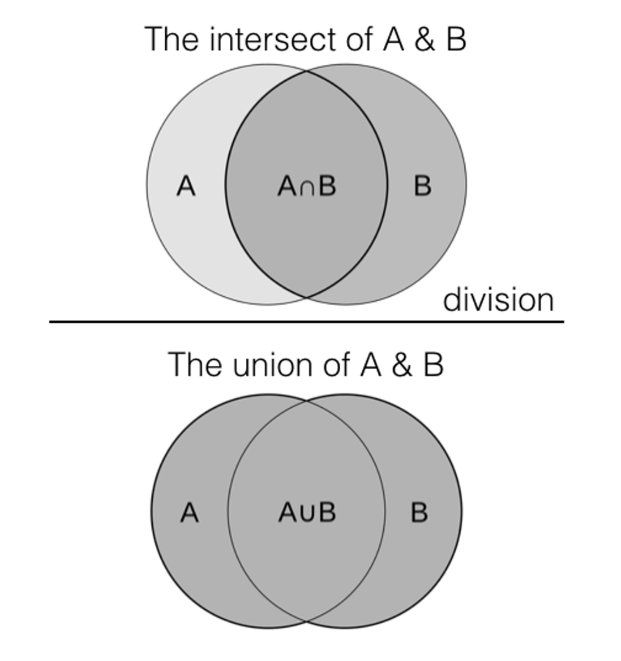

# 고차 함수로 유사한 레코드 검색

데이터 Distiller 고차 함수를 사용하여 다양한 일반적인 사용 사례를 해결할 수 있습니다. 하나 이상의 데이터 세트에서 유사하거나 관련된 레코드를 식별하고 검색하려면 이 안내서에 설명된 대로 필터, 변환 및 감소 함수를 사용하십시오. 복잡한 데이터 유형을 처리하는 데 고차 함수를 사용하는 방법에 대해 알아보려면 방법 설명서를 참조하십시오 [배열 관리 및 데이터 유형 매핑](../sql/higher-order-functions.md).

이 안내서를 사용하여 특성 또는 속성과 상당히 유사한 다양한 데이터 세트의 제품을 식별할 수 있습니다. 이 방법론은 데이터 중복 제거, 레코드 연결, 추천 시스템, 정보 검색 및 텍스트 분석 등에 대한 솔루션을 제공합니다.

이 문서에서는 유사성 조인을 구현하는 프로세스에 대해 설명합니다. 이 프로세스에서는 데이터 Distiller 고차 함수를 사용하여 데이터 세트 간의 유사성을 계산하고 선택한 속성을 기준으로 필터링합니다. 프로세스의 각 단계에 대해 SQL 코드 조각 및 설명이 제공됩니다. 워크플로는 Jaccard 유사성 측정을 사용한 유사성 조인과 데이터 Distiller 고차 함수를 사용한 토큰화를 구현합니다. 그런 다음 이러한 방법을 사용하여 유사성 지표에 따라 하나 이상의 데이터 세트에서 유사하거나 관련된 레코드를 식별하고 검색합니다. 프로세스의 주요 섹션은 다음과 같습니다. [고차 함수를 사용한 토큰화](#data-transformation), [고유 요소의 교차 결합](#cross-join-unique-elements), [자카드 유사성 계산](#compute-the-jaccard-similarity-measure)및 [임계값 기반 필터링](#similarity-threshold-filter).

## 전제 조건

이 문서를 계속하기 전에 다음 개념에 익숙해야 합니다.

- A **유사성 결합** 는 레코드 간의 유사성 측정값을 기준으로 하나 이상의 테이블에서 레코드 쌍을 식별하고 검색하는 작업입니다. 유사성 조인의 주요 요구 사항은 다음과 같습니다.
   - **유사성 지표**: 유사성 조인은 사전 정의된 유사성 지표 또는 측정을 사용합니다. 이러한 지표에는 Jaccard 유사성, 코사인 유사성, 편집 거리 등이 포함됩니다. 지표는 데이터의 특성과 사용 사례에 따라 다릅니다. 이 지표는 두 레코드가 얼마나 유사하거나 유사하지 않은지 수량화합니다.
   - **임계값**: 유사성 임계값은 두 레코드가 조인 결과에 포함될 만큼 유사하다고 간주되는 시기를 결정하는 데 사용됩니다. 유사성 점수가 임계값을 초과하는 레코드는 일치로 간주됩니다.
- 다음 **자카드 유사성** 색인 또는 Jaccard 유사성 측정은 샘플 세트의 유사성과 다양성을 측정하는 데 사용되는 통계입니다. 교차점의 크기를 샘플 집합의 결합 크기로 나눈 값으로 정의된다. Jaccard 유사성 측정의 범위는 0부터 1까지입니다. Jaccard 유사도가 0이면 집합 간 유사도가 없고, Jaccard 유사도가 1이면 집합 간 유사도가 동일함을 나타낸다.
  
- **고차 함수** 데이터 Distiller의 인라인 도구는 SQL 문 내에서 직접 데이터를 처리하고 변환하는 동적 인라인 도구입니다. 이러한 다목적 기능은 특히 다음과 같은 경우 데이터 조작에서 여러 단계의 필요성을 제거합니다. [배열 및 맵과 같은 복잡한 유형 처리](../sql/higher-order-functions.md). 쿼리 효율성을 높이고 변환을 단순화함으로써 고차 함수는 다양한 비즈니스 시나리오에서 더 민첩한 분석과 더 나은 의사 결정에 기여합니다.

## 시작하기

Data Distiller SKU는 Adobe Experience Platform 데이터에 대해 더 높은 수준의 기능을 수행하는 데 필요합니다. Data Distiller SKU가 없는 경우 Adobe 고객 서비스 담당자에게 자세한 내용을 문의하십시오.

## 유사성 설정 {#establish-similarity}

이 사용 사례에서는 필터링을 위한 임계값을 설정하는 데 나중에 사용할 수 있는 텍스트 문자열 간의 유사성 측정이 필요합니다. 이 예에서 집합 A와 집합 B의 곱은 두 문서의 단어를 나타냅니다.

Jaccard 유사성 측정은 텍스트 데이터, 범주형 데이터, 이진 데이터 등 광범위한 데이터 유형에 적용할 수 있다. 또한 대용량 데이터 세트에 대해 계산하는 것이 계산적으로 효율적일 수 있으므로 실시간 또는 일괄 처리에도 적합하다.

제품 세트 A와 세트 B에는 이 워크플로우에 대한 테스트 데이터가 포함되어 있습니다.

- 제품 세트 A: `{iPhone, iPad, iWatch, iPad Mini}`
- 제품 세트 B: `{iPhone, iPad, Macbook Pro}`

제품 세트 A와 B 간의 자카드 유사성을 계산하려면 먼저 **교차** (공통 요소). 이 경우, `{iPhone, iPad}`. 그런 다음 **합집합** (모든 고유 요소). 이 예에서는 `{iPhone, iPad, iWatch, iPad Mini, Macbook Pro}`.

마지막으로 Jaccard 유사성 공식을 사용합니다. `J(A,B) = A∪B / A∩B` 유사성을 계산합니다.

J = 자카드 거리 A = 세트 1 B = 세트 2

제품 세트 A와 B 사이의 Jaccard 유사성은 0.4입니다. 이는 두 문헌에서 사용된 단어들 간의 중간 정도의 유사성을 나타낸다. 두 집합 간의 이러한 유사성은 유사성 조인에서 열을 정의합니다. 이러한 열은 테이블에 저장되고 유사성 계산을 수행하는 데 사용되는 정보 또는 데이터와 연관된 특성을 나타냅니다.

### 문자열 유사성을 사용한 쌍별 Jaccard 계산 {#pairwise-similarity}

문자열의 유사성을 보다 정확하게 비교하려면 쌍대 유사성을 계산해야 합니다. 쌍대 유사성은 비교 및 분석을 위해 고차원 객체를 더 작은 차원 객체로 분할합니다. 이를 위해 텍스트 문자열을 더 작은 부분 또는 단위(토큰)로 나눕니다. 개별 문자, 문자 그룹(음절 등) 또는 전체 단어일 수 있습니다. 집합 A의 각 요소와 집합 B의 각 요소 사이의 각 토큰 쌍에 대해 유사도를 계산한다. 이러한 토큰화는 분석적 및 계산 비교, 관계 및 데이터로부터 도출될 통찰력에 대한 기반을 제공한다.

쌍별 유사성 계산의 경우 이 예제에서는 문자 양방향(2개의 문자 토큰)을 사용하여 집합 A와 집합 B에 있는 제품의 텍스트 문자열 간의 유사성 일치를 비교합니다. 바이그램은 주어진 시퀀스 또는 텍스트에 있는 두 개의 항목이나 요소의 연속 시퀀스입니다. 이를 n-그램으로 일반화할 수 있습니다.

이 예제에서는 대소문자가 중요하지 않으며 공백을 고려하지 않아야 한다고 가정합니다. 이러한 기준에 따라 세트 A와 세트 B에는 다음과 같은 두 개의 양지표가 있습니다.

Product Set A bi-grams:

- iPhone (5): &quot;ip&quot;, &quot;ph&quot;, &quot;ho&quot;, &quot;on&quot;, &quot;ne&quot;
- iPad (3): &quot;ip&quot;, &quot;pa&quot;, &quot;ad&quot;
- iWatch (5): &quot;iw&quot;, &quot;wa&quot;, &quot;at&quot;, &quot;tc&quot;, &quot;ch&quot;
- iPad Mini (7): &quot;ip&quot;, &quot;pa&quot;, &quot;ad&quot;, &quot;dm&quot;, &quot;mi&quot;, &quot;in&quot;, &quot;ni&quot;

제품 세트 B 2그램:

- iPhone (5): &quot;ip&quot;, &quot;ph&quot;, &quot;ho&quot;, &quot;on&quot;, &quot;ne&quot;
- iPad (3): &quot;ip&quot;, &quot;pa&quot;, &quot;ad&quot;
- 맥북 프로 (9): &quot;Ma&quot;, &quot;ac&quot;, &quot;cb&quot;, &quot;bo&quot;, &quot;oo&quot;, &quot;ok&quot;, &quot;kp&quot;, &quot;pr&quot;, &quot;ro&quot;

다음으로 각 쌍에 대한 Jaccard 유사성 계수를 계산합니다.

|                   | iPhone(세트 B) | iPad(세트 B) | Macbook Pro(세트 B) |
|-------------------|----------------------------------------------|---------------------------------------------|-------------------------------------------|
| iPhone (세트 A) | (교차: 5, 결합: 5) = 5 / 5 = 1 | (교차: 1, 결합: 7) =1 / 7 ≈ 0.14 | (교차: 0, 합집합: 14) = 0 / 14 = 0 |
| iPad (세트 A) | (교차: 1, 결합: 7) = 1 / 7 ≈ 0.14 | (교차: 3, 결합: 3) = 3 / 3 = 1 | (교차: 0, 합집합: 12) = 0 / 12 = 0 |
| iWatch(세트 A) | (교차: 0, 합집합: 8) = 0 / 8 = 0 | (교차: 0, 합집합: 8) = 0 / 8 = 0 | (교차: 0, 결합: 8) = 0 / 8 =0 |
| iPad Mini (세트 A) | (교차: 1, 결합: 11) = 1 / 11 ≈ 0.09 | (교차: 3, 결합: 7) = 3 / 7 ≈ 0.43 | (교차: 0, 합집합: 16) = 0 / 16 = 0 |

{style="table-layout:auto"}

## SQL로 테스트 데이터 만들기 {#create-test-data}

제품 집합에 대한 테스트 테이블을 수동으로 만들려면 SQL CREATE TABLE 문을 사용합니다.

```SQL {line-numbers="true"}
CREATE TABLE featurevector1 AS SELECT *
FROM (
    SELECT 'iPad' AS ProductName
    UNION ALL
    SELECT 'iPhone'
    UNION ALL
    SELECT 'iWatch'
     UNION ALL
    SELECT 'iPad Mini'
);
SELECT * FROM featurevector1;
```

다음 설명은 위의 SQL 코드 블록에 대한 분류를 제공합니다.

- 1행: `CREATE TEMP TABLE featurevector1 AS`: 이 문은 라는 임시 테이블을 만듭니다. `featurevector1`. 임시 테이블은 일반적으로 현재 세션 내에서만 액세스할 수 있으며 세션이 끝날 때 자동으로 삭제됩니다.
- 1행 및 2행: `SELECT * FROM (...)`: 이 코드 부분은 다음에 삽입되는 데이터를 생성하는 데 사용되는 하위 쿼리입니다 `featurevector1` 테이블.
하위 쿼리 내부, 다중 `SELECT` 문은 를 사용하여 결합됩니다. `UNION ALL` 명령입니다. 각 `SELECT` 문은 다음에 대해 지정된 값이 있는 하나의 데이터 행을 생성합니다. `ProductName` 열.
- 3행: `SELECT 'iPad' AS ProductName`: 값이 있는 행이 생성됩니다 `iPad` 다음에서 `ProductName` 열.
- 5행: `SELECT 'iPhone'`: 값이 있는 행이 생성됩니다 `iPhone` 다음에서 `ProductName` 열.

SQL 문은 아래와 같이 테이블을 생성합니다.

|   | `ProductName` |
|---|---------------|
| 1 | iPad |
| 2 | iPhone |
| 3 | iWatch |
| 4 | iPad Mini |

{style="table-layout:auto"}

두 번째 피쳐 벡터를 생성하려면 다음 SQL 문을 사용합니다.

```SQL
CREATE TABLE featurevector2 AS SELECT *
FROM (
    SELECT 'iPad' AS ProductName
    UNION ALL
    SELECT 'iPhone'
    UNION ALL
    SELECT 'Macbook Pro'
);
SELECT * FROM featurevector2;
```

## 데이터 변환 {#data-transformation}

이 예제에서는 여러 작업을 수행하여 세트를 정확하게 비교해야 합니다. 먼저, 모든 공백은 유사성 측정에 기여하지 않는다고 가정하므로 피쳐 벡터에서 제거됩니다. 그런 다음, 특징 벡터에 존재하는 임의의 복제는 그들이 계산 처리를 낭비함에 따라 제거된다. 다음으로, 특징 벡터로부터 2개의 문자(2그램)의 토큰이 추출된다. 이 예제에서는 서로 겹치는 것으로 가정합니다.

>[!NOTE]
>
>설명을 위해 처리된 열이 각 단계에 대한 피쳐 벡터 옆에 추가됩니다.

다음 섹션에서는 토큰화 프로세스를 시작하기 전에 중복 제거, 공백 제거 및 소문자 변환과 같은 사전 요구 사항 데이터 변환에 대해 설명합니다.

### 중복 제거 {#deduplication}

그런 다음 를 사용합니다. `DISTINCT` 절을 사용하여 중복을 제거할 수 있습니다. 이 예에는 중복 항목이 없지만 비교의 정확도를 개선하는 중요한 단계입니다. 필요한 SQL이 아래에 표시됩니다.

```SQL
SELECT DISTINCT(ProductName) AS featurevector1_distinct FROM featurevector1
SELECT DISTINCT(ProductName) AS featurevector2_distinct FROM featurevector2
```

### 공백 제거 {#whitespace-removal}

다음 SQL 문에서는 피쳐 벡터에서 공백이 제거됩니다. 다음 `replace(ProductName, ' ', '') AS featurevector1_nospaces` 쿼리의 일부는 `ProductName` 의 열 `featurevector1` 표 및 사용 `replace()` 함수. 다음 `REPLACE` 함수는 공백(&#39; &#39;)의 모든 발생 항목을 빈 문자열(&#39;&#39;)로 바꿉니다. 이렇게 하면 `ProductName` 값. 결과는 다음으로 별칭이 지정됩니다. `featurevector1_nospaces`.

```SQL
SELECT DISTINCT(ProductName) AS featurevector1_distinct, replace(ProductName, ' ', '') AS featurevector1_nospaces FROM featurevector1
```

결과는 아래 표와 같습니다.

|   | featurevector1_distinct | featurevector1_nospaces |
|---|---|---|
| 1 | iPad Mini | iPadMini |
| 2 | iPad | iPad |
| 3 | iWatch | iWatch |
| 4 | iPhone | iPhone |

{style="table-layout:auto"}

두 번째 특징 벡터에 대한 SQL 문과 그 결과는 다음과 같습니다.

+++확장하려면 선택

```SQL
SELECT DISTINCT(ProductName) AS featurevector2_distinct, replace(ProductName, ' ', '') AS featurevector2_nospaces FROM featurevector2
```

결과는 다음과 같이 표시됩니다.

|   | featurevector2_distinct | featurevector2_nospaces |
|---|---|---|
| 1 | iPad | iPad |
| 2 | Macbook Pro | 맥북 프로 |
| 3 | iPhone | iPhone |

{style="table-layout:auto"}

+++

### 소문자로 변환 {#lowercase-conversion}

그런 다음 제품 이름을 소문자로 변환하고 공백을 제거하도록 SQL을 개선합니다. 하위 함수(`lower(...)`)가 의 결과에 적용됩니다. `replace()` 함수. lower 함수는 수정된 파일의 모든 문자를 변환합니다. `ProductName` 값을 소문자로 바꿉니다. 이렇게 하면 값이 원래 대/소문자에 관계없이 소문자로 표시됩니다.

```SQL
SELECT DISTINCT(ProductName) AS featurevector1_distinct, lower(replace(ProductName, ' ', '')) AS featurevector1_transform FROM featurevector1;
```

이 문의 결과는 다음과 같습니다.

|   | featurevector1_distinct | featurevector1_transform |
|---|---|---|
| 1 | iPad Mini | ipadmini |
| 2 | iPad | iPad |
| 3 | iWatch | iWatch |
| 4 | iPhone | iPhone |

{style="table-layout:auto"}

두 번째 특징 벡터에 대한 SQL 문과 그 결과는 다음과 같습니다.

+++확장하려면 선택

```SQL
SELECT DISTINCT(ProductName) AS featurevector2_distinct, lower(replace(ProductName, ' ', '')) AS featurevector2_transform FROM featurevector2
```

결과는 다음과 같이 표시됩니다.

|   | featurevector2_distinct | featurevector2_transform |
|---|---|---|
| 1 | iPad | ipad |
| 2 | Macbook Pro | macbookpro |
| 3 | iPhone | iphone |

{style="table-layout:auto"}

+++

### SQL을 사용하여 토큰 추출 {#tokenization}

다음 단계는 토큰화 또는 텍스트 분할입니다. 토큰화는 텍스트를 가져와서 개별적인 용어로 나누는 과정이다. 일반적으로 이것은 문장을 단어로 나누는 것을 포함합니다. 이 예에서 문자열은 다음과 같은 SQL 함수를 사용하여 토큰을 추출하여 2그램(및 고차 n그램)으로 분류됩니다 `regexp_extract_all`. 효과적인 토큰화를 위해서는 겹치는 양상을 생성해야 한다.

사용할 수 있도록 SQL이 더욱 개선되었습니다. `regexp_extract_all`. `regexp_extract_all(lower(replace(ProductName, ' ', '')), '.{2}', 0) AS tokens:` 쿼리의 이 부분은 수정된 사항을 추가로 처리합니다 `ProductName` 이전 단계에서 생성된 값입니다. 다음을 사용합니다. `regexp_extract_all()` 함수 를 사용하십시오. `ProductName` 값. 다음 `.{2}` 정규 표현식 패턴은 두 문자 길이의 하위 문자열과 일치합니다. 다음 `regexp_extract_all(..., '.{2}', 0)` 그런 다음 함수의 일부가 입력 텍스트에서 일치하는 모든 하위 문자열을 추출합니다.

```SQL
SELECT DISTINCT(ProductName) AS featurevector1_distinct, lower(replace(ProductName, ' ', '')) AS featurevector1_transform, 
regexp_extract_all(lower(replace(ProductName, ' ', '')) , '.{2}', 0) AS tokens
FROM featurevector1;
```

결과는 아래 표와 같습니다.

+++확장하려면 선택

|   | featurevector1_distinct | featurevector1_transform | 토큰 |
|---|--------------------------|--------------|------------------------|
| 1 | iPad Mini | ipadmini | {&quot;ip&quot;,&quot;ad&quot;,&quot;mi&quot;,&quot;ni&quot;} |
| 2 | iPad | iPad | {&quot;ip&quot;,&quot;ad&quot;} |
| 3 | iWatch | iWatch | {&quot;iw&quot;,&quot;at&quot;, &quot;ch&quot;} |
| 4 | iPhone | iPhone | {&quot;ip&quot;,&quot;ho&quot;,&quot;ne&quot;} |

{style="table-layout:auto"}

+++

정확성을 더욱 향상시키려면 SQL을 사용하여 겹치는 토큰을 생성해야 합니다. 예를 들어 위의 &quot;iPad&quot; 문자열에는 &quot;pa&quot; 토큰이 없습니다. 이 문제를 해결하려면 lookahead 연산자를 이동합니다( 사용). `substring`)를 한 단계씩 실행하고 두 개의 이중화를 생성하십시오.

이전 단계와 비슷하게 `regexp_extract_all(lower(replace(substring(ProductName, 2), ' ', '')), '.{2}', 0):` 는 수정된 제품 이름에서 두 문자 시퀀스를 추출하지만 를 사용하여 두 번째 문자부터 시작합니다. `substring` 메서드를 사용하여 겹치는 토큰을 만듭니다. 다음으로, 3-7행(`array_union(...) AS tokens`), `array_union()` 함수는 2개의 정규 표현식 추출로 얻은 2문자 시퀀스 배열을 결합합니다. 이렇게 하면 겹치지 않는 시퀀스와 겹치는 시퀀스 모두에서 고유 토큰이 결과에 포함됩니다.

```SQL {line-numbers="true"}
SELECT DISTINCT(ProductName) AS featurevector1_distinct, 
       lower(replace(ProductName, ' ', '')) AS featurevector1_transform, 
       array_union(
           regexp_extract_all(lower(replace(ProductName, ' ', '')), '.{2}', 0),
           regexp_extract_all(lower(replace(substring(ProductName, 2), ' ', '')), '.{2}', 0)
       ) AS tokens
FROM featurevector1;
```

결과는 아래 표와 같습니다.

+++확장하려면 선택

|   | featurevector1_distinct | featurevector1_transform | 토큰 |
|---|--------------------------|--------------|------------------------|
| 1 | iPad Mini | ipadmini | {&quot;ip&quot;,&quot;ad&quot;,&quot;mi&quot;,&quot;ni&quot;,&quot;pa&quot;,&quot;dm&quot;,&quot;in&quot;} |
| 2 | iPad | iPad | {&quot;ip&quot;,&quot;ad&quot;,&quot;pa&quot;} |
| 3 | iWatch | iWatch | {&quot;iw&quot;,&quot;at&quot;,&quot;ch&quot;,&quot;wa&quot;,&quot;tc&quot;} |
| 4 | iPhone | iPhone | {&quot;ip&quot;,&quot;ho&quot;,&quot;ne&quot;,&quot;ph&quot;,&quot;on&quot;} |

{style="table-layout:auto"}

+++

그러나 의 사용 `substring` 그 문제에 대한 해결책으로는 한계가 있다. 3그램(3자)을 기반으로 텍스트에서 토큰을 만들려면 2를 사용해야 합니다 `substrings` 필요한 교대조를 얻기 위해 두 번 살펴보아야 한다. 10g을 만들려면 9가 필요하다 `substring` 표현식. 이렇게 하면 코드가 확장되어 확장할 수 없게 됩니다. 일반 정규 표현식의 사용은 적합하지 않습니다. 새로운 접근이 필요하다.

### 제품 이름의 길이에 맞게 조정 {#length-adjustment}

SQl은 시퀀스 함수와 길이 함수로 향상시킬 수 있다. 다음 예제에서는 `sequence(1, length(lower(replace(ProductName, ' ', ''))) - 3)` 는 수정된 제품 이름 길이에서 3을 뺀 값까지의 숫자 시퀀스를 생성합니다. 예를 들어 수정된 제품 이름이 문자 길이가 8인 &quot;ipadmini&quot;이면 1에서 5까지(8-3) 숫자가 생성됩니다.

아래 명령문은 고유한 제품 이름을 추출한 다음 각 이름을 공백을 제외하고 4개의 문자 길이 문자 시퀀스(토큰)로 분류하여 두 개의 열로 표시합니다. 한 열에는 고유한 제품 이름이 표시되고 다른 열에는 생성된 토큰이 표시됩니다.

```SQL
SELECT
   DISTINCT(ProductName) AS featurevector1_distinct,
  transform(
    sequence(1, length(lower(replace(ProductName, ' ', ''))) - 3),
    i -> substring(lower(replace(ProductName, ' ', '')), i, 4)
  ) AS tokens
FROM
  featurevector1;
```

결과는 아래 표와 같습니다.

+++확장하려면 선택

|   | featurevector1_distinct | 토큰 |
|---|--------------------------|------------------------|
| 1 | iPad Mini | {&quot;ipad&quot;,&quot;padm&quot;,&quot;admi&quot;,&quot;dmin&quot;,&quot;mini&quot;} |
| 2 | iPad | {&quot;ipad&quot;} |
| 3 | iWatch | {&quot;iwat&quot;,&quot;watc&quot;,&quot;atch&quot;} |
| 4 | iPhone | {&quot;ipho&quot;,&quot;phon&quot;,&quot;hone&quot;} |

{style="table-layout:auto"}

+++

### 토큰 길이 설정 확인 {#ensure-set-token-length}

생성된 시퀀스가 특정 길이인지 확인하기 위해 문에 조건을 추가할 수 있습니다. 다음 SQL 문은 다음을 수행하여 토큰 생성 논리를 확장합니다. `transform` 함수가 더 복잡합니다. 문은 `filter` 다음 범위 내의 함수 `transform` 생성된 시퀀스가 6자 길이인지 확인합니다. 해당 Position에 NULL 값을 지정하여 해당 Position이 가능하지 않은 경우를 처리합니다.

```SQL
SELECT
  DISTINCT(ProductName) AS featurevector1_distinct,
  transform(
    filter(
      sequence(1, length(lower(replace(ProductName, ' ', ''))) - 5),
      i -> i + 5 <= length(lower(replace(ProductName, ' ', '')))
    ),
    i -> CASE WHEN length(substring(lower(replace(ProductName, ' ', '')), i, 6)) = 6
               THEN substring(lower(replace(ProductName, ' ', '')), i, 6)
               ELSE NULL
          END
  ) AS tokens
FROM
  featurevector1;
```

결과는 아래 표와 같습니다.

+++확장하려면 선택

|   | featurevector1_distinct | 토큰 |
|---|--------------------------|------------------------|
| 1 | iPad Mini | {&quot;ipadmi&quot;,&quot;padmin&quot;,&quot;admini&quot;} |
| 2 | iPad | {null} |
| 3 | iWatch | {&quot;iwatch&quot;} |
| 4 | iPhone | {&quot;iphone&quot;} |

{style="table-layout:auto"}

+++

## Data Distiller 상위 함수를 사용하여 솔루션 탐색 {#higher-order-function-solutions}

고차 함수는 Data Distiller의 구문과 같은 &quot;프로그래밍&quot;을 구현할 수 있는 강력한 구문입니다. 배열의 여러 값에 대해 함수를 반복하는 데 사용할 수 있습니다.

Data Distiller의 컨텍스트에서 고차 함수는 n-그램을 생성하고 문자 시퀀스를 반복하는 데 이상적입니다.

다음 `reduce` 함수, 특히 다음에서 생성된 시퀀스 내에서 사용할 때 `transform`는 다양한 분석 및 계획 프로세스에서 중추적 역할을 할 수 있는 누적 값 또는 합계를 도출하는 방법을 제공합니다.

예를 들어 아래 SQl 문에서 `reduce()` 함수는 사용자 지정 집계기를 사용하여 배열의 요소를 집계합니다. 에 대한 for 루프를 시뮬레이션합니다. **모든 정수의 누적 합계 만들기** 1시부터 5시까지요 `1, 1+2, 1+2+3, 1+2+3+4, 1+2+3+4`.

```SQL {line-numbers="true"}
SELECT transform(
    sequence(1, 5), 
    x -> reduce(
        sequence(1, x),  
        0,  -- Initial accumulator value
        (acc, y) -> acc + y  -- Higher-order function to add numbers
    )
) AS sum_result;
```

다음은 SQL 문에 대한 분석입니다.

- 1행: `transform` 함수 적용 `x -> reduce` 시퀀스에서 생성된 각 요소에 대해 을 선택합니다.
- 2행: `sequence(1, 5)` 1부터 5까지의 숫자 시퀀스를 생성합니다.
- 3행: `x -> reduce(sequence(1, x), 0, (acc, y) -> acc + y)` 시퀀스의 각 요소 x에 대해 감소 작업을 수행합니다(1부터 5까지).
   - 다음 `reduce` 함수는 초기 누산 값 0을 취하고, 1에서 현재 값 사이의 수열을 취합니다. `x`및 상위 함수 `(acc, y) -> acc + y` 숫자를 추가합니다.
   - 고차 함수 `acc + y` 현재 값을 추가하여 합계를 누적합니다. `y` 어큐뮬레이터로 `acc`.
- 8행: `AS sum_result` 결과 열의 이름을 sum_result로 바꿉니다.

요약하자면, 이 고차 함수는 2개의 매개 변수(`acc` 및 `y`) 수행할 작업을 정의합니다. 이 경우 해당 작업을 추가합니다. `y` 어큐뮬레이터로 `acc`. 이 고차 함수는 축약 과정에서 수열의 각 요소에 대하여 실행된다.

이 문의 출력은 단일 열입니다(`sum_result`)을 반환합니다.

### 고차 함수의 값 {#value-of-higher-order-functions}

이 섹션에서는 Data Distiller의 고차 함수 값을 더 잘 이해하여 n-그램을 보다 효율적으로 만들기 위해 3그램 SQL 문의 슬림화된 버전을 분석합니다.

다음 문은 `ProductName` 열 위치: `featurevector1` 테이블. 생성된 시퀀스에서 가져온 위치를 사용하여 테이블 내에서 수정된 제품 이름에서 파생된 세 문자 하위 문자열 세트를 생성합니다.

```SQL {line-numbers="true"}
SELECT
  transform(
    sequence(1, length(lower(replace(ProductName, ' ', ''))) - 2),
    i -> substring(lower(replace(ProductName, ' ', '')), i, 3)
  ) 
FROM
  featurevector1
```

다음은 SQL 문에 대한 분석입니다.

- 2행: `transform` 시퀀스의 각 정수에 고차 함수를 적용합니다.
- 3행: `sequence(1, length(lower(replace(ProductName, ' ', ''))) - 2)` 에서 정수 시퀀스를 생성합니다. `1` 수정된 제품 이름에서 2를 뺀 길이입니다.
   - `length(lower(replace(ProductName, ' ', '')))` 의 길이를 계산합니다. `ProductName` 소문자로 만들고 공백을 제거한 후
   - `- 2` 길이에서 2를 빼서 3자로 이루어진 하위 문자열에 대해 유효한 시작 위치를 생성합니다. 빼기 2를 사용하면 각 시작 위치 다음에 3자의 하위 문자열을 추출할 충분한 문자가 있습니다. 여기에서 하위 문자열 함수는 lookahead 연산자처럼 작동합니다.
- 4행: `i -> substring(lower(replace(ProductName, ' ', '')), i, 3)` 는 각 정수에 대해 작동하는 고차 함수입니다 `i` 생성된 순서대로.
   - 다음 `substring(...)` 함수는 `ProductName` 열.
   - 하위 문자열을 추출하기 전에 `lower(replace(ProductName, ' ', ''))` 를 변환합니다. `ProductName` 를 소문자로 바꾸고 공백을 제거하여 일관성을 보장합니다.

출력은 시퀀스에 지정된 위치를 기반으로 수정된 제품 이름에서 추출한 3자 길이의 하위 문자열 목록입니다.

## 결과 필터링 {#filter-results}

다음 `filter` 함수, 후속 함수 [데이터 변환](#data-transformation)를 사용하면 텍스트 데이터에서 관련 정보를 보다 정교하고 정확하게 추출할 수 있습니다. 이를 통해 통찰력을 도출하고, 데이터 품질을 개선하며, 더 나은 의사 결정 프로세스를 용이하게 할 수 있습니다.

다음 `filter` 다음 SQL 문의 함수는 후속 변환 함수를 사용하여 하위 문자열이 추출되는 문자열 내 위치 시퀀스를 세분화하고 제한하는 역할을 합니다.

```SQL
SELECT
  transform(
    filter(
      sequence(1, length(lower(replace(ProductName, ' ', ''))) - 6),
      i -> i + 6 <= length(lower(replace(ProductName, ' ', '')))
    ),
    i -> CASE WHEN length(substring(lower(replace(ProductName, ' ', '')), i, 7)) = 7
               THEN substring(lower(replace(ProductName, ' ', '')), i, 7)
               ELSE NULL
          END
  )
FROM
  featurevector1;
```

다음 `filter` 함수는 수정됨 내에서 유효한 시작 위치의 시퀀스를 생성합니다. `ProductName` 및 는 특정 길이의 하위 문자열을 추출합니다. 7자 하위 문자열의 추출을 허용하는 시작 위치만 허용됩니다.

조건 `i -> i + 6 <= length(lower(replace(ProductName, ' ', '')))` 는 시작 위치가 `i` 플러스 `6` (원하는 7자 하위 문자열의 길이에서 1을 뺀 값)은 수정된 길이를 초과하지 않습니다 `ProductName`.

다음 `CASE` 문은 해당 길이에 따라 하위 문자열을 조건부로 포함하거나 제외하는 데 사용됩니다. 7자리 하위 문자열만 포함되고, 나머지 문자열은 NULL로 대체됩니다. 그런 다음 이 하위 문자열은 `transform` 함수에서 하위 문자열 시퀀스를 만드는 방법 `ProductName` 열의 `featurevector1` 테이블.

>[!TIP]
>
>다음을 사용할 수 있습니다. [매개 변수가 있는 템플릿](../ui/parameterized-queries.md) 쿼리 내에서 논리를 재사용하고 추상화하는 기능입니다. 예를 들어, 문자열 토큰화를 위해 위에 표시된 것과 같은 범용 유틸리티 함수를 빌드할 때 문자 수가 매개 변수인 Data Distiller 매개 변수화된 템플릿을 사용할 수 있습니다.

## 두 특징 벡터에 걸쳐 고유 요소의 교차 결합 계산 {#cross-join-unique-elements}

데이터의 특정 변환을 기반으로 두 데이터 세트 간의 차이점 또는 불일치를 식별하는 것은 데이터의 정확성을 유지하고 데이터 품질을 향상하며 데이터 세트 간 일관성을 보장하기 위한 일반적인 프로세스입니다.

아래의 이 SQL 문은에 있는 고유한 제품 이름을 추출합니다. `featurevector2` 에는 없습니다. `featurevector1` 변형을 적용한 후.

```SQL
SELECT lower(replace(ProductName, ' ', '')) FROM featurevector2
EXCEPT
SELECT lower(replace(ProductName, ' ', '')) FROM featurevector1;
```

>[!TIP]
>
>에 더하여 `EXCEPT`, 다음을 사용할 수도 있습니다. `UNION` 및 `INTERSECT` 사용 사례에 따라 다릅니다. 또한 다음을 실험할 수 있습니다. `ALL` 또는 `DISTINCT` 모든 값을 포함하고 지정된 열에 대한 고유 값만 반환하는 식의 차이를 보기 위한 절입니다.

결과는 아래 표와 같습니다.

+++확장하려면 선택

|   | lower(replace(ProductName, &#39; &#39;, &#39;&#39;)) |
|---|---------------------------------------|
| 1 | macbookpro |

{style="table-layout:auto"}

+++

그런 다음 교차 결합을 수행하여 두 피쳐 벡터의 요소를 결합하여 비교할 요소 쌍을 생성합니다. 이 과정의 첫 번째 단계는 토큰화된 벡터를 만드는 것이다.

토큰화된 벡터는 텍스트 데이터를 구조적으로 표현한 것으로 각 단어, 구문 또는 의미 단위(토큰)가 숫자 형식으로 변환됩니다. 이러한 전환을 통해 자연어 처리 알고리즘이 텍스트 정보를 이해하고 분석할 수 있습니다.

아래의 SQl은 토큰화된 벡터를 만든다.

```SQL
CREATE TABLE featurevector1tokenized AS SELECT
  DISTINCT(ProductName) AS featurevector1_distinct,
  transform(
    filter(
      sequence(1, length(lower(replace(ProductName, ' ', ''))) - 1),
      i -> i + 1 <= length(lower(replace(ProductName, ' ', '')))
    ),
    i -> CASE WHEN length(substring(lower(replace(ProductName, ' ', '')), i, 2)) = 2
               THEN substring(lower(replace(ProductName, ' ', '')), i, 2)
               ELSE NULL
          END
  ) AS tokens
FROM
  (SELECT lower(replace(ProductName, ' ', '')) AS ProductName FROM featurevector1);
SELECT * FROM featurevector1tokenized;
```

>[!NOTE]
>
>을 사용하는 경우 [!DNL DbVisualizer]를 클릭하고 테이블을 만들거나 삭제한 후 데이터베이스 연결을 새로 고쳐 테이블의 메타데이터 캐시를 새로 고칩니다. Data Distiller은 메타데이터 업데이트를 푸시하지 않습니다.

결과는 아래 표와 같습니다.

+++확장하려면 선택

|   | featurevector1_distinct | 토큰 |
|---|--------------------------|------------------------|
| 1 | ipadmini | {&quot;ip&quot;,&quot;pa&quot;,&quot;ad&quot;,&quot;dm&quot;,&quot;mi&quot;,&quot;in&quot;,&quot;ni&quot;} |
| 2 | ipad | {&quot;ip&quot;,&quot;pa&quot;,&quot;ad&quot;} |
| 3 | 아이워치 | {&quot;iw&quot;,&quot;wa&quot;,&quot;at&quot;,&quot;tc&quot;,&quot;ch&quot;} |
| 4 | iphone | {&quot;ip&quot;,&quot;ph&quot;,&quot;ho&quot;,&quot;on&quot;,&quot;ne&quot;} |

{style="table-layout:auto"}

+++

그런 다음 다음 다음 프로세스를 반복합니다. `featurevector2`:

```SQL
CREATE TABLE featurevector2tokenized AS 
SELECT
  DISTINCT(ProductName) AS featurevector2_distinct,
  transform(
    filter(
      sequence(1, length(lower(replace(ProductName, ' ', ''))) - 1),
      i -> i + 1 <= length(lower(replace(ProductName, ' ', '')))
    ),
    i -> CASE WHEN length(substring(lower(replace(ProductName, ' ', '')), i, 2)) = 2
               THEN substring(lower(replace(ProductName, ' ', '')), i, 2)
               ELSE NULL
          END
  ) AS tokens
FROM
(SELECT lower(replace(ProductName, ' ', '')) AS ProductName FROM featurevector2
);
SELECT * FROM featurevector2tokenized;
```

결과는 아래 표와 같습니다.

+++확장하려면 선택

|   | featurevector2_distinct | 토큰 |
|---|--------------------------|------------------------|
| 1 | ipadmini | {&quot;ip&quot;,&quot;pa&quot;,&quot;ad&quot;} |
| 2 | macbookpro | {&quot;ma&quot;,&quot;ac&quot;,&quot;cb&quot;,&quot;bo&quot;,&quot;oo&quot;,&quot;ok&quot;,&quot;kp&quot;,&quot;pr&quot;,&quot;ro&quot;} |
| 3 | iphone | {&quot;ip&quot;,&quot;ph&quot;,&quot;ho&quot;,&quot;on&quot;,&quot;ne&quot;} |

{style="table-layout:auto"}

+++

토큰화된 두 벡터가 모두 완료되면 이제 크로스 조인을 생성할 수 있습니다. 이는 아래 SQL에 표시됩니다.

```SQL {line-numbers="true"}
SELECT
    A.featurevector1_distinct AS SetA_ProductNames,
    B.featurevector2_distinct AS SetB_ProductNames,
    A.tokens AS SetA_tokens1,
    B.tokens AS SetB_tokens2
FROM
    featurevector1tokenized A
CROSS JOIN
    featurevector2tokenized B;
```

다음은 교차 결합을 만드는 데 사용되는 SQl에 대한 요약입니다.

- 2행: `A.featurevector1_distinct AS SetA_ProductNames` 다음을 선택합니다. `featurevector1_distinct` 테이블의 열 `A` 별칭을 할당합니다. `SetA_ProductNames`. SQL의 이 섹션에는 첫 번째 데이터 세트와 구별되는 제품 이름이 나열됩니다.
- 4행: `A.tokens AS SetA_tokens1` 다음을 선택합니다. `tokens` 테이블 또는 하위 쿼리의 열 `A` 별칭을 할당합니다. `SetA_tokens1`. SQL의 이 섹션에는 첫 번째 데이터 세트의 제품 이름과 연결된 토큰화된 값 목록이 표시됩니다.
- 8행: `CROSS JOIN` 작업은 두 데이터 세트에서 가능한 모든 행 조합을 결합합니다. 즉, 첫 번째 표에서 각 제품 이름과 관련 토큰을 쌍으로 묶습니다(`A`)를 만들고, 두 번째 표에서 각 제품 이름과 관련 토큰을 추가했습니다(`B`). 이렇게 하면 두 데이터 세트의 데카르트 제품이 출력되며, 여기에서 각 행은 제품 이름과 두 데이터 세트의 관련 토큰의 조합을 나타냅니다.

결과는 아래 표와 같습니다.

+++확장하려면 선택

| * | SetA_ProductName | SetB_ProductNames | SetA_tokens 1 | SetB_tokens 2 |
|---|---------------------|-------------------|---|---|
| 1 | ipadmini | ipad | {&quot;ip&quot;,&quot;pa&quot;,&quot;ad&quot;,&quot;dm&quot;,&quot;mi&quot;,&quot;in&quot;,&quot;ni&quot;} | {&quot;ip&quot;,&quot;pa&quot;,&quot;ad&quot;} |
| 2 | ipadmini | macbookpro | {&quot;ip&quot;,&quot;pa&quot;,&quot;ad&quot;,&quot;dm&quot;,&quot;mi&quot;,&quot;in&quot;,&quot;ni&quot;} | {&quot;ma&quot;,&quot;ac&quot;,&quot;cb&quot;,&quot;bo&quot;,&quot;oo&quot;,&quot;ok&quot;,&quot;kp&quot;,&quot;pr&quot;,&quot;ro&quot;} |
| 3 | ipadmini | iphone | {&quot;ip&quot;,&quot;pa&quot;,&quot;ad&quot;,&quot;dm&quot;,&quot;mi&quot;,&quot;in&quot;,&quot;ni&quot;} | {&quot;ip&quot;,&quot;ph&quot;,&quot;ho&quot;,&quot;on&quot;,&quot;ne&quot;} |
| 4 | ipad | ipad | {&quot;ip&quot;,&quot;pa&quot;,&quot;ad&quot;} | {&quot;ip&quot;,&quot;pa&quot;,&quot;ad&quot;} |
| 5 | ipad | macbookpro | {&quot;ip&quot;,&quot;pa&quot;,&quot;ad&quot;} | {&quot;ma&quot;,&quot;ac&quot;,&quot;cb&quot;,&quot;bo&quot;,&quot;oo&quot;,&quot;ok&quot;,&quot;kp&quot;,&quot;pr&quot;,&quot;ro&quot;} |
| 6 | ipad | iphone | {&quot;ip&quot;,&quot;pa&quot;,&quot;ad&quot;} | {&quot;ip&quot;,&quot;ph&quot;,&quot;ho&quot;,&quot;on&quot;,&quot;ne&quot;} |
| 7 | 아이워치 | ipad | {&quot;iw&quot;,&quot;wa&quot;,&quot;at&quot;,&quot;tc&quot;,&quot;ch&quot;} | {&quot;ip&quot;,&quot;pa&quot;,&quot;ad&quot;} |
| 8 | 아이워치 | macbookpro | {&quot;iw&quot;,&quot;wa&quot;,&quot;at&quot;,&quot;tc&quot;,&quot;ch&quot;} | {&quot;ma&quot;,&quot;ac&quot;,&quot;cb&quot;,&quot;bo&quot;,&quot;oo&quot;,&quot;ok&quot;,&quot;kp&quot;,&quot;pr&quot;,&quot;ro&quot;} |
| 9 | 아이워치 | iphone | {&quot;iw&quot;,&quot;wa&quot;,&quot;at&quot;,&quot;tc&quot;,&quot;ch&quot;} | {&quot;ip&quot;,&quot;ph&quot;,&quot;ho&quot;,&quot;on&quot;,&quot;ne&quot;} |
| 10 | iphone | ipad | {&quot;ip&quot;,&quot;ph&quot;,&quot;ho&quot;,&quot;on&quot;,&quot;ne&quot;} | {&quot;ip&quot;,&quot;pa&quot;,&quot;ad&quot;} |
| 11 | iphone | macbookpro | {&quot;ip&quot;,&quot;ph&quot;,&quot;ho&quot;,&quot;on&quot;,&quot;ne&quot;} | {&quot;ma&quot;,&quot;ac&quot;,&quot;cb&quot;,&quot;bo&quot;,&quot;oo&quot;,&quot;ok&quot;,&quot;kp&quot;,&quot;pr&quot;,&quot;ro&quot;} |
| 12 | iphone | iphone | {&quot;ip&quot;,&quot;ph&quot;,&quot;ho&quot;,&quot;on&quot;,&quot;ne&quot;} | {&quot;ip&quot;,&quot;ph&quot;,&quot;ho&quot;,&quot;on&quot;,&quot;ne&quot;} |

{style="table-layout:auto"}

+++

## Jaccard 유사성 측정 계산 {#compute-the-jaccard-similarity-measure}

다음으로, 계산은 자카드 유사도 계수를 사용하여 토큰화된 표현과 비교하여 두 제품 이름 집합 사이의 유사도 분석을 수행합니다. 아래 SQL 스크립트의 출력은 두 세트의 제품 이름, 토큰화된 표현, 공통 및 총 고유 토큰 수, 각 데이터 세트 쌍에 대한 계산된 Jaccard 유사성 계수를 제공합니다.


```SQL {line-numbers="true"}
SELECT 
    SetA_ProductNames, 
    SetB_ProductNames, 
    SetA_tokens1,
    SetB_tokens2,
    size(array_intersect(SetA_tokens1, SetB_tokens2)) AS token_intersect_count,
    size(array_union(SetA_tokens1, SetB_tokens2)) AS token_union_count,
    ROUND(
        CAST(size(array_intersect(SetA_tokens1, SetB_tokens2)) AS DOUBLE) /    size(array_union(SetA_tokens1, SetB_tokens2)), 2) AS jaccard_similarity
FROM
    (SELECT
        A.featurevector1_distinct AS SetA_ProductNames,
        B.featurevector2_distinct AS SetB_ProductNames,
        A.tokens AS SetA_tokens1,
        B.tokens AS SetB_tokens2
    FROM
        featurevector1tokenized A
    CROSS JOIN
        featurevector2tokenized B
    );
```

다음은 Jaccard 유사성 계수를 계산하는 데 사용되는 SQL의 요약입니다.

- 6행: `size(array_intersect(SetA_tokens1, SetB_tokens2)) AS token_intersect_count` 두 토큰 모두에 공통되는 토큰 수를 계산합니다. `SetA_tokens1` 및 `SetB_tokens2`. 이 계산은 토큰의 두 배열의 교차점의 크기를 계산함으로써 달성된다.
- 7행: `size(array_union(SetA_tokens1, SetB_tokens2)) AS token_union_count` 두 항목의 총 고유 토큰 수를 계산합니다. `SetA_tokens1` 및 `SetB_tokens2`. 이 선은 두 토큰 배열의 결합 크기를 계산합니다.
- 8-10행: `ROUND(CAST(size(array_intersect(SetA_tokens1, SetB_tokens2)) AS DOUBLE) / size(array_union(SetA_tokens1, SetB_tokens2)), 2) AS jaccard_similarity` 는 토큰 집합 간의 Jaccard 유사성을 계산합니다. 이 행들은 토큰 교차의 크기를 토큰 유니온의 크기로 나누고 결과를 소수점 두 자리로 반올림합니다. 결과는 0과 1 사이의 값이며, 여기서 하나는 완전한 유사성을 나타냅니다.

결과는 아래 표와 같습니다.

+++확장하려면 선택

| * | SetA_ProductName | SetB_ProductNames | SetA_tokens 1 | SetB_tokens 2 | token_intersect_count | token_intersect_count | 자카드 유사성 |
|---|---------------------|-------------------|---------------------------------------|-------------------------------------------------|----|----|----|
| 1 | ipadmini | ipad | {&quot;ip&quot;,&quot;pa&quot;,&quot;ad&quot;,&quot;dm&quot;,&quot;mi&quot;,&quot;in&quot;,&quot;ni&quot;} | {&quot;ip&quot;,&quot;pa&quot;,&quot;ad&quot;} | 3 | 7 | 0.43 |
| 2 | ipadmini | macbookpro | {&quot;ip&quot;,&quot;pa&quot;,&quot;ad&quot;,&quot;dm&quot;,&quot;mi&quot;,&quot;in&quot;,&quot;ni&quot;} | {&quot;ma&quot;,&quot;ac&quot;,&quot;cb&quot;,&quot;bo&quot;,&quot;oo&quot;,&quot;ok&quot;,&quot;kp&quot;,&quot;pr&quot;,&quot;ro&quot;} | 0 | 16 | 0.0 |
| 3 | ipadmini | iphone | {&quot;ip&quot;,&quot;pa&quot;,&quot;ad&quot;,&quot;dm&quot;,&quot;mi&quot;,&quot;in&quot;,&quot;ni&quot;} | {&quot;ip&quot;,&quot;ph&quot;,&quot;ho&quot;,&quot;on&quot;,&quot;ne&quot;} | 1 | 11 | 0.09 |
| 4 | ipad | ipad | {&quot;ip&quot;,&quot;pa&quot;,&quot;ad&quot;} | {&quot;ip&quot;,&quot;pa&quot;,&quot;ad&quot;} | 3 | 3 | 1.0 |
| 5 | ipad | macbookpro | {&quot;ip&quot;,&quot;pa&quot;,&quot;ad&quot;} | {&quot;ma&quot;,&quot;ac&quot;,&quot;cb&quot;,&quot;bo&quot;,&quot;oo&quot;,&quot;ok&quot;,&quot;kp&quot;,&quot;pr&quot;,&quot;ro&quot;} | 0 | 12 | 0.0 |
| 6 | ipad | iphone | {&quot;ip&quot;,&quot;pa&quot;,&quot;ad&quot;} | {&quot;ip&quot;,&quot;ph&quot;,&quot;ho&quot;,&quot;on&quot;,&quot;ne&quot;} | 1 | 7 | 0.14 |
| 7 | 아이워치 | ipad | {&quot;iw&quot;,&quot;wa&quot;,&quot;at&quot;,&quot;tc&quot;,&quot;ch&quot;} | {&quot;ip&quot;,&quot;pa&quot;,&quot;ad&quot;} | 0 | 8 | 0.0 |
| 8 | 아이워치 | macbookpro | {&quot;iw&quot;,&quot;wa&quot;,&quot;at&quot;,&quot;tc&quot;,&quot;ch&quot;} | {&quot;ma&quot;,&quot;ac&quot;,&quot;cb&quot;,&quot;bo&quot;,&quot;oo&quot;,&quot;ok&quot;,&quot;kp&quot;,&quot;pr&quot;,&quot;ro&quot;} | 0 | 14 | 0.0 |
| 9 | 아이워치 | iphone | {&quot;iw&quot;,&quot;wa&quot;,&quot;at&quot;,&quot;tc&quot;,&quot;ch&quot;} | {&quot;ip&quot;,&quot;ph&quot;,&quot;ho&quot;,&quot;on&quot;,&quot;ne&quot;} | 0 | 10 | 0.0 |
| 10 | iphone | ipad | {&quot;ip&quot;,&quot;ph&quot;,&quot;ho&quot;,&quot;on&quot;,&quot;ne&quot;} | {&quot;ip&quot;,&quot;pa&quot;,&quot;ad&quot;} | 1 | 7 | 0.14 |
| 11 | iphone | macbookpro | {&quot;ip&quot;,&quot;ph&quot;,&quot;ho&quot;,&quot;on&quot;,&quot;ne&quot;} | {&quot;ma&quot;,&quot;ac&quot;,&quot;cb&quot;,&quot;bo&quot;,&quot;oo&quot;,&quot;ok&quot;,&quot;kp&quot;,&quot;pr&quot;,&quot;ro&quot;} | 0 | 14 | 0.0 |
| 12 | iphone | iphone | {&quot;ip&quot;,&quot;ph&quot;,&quot;ho&quot;,&quot;on&quot;,&quot;ne&quot;} | {&quot;ip&quot;,&quot;ph&quot;,&quot;ho&quot;,&quot;on&quot;,&quot;ne&quot;} | 5 | 5 | 1.0 |

{style="table-layout:auto"}

+++

## Jaccard 유사성 임계값을 기반으로 결과 필터링 {#similarity-threshold-filter}

마지막으로 사전 정의된 임계값을 기반으로 결과를 필터링하여 유사성 기준을 충족하는 쌍만 선택합니다. 아래의 SQL 문은 Jaccard 유사성 계수가 0.4 이상인 제품을 필터링합니다. 이는 결과를 상당한 유사도를 나타내는 쌍으로 좁힌다.

```SQL
SELECT 
    SetA_ProductNames, 
    SetB_ProductNames
FROM 
(SELECT 
    SetA_ProductNames, 
    SetB_ProductNames, 
    SetA_tokens1,
    SetB_tokens2,
    size(array_intersect(SetA_tokens1, SetB_tokens2)) AS token_intersect_count,
    size(array_union(SetA_tokens1, SetB_tokens2)) AS token_union_count,
    ROUND(
        CAST(size(array_intersect(SetA_tokens1, SetB_tokens2)) AS DOUBLE) / size(array_union(SetA_tokens1, SetB_tokens2)),
        2
    ) AS jaccard_similarity
FROM
    (SELECT
        A.featurevector1_distinct AS SetA_ProductNames,
        B.featurevector2_distinct AS SetB_ProductNames,
        A.tokens AS SetA_tokens1,
        B.tokens AS SetB_tokens2
    FROM
        featurevector1tokenized A
    CROSS JOIN
        featurevector2tokenized B
    )
)
WHERE jaccard_similarity>=0.4
```

이 쿼리의 결과는 아래와 같이 유사성 조인용 열을 제공합니다.

+++확장하려면 선택

|   | SetA_ProductName | SetA_ProductName |
|---|--------------------------|------------------------|
| 1 | ipadmini | ipad |
| 2 | ipad | ipad |
| 3 | iphone | iphone |

{style="table-layout:auto"}

+++:

### 다음 단계 {#next-steps}

이제 이 문서를 검토하여 이 논리를 사용하여 서로 다른 데이터 세트 간의 의미 있는 관계 또는 중복을 강조 표시할 수 있습니다. 특성 또는 속성에서 상당한 유사성을 갖는 서로 다른 데이터 세트의 제품을 식별하는 기능에는 수많은 실제 애플리케이션이 있습니다. 이 논리는 다음과 같은 시나리오에 사용할 수 있습니다.

- 제품 일치: 고객에게 유사한 제품을 그룹화하거나 추천합니다.
- 데이터 정리: 데이터 품질을 개선합니다.
- 시장 바구니 분석: 고객 행동, 환경 설정 및 잠재적 교차 판매 기회에 대한 통찰력을 제공합니다.

아직 읽지 않았다면 다음을 읽는 것이 좋습니다. [AI/ML 기능 파이프라인 개요](../data-distiller/ml-feature-pipelines/overview.md). 이 개요를 통해 Data Distiller 및 선호하는 머신 러닝이 Experience Platform 데이터와 함께 마케팅 사용 사례를 지원하는 사용자 정의 데이터 모델을 구축하는 방법을 알아보십시오.
