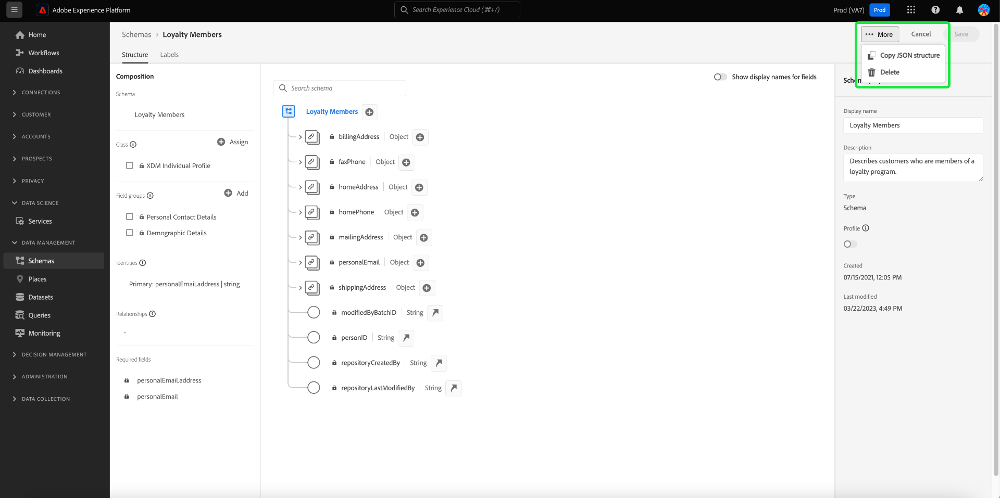

# Adobe Experience Platform 릴리스 정보

**릴리스 날짜: 2023년 9월 28일 금요일**

Adobe Experience Platform의 새로운 기능:

- [계산된 속성](#computed-attributes)

Experience Platform의 기존 기능 업데이트:

- [경고](#alerts)
- [대시보드](#dashboards)
- [데이터 수집](#data-collection)
- [데이터 거버넌스](#data-governance)
- [데이터 위생](#hygiene)
- [대상](#destinations)
- [경험 데이터 모델 (XDM)](#xdm)
- [ID 서비스](#identity-service)
- [쿼리 서비스](#query-service)
- [Segmentation Service](#segmentation)
- [소스](#sources)

## 계산된 속성 {#computed-attributes}

계산된 속성을 사용하면 향상된 동작 기반 세분화, 개인화 및 활성화를 위해 직관적인 UI를 통해 이벤트 데이터를 프로필 속성으로 쉽게 요약할 수 있습니다. 이 기능을 사용하면 셀프서비스 방식으로 계산된 속성을 만들고 관리하여 세그멘테이션, Real-Time CDP 대상 또는 Adobe Journey Optimizer에서 사용할 수 있습니다. 또한 계산된 속성은 세그멘테이션 및 여정 워크플로를 단순화하여 관련 경험을 원활하게 전달할 수 있습니다. 계산된 속성에 대해 자세히 알아보려면 다음을 참조하십시오. [계산된 속성 개요](../../profile/computed-attributes/overview.md).

## 경고 {#alerts}

Experience Platform을 사용하면 다양한 플랫폼 활동에 대한 이벤트 기반 경고를 구독할 수 있습니다. 다음을 통해 다양한 경고 규칙에 가입할 수 있습니다. [!UICONTROL 경고] Platform 사용자 인터페이스의 탭으로, UI 자체 내에서 또는 이메일 알림을 통해 경고 메시지를 수신하도록 선택할 수 있습니다.

**새로운 기능 또는 업데이트된 기능**

| 기능 | 설명 |
| --- | --- |
| 경고 내역 탭 | 경고 [!UICONTROL 기록] 이제 탭에는 지연, 시작, 성공 및 실패를 포함한 모든 이벤트가 포함됩니다. 읽기 [경고 UI 설명서](../../observability/alerts/ui.md) 기록 탭에 대한 자세한 내용은 |

{style="table-layout:auto"}

경고에 대한 자세한 내용은 [[!DNL Observability Insights] 개요](../../observability/home.md).

## 대시보드 {#dashboards}

Adobe Experience Platform에서 여러 기능 제공 [!DNL dashboards] 이를 통해 일별 스냅샷 중에 캡처한 조직 데이터에 대한 중요한 정보를 볼 수 있습니다.

| 기능 | 설명 |
| --- | --- |
| [라이선스 사용 대시보드 개선 사항](../../dashboards/guides/license-usage.md) | 조직의 라이선스 사용과 관련하여 향상된 보고 및 주요 지표 시각화를 통해 라이선스 계약을 계속 제어할 수 있습니다. 이러한 개선 사항은 구입한 모든 Experience Platform 제품에 대한 라이선스 사용 지표보다 높은 수준의 세부기간을 제공합니다. |

{style="table-layout:auto"}

라이선스 사용 대시보드에 대한 자세한 내용은 [라이선스 사용 대시보드 개요](../../dashboards/guides/destinations.md).

## 데이터 수집 {#data-collection}

Adobe Experience Platform은 클라이언트측 고객 경험 데이터를 수집하여 Adobe 또는 비 Adobe 대상으로 보강, 변환 및 배포가 가능한 Adobe Experience Platform Edge Network로 보낼 수 있는 기술 제품군을 제공합니다.

**새로운 기능 또는 업데이트된 기능**

| 유형 | 기능 | 설명 |
| --- | --- | --- |
| 데이터스트림 | 장치 조회 지원 | 이제 데이터 스트림을 구성할 때 수집할 디바이스 조회 정보 수준을 선택할 수 있습니다. 장치 조회 정보에는 페이지와 상호 작용하는 데 사용되는 장치, 하드웨어, 운영 체제 및 브라우저에 대한 데이터가 포함됩니다.    사용자 에이전트 및 클라이언트 힌트와 함께 디바이스 조회 정보를 수집할 수 없습니다. 디바이스 정보를 수집하도록 선택하면 사용자 에이전트 및 클라이언트 힌트 수집이 비활성화되고, 그 반대의 경우도 마찬가지입니다. 모든 장치 조회 정보는 `xdm:device` 필드 그룹입니다. 의 설명서에서 자세히 알아보기 [데이터스트림 구성](../../datastreams/configure.md#geolocation-device-lookup). |
| 확장 | [!DNL TikTok] 웹 이벤트 API 확장 | 다음 [[!DNL TikTok] 웹 이벤트 API](https://exchange.adobe.com/apps/ec/109834/tiktok-web-events-api) 확장을 사용하면 Adobe Experience Platform Edge Network에 캡처된 데이터를 활용하여 로 전송할 수 있습니다. [!DNL TikTok] 를 사용하는 서버측 이벤트 형식으로 [!DNL TikTok] 웹 이벤트 API. |

{style="table-layout:auto"}

데이터 수집에 대한 자세한 내용은 [데이터 수집 개요](../../tags/home.md).

## 데이터 거버넌스 {#data-governance}

Adobe Experience Platform 데이터 거버넌스는 고객 데이터를 관리하고 데이터 사용에 적용되는 규정, 제한 및 정책을 준수하는 데 사용되는 일련의 전략 및 기술입니다. 이 기능은 Experience Platform 내 카탈로그 작성, 데이터 계통 확인, 데이터 사용 라벨링, 데이터 액세스 정책, 마케팅 액션을 위한 데이터 액세스 제어 등 다양한 수준에서 주요 역할을 합니다.

**새로운 기능**

| 기능 | 설명 |
| --- | --- |
| 서드파티 데이터에 대한 새로운 파트너 에코시스템 레이블 | 타사 데이터 보강 및 잠재 고객 확보를 위한 새로운 데이터 사용 레이블 제공 다음을 참조하십시오. [파트너 에코시스템 레이블에 대한 설명서](../../data-governance/labels/reference.md#partner) 추가 정보. |

{style="table-layout:auto"}

데이터 거버넌스에 대해 자세히 알아보려면 [데이터 거버넌스 개요](../../data-governance/home.md)를 참조하십시오.

## 데이터 위생 {#hygiene}

Experience Platform은 소비자 레코드 및 데이터 세트에 대한 프로그래밍 방식 삭제를 통해 저장된 데이터를 관리할 수 있는 데이터 위생 기능 제품군을 제공합니다. 다음 중 하나를 사용합니다. [!UICONTROL 데이터 수명 주기] ui의 작업 영역 또는 데이터 위생 API 호출을 통해 데이터 스토어를 효과적으로 관리할 수 있습니다. 이러한 기능을 사용하여 정보가 예상대로 사용되고, 잘못된 데이터를 수정해야 할 때 업데이트되고, 조직 정책에서 필요하다고 판단할 때 삭제되도록 하십시오.

**새로운 기능**

| 기능 | 설명 |
| --- | --- |
| [!BADGE Beta]{type=Informative} | Adobe Experience Platform의 고급 데이터 라이프사이클 관리 기능인 자동화된 데이터 세트 만료 및 레코드 삭제 를 사용하여 고객 약속 및 라이선스 계약을 충족하도록 모든 데이터 저장소에서 데이터 라이프사이클을 관리합니다. 자동화된 데이터 세트 만료로 전체 데이터 세트를 삭제하고 데이터 세트를 삭제할 날짜 및 시간을 설정할 수 있습니다. 레코드 삭제를 사용하면 기본 ID를 타겟팅하여 개별 소비자 프로필을 삭제할 수 있습니다. UI를 통해 또는 CSV/JSON 파일 업로드를 통해 개별적으로 기본 ID를 제공할 수 있습니다. 다음을 참조하십시오. [레코드 삭제 설명서](../../hygiene/ui/record-delete.md) 추가 정보 |
| 데이터 세트 만료 | 자동화된 데이터 세트 만료로 데이터를 최소화하고 라이선스 계약을 계속 제어할 수 있습니다. 전체 데이터 세트를 삭제하여 데이터 볼륨을 줄이고 데이터 세트를 삭제할 날짜와 시간을 설정합니다. 다음을 참조하십시오. [데이터 세트 만료 설명서](../../hygiene/ui/dataset-expiration.md) 추가 정보. |

{style="table-layout:auto"}

플랫폼의 데이터 위생 기능에 대한 자세한 내용은 다음을 참조하십시오. [데이터 위생 개요](../../hygiene/home.md).

## 대상 {#destinations}

[!DNL Destinations]는 Adobe Experience Platform에서 데이터를 원활하게 활성화할 수 있는 대상 플랫폼과 사전 설치된 통합입니다. 대상을 사용해 크로스 채널 마케팅 캠페인, 이메일 캠페인, 타겟팅 광고 및 기타 많은 사용 사례를 위해 알려진 데이터와 알 수 없는 데이터를 활성화할 수 있습니다.

**새로운 대상 또는 업데이트된 대상** {#new-updated-destinations}

| 대상 | 새로운 기능 또는 업데이트된 기능 | 설명 |
| ----------- |----------------|----------- |
| [[!DNL LiveRamp - Distribution]](../../destinations/catalog/advertising/liveramp-distribution.md) | 새로운 기능 | 이전에 온보딩된 대상 활성화 [!DNL LiveRamp] 모바일, 웹, 디스플레이 및 연결된 TV 매체의 프리미엄 게시자에게   대상자를 로 온보딩한 후 [!DNL LiveRamp] 계정 스루 [라이브 램프 - 온보딩](../../destinations/catalog/advertising/liveramp-onboarding.md) 연결, 새 연결 사용 [[!DNL LiveRamp - Distribution]](../../destinations/catalog/advertising/liveramp-distribution.md) 연결을 통해 대상자를 다운스트림 대상으로 활성화합니다. |
| [[!DNL HubSpot]](../../destinations/catalog/crm/hubspot.md) | 새로운 기능 | [[!DNL HubSpot]](https://www.hubspot.com) 는 마케팅, 판매, 콘텐츠 관리 및 고객 서비스를 연결하는 데 필요한 모든 소프트웨어, 통합 및 리소스가 포함된 CRM 플랫폼입니다. 이를 통해 하나의 CRM 플랫폼에서 데이터, 팀 및 고객을 연결할 수 있습니다. |
| [[!DNL Microsoft Dynamics 365]](../../destinations/catalog/crm/microsoft-dynamics-365.md) | 업데이트된 기능 | 에 대한 지원이 추가됨 [!DNL Dynamics 365] 의 기본 솔루션 내에서 만들어지지 않은 사용자 정의 필드에 대한 사용자 정의 필드 접두사 [!DNL Dynamics 365]. 새 입력 필드, **[!UICONTROL 사용자 지정 접두사]**&#x200B;이(가)에 추가되었습니다. [대상 세부 정보 입력](#destination-details) 단계. |
| [[!DNL Experience Cloud Audiences]](../../destinations/catalog/adobe/experience-cloud-audiences.md) | 업데이트된 기능 | 이제 Experience Cloud 대상 을 일반적으로 사용할 수 있습니다. 이 대상을 사용하여 Real-Time CDP에서 Audience Manager 및 Adobe Analytics으로 대상을 활성화합니다. Adobe Analytics에 대상을 보내려면 Audience Manager 라이선스가 필요합니다. |

{style="table-layout:auto"}

<!-- 

Add these to release notes as they go out

| [[!DNL Qualtrics]] | New | Use the aggregation of multiple sources of operational data in Adobe Experience Platform as an input in Qualtrics Experience ID to better understand your customers and enable targeted outreach to close the gap when it comes to understanding intent, emotion and experience drivers. | 

-->

**새로운 기능 또는 업데이트된 기능** {#destinations-new-updated-functionality}

| 기능 | 설명 |
| ----------- | ----------- |
| Real-Time CDP의 데이터 내보내기 | 다음 [데이터 세트 내보내기](../../destinations/ui/export-datasets.md) 이제 기능을 일반적으로 사용할 수 있습니다. 다음을 참조하십시오 [Experience Platform 앱을 기반으로 내보낼 수 있는 데이터 세트](../../destinations/ui/export-datasets.md#datasets-to-export) 을(를) 구입하고 다음을 확인하십시오. [데이터 세트 내보내기 보호](/help/destinations/guardrails.md#dataset-exports). |
| (베타) 배열 유형 개체 내보내기 지원 | 기본 값(문자열, int 또는 부울 값) 배열을 클라우드 스토리지 대상에 플랫 스키마 파일로 내보냅니다. 의 기능에 대해 자세히 알아보십시오 [설명서](../../destinations/ui/export-arrays-calculated-fields.md). |
| Destination SDK의 동적 드롭다운 선택기 | 이제 Destination SDK을 통해 대상을 만들 때 다음을 사용할 수 있습니다. [동적 드롭다운 선택기](../../destinations/destination-sdk/functionality/destination-configuration/customer-data-fields.md#dynamic-dropdown-selectors) 드롭다운 선택기의 필드를 API에서 검색한 값으로 채우기. |

**수정 사항 및 개선 사항** {#destinations-fixes-and-enhancements}

- 활용 [투명도 모니터링](../../dataflows/ui/monitor-destinations.md#dataflow-runs-for-streaming-destinations) 이제 엔터프라이즈 대상에 사용할 수 있습니다([HTTP API](../../destinations/catalog/streaming/http-destination.md), [Amazon Kinesis](../../destinations/catalog/cloud-storage/amazon-kinesis.md) 및 [Azure 이벤트 허브](../../destinations/catalog/cloud-storage/azure-event-hubs.md))에서 활성화 지표 및 상태를 모니터링하기 위한 데이터 흐름 실행 수준 [데이터 흐름 세부 정보 보기](../../dataflows/ui/monitor-destinations.md#dataflow-run-details-page)문제 해결을 위한 오류 코드 및 메시지를 통한 추가 정보 포함
- 에 매핑된 대상자의 이름을 업데이트할 때 [Google Ad Manager](../../destinations/catalog/advertising/google-ad-manager.md), [Google Display &amp; Video 360](../../destinations/catalog/advertising/google-dv360.md)를 사용하는 및 기타 대상 [대상자 업데이트 템플릿](../../destinations/destination-sdk/metadata-api/update-audience-template.md), 이제 이러한 이름 변경 사항이 대상에 다운스트림에 반영됩니다.

대상에 대한 일반적인 정보는 [대상 개요](../../destinations/home.md)를 참조하십시오.

## 경험 데이터 모델 (XDM) {#xdm}

XDM은 Adobe Experience Platform으로 가져오는 데이터에 대한 공통 구조 및 정의(스키마)를 제공하는 오픈 소스 사양입니다. XDM 표준을 준수하여 모든 고객 경험 데이터를 공통된 표현에 통합해 보다 빠르고 통합된 방식으로 인사이트를 제공할 수 있습니다. 고객 조치에서 귀중한 인사이트를 얻고, 세그먼트를 통해 고객 대상자를 정의하고, 개인 설정 목적으로 고객 속성을 사용할 수 있습니다.

**새로운 기능**

| 기능 | 설명 |
| --- | --- |
| 스키마 편집기에 추가된 빠른 작업 | 스키마 편집기의 캔버스에 새로운 빠른 작업이 추가되었습니다. 이제 JSON 구조를 복사하거나 편집기에서 직접 스키마를 삭제할 수 있습니다. {width="100" zoomable="yes"} |
| 사용자 지정 또는 표준 작성자별로 XDM 리소스 필터링 | 이제 사용 가능한 스키마, 필드 그룹, 데이터 형식 및 클래스 목록이 해당 생성 방법에 따라 사전 필터링됩니다. 따라서 리소스가 사용자 지정 빌드되었는지 또는 Adobe에 의해 만들어졌는지 여부에 따라 리소스를 필터링할 수 있습니다. {width="100" zoomable="yes"}   다음을 참조하십시오. [리소스 만들기 및 편집 설명서](../../xdm/ui/resources/classes.md#filter.md) 추가 정보. |

**업데이트된 기능**

| 기능 | 설명 |
| --- | --- |
| 업데이트된 스키마 생성 워크플로 | 프로세스를 간소화하기 위해 새로운 스키마 생성 워크플로우가 구현되었습니다.   {width="100" zoomable="yes"}   다음을 참조하십시오. [스키마 생성 설명서](../../xdm/ui/resources/schemas.md#create) 추가 정보. |

**새로운 XDM 구성 요소**

| 구성 요소 유형 | 이름 | 설명 |
| --- | --- | --- |
| 데이터 유형 | [[!UICONTROL 반환]](https://github.com/adobe/xdm/pull/1773/files) | RMA(반품 상품 승인)가 발행되었습니다. |
| 데이터 유형 | [[!UICONTROL 항목 반환]](https://github.com/adobe/xdm/pull/1773/files) | RMA(Return Merchandise Authorization) 내에서 반품 품목 정보. |

{style="table-layout:auto"}

**업데이트된 XDM 구성 요소**

| 구성 요소 유형 | 이름 | 설명 업데이트 |
| --- | --- | --- |
| 확장 기능 | [!UICONTROL AJO 엔티티 필드] | 다음 [[!UICONTROL 다중 변형에 대한 플래그]](https://github.com/adobe/xdm/pull/1774/files) 이(가)에 추가되었습니다. [!UICONTROL AJO 엔티티 필드] 변형이 다중 변형인지 여부를 식별합니다. |
| 데이터 유형 | [!UICONTROL 제품 목록 항목] | [[!UICONTROL 항목 반환]](https://github.com/adobe/xdm/pull/1773/files) 반품 승인 정보를 포함하도록 가 추가되었습니다. |
| 데이터 유형 | 주문 | [[!UICONTROL 반환 정보]](https://github.com/adobe/xdm/pull/1773/files) rma(Return Merchandises Authorization)를 발행하기 위해 가 추가되었습니다. |

{style="table-layout:auto"}

Platform의 XDM에 대한 자세한 내용은 [XDM 시스템 개요](../../xdm/home.md)를 참조하십시오.

## ID 서비스 {#identity-service}

Adobe Experience Platform ID 서비스는 여러 디바이스 및 시스템에 걸쳐 ID를 연결하여 고객과 고객의 행동을 종합적으로 파악할 수 있으므로, 실시간으로 효과적인 개인 디지털 환경을 제공할 수 있습니다.

**새로운 기능 또는 업데이트된 기능**

| 기능 | 설명 |
| --- | --- |
| ID 서비스 UI 개선 사항 | Experience Platform UI에서 향상된 사용자 정의 네임스페이스 만들기 도구를 사용하여 사용자 정의 네임스페이스 및 해당 ID 유형을 보다 효율적으로 관리할 수 있습니다. 향상된 ID 서비스 UI는 다음과 같은 기능을 제공합니다. <ul><li>컨텍스트 경험: ID 네임스페이스 및 ID 유형에 대한 시각적 큐, 명확성 및 컨텍스트입니다.</li><li>정확성: 더 이상 중복 ID 이름이 없어 오류 처리가 향상됩니다.</li><li>검색 기능: 제품 내 대화 상자에서 문서에 액세스합니다.</li></ul> 자세한 내용은 의 안내서를 참조하십시오. [사용자 정의 네임스페이스 만들기](../../identity-service/features/namespaces.md#create-namespaces). |
| ID 그래프 제한 변경 | ID 그래프 제한이 150개의 ID에서 50개의 ID로 변경되었습니다. 새 ID가 전체 그래프에 수집되면 수집 타임스탬프와 ID 유형에 따라 가장 오래된 ID가 삭제됩니다. 쿠키 ID 유형은 삭제 우선 순위가 지정됩니다. 프로덕션 샌드박스에 다음이 포함된 경우 Adobe 계정 팀에 문의하여 ID 유형 변경을 요청하십시오. <ul><li>개인 식별자(예: CRM ID)가 쿠키/장치 ID 유형으로 구성되는 사용자 정의 네임스페이스입니다.</li><li>쿠키/장치 식별자가 교차 장치 ID 유형으로 구성된 사용자 지정 네임스페이스입니다.</li></ul> Adobe 엔지니어링에서 이러한 요청을 수동으로 처리합니다. 자세한 내용은 [id 서비스 데이터 보호](../../identity-service/guardrails.md) 및 다음에 대한 안내서: [데이터 관리 라이선스 권한 부여 모범 사례](../../landing/license-usage-and-guardrails/data-management-best-practices.md). |

{style="table-layout:auto"}

ID 서비스에 대한 자세한 내용은 [ID 서비스 개요](../../identity-service/home.md).

## 쿼리 서비스 {#query-service}

쿼리 서비스를 사용하면 표준 SQL로 Adobe Experience Platform [!DNL Data Lake]에서 데이터를 쿼리할 수 있습니다. 에서 모든 데이터 세트를 결합할 수 있습니다. [!DNL Data Lake] 보고, Data Science Workspace에 사용하거나 실시간 고객 프로필로 수집하기 위한 새 데이터 세트로 쿼리 결과를 캡처합니다.

**업데이트된 기능**

| 기능 | 설명 |
| --- | --- |
| 로그 필터링 UI 업데이트 | 향상된 쿼리 로그 필터링은 모니터링, 관리 및 문제 해결을 위해 사용자 생성 로그에 대한 가시성을 향상시킵니다. 다양한 설정을 기반으로 쿼리 로그 목록을 필터링할 수 있습니다.   {width="100" zoomable="yes"}    다음을 참조하십시오. [쿼리 로그 설명서](../../query-service/ui/query-logs.md#filter-logs) 추가 정보. |
| 여러 쿼리 편집기 UI 업데이트 | 이제 쿼리 편집기에서 여러 순차적 쿼리를 실행하거나 둘 이상의 쿼리를 작성하고 모든 쿼리를 순차적 방식으로 실행할 수 있습니다. 쿼리 실행에 유연성을 더하기 위해 선택한 쿼리를 강조 표시하고 다른 쿼리와 독립적으로 실행할 특정 쿼리를 선택할 수 있습니다. 다음을 참조하십시오. [쿼리 편집기 UI 안내서](../../query-service/ui/user-guide.md#execute-multiple-sequential-queries) 추가 정보. |

{style="table-layout:auto"}

쿼리 서비스에 대한 자세한 내용은 [쿼리 서비스 개요](../../query-service/home.md)를 참조하십시오.

## Segmentation Service {#segmentation}

[!DNL Segmentation Service]를 사용하여 개인 사용자(예: 고객, 잠재 고객, 사용자 또는 조직)와 관련된 [!DNL Experience Platform]에 저장된 데이터를 대상자로 세분화할 수 있습니다. 세그먼트 정의 또는 [!DNL Real-Time Customer Profile] 데이터의 다른 소스를 통해 대상자를 만들 수 있습니다. 이러한 대상자는 [!DNL Platform]을 통해 중앙 집중식으로 구성 및 유지 관리되고 모든 Adobe 솔루션에서 쉽게 액세스할 수 있습니다.

**새로운 기능 또는 업데이트된 기능**

| 기능 | 설명 |
| ------- | ----------- |
| 사용자 정의 가능한 열 | 이제 크기 조정 가능한 열을 사용하여 Audience Portal의 레이아웃을 사용자 정의할 수 있습니다. 이 기능에 대한 자세한 내용은 [세그멘테이션 UI 안내서](../../segmentation/ui/overview.md#customize). |
| 빈도 분류 업데이트 | 이제 조직 내 대상자의 업데이트 주기 분류를 볼 수 있습니다. 이 기능에 대한 자세한 내용은 [세그멘테이션 UI 안내서](../../segmentation/ui/overview.md#browse). |

세분화 서비스에 대한 자세한 내용은 [세그먼테이션 서비스 개요](../../segmentation/home.md).

## 소스 {#sources}

Experience Platform은 다양한 데이터 공급자에 대한 소스 연결을 쉽게 설정할 수 있는 RESTful API 및 대화형 UI를 제공합니다. 이러한 소스 연결을 통해 외부 스토리지 시스템 및 CRM 서비스에 인증 및 연결하고, 수집 실행 시간을 설정하고, 데이터 수집 처리량을 관리할 수 있습니다.

**새로운 기능 또는 업데이트된 기능**

| 기능 | 설명 |
| --- | --- |
| 에 대한 새 매개 변수 `offset` 셀프서비스 소스의 페이지 매김(일괄 SDK) | 이제 다음을 지정할 수 있습니다. `endConditionName` 및 `endConditionValue` 를 사용할 때 소스에 대해 `offset` 페이지 매김. 이러한 매개 변수를 사용하면 다음 HTTP 요청에서 페이지 매김 루프를 종료하는 조건을 나타낼 수 있습니다. 자세한 내용은 [셀프서비스 소스에 대한 페이지 매김 안내서(일괄 처리 SDK)](../../sources/sources-sdk/config/sourcespec.md#pagination). |

{style="table-layout:auto"}

소스에 대해 자세히 알아보려면 [소스 개요](../../sources/home.md).
