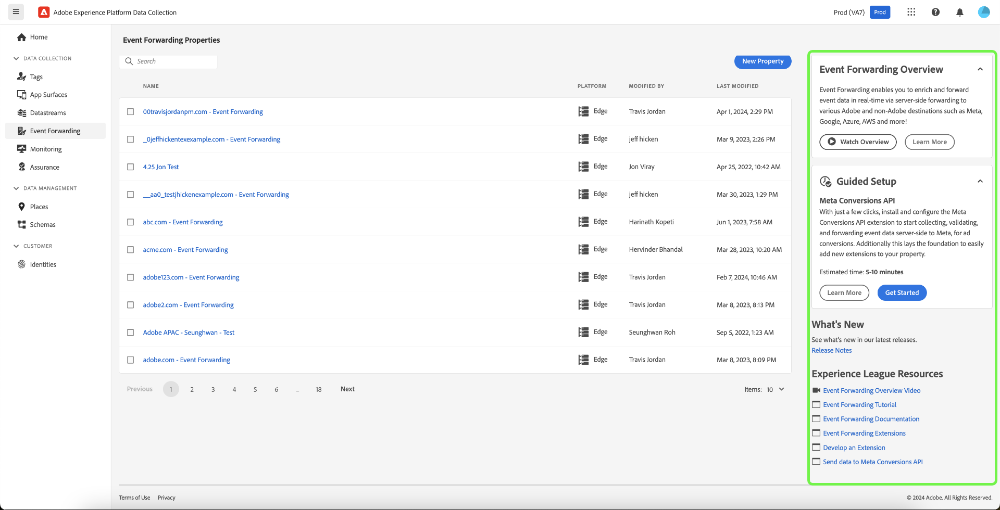

# Adobe Experience Platform 릴리스 정보

**릴리스 일자: 2024년 4월 30일**

>[!TIP]
>
>[Adobe Experience Platform 용어집](/help/landing/glossary.md)을 사용하여 Real-Time Customer Data Platform과 Adobe Experience Platform에서 사용되는 용어를 살펴보십시오. 찾고 있는 특정 용어가 없다면 페이지의 피드백 옵션을 사용하여 용어집에 새 용어를 추가할 것을 요청할 수 있습니다.

Experience Platform의 기존 기능 업데이트:

- [대시보드](#dashboards)
- [데이터 수집](#data-collection)
- [대상](#destinations)
- [ID 서비스](#identity-service)
- [모니터링](#monitoring)
- [쿼리 서비스](#query-service)
- [샌드박스](#sandboxes)
- [Segmentation Service](#segmentation)
- [소스](#sources)

## 대시보드 {#dashboards}

Adobe Experience Platform은 일일 스냅샷 중에 캡처된 조직 데이터에 대한 중요한 인사이트를 볼 수 있는 여러 대시보드를 제공합니다.

**새로운 기능 또는 업데이트된 기능**

| 기능 | 설명 |
| --- | --- |
| Real-Time CDP B2B 인사이트 | [계정 및 기회에 대한 사전 구성된 Real-Time CDP B2B 데이터 인사이트](../../dashboards/insights/account-profiles.md)를 살펴보고 데이터를 파악하고 비즈니스 결정에 도움을 받으십시오. 또한 [Real-Time CDP B2B 데이터 모델을 사용하여 자신만의 인사이트를 구축](../../dashboards/data-models/cdp-insights-data-model-b2c.md)하고 데이터를 시각화하고 탐색하고 대시보드에 사용자 정의 시각화를 저장할 수도 있습니다. |

{style="table-layout:auto"}

액세스 권한을 부여하고 사용자 정의 위젯을 만드는 방법을 포함해 대시보드에 대한 자세한 내용은 [대시보드 개요](../../dashboards/home.md)를 읽어 보십시오.

## 데이터 수집 {#data-collection}

Adobe Experience Platform은 클라이언트측 고객 경험 데이터를 수집하여 Adobe 또는 비 Adobe 대상으로 보강, 변환 및 배포가 가능한 Experience Platform Edge Network로 보낼 수 있는 기술 제품군을 제공합니다.

**새로운 기능 또는 업데이트된 기능**

| 유형 | 기능 | 설명 |
| --- | --- | --- |
| 확장 | [!DNL Acxiom Anonymous Visitor Insights] 태그 확장 기능 | 웹 사이트 방문자가 [!DNL Acxiom's Visitor Insights]를 통해 어디에서 왔는지 알아볼 수 있습니다. Acxiom은 지리적 IP 조회 기술을 활용하여 익명 브라우저의 위치를 정확히 파악할 수 있습니다. 위치를 파악하면 정리된 데이터베이스에서 검색하여 브라우저로 다시 전송되는 추가 인사이트를 얻을 수 있습니다. 따라서 콘텐츠 제작자는 낯선 사람으로 시작하더라도 이러한 데이터 포인트에 맞게 콘텐츠를 조정하여 방문자에게 보다 개인화된 매력적인 경험을 제공할 수 있습니다. |
| 데이터스트림 | [Edge Network 봇 탐지](../../datastreams/bot-detection.md) | 자동화된 프로그램, 웹 스크래퍼, 스파이더, 스크립트 스캐너 등 비인간 엔티티에서 발생하는 트래픽으로 인해 방문자로부터 발생하는 이벤트를 식별하기가 더 어려워질 수 있습니다. 이러한 유형의 트래픽은 중요한 비즈니스 지표에 부정적인 영향을 미쳐 잘못된 트래픽 보고로 이어질 수 있습니다.  봇 탐지 기능을 사용하면 [Web SDK](../../web-sdk/home.md), [Mobile SDK](https://developer.adobe.com/client-sdks/home/) 및 [[!DNL Server API]](../../server-api/overview.md)에서 생성된 이벤트가 알려진 스파이더 및 봇에 의해 생성된 것으로 식별할 수 있습니다. 데이터스트림에 봇 탐지를 구성하면 봇 이벤트로 분류할 특정 IP 주소, IP 범위 및 요청 헤더를 식별할 수 있습니다.   봇 트래픽을 식별하면 사이트 또는 모바일 애플리케이션에서 사용자 활동을 보다 정확하게 측정할 수 있습니다. |
| Mobile SDK | 주요 버전 출시 | Mobile SDK의 새로운 주요 버전이 iOS Mobile Core 5.x 및 호환되는 iOS 확장 기능, Android Mobile Core 3.x 및 호환되는 Android 확장 기능, React Native Core 6.x 및 호환되는 React Native 확장 기능, Flutter Core 4.x 및 호환 Flutter 확장 기능 플랫폼용으로 출시되었습니다. 이 릴리스는 Jetpack Compose용 Android SDK 지원, Adobe Journey Optimizer 코드 기반 환경 지원, Flutter용 Adobe Journey Optimizer 메시지 확장 기능의 일반적인 가용성 등 몇 가지 새로운 기능과 향상된 기능을 제공합니다. 더 자세한 릴리스 정보를 보려면 [Mobile SDK 릴리스 정보](https://developer.adobe.com/client-sdks/home/release-notes/)를 참조하십시오. |
| Mobile SDK | 개인 정보 보호 | Apple의 정책 업데이트로 인해 2024년 5월 1일부터 개발자는 App Store에 제출하기 위해 새로운 개인 정보 보호 기능을 구현해야 합니다. Mobile SDK를 사용하는 모든 Adobe 고객은 5월 1일 이후 App Store 승인을 받으려면 SDK 버전 5.x로 업그레이드해야 합니다. |
| Roku SDK | Roku SDK | Platform Edge Network용 스트리밍 미디어를 지원하는 Roku SDK의 첫 번째 주요 버전이 출시되었습니다. |
| 태그 및 이벤트 전달 | 제품 내 지침 | Experience Platform [태그](../../tags/home.md) 및 [이벤트 전달](../../tags/ui/event-forwarding/overview.md)이 빠르게 시작하고 가치 실현 시간을 단축하는 데 도움이 되는 새로운 범위의 경험을 제공합니다. 이러한 경험에는 새로운 온보딩 화면, 제품 내 튜토리얼, 도구 설명이 포함됩니다.  {width="100" zoomable="yes"}  |
| Web SDK | Audience Manager 고객을 위해 간소화된 Web SDK 도입 | 이제 여러 Web SDK 업데이트를 통해 Audience Manager, Analytics 및 Target과 같은 Experience Cloud 솔루션용 경험 데이터 모델(XDM)을 사용하지 않고도 Web SDK의 채택을 간소화할 수 있습니다. 다음 안내서에서 Audience Manager Web SDK 도입에 대해 자세히 알아보십시오. <ul><li><a href="https://experienceleague.adobe.com/ko/docs/audience-manager/user-guide/migrate-to-web-sdk/dil-extension-to-web-sdk">Audience Manager 태그 확장에서 Web SDK 태그 확장으로 Audience Manager용 데이터 수집 라이브러리 업데이트</li><li><a href="https://experienceleague.adobe.com/ko/docs/audience-manager/user-guide/migrate-to-web-sdk/appmeasurement-to-web-sdk">AppMeasurement JavaScript 라이브러리에서 Web SDK JavaScript 라이브러리로 Audience Manager용 데이터 수집 라이브러리 업데이트</li></ul> |

{style="table-layout:auto"}

<!--| Web SDK | [Streaming Media Collection support in Web SDK](../../web-sdk/commands/configure/streamingmedia.md) | You can now use Experience Platform Web SDK to collect data related to media sessions on your website. The collected data can include information about media playbacks, pauses, completions, and other related events. Once collected, you can send this data to Adobe Experience Platform and/or Adobe Analytics, to generate reports. This feature provides a comprehensive solution for tracking and understanding media consumption behavior on your website.  See the [Web SDK](../../web-sdk/commands/configure/streamingmedia.md) documentation to learn how to configure the `streamingMedia` component.  See the guide on [migrating your Analytics for Streaming Media implementation from Media JS to Web SDK](https://experienceleague.adobe.com/en/docs/media-analytics/using/implementation/edge-recommended/media-edge-sdk/edge-web-sdk) for more details.|-->

데이터 수집에 대해 자세히 알아보려면 [데이터 수집 개요](../../collection/home.md)를 참조하십시오.

## 대상 {#destinations}

[!DNL Destinations]는 Adobe Experience Platform에서 데이터를 원활하게 활성화할 수 있는 대상 플랫폼과 사전 설치된 통합입니다. 대상을 사용해 크로스 채널 마케팅 캠페인, 이메일 캠페인, 타겟팅 광고 및 기타 많은 사용 사례를 위해 알려진 데이터와 알 수 없는 데이터를 활성화할 수 있습니다.

**새로운 기능 또는 업데이트된 기능** {#destinations-new-updated-functionality}

| 기능 | 설명 |
| ----------- | ----------- |
| 이제 Destination SDK의 중첩된 고객 데이터 필드에 `isRequired` 매개변수를 사용할 수 있습니다 | 이제 Destination SDK에서 대상을 구성할 때 [필요에 따라 중첩된 고객 데이터 필드를 설정](/help/destinations/destination-sdk/functionality/destination-configuration/customer-data-fields.md#nested-fields)할 수 있습니다. 이렇게 하면 대상을 설정하는 사용자는 해당 필드의 값을 선택할 때까지 활성화 흐름을 진행할 수 없습니다. |
| Web SDK로 Adobe Target 대상을 설정할 때 에지 세분화가 더 이상 필수 사항이 아닙니다. | 이전에는 Web SDK로 [Adobe Target 대상](/help/destinations/catalog/personalization/adobe-target-connection.md)을 구성할 때 개인화 및 에지 세분화를 위해 데이터스트림을 활성화해야 했습니다. 이제 에지 세분화를 위해 데이터스트림을 사용해야 하는 요구 사항이 [제거되었습니다](/help/destinations/ui/activate-edge-personalization-destinations.md#configure-datastream). 이 통합 패턴을 사용하면 Real-Time CDP와 함께 Adobe Target을 사용할 때만 일부 개인화 사용 사례의 이점을 얻을 수 있습니다. [통합 유형별로 활성화된 사용 사례](/help/destinations/catalog/personalization/adobe-target-connection.md#supported-use-cases)에 대해 자세히 알아보십시오. |
| [!BADGE Beta] {type=Informative} 활성화 흐름에서 여러 대상자 및 데이터 세트 제거 | 이제 대상 활성화 흐름에서 여러 대상자 및 데이터 세트를 선택하고 제거할 수 있습니다. 자세한 내용은 [대상 세부 정보](../../destinations/ui/destination-details-page.md#bulk-remove) 및 [데이터 세트 내보내기](../../destinations/ui/export-datasets.md) 설명서를 참조하십시오. |

{style="table-layout:auto"}

대상에 대한 일반적인 정보는 [대상 개요](../../destinations/home.md)를 참조하십시오.

## ID 서비스 {#identity-service}

Adobe Experience Platform ID 서비스를 사용하여 여러 디바이스 및 시스템에 걸쳐 ID를 연결하여 고객과 고객의 행동을 종합적으로 파악할 수 있으므로, 실시간으로 효과적인 개인 디지털 환경을 제공할 수 있습니다.

**업데이트된 기능**

| 기능 | 설명 |
| --- | --- |
| API에서 `/orgs/{ORG}/` 엔드포인트 사용 중단 | [[!DNL Identity Service] API](https://developer.adobe.com/experience-platform-apis/references/identity-service/)에서 다음 엔드포인트가 사용되지 않았습니다.<ul><li>`https://platform.adobe.io/data/core/idnamespace/orgs/{ORG}/identities`</li><li>`https://platform.adobe.io/data/core/idnamespace/orgs/{ORG}/identities/{ID}`</li></ul> `/idnamespace/identities` 및 `/idnamespace/identities/{ID}` 엔드포인트를 사용하여 동일한 작업을 수행하고 조직의 모든 네임스페이스 또는 조직의 특정 네임스페이스를 검색할 수 있습니다. |

{style="table-layout:auto"}

ID 서비스에 대한 자세한 내용은 [ID 서비스 개요](../../identity-service/home.md)를 참조하십시오.

## 모니터링 {#monitoring}

Experience Platform UI의 모니터링 대시보드를 사용하여 소스, ID 서비스, 실시간 고객 프로필, 대상자 및 대상에서 데이터의 여정을 모니터링합니다.

**업데이트된 기능**

| 기능 | 설명 |
| --- | --- |
| 모니터링 대시보드 확장 | 이제 비즈니스 사용 사례에 따라 다양한 데이터 유형에 모니터링 대시보드를 사용할 수 있습니다. 모니터링 대시보드를 사용하여 소스, 대상자 및 대상의 사용자, 계정 및 잠재 고객 데이터 유형 활동을 모니터링합니다. |

{style="table-layout:auto"}

자세한 내용은 [모니터링 대시보드 사용](../../dataflows/ui/monitor.md)에 관한 안내서를 참조하십시오.

## 쿼리 서비스 {#query-service}

쿼리 서비스를 사용하면 표준 SQL로 Adobe Experience Platform [!DNL Data Lake]에서 데이터를 쿼리할 수 있습니다. [!DNL Data Lake]의 데이터 세트에 참여하고 쿼리 결과를 보고 또는 데이터 과학 작업 영역에 사용하거나 실시간 고객 프로필에 수집하기 위한 새 데이터 세트로 캡처할 수 있습니다.

**업데이트된 기능**

| 기능 | 설명 |
| --- | --- |
| 쿼리 격리 | 실패한 쿼리 실행을 자동으로 분리하여 중단을 방지하고 일관된 성능을 유지합니다. 자세한 내용은 [쿼리 격리](../../query-service/ui/query-schedules.md#quarantine) 설명서를 참조하십시오. |
| 쿼리 취소 | 쿼리 실행을 제어하고 장기 실행 중인 쿼리를 취소하여 생산성을 향상시킬 수 있습니다. 자세한 내용은 [쿼리 취소](../../query-service/ui/user-guide.md#cancel-query) 설명서를 참조하십시오. |
| 예약된 쿼리 경고 | 쿼리를 예약하는 동안 사전 알림을 통해 정보를 파악하여 효율적이고 시기적절한 작업을 관리할 수 있습니다. [쿼리를 생성할 때 경고를 구독](../../query-service/ui/query-schedules.md#alerts-for-query-status)하거나 기존 예약된 쿼리에 대해 인라인 액션을 사용할 수 있습니다. 자세한 내용은 [인라인 액션이 포함된 알림 구독](../../query-service/ui/monitor-queries.md#alert-subscription) 설명서를 참조하십시오. |
| 향상된 예약된 쿼리 탐색 | 쿼리 템플릿과 예약된 실행 사이를 쉽게 탐색하여 생산성을 높일 수 있습니다. 자세한 내용은 [예약된 쿼리 실행 보기](../../query-service/ui/query-schedules.md#scheduled-query-runs)의 설명서를 참조하십시오. |
| 확장된 쿼리 출력 | 콘솔 내 최대 500개 행의 쿼리 결과에 액세스하여 데이터를 심층적으로 분석할 수 있습니다. 자세한 내용은 [결과 수](../../query-service/ui/user-guide.md#result-count) 설명서를 참조하십시오. |
| 레거시 쿼리 편집기 만료 | 2024년 4월 30일부터 모든 사용자의 기본 편집기가 향상된 쿼리 편집기로 되었습니다. 레거시 편집기는 2024년 5월 24일부터 사용이 중단되어 더 이상 사용할 수 없습니다. 자세한 내용은 [쿼리 편집기 사용 안내서](../../query-service/ui/user-guide.md)를 참조하십시오. |

{style="table-layout:auto"}

쿼리 서비스에 대한 자세한 내용은 [쿼리 서비스 개요](../../query-service/home.md)를 참조하십시오.

## 샌드박스 {#sandboxes}

Adobe Experience Platform은 전 세계적으로 디지털 체험 애플리케이션을 풍부하게 제공하기 위해 구축되었습니다. 기업은 여러 디지털 경험 애플리케이션을 동시에 실행하는 경우가 많으며, 운영 규정 준수를 보장하면서 이러한 애플리케이션의 개발, 테스트 및 배포를 처리해야 합니다. 이러한 필요를 처리하기 위해 Experience Platform은 디지털 경험 애플리케이션을 개발하고 발전시키는 데 도움이 되는 단일 플랫폼 인스턴스를 별도의 가상 환경으로 분할하는 샌드박스를 제공합니다.

**새로운 기능 또는 업데이트된 기능**

| 기능 | 설명 |
| --- | --- |
| [샌드박스 도구](../../sandboxes/ui/sandbox-tooling.md) | 샌드박스 도구를 사용하여 지원되는 모든 오브젝트 유형을 전체 샌드박스 패키지로 [내보낸](../../sandboxes/ui/sandbox-tooling.md#export-entire-sandbox) 다음 다양한 샌드박스에서 패키지를 [가져와](../../sandboxes/ui/sandbox-tooling.md#import-entire-sandbox) 오브젝트 구성을 복제합니다. |

{style="table-layout:auto"}

샌드박스에 대한 자세한 내용은 [샌드박스 개요](../../sandboxes/home.md)를 참조하십시오.

## Segmentation Service {#segmentation}

[!DNL Segmentation Service]를 사용하여 개인 사용자(예: 고객, 잠재 고객, 사용자 또는 조직)와 관련된 [!DNL Experience Platform]에 저장된 데이터를 대상자로 세분화할 수 있습니다. 세그먼트 정의 또는 [!DNL Real-Time Customer Profile] 데이터의 다른 소스를 통해 대상자를 만들 수 있습니다. 이러한 대상자는 [!DNL Platform]을 통해 중앙 집중식으로 구성 및 유지 관리되고 모든 Adobe 솔루션에서 쉽게 액세스할 수 있습니다.

**업데이트된 기능**

| 기능 | 설명 |
| ------- | ----------- |
| 대상자 라이프사이클 상태 | 대상자 라이프사이클 상태가 간소화되어 라이프사이클 관리가 간소화되었습니다. 이러한 라이프사이클 상태에 대해 자세히 알아보려면 [세분화 서비스 FAQ](../../segmentation/faq.md#lifecycle-states)를 참조하십시오. |

{style="table-layout:auto"}

[!DNL Segmentation Service]에 대한 자세한 내용은 [세분화 개요](../../segmentation/home.md)를 참조하십시오.

## 소스 {#sources}

Experience Platform은 다양한 데이터 공급자에 대한 소스 연결을 쉽게 설정할 수 있는 RESTful API 및 대화형 UI를 제공합니다. 이러한 소스 연결을 통해 외부 스토리지 시스템 및 CRM 서비스에 인증 및 연결하고, 수집 실행 시간을 설정하고, 데이터 수집 처리량을 관리할 수 있습니다.

Experience Platform의 소스를 사용하여 Adobe 애플리케이션 또는 서드파티 데이터 소스에서 데이터를 수집합니다.

**새로운 소스**

| 새로운 소스 | 설명 |
| --- | --- |
| [!BADGE Beta]{type=Informative} [!DNL PathFactory] | [[!DNL PathFactory] 소스](../../sources/tutorials/ui/create/marketing-automation/pathfactory.md)를 사용하여 방문자, 세션 및 페이지 조회수 데이터를 [!DNL PathFactory]에서 Experience Platform으로 통합할 수 있습니다. 시작하는 방법에 대한 자세한 내용은 [[!DNL PathFactory] 개요](../../sources/connectors/marketing-automation/pathfactory.md)를 참조하십시오. |
| [!DNL Teradata Vantage] | [[!DNL Teradata Vantage] 소스](../../sources/tutorials/ui/create/databases/teradata-vantage.md)를 사용하여 하이브리드 멀티 클라우드 환경에서 Experience Platform으로 데이터를 수집합니다. 시작하는 방법에 대한 자세한 내용은 [[!DNL Teradata Vantage] 개요](../../sources/connectors/databases/teradata-vantage.md)를 참조하십시오. |

{style="table-layout:auto"}

**새로운 기능 및 업데이트된 기능**

| 기능 | 설명 |
| --- | --- |
| VA7의 허용 목록에 대한 IP 주소 업데이트 | 다음 IP 주소가 VA7(북미) 허용 목록에 추가할 IP 주소 목록에 추가되었습니다. <ul><li>`20.98.198.224/29`</li><li>`20.119.28.57/32`</li><li>`20.232.89.104/29`</li><li>`20.98.195.172/32`</li><li>`172.210.218.144/28`</li></ul> 허용 목록에 추가할 포괄적인 IP 주소 목록은 [IP 주소 허용 목록 문서](../../sources/ip-address-allow-list.md)를 참조하십시오. |
| [!DNL Azure Event Hubs] 소스를 사용하여 새로운 인증 유형 지원 | 이제 [!DNL Azure Active Directory Authentication] 또는 [!DNL Scoped Azure Active Directory Authentication]을 사용하여 [!DNL Event Hubs] 소스를 Experience Platform에 연결할 수 있습니다. 자세한 내용은 [ [!DNL Event Hubs] Experience Platform으로 연결하기](../../sources/tutorials/ui/create/cloud-storage/eventhub.md)에 대한 안내서를 참조하십시오. |
| [!DNL Data Landing Zone]자격 증명 검색에 대한 업데이트 | 이제 소스 작업 영역의 오른쪽 레일을 사용하여 [!DNL Data Landing Zone] 자격 증명을 검색할 수 있습니다. 이제 오른쪽 레일을 사용하여 자격 증명을 새로 고침할 수도 있습니다. 자세한 내용은 [[!DNL Data Landing Zone] UI 안내서](../../sources/tutorials/ui/create/cloud-storage/data-landing-zone.md)를 참조하십시오. |

{style="table-layout:auto"}

<!--| Enhanced filtering and navigation in the sources UI workspace | Use the enhanced filtering, search, and inline action tools in the sources UI workspace to streamline your workflow. <ul><li>Use filtering and search capabilities to navigate your way through sources accounts and dataflows in your organization.</li><li>Use inline actions to modify configuration settings applied to your dataflows and improve organizational workflows. You can use inline actions to apply tags, set up alerts, or create ingestion jobs on demand.</li></ul> For more information, read the guide on [filtering sources objects in the UI](../../sources/tutorials/ui/filter.md).|-->

소스에 대한 자세한 내용은 [소스 개요](../../sources/home.md)를 참조하십시오.
