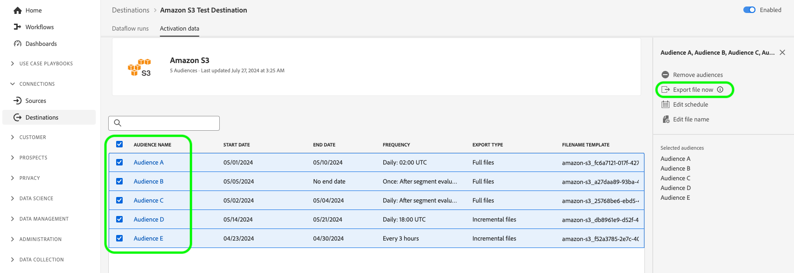

# Adobe Experience Platform 릴리스 정보

**릴리스 일자: 2024년 8월 20일**

>[!TIP]
>
>Real-Time CDP를 통해 조직이 달성할 수 있는 잠재 고객 발굴, 인수 등 다양한 사용 사례에 대해 알아보려면 [샘플 사용 사례 설명서의 개요](https://experienceleague.adobe.com/ko/docs/experience-platform/rtcdp/use-cases/overview)를 참조하십시오.

Experience Platform의 기존 기능 및 설명서 업데이트:

- [속성 기반 액세스 제어](#abac)
- [데이터 수집](#data-ingestion)
- [대상](#destinations)
- [경험 데이터 모델 (XDM)](#xdm)
- [ID 서비스](#identity-service)
- [Segmentation Service](#segmentation)
- [소스](#sources)

## 속성 기반 액세스 제어 {#abac}

속성 기반 액세스 제어는 개인 정보 보호를 중시하는 브랜드가 사용자 액세스를 더욱 유연하게 관리할 수 있도록 하는 Adobe Experience Platform의 기능입니다. 스키마 필드 및 세그먼트와 같은 개별 오브젝트를 사용자 역할에 할당할 수 있습니다. 이 기능을 사용하면 조직 내 특정 플랫폼 사용자에 대한 개별 오브젝트에 액세스를 허용하거나 취소할 수 있습니다.

조직의 관리자는 속성 기반 액세스 제어를 통해 모든 플랫폼 워크플로와 리소스에서 민감한 개인 데이터(SPD), 개인 식별 정보(PII) 및 기타 사용자 정의 유형의 데이터에 대한 액세스를 제어할 수 있습니다. 관리자는 특정 필드에만 액세스할 수 있는 사용자 역할과 필드에 해당하는 데이터를 정의할 수 있습니다.

**새로운 기능**

| 기능 업데이트 | 설명 |
| --- | --- |
| 새로운 권한 관리자 기능 | 이제 [권한 관리자](../../access-control/abac/permission-manager/overview.md)를 사용하여 간단한 쿼리를 사용하여 보고서를 생성할 수 있으므로 액세스 관리를 이해하고 여러 워크플로 및 세분화 수준에서 액세스 권한을 확인하는 데 시간을 절약할 수 있습니다. 사용자 및 역할에 대한 보고서 작성에 대한 자세한 내용은 [권한 관리자 사용 안내서](../../access-control/abac/permission-manager/permissions.md)를 참조하십시오. {width="250" align="center" zoomable="yes"} |

{style="table-layout:auto"}

속성 기반 액세스 제어에 대한 자세한 내용은 [속성 기반 액세스 제어 개요](../../access-control/abac/overview.md)를 참조하십시오. 속성 기반 액세스 제어 워크플로에 대한 종합적인 안내서는 [속성 기반 액세스 제어 통합 안내서](../../access-control/abac/end-to-end-guide.md)를 참조하십시오.

## 데이터 수집 (8월 23일 업데이트) {#data-ingestion}

Adobe Experience Platform은 데이터의 모든 유형과 지연 시간을 수집할 수 있는 다양한 기능 세트를 제공합니다. Adobe에서 구축한 소스, 데이터 통합 파트너 또는 Adobe Experience Platform UI를 사용하여 일괄 처리 또는 스트리밍 API로 수집할 수 있습니다.

**배치 데이터 수집에서 날짜 포맷 처리 업데이트**

이 릴리스는 배치 데이터 수집에서 *날짜 포맷 처리*&#x200B;와 관련된 문제를 해결합니다. 이전에는 클라이언트가 삽입한 날짜 필드를 `Date`로서 `DateTime` 포맷으로 변환했습니다. 이 때문에 시간대가 필드에 자동으로 추가되어 `Date` 포맷을 선호하거나 필요로 하는 사용자에게 어려움을 주었습니다. 앞으로는 시간대가 `Date` 유형 필드에 자동으로 추가되지 않습니다. 이 업데이트를 통해 내보낸 데이터 포맷이 고객의 요청에 따라 해당 필드의 프로필에 표시된 포맷과 일치하는지 확인할 수 있습니다.

릴리스 전 `Date` 출시: `"birthDate": "2018-01-12T00:00:00Z"`
릴리스 후 `Date` 필드: `"birthDate": "2018-01-12"`

[배치 수집](/help/ingestion/batch-ingestion/overview.md)에 대해 자세히 알아보십시오.

## 대상 {#destinations}

[!DNL Destinations]는 Adobe Experience Platform에서 데이터를 원활하게 활성화할 수 있는 대상 플랫폼과 사전 설치된 통합입니다. 대상을 사용해 크로스 채널 마케팅 캠페인, 이메일 캠페인, 타겟팅 광고 및 기타 많은 사용 사례를 위해 알려진 데이터와 알 수 없는 데이터를 활성화할 수 있습니다.

**새로운 대상 또는 업데이트된 대상** {#new-updated-destinations}

| 대상 | 설명 |
| ----------- | ----------- |
| [Braze](/help/destinations/catalog/mobile-engagement/braze.md) | [!UICONTROL Braze]는 대시보드 및 REST 엔드포인트에 대한 다양한 인스턴스를 관리합니다. [!UICONTROL Braze] 고객은 어떤 인스턴스에 프로비저닝되었는지에 따라 올바른 REST 엔드포인트를 사용해야 합니다. 이 릴리스에는 [!UICONTROL Braze]에 연결할 때 선택할 수 있는 새로운 US-07 엔드포인트가 추가되었습니다 |

{style="table-layout:auto"}

**새로운 기능 또는 업데이트된 기능** {#destinations-new-updated-functionality}

| 기능 | 설명 |
| ----------- | ----------- |
| 이제 배치 대상으로 온디맨드 파일을 내보낼 수 있습니다. | 이제 모든 고객이 온디맨드 파일을 배치 대상으로 내보낼 수 있는 옵션을 사용할 수 있습니다. 자세한 내용은 [전용 설명서](../../destinations/ui/export-file-now.md)를 참조하십시오. |
| [예약 단계](../../destinations/ui/activate-batch-profile-destinations.md#scheduling)에서 여러 내보낸 대상자에 대한 내보내기 예약을 편집합니다. | 이제 모든 고객이 대상자 활성화 워크플로의 예약 단계에서 여러 내보낸 대상자에 대한 내보내기 예약을 직접 편집할 수 있는 옵션을 사용할 수 있습니다. {width="250" align="center" zoomable="yes"} |
| [예약 단계](../../destinations/ui/activate-batch-profile-destinations.md#scheduling)에서 여러 내보낸 대상자의 파일 이름을 편집합니다. | 이제 모든 고객이 대상자 활성화 워크플로의 예약 단계에서 여러 내보낸 파일의 이름을 직접 편집할 수 있는 옵션을 사용할 수 있습니다. {width="250" align="center" zoomable="yes"} |
| [대상 세부 정보](../../destinations/ui/destination-details-page.md#bulk-remove) 페이지의 데이터 흐름에서 여러 대상자를 삭제합니다. | 이제 모든 고객이 **[!UICONTROL 대상 세부 정보]** 페이지의 기존 데이터 흐름에서 여러 대상자를 삭제할 수 있는 옵션을 사용할 수 있습니다. {width="250" align="center" zoomable="yes"} |
| [대상 세부 정보](../../destinations/ui/destination-details-page.md#bulk-export) 페이지에서 여러 온디맨드 파일을 배치 대상으로 내보냅니다. | 이제 모든 고객이 **[!UICONTROL 대상 세부 정보]** 페이지에서 여러 온디맨드 파일을 배치 대상으로 내보낼 수 있는 옵션을 사용할 수 있습니다. {width="250" align="center" zoomable="yes"} |
| [대상 세부 정보](../../destinations/ui/destination-details-page.md#bulk-edit-file-names) 페이지에서 내보낸 여러 대상자의 파일 이름을 편집합니다. | 이제 **[!UICONTROL 대상 세부 정보]** 페이지에서 내보낸 여러 파일의 이름을 직접 편집할 수 있습니다. {width="250" align="center" zoomable="yes"} |
| [대상 세부 정보](../../destinations/ui/export-datasets.md#remove-dataset) 페이지의 데이터 흐름에서 여러 데이터 세트를 제거합니다. | 이제 모든 고객이 데이터 흐름에서 여러 데이터 세트를 제거하는 옵션을 사용할 수 있습니다. {width="250" align="center" zoomable="yes"} |

{style="table-layout:auto"}

자세한 내용은 [대상 개요](../../destinations/home.md)를 참조하십시오.

## 경험 데이터 모델 (XDM) {#xdm}

XDM은 Adobe Experience Platform으로 가져오는 데이터에 대한 공통 구조 및 정의(스키마)를 제공하는 오픈 소스 사양입니다. XDM 표준을 준수하여 모든 고객 경험 데이터를 공통된 표현에 통합해 보다 빠르고 통합된 방식으로 인사이트를 제공할 수 있습니다. 고객 조치에서 귀중한 인사이트를 얻고, 세그먼트를 통해 고객 대상자를 정의하고, 개인 설정 목적으로 고객 속성을 사용할 수 있습니다.

**새로운 기능**

| 기능 | 설명 |
| --- | --- |
| ML 지원 스키마 생성 흐름 | 고급 머신 러닝 알고리즘을 사용하여 샘플 데이터 파일을 분석하고 표준 및 사용자 정의 필드를 사용하여 최적화된 스키마를 자동으로 생성합니다. 주요 기능: <ul><li>더 빠른 스키마 생성: ML 추천 및 생성된 XDM 필드를 사용하여 샘플 데이터 파일에서 직접 스키마를 생성합니다.</li><li>유연한 스키마 진화: 생성된 스키마에 필드를 쉽게 추가하거나 업데이트합니다.</li><li>원활한 통합: 스키마 Ul의 핵심 스키마 생성 흐름과 완벽하게 통합되어 원활하고 일관된 사용자 경험을 보장합니다.</li><li>효율적인 검토 및 편집: Flat View 편집기를 사용하여 스키마를 빠르게 보고 업데이트하여 생성 프로세스를 더욱 효율적이고 사용자 친화적으로 만듭니다.</li></ul> 자세한 내용은 [ML 지원 스키마 생성 워크플로 안내서](../../xdm/ui/ml-assisted-schema-creation.md)를 참조하십시오. |

{style="table-layout:auto"}

Platform의 XDM에 대한 자세한 내용은 [XDM 시스템 개요](../../xdm/home.md)를 참조하십시오.

## ID 서비스 {#identity-service}

Adobe Experience Platform ID 서비스를 사용하여 여러 디바이스 및 시스템에 걸쳐 ID를 연결하여 고객과 고객의 행동을 종합적으로 파악할 수 있으므로, 실시간으로 효과적인 개인 디지털 환경을 제공할 수 있습니다.

**업데이트된 설명서**

| 기능 | 설명 |
| --- | --- |
| 그래프 구성 안내서 | 아이덴티티 그래프 연결 규칙과 아이덴티티 그래프를 사용하는 동안 발생할 수 있는 일반적인 그래프 시나리오에 대한 정보는 [그래프 구성 안내서](../../identity-service/identity-graph-linking-rules/example-configurations.md)를 참조하십시오. 그래프 구성 안내서는 간단한 1인 그래프 시나리오부터 복잡하고 계층적인 다인 그래프 시나리오에 이르기까지 다양한 예시를 제공합니다. 또한 안내서를 사용하여 [그래프 시뮬레이션 UI](../../identity-service/identity-graph-linking-rules/graph-simulation.md)에 입력할 수 있는 이벤트 및 알고리즘 구성의 예와 특정 그래프 시나리오에서 기본 ID가 선택되는 방식에 대한 세부 정보도 볼 수 있습니다. |

{style="table-layout:auto"}

ID 서비스에 대한 자세한 내용은 [ID 서비스 개요](../../identity-service/home.md)를 참조하십시오.

## Segmentation Service {#segmentation}

[!DNL Segmentation Service]를 사용하여 개인 사용자(예: 고객, 잠재 고객, 사용자 또는 조직)와 관련된 [!DNL Experience Platform]에 저장된 데이터를 대상자로 세분화할 수 있습니다. 세그먼트 정의 또는 [!DNL Real-Time Customer Profile] 데이터의 다른 소스를 통해 대상자를 만들 수 있습니다. 이러한 대상자는 [!DNL Platform]을 통해 중앙 집중식으로 구성 및 유지 관리되고 모든 Adobe 솔루션에서 쉽게 액세스할 수 있습니다.

**업데이트된 기능**

| 기능 | 설명 |
| ------- | ----------- |
| 수집 세부 정보 | 사용자 정의 업로드 원본이 있는 대상자의 경우 대상자 세부 정보 페이지에서 대상자의 수집 세부 정보를 보다 포괄적으로 볼 수 있습니다. 또한 스키마를 선택하고 레이블을 지정할 원하는 속성을 선택하여 페이로드 속성에 레이블을 적용할 수 있습니다. 수집 세부 정보 섹션에 대한 자세한 내용은 [대상자 포털 안내서](../../segmentation/ui/audience-portal.md#ingestion-details)에서 확인할 수 있습니다. |

{style="table-layout:auto"}

[!DNL Segmentation Service]에 대한 자세한 내용은 [세분화 개요](../../segmentation/home.md)를 참조하십시오.

## 소스

Experience Platform은 다양한 데이터 공급자에 대한 소스 연결을 쉽게 설정할 수 있는 RESTful API 및 대화형 UI를 제공합니다. 이러한 소스 연결을 통해 외부 스토리지 시스템 및 CRM 서비스에 인증 및 연결하고, 수집 실행 시간을 설정하고, 데이터 수집 처리량을 관리할 수 있습니다.

Experience Platform의 소스를 사용하여 Adobe 애플리케이션 또는 서드파티 데이터 소스에서 데이터를 수집합니다.

**업데이트된 기능**

| 기능 | 설명 |
| --- | --- |
| Adobe Analytics Source Connector 업데이트 | Analytics Source Connector는 Adobe에서 전적으로 관리하므로 데이터 세트 활동 페이지에는 배치에 대한 정보가 표시되지 않습니다. 수집한 레코드 주변의 지표를 확인하여 데이터 흐름을 모니터링할 수 있습니다. 자세한 내용은 [Analytics 데이터의 소스 연결](../../sources/tutorials/ui/create/adobe-applications/analytics.md)을 만드는 방법에 관한 안내서를 참조하십시오. |

**업데이트된 설명서**

| 업데이트된 설명서 | 설명 |
| --- | --- |
| 데이터 흐름 업데이트에 대한 확장된 문서 | 기존 데이터 흐름에 적용할 수 있는 다양한 구성의 상세 정보를 제공하는 [UI의 기존 소스 데이터 흐름 업데이트 안내서](../../sources/tutorials/ui/update-dataflows.md)가 업데이트되었습니다. 비활성화된 데이터 흐름이 다시 활성화될 때 예상되는 동작을 명확히 하기 위해 안내서도 업데이트되었습니다. |

{style="table-layout:auto"}

자세한 내용은 [소스 개요](../../sources/home.md)를 참조하십시오.
