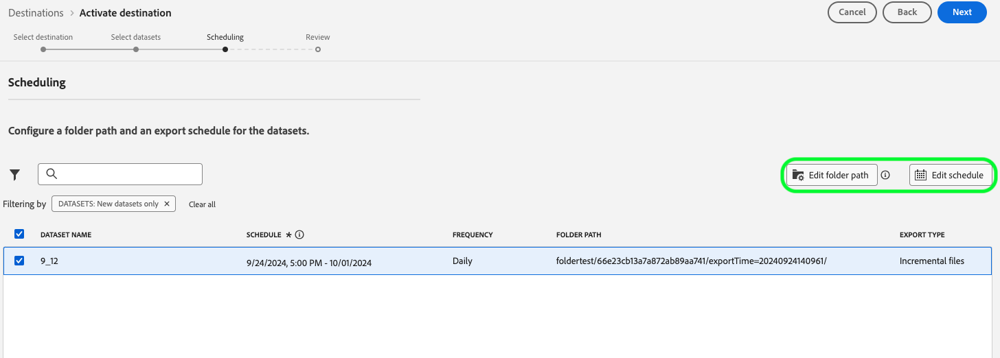

# Adobe Experience Platform 릴리스 정보

**릴리스 날짜: 2024년 9월 24일**

Adobe Experience Platform의 기존 기능 및 설명서에 대한 업데이트:

- [경고](#alerts)
- [대시보드](#dashboards)
- [데이터 준비](#data-prep)
- [대상](#destinations)
- [경험 데이터 모델 (XDM)](#xdm)
- [ID 서비스](#identity-service)
- [쿼리 서비스](#query-service)
- [Segmentation Service](#segmentation-service)
- [소스](#sources)

## 경고 {#alerts}

Experience Platform을 사용하면 다양한 플랫폼 활동에 대한 이벤트 기반 경고를 구독할 수 있습니다. 플랫폼 사용자 인터페이스의 [!UICONTROL 경고] 탭을 통해 다양한 경고 규칙을 구독할 수 있으며, UI 자체 또는 이메일 알림을 통해 알림 메시지를 받도록 선택할 수 있습니다.

**새로운 기능 또는 업데이트된 기능**

| 기능 | 설명 |
| --- | --- |
| 개발 샌드박스 지원 | 이제 프로덕션 및 개발 샌드박스에서 [경고를 구독](../../observability/alerts/ui.md)할 수 있으므로 모든 환경에서 원활한 모니터링이 가능합니다. |
| 이메일 템플릿 | 이제 [전자 메일 경고](../../observability/alerts/ui.md)에 자세한 자산 정보가 포함되어 있으므로 모든 주요 세부 정보를 손쉽게 확인할 수 있습니다. |
| 향상된 사용자 지정 | 이제 다음 경고 유형에 대한 특정 요구 사항에 맞게 경고를 조정할 수 있는 유연성을 제공하는 [경고 임계값](../../observability/alerts/ui.md#alert-threshold)을 구성할 수 있습니다. <ul><li>세그먼트 작업 지연</li><li>세그먼트 내보내기 지연</li><li>대상 흐름 실행 지연</li><li>ID 서비스 흐름 실행 지연</li><li>프로필 흐름 실행 지연</li><li>소스 플로우 실행 지연</li><li>쿼리 실행 지연</li><li>활성화 건너뛰기 비율 초과</li><li>소스 수집 오류율 초과</ul> |
| 확장된 경고 | 감사 이벤트 정보 경고를 다음 [경고 규칙](../../observability/alerts/rules.md): 에 대한 구독에 사용할 수 있습니다.<ul><li>대상자 만들기</li><li>대상자 업데이트</li><li>대상 삭제</li><li>데이터 세트 만들기</li><li>데이터 세트 업데이트</li><li>데이터 세트 삭제</li><li>스키마 만들기</li><li>스키마 업데이트</li><li>스키마 삭제. |

{style="table-layout:auto"}

경고에 대한 자세한 내용은 [[!DNL Observability Insights] 개요](../../observability/home.md)를 참조하세요.

## 대시보드 {#dashboards}

Experience Platform은 일별 스냅샷 중에 캡처한 대로 조직 데이터에 대한 중요한 통찰력을 볼 수 있는 여러 대시보드를 제공합니다.

**새로운 기능 또는 업데이트된 기능**

| 기능 | 설명 |
| --- | --- |
| Query Pro 모드 - 전역 필터 업그레이드 | Query Pro Mode의 새 날짜 필터를 사용하여 분석을 강화합니다. SQL 쿼리의 동적 날짜 매개 변수를 사용하여 통찰력을 구체화하고 특정 시간대별로 데이터를 필터링합니다. 직관적인 UI를 사용하여 사전 설정 또는 사용자 정의 날짜 범위를 선택하여 모든 사용자와 관련된 대시보드를 유지합니다. 워크플로우를 단순화하고 정확성을 유지하며 적시에 의사 결정을 내릴 수 있습니다. 자세한 내용은 [날짜 필터 만들기에 대한 가이드](../../dashboards/data-distiller/query-pro-mode/filters/global-filter.md)를 참조하세요. |
| Query Pro 모드 - 드릴스루 | Query Pro Mode의 드릴스루 기능을 통해 더 심층적인 통찰력을 확보하고 높은 수준의 차트에서 세부 대시보드로 원활하게 탐색할 수 있습니다. 이 기능을 사용하여 요약에서 심층 분석으로 간편하게 이동하고 트렌드, 고객 행동 및 KPI를 살펴볼 수 있습니다. 자동 필터 통과 및 다중 레벨 드릴스루는 데이터의 일관성을 유지하여 원활한 탐색을 보장합니다. 워크플로우를 단순화하고, 컨텍스트를 유지하고, 의사 결정 속도를 높입니다. 자세한 내용은 [드릴스루 만들기에 대한 단계별 안내서](../../dashboards/data-distiller/query-pro-mode/drill-through.md)를 참조하십시오. |
| Query Pro 모드 - 고급 테이블 속성 | Query Pro Mode 고급 테이블 속성을 사용하여 데이터 시각화를 간소화하고, 워크플로우 효율성을 높이고, 데이터 명확성을 개선합니다. 사용자 지정 대시보드에서 직접 표에 자동 정렬, 크기 조정 및 페이지 매김 기능을 추가합니다. 열을 정렬하여 주요 데이터의 우선 순위를 지정하고, 크기를 조정하여 가독성을 최적화하고, SQL 쿼리를 수정하지 않고도 대용량 데이터 세트를 원활하게 탐색할 수 있습니다. 이러한 기능을 통합하고 데이터 통찰력을 향상시키는 방법을 알아보려면 &#39;[자세히 보기](../../dashboards/data-distiller/query-pro-mode/view-more.md)&#39; 안내서를 읽어 보십시오. |

{style="table-layout:auto"}

액세스 권한을 부여하고 사용자 정의 위젯을 만드는 방법을 포함해 대시보드에 대한 자세한 내용은 [대시보드 개요](../../dashboards/home.md)를 읽어 보십시오.

## 데이터 준비 {#data-prep}

데이터 준비를 사용하면 데이터 엔지니어가 경험 데이터 모델(XDM)과의 데이터를 매핑, 변환 및 확인할 수 있습니다.

**새로운 기능 또는 업데이트된 기능**

| 기능 | 설명 |
| --- | --- |
| 대상에 사용할 [!BADGE Beta]{type=Informative} 새 데이터 준비 기능 | 이제 대상 사용 사례에 대해 다음 배열 함수를 사용할 수 있습니다.<ul><li>`array_to_string`</li><li>`filterArray`</li><li>`transformArray`</li><li>`flattenArray`</li></ul> 자세한 내용은 [데이터 준비 기능 안내서](../../data-prep/functions.md#arrays)를 참조하십시오. |

{style="table-layout:auto"}

데이터 준비에 대한 자세한 내용은 [데이터 준비 개요](../../data-prep/home.md)를 참조하십시오.

## 대상 {#destinations}

[!DNL Destinations]는 Adobe Experience Platform에서 데이터를 원활하게 활성화할 수 있는 대상 플랫폼과 사전 설치된 통합입니다. 대상을 사용해 크로스 채널 마케팅 캠페인, 이메일 캠페인, 타겟팅 광고 및 기타 많은 사용 사례를 위해 알려진 데이터와 알 수 없는 데이터를 활성화할 수 있습니다.

**새로운 대상 또는 업데이트된 대상** {#new-updated-destinations}

| 대상 | 설명 |
| --- | --- |
| [Amazon 광고](/help/destinations/catalog/advertising/amazon-ads.md) | 2024년 9월 릴리스에서는 매핑 옵션을 추가하여 `countryCode` 매개 변수를 Amazon Ads로 내보냅니다. [매핑 단계](/help/destinations/catalog/advertising/amazon-ads.md#map)에서 `countryCode`을(를) 사용하여 Amazon과의 ID 일치율을 개선하세요. |

{style="table-layout:auto"}

**새로운 기능 또는 업데이트된 기능** {#destinations-new-updated-functionality}

| 기능 | 설명 |
| --- | --- |
| [데이터 세트 내보내기](/help/destinations/ui/export-datasets.md) 개선 사항 | Experience Platform의 2024년 9월 릴리스에는 다양한 데이터 이그레스 사용 사례를 더 잘 지원하기 위해 데이터 세트 내보내기 기능 기능에 대한 몇 가지 개선 사항이 포함되어 있습니다. 향상된 기능은 다음과 같습니다. <ul><li>하위 폴더 추가 및 제거 옵션을 비롯한 새로운 데이터 폴더 구성 옵션</li><li>전체 파일 내보내기(한 번) 및 종료 날짜 지정 기능을 포함한 새로운 내보내기 옵션</li><li>참고: 또한 Adobe은 9월 릴리스 전에 생성된 모든 데이터 세트 내보내기 데이터 흐름에 대한 기본 종료 날짜를 2025년 5월 1일로 도입합니다. 이러한 데이터 흐름의 경우 고객은 종료 날짜 이전에 데이터 흐름의 종료 날짜를 수동으로 업데이트해야 합니다. 그렇지 않으면 이 날짜에 내보내기가 중지됩니다.</li></ul>   {width="250" align="center" zoomable="yes"} |

{style="table-layout:auto"}

자세한 내용은 [대상 개요](../../destinations/home.md)를 참조하십시오.

## 경험 데이터 모델 (XDM) {#xdm}

XDM은 Adobe Experience Platform으로 가져오는 데이터에 대한 공통 구조 및 정의(스키마)를 제공하는 오픈 소스 사양입니다. XDM 표준을 준수하여 모든 고객 경험 데이터를 공통된 표현에 통합해 보다 빠르고 통합된 방식으로 인사이트를 제공할 수 있습니다. 고객 조치에서 귀중한 인사이트를 얻고, 세그먼트를 통해 고객 대상자를 정의하고, 개인 설정 목적으로 고객 속성을 사용할 수 있습니다.

**업데이트된 기능**

| 기능 | 설명 |
| --- | --- |
| 스키마 편집기 개선 사항 | 스키마 편집기에서 업데이트된 관계 워크플로우로 스키마 관계를 제어합니다. Experience Platform UI에서 직접 기존 관계를 쉽게 업데이트하거나 제거하여 스키마 관리를 더 유연하고 직관적으로 만듭니다. 참조 스키마를 조정하고 안정적으로 관계의 이름을 변경하여 세그먼테이션 및 기타 주요 프로세스 간에 원활한 데이터 무결성을 보장합니다. 스키마 관계를 효율적으로 관리하는 방법에 대한 자세한 내용은 [UI에서 관계 필드 정의](../../xdm/tutorials/relationship-ui.md#create-a-relationship-field-group) 및 [B2B 관계](../../xdm/tutorials/relationship-b2b.md#edit-a-b2b-schema-relationship)에 대한 안내서를 참조하십시오. |

{style="table-layout:auto"}

XDM에 대한 자세한 내용은 [XDM 시스템 개요](../../xdm/home.md)를 참조하십시오.

## ID 서비스 {#identity-service}

Adobe Experience Platform ID 서비스를 사용하여 여러 디바이스 및 시스템에 걸쳐 ID를 연결하여 고객과 고객의 행동을 종합적으로 파악할 수 있으므로, 실시간으로 효과적인 개인 디지털 환경을 제공할 수 있습니다.

**업데이트된 기능**

| 기능 | 설명 |
| --- | --- |
| ID 그래프 연결 규칙의 제한된 가용성 | ID 그래프 연결 규칙은 사용자의 정확한 개인화를 보장하기 위해 사용할 수 있는 Identity Service의 도구 세트입니다. <ul><li>이제 [ID 최적화 알고리즘](../../identity-service/identity-graph-linking-rules/identity-optimization-algorithm.md)을 사용하여 ID 그래프가 한 사람을 대표하는지 확인할 수 있으므로 실시간 고객 프로필에서 원치 않는 ID 병합을 방지할 수 있습니다.</li><li>[네임스페이스 우선 순위](../../identity-service/identity-graph-linking-rules/namespace-priority.md)을(를) 구성하여 각 네임스페이스의 중요도를 정의하고 프로필이 형성되고 세그먼트화되는 방식에 영향을 줍니다.</li><li>UI의 [그래프 시뮬레이션 도구](../../identity-service/identity-graph-linking-rules/graph-simulation.md)를 사용하여 다양한 구성을 가진 ID 그래프를 시뮬레이션하십시오.</li><li>[ID 설정 인터페이스](../../identity-service/identity-graph-linking-rules/identity-settings-ui.md)를 사용하여 고유한 네임스페이스를 지정하고 조직의 모든 네임스페이스에 대한 우선 순위를 설정하십시오.</li><li>그래프 데이터와 관련된 지표 및 트렌드는 [ID 대시보드](../../identity-service/identity-graph-linking-rules/implementation-guide.md#validate-your-graphs)를 참조하세요.</li></ul> ID 그래프 연결 규칙을 시도하려면 Adobe 계정 팀에 문의하여 개발 샌드박스에 액세스하십시오. |

**업데이트된 설명서**

| 기능 | 설명 |
| --- | --- |
| ID 그래프 연결 규칙에 대한 문제 해결 안내서 | ID 그래프 연결 규칙을 사용하여 작업할 때 발생할 수 있는 일반적인 문제를 해결하기 위해 수행할 수 있는 접근 방식 및 디버깅 솔루션에 대한 새로운 [ID 그래프 연결 규칙 문제 해결 가이드](../../identity-service/identity-graph-linking-rules/troubleshooting.md)를 읽어 보십시오. |
| ID 그래프 연결 규칙에 대한 FAQ | 네임스페이스 우선 순위, ID 최적화 알고리즘 및 ID 그래프 연결 규칙의 기타 측면에 대한 FAQ 목록을 보려면 새 [ID 그래프 연결 규칙 FAQ](../../identity-service/identity-graph-linking-rules/troubleshooting.md#frequently-asked-questions)를 참조하십시오. |

{style="table-layout:auto"}

ID 서비스에 대한 자세한 내용은 [ID 서비스 개요](../../identity-service/home.md)를 참조하십시오.

## 쿼리 서비스 {#query-service}

쿼리 서비스를 사용하면 표준 SQL로 Adobe Experience Platform [!DNL data lake]에서 데이터를 쿼리할 수 있습니다. 데이터 레이크의 데이터 세트에 참여하고 쿼리 결과를 보고 또는 Data Science Workspace에 사용하거나 실시간 고객 프로필에 수집하기 위한 새 데이터 세트로 캡처할 수 있습니다.

**업데이트된 기능**

| 기능 | 설명 |
| --- | --- |
| 데이터 Distiller 대상 | Experience Platform의 Data Distiller에서 SQL 대상 확장을 사용하여 대상을 쉽게 만들고, 관리하고, 활성화합니다. 프로필에 원시 데이터가 필요 없이 데이터 레이크에서 직접 SQL 명령으로 대상 세그먼트를 정의합니다. 유연하고 데이터 중심적인 이 접근 방식을 사용하여 타깃팅 전략을 구체화하고 대상자를 파일 기반 대상에 자동으로 동기화합니다. 워크플로우를 간소화하고, 고객 관리를 최적화하고, 데이터의 모든 잠재력을 최대한 활용합니다. 대상 전략을 향상시키려면 SQL 대상 확장 사용에 대한 [안내서](../../query-service/data-distiller-audiences/overview.md)를 읽어 보십시오. |
| 데이터 Distiller 통계 - 하이퍼큐브 | 하이퍼큐브로 빅데이터 분석을 최적화합니다. 기록 데이터를 다시 처리하지 않고도 고유 카운트 및 다차원 분석과 같은 복잡한 계산을 처리할 수 있습니다. 정확성과 효율성을 유지하면서 점진적으로 데이터를 업데이트하고 워크플로우를 간소화하며 처리 시간을 단축합니다. 의사 결정을 전환하는 빠르고 확장 가능하며 비용 효율적인 통찰력을 얻으십시오. 고급 분석을 잠금 해제하려면 [하이퍼큐브 사용 가이드](../../query-service/hypercubes.md)를 살펴보십시오. |
| 쿼리 편집기 개체 브라우저 | 쿼리 편집기의 새 개체 브라우저를 사용하여 쿼리 효율성을 높입니다. 데이터 세트를 빠르게 검색, 필터링 및 액세스하여 쿼리를 더 빠르게 작성하고 세분화할 수 있습니다. 실시간 스키마 업데이트 및 인스턴트 테이블 메타데이터를 통해 워크플로우를 간소화하고, 탐색 시간을 줄이고, 쿼리 환경을 개선할 수 있습니다. 데이터의 잠재력을 최대한 활용하고 분석을 최적화합니다. 자세한 내용은 개체 브라우저 사용에 대한 [안내서](../../query-service/ui/user-guide.md#object-browser)를 참조하십시오. |
| 시간 계산 | 예약된 쿼리에 대해 새로 표시되는 연산 시간 지표를 통해 리소스 사용을 제어할 수 있습니다. 쿼리 실행 수준에서 완료 시간을 보고 CTAS/ITAS 배치 쿼리에 대한 리소스 사용을 모니터링하고 최적화합니다. 각 쿼리 실행에 대한 시작 시간, 완료 상태 및 계산 시간을 추적합니다. 성능 미세 조정 및 비용 절감 쿼리 효율성을 최대화하는 방법에 대한 자세한 내용은 [시간 계산 가이드](../../query-service/ui/query-schedules.md#compute-hours-at-job-level)를 참조하십시오. |

{style="table-layout:auto"}

쿼리 서비스에 대한 자세한 내용은 [쿼리 서비스 개요](../../query-service/home.md)를 참조하세요.

## Segmentation Service {#segmentation-service}

[!DNL Segmentation Service]는 고객 기반 내에서 마케팅 가능한 사용자 그룹을 구분하는 기준을 설명하여 프로필의 특정 하위 집합을 정의합니다. 세그먼트는 기록 데이터(예: 인구 통계 정보) 또는 고객과 브랜드의 상호 작용을 나타내는 시계열 이벤트를 기반으로 할 수 있습니다.

**새로운 기능 또는 업데이트된 기능**

| 기능 | 설명 |
| --- | --- |
| 통합 검색 구현 | 이제 세그먼트 빌더 내의 검색 비헤이비어에서 통합 검색을 사용합니다. 이렇게 하면 세그먼트 멤버십에 재사용할 대상을 관리하고 검색할 때 보다 강력한 경험을 사용할 수 있습니다. 이 변경 사항에 대한 자세한 내용은 [세그먼트 빌더 안내서](../../segmentation/ui/segment-builder.md#rule-builder-canvas)를 참조하십시오. |

{style="table-layout:auto"}

[!DNL Segmentation Service]에 대한 자세한 내용은 [세그먼테이션 개요](../../segmentation/home.md)를 참조하세요.

## 소스 {#sources}

Experience Platform은 다양한 데이터 공급자에 대한 소스 연결을 쉽게 설정할 수 있는 RESTful API 및 대화형 UI를 제공합니다. 이러한 소스 연결을 통해 외부 스토리지 시스템 및 CRM 서비스에 인증 및 연결하고, 수집 실행 시간을 설정하고, 데이터 수집 처리량을 관리할 수 있습니다.

Experience Platform의 소스를 사용하여 Adobe 애플리케이션 또는 서드파티 데이터 소스에서 데이터를 수집합니다.

**업데이트된 기능**

| 기능 | 설명 |
| --- | --- |
| UI에서 암호화된 데이터 수집에 대한 [!BADGE Beta]{type=Informative} 지원 | 이제 Experience Platform 사용자 인터페이스의 소스 작업 영역을 사용하여 클라우드 스토리지 일괄 처리 소스에서 암호화된 데이터를 수집할 수 있습니다. 자세한 내용은 [UI에서 암호화된 데이터 수집](../../sources/tutorials/ui/encryped-ingestion.md)에 대한 자습서를 참조하십시오. |
| [!DNL Snowflake Streaming] 소스의 일반 가용성 | [!DNL Snowflake Streaming] 원본이 현재 GA 상태입니다. 이 원본을 사용하여 [!DNL Snowflake] 계정의 데이터를 Experience Platform으로 스트리밍하세요. 자세한 내용은 [[!DNL Snowflake Streaming] 개요](../../sources/connectors/databases/snowflake-streaming.md)를 참조하세요. |
| [!DNL Google BigQuery]에서 서비스 계정 인증 지원 | 이제 서비스 계정 인증을 사용하여 [!DNL Google BigQuery] 계정을 Experience Platform에 연결할 수 있습니다. 자세한 내용은 [[!DNL Google BigQuery] 개요](../../sources/connectors/databases/bigquery.md#generate-your-google-bigquery-credentials)를 참조하십시오.   {width="250" align="center" zoomable="yes"} |
| 샘플 데이터 미리 보기 건너뛰기 지원 | 이제 다음 소스로 소스 연결을 만들 때 데이터 미리 보기를 건너뛰도록 선택할 수 있습니다. <ul><li>[[!DNL Google BigQuery]](../../sources/tutorials/ui/create/databases/bigquery.md#skip-preview-of-sample-data)</li><li>[[!DNL Salesforce]](../../sources/tutorials/ui/create/crm/salesforce.md#skip-preview-of-sample-data)</li><li>[[!DNL Snowflake]](../../sources/tutorials/ui/create/databases/snowflake.md#skip-preview-of-sample-data)</li></ul> 일괄 처리 데이터를 수집할 때 발생할 수 있는 시간 제한을 피하기 위해 데이터 미리 보기를 건너뛸 수 있습니다. 이렇게 하면 계산된 필드와 필수 필드의 자동 유효성 검사가 수행되지 않을 수 있습니다. 데이터 미리보기를 건너뛰도록 선택하는 경우 매핑 중에 계산된 필드 및 필수 필드를 수동으로 확인해야 할 수 있습니다. |
| [!DNL SFTP]에서 청크 해제 지원 | 이제 [!DNL SFTP] 원본에서 청크를 사용하지 않도록 설정할 수 있는 설정을 구성할 수 있습니다. 자세한 내용은 [[!DNL SFTP] 개요](../../sources/connectors/cloud-storage/sftp.md)를 참조하십시오. |

{style="table-layout:auto"}

자세한 내용은 [소스 개요](../../sources/home.md)를 참조하십시오.
