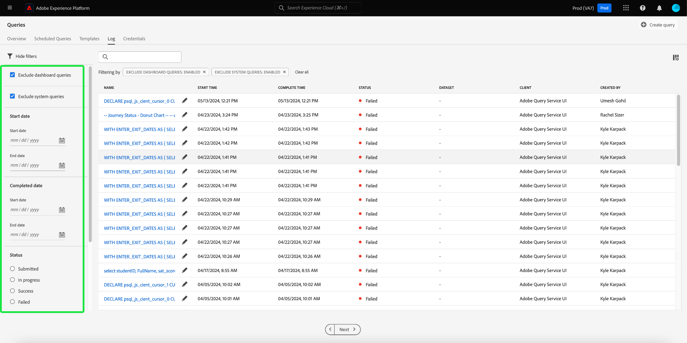

# Adobe Experience Platform 릴리스 정보

**릴리스 일자: 2024년 5월 21일 수요일**

>[!TIP]
>
>다음 [Experience Platform API 설명서](https://developer.adobe.com/experience-platform-apis/) 은(는) 이제 대화형입니다. 설명서 페이지에서 직접 API 끝점을 탐색하여 즉각적인 피드백을 받고 기술 구현 속도를 높이십시오. [자세히 보기](#interactive-api-documentation) 새 기능에 대해 설명합니다.

Experience Platform의 기존 기능 업데이트:

- [카탈로그 서비스](#catalog-service)
- [대시보드](#dashboards)
- [데이터 거버넌스](#governance)
- [대상](#destinations)
- [쿼리 서비스](#query-service)
- [Segmentation Service](#segmentation)
- [소스](#sources)

Adobe Experience Platform의 기타 업데이트:

- [설명서 업데이트](#documentation-updates)

## 카탈로그 서비스 {#catalog-service}

카탈로그 서비스는 Adobe Experience Platform 내의 데이터 위치 및 계보에 대한 레코드 시스템입니다. Experience Platform에 수집되는 모든 데이터는 파일 및 디렉터리로 데이터 레이크에 저장되지만, 카탈로그는 조회 및 모니터링을 위해 이러한 파일 및 디렉터리에 대한 메타데이터 및 설명을 보유합니다.

**새로운 기능 또는 업데이트된 기능**

| 기능 | 설명 |
| --- | --- |
| 대량 작업 | 이제 데이터 세트 인벤토리가 대량 작업을 지원합니다. 일괄 작업을 통해 데이터 관리 프로세스를 간소화하고 데이터 세트를 효율적으로 관리할 수 있습니다. 대량 작업을 사용하면 여러 데이터 세트에 동시에 여러 작업을 수행하여 시간을 절약할 수 있습니다.  대량 작업은 다음과 같습니다. [폴더로 이동](../../catalog/datasets/user-guide.md#move-to-folders), [태그 편집](../../catalog/datasets/user-guide.md#manage-tags), 및 [삭제](../../catalog/datasets/user-guide.md#delete) 데이터 세트.   {width="100" zoomable="yes"}   이 기능에 대한 자세한 내용은 [데이터 세트 UI 안내서](../../catalog/datasets/user-guide.md#bulk-actions). |

{style="table-layout:auto"}

## 대시보드 {#dashboards}

Adobe Experience Platform은 일일 스냅샷 중에 캡처된 조직 데이터에 대한 중요한 인사이트를 볼 수 있는 여러 대시보드를 제공합니다.

**새로운 기능 또는 업데이트된 기능**

| 기능 | 설명 |
| --- | --- |
| 확장 앱 보고를 위한 사용자 지정 가능한 통찰력 | 매끄럽게 [sql 분석 결과를 이해하기 쉽고 비즈니스 친화적인 시각적 형식으로 변환](../../dashboards/data-distiller/customizable-insights/overview.md). 사용자 정의 SQL 쿼리를 사용하여 정확한 데이터 조작 및 다양한 구조화된 데이터 세트에서 동적 차트를 만듭니다. Query pro 모드를 사용하여 SQL로 복잡한 분석을 수행한 다음 사용자 지정 대시보드의 차트를 통해 기술 전문가가 아닌 사용자와 이 분석을 공유하거나 CSV 파일로 내보낼 수 있습니다. |

{style="table-layout:auto"}

## 데이터 거버넌스 {#governance}

Adobe Experience Platform 데이터 거버넌스는 고객 데이터를 관리하고 데이터 사용에 적용되는 규정, 제한 및 정책을 준수하는 데 사용되는 일련의 전략 및 기술입니다. 내에서 중요한 역할을 합니다. [!DNL Experience Platform] 카탈로그 작성, 데이터 계보, 데이터 사용 레이블 지정, 데이터 액세스 정책 및 마케팅 작업을 위한 데이터에 대한 액세스 제어 등 다양한 수준에서 사용됩니다.

**새로운 기능**

| 기능 | 설명 |
| --- | --- |
| HTTP API 대상 및 Adobe Journey Optimizer 사용자 지정 작업에 대한 mTLS 지원 | mTLS(Mutual Transport Layer Security) 프로토콜의 강화된 보안 수단으로 고객 신뢰를 구축합니다. 다음 [Experience Platform HTTP API 대상](../../destinations/catalog/streaming/http-destination.md#mtls-protocol-support) 및 [Adobe Journey Optimizer 사용자 지정 작업](https://experienceleague.adobe.com/en/docs/journey-optimizer/using/orchestrate-journeys/about-journey-building/using-custom-actions) 이제 구성된 종단점으로 데이터를 전송할 때 mTLS 프로토콜을 지원합니다. mTLS를 활성화하기 위해 사용자 지정 작업 또는 HTTP API 대상에 추가 구성이 필요하지 않습니다. 이 프로세스는 mTLS 활성화 끝점이 감지되면 자동으로 발생합니다. 다음을 수행할 수 있습니다. [여기에서 Adobe Journey Optimizer 공개 인증서 다운로드](../../landing/governance-privacy-security/encryption.md#download-certificates) 및 [대상 서비스 공개 인증서 위치](../../landing/governance-privacy-security/encryption.md#download-certificates). 다음을 참조하십시오. [Experience Platform 데이터 암호화 설명서](../../landing/governance-privacy-security/encryption.md#mtls-protocol-support) 데이터를 서드파티 시스템으로 내보낼 때 네트워크 연결 프로토콜에 대한 자세한 내용을 참조하십시오. |

{style="table-layout:auto"}

## 대상 {#destinations}

[!DNL Destinations]는 Adobe Experience Platform에서 데이터를 원활하게 활성화할 수 있는 대상 플랫폼과 사전 설치된 통합입니다. 대상을 사용해 교차 채널 마케팅 캠페인, 이메일 캠페인, 타겟팅 광고 및 기타 많은 사용 사례를 위해 알려진 데이터와 알 수 없는 데이터를 활성화할 수 있습니다.

**새로운 기능 또는 업데이트된 기능** {#destinations-new-updated-functionality}

| 기능 | 설명 |
| ----------- | ----------- |
| 배치 대상에 대한 매핑 필드 순서 바꾸기 | 이제 의 매핑 필드를 드래그 앤 드롭하여 CSV 내보내기의 열 순서를 변경할 수 있습니다. [매핑 단계](../../destinations/ui/activate-batch-profile-destinations.md#mapping). UI에서 매핑된 필드의 순서는 내보낸 CSV 파일의 열 순서에 따라 위에서 아래로 반영되며, 맨 위 행은 CSV 파일의 가장 왼쪽 열입니다.   {width="100" zoomable="yes"} |
| 배치 대상에 대해 미리 선택된 기본 내보내기 일정 | 이제 Experience Platform이 각 파일 내보내기에 대한 기본 일정을 자동으로 설정합니다. 다음에서 설명서를 참조하십시오. [대상자 내보내기 예약](../../destinations/ui/activate-batch-profile-destinations.md#scheduling) 기본 일정을 수정하는 방법을 알아봅니다. |
| 배치 대상에 대한 여러 대상 활성화 일정 편집 | 이제 의 배치(파일 기반) 대상으로 내보낸 여러 대상에 대한 활성화 일정을 편집할 수 있습니다 **[!UICONTROL 활성화 데이터]** 의 탭 [대상 세부 정보 페이지](../../destinations/ui/destination-details-page.md#bulk-edit-schedule).   {width="100" zoomable="yes"} |
| 주문형 여러 대상을 배치 대상으로 내보내기 | 이제 다음을 통해 여러 대상을 선택하여 배치 대상으로 내보낼 수 있습니다. [요청 시 파일 내보내기](../../destinations/ui/export-file-now.md) 기능. |

{style="table-layout:auto"}

대상에 대한 일반적인 정보는 [대상 개요](../../destinations/home.md)를 참조하십시오.

## 쿼리 서비스 {#query-service}

쿼리 서비스를 사용하면 표준 SQL로 Adobe Experience Platform [!DNL Data Lake]에서 데이터를 쿼리할 수 있습니다. 에서 모든 데이터 세트를 결합할 수 있습니다. [!DNL Data Lake] 보고, Data Science Workspace에 사용하거나 실시간 고객 프로필로 수집하기 위한 새 데이터 세트로 쿼리 결과를 캡처합니다.

**업데이트된 기능**

| 기능 | 설명 |
| --- | --- |
| 레거시 편집기 더 이상 사용되지 않음 | 레거시 편집기는 더 이상 사용되지 않으며 더 이상 사용할 수 없습니다. 대신 [쿼리 편집기의 향상된 기능](../../query-service/ui/user-guide.md#query-authoring) 쿼리를 작성, 유효성 검사 및 실행하려면 |
| 쿼리 실행 지연 | 쿼리 실행에 대한 지연 경고를 설정하여 연산 시간을 제어합니다. 특정 기간 후에 쿼리 상태가 상태를 변경하지 않는 경우 경고를 수신하도록 선택할 수 있습니다. 쿼리 진행 상황에 대한 최신 정보를 얻으려면 Platform UI에서 원하는 지연 시간을 설정하기만 하면 됩니다. UI에서 이 경고를 설정하는 방법에 대해 알아보려면 다음을 참조하십시오. [쿼리 일정 설명서](../../query-service/ui/query-schedules.md#alerts-for-query-status) 또는 [인라인 쿼리 작업 안내서](../../query-service/ui/monitor-queries.md#query-run-delay). |
| 간소화된 쿼리 로그 인벤토리 | 이제 를 사용하여 향상된 문제 해결 효율성 및 작업 모니터링을 사용할 수 있습니다. [간소화된 쿼리 로그 UI](../../query-service/ui/query-logs.md#filter-logs): <ul><li> 이제 Platform UI는 기본적으로 모든 &quot;시스템 쿼리&quot;를 로그 탭에서 제외합니다. </li><li> 선택을 취소하여 시스템 쿼리 보기 **시스템 쿼리 제외**. </li></ul>   {width="100" zoomable="yes"}   관련 로그를 빠르게 식별하고 분석하는 데 도움이 되는 더 많은 포커스 보기에 대해 간소화된 쿼리 로그 UI를 사용하십시오. |
| 데이터베이스 선택기 | 새 데이터베이스 선택기 드롭다운 메뉴를 사용하여 다음 작업을 수행합니다. [Power BI 또는 Tableau에서 Customer Journey Analytics 데이터 보기에 편리하게 액세스](../../query-service/ui/credentials.md#connect-to-customer-journey-analytics). 이제 Platform UI에서 원하는 데이터베이스를 직접 선택하여 BI 도구를 보다 원활하게 통합할 수 있습니다.   {width="100" zoomable="yes"}   |

{style="table-layout:auto"}

## Segmentation Service {#segmentation}

[!DNL Segmentation Service]를 사용하여 개인 사용자(예: 고객, 잠재 고객, 사용자 또는 조직)와 관련된 [!DNL Experience Platform]에 저장된 데이터를 대상자로 세분화할 수 있습니다. 세그먼트 정의 또는 [!DNL Real-Time Customer Profile] 데이터의 다른 소스를 통해 대상자를 만들 수 있습니다. 이러한 대상자는 [!DNL Platform]을 통해 중앙 집중식으로 구성 및 유지 관리되고 모든 Adobe 솔루션에서 쉽게 액세스할 수 있습니다.

**업데이트된 기능**

| 기능 | 설명 |
| --- | --- |
| 외부에서 생성된 대상 가져오기 | 이제 외부에서 생성된 대상을 가져오려면 &quot;대상 가져오기&quot; 권한이 필요합니다. 권한에 대해 자세히 알아보려면 [권한 UI 안내서](../../access-control/home.md#permissions). |

{style="table-layout:auto"}

## 소스 {#sources}

Experience Platform은 다양한 데이터 공급자에 대한 소스 연결을 쉽게 설정할 수 있는 RESTful API 및 대화형 UI를 제공합니다. 이러한 소스 연결을 통해 외부 스토리지 시스템 및 CRM 서비스에 인증 및 연결하고, 수집 실행 시간을 설정하고, 데이터 수집 처리량을 관리할 수 있습니다.

Experience Platform의 소스를 사용하여 Adobe 애플리케이션이나 타사 데이터 소스에서 데이터를 수집합니다.

**새로운 기능 또는 업데이트된 기능**

| 기능 | 설명 |
| --- | --- |
| 에 대한 OAuth2 클라이언트 자격 증명 인증 [!DNL Salesforce] 소스 | 이제 OAuth2 클라이언트 자격 증명을 사용하여 [!DNL Salesforce] Experience Platform 계정. 읽기 [!DNL Salesforce] 소스 [API 안내서](../../sources/tutorials/api/create/crm/salesforce.md) 및 [UI 안내서](../../sources/tutorials/ui/create/crm/salesforce.md) 추가 정보. |
| 에 대한 샘플 데이터 흐름 지원 [!DNL Marketo Engage] 소스 | 다음 [!DNL Marketo Engage] 이제 source에서 샘플 데이터 흐름을 지원합니다. 샘플 데이터 흐름 구성을 활성화하여 수집 속도를 제한한 다음 대량의 데이터를 수집하지 않고도 Experience Platform 기능을 사용해 보십시오. 자세한 내용은 의 안내서를 참조하십시오. [데이터 흐름 만들기 [!DNL Marketo Engage] UI에서](../../sources/tutorials/ui/create/adobe-applications/marketo.md). |
| IP 주소 허용 목록 업데이트 | 스트리밍 소스를 성공적으로 사용하려면 위치에 따라 허용 목록에 새 IP 주소 집합을 추가해야 합니다. 새 IP 주소의 전체 목록을 보려면 [IP 주소 허용 목록 안내서](../../sources/ip-address-allow-list.md). |

{style="table-layout:auto"}

**신규 또는 업데이트된 설명서**

| 업데이트된 설명서 | 설명 |
| --- | --- |
| 설명서 업데이트 [!DNL Google PubSub] | 다음 [!DNL Google PubSub] 소스 설명서에 포괄적인 사전 요구 사항 안내서를 업데이트했습니다. 새 사전 요구 사항 섹션을 사용하여 서비스 계정을 만들고, 주제 또는 구독 수준에서 권한을 부여하고, 구성을 설정하여 사용을 최적화하는 방법을 알아보십시오. [!DNL Google PubSub] 소스. 읽기 [[!DNL Google PubSub] 개요](../../sources/connectors/cloud-storage/google-pubsub.md) 추가 정보. |

{style="table-layout:auto"}

소스에 대한 자세한 내용은 [소스 개요](../../sources/home.md).

## 설명서 업데이트 {#documentation-updates}

### 대화형 Experience Platform API 설명서 {#interactive-api-documentation}

다음 [Experience Platform API 설명서](https://developer.adobe.com/experience-platform-apis/) 은(는) 이제 대화형입니다. 이제 모든 API 참조 페이지에 **사용해 보기** .설명서 웹 사이트 페이지에서 직접 API 호출을 테스트하는 데 사용할 수 있는 기능입니다. [필요한 인증 자격 증명 가져오기](/help/landing/api-authentication.md) 기능을 사용하여 API 끝점을 탐색할 수 있습니다.

이 새로운 기능을 사용하여 API 끝점에 대한 요청과 응답을 탐색하고, 즉각적인 피드백을 얻으며 기술 구현 속도를 높입니다. 예를 들어 다음을 방문하십시오. [ID 서비스 API](https://developer.adobe.com/experience-platform-apis/references/identity-service/) 또는 [스키마 레지스트리 API](https://developer.adobe.com/experience-platform-apis/references/schema-registry/) 새 항목 탐색을 위한 엔드포인트 **사용해 보기** 오른쪽 레일의 기능입니다.

>[!CAUTION]
>
>설명서 페이지에서 대화형 API 기능을 사용하면 끝점에 대해 실제 API를 호출할 수 있습니다. 프로덕션 샌드박스를 테스트할 때 이 점을 염두에 두십시오.

### 개인화된 통찰력 및 참여 {#personalized-insights-engagement}

에 대한 새로운 엔드투엔드 사용 사례 설명서 페이지 [일회성 값을 라이프타임 값으로 진화](/help/rtcdp/use-case-guides/evolve-one-time-value-lifetime-value/evolve-one-time-value-to-lifetime-value.md) 은(는) 현재 라이브 상태입니다. Real-Time CDP 및 Adobe Journey Optimizer을 사용하여 산발적 방문자를 웹 자산으로 단골 고객으로 변환하는 방법을 이해하려면 이 설명서를 참조하십시오.
