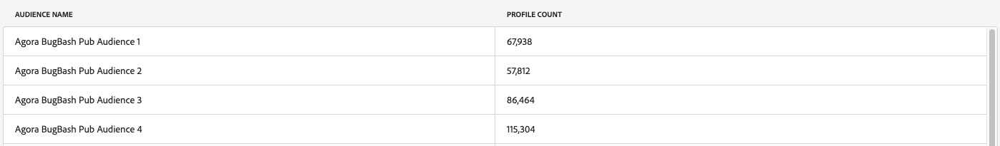

# Adobe Experience Platform 릴리스 정보

>[!TIP]
>
>다른 Adobe Experience Platform 애플리케이션의 릴리스 정보는 다음 문서를 참조하십시오.
>
>- [Adobe Journey Optimizer](https://experienceleague.adobe.com/ko/docs/journey-optimizer/using/whats-new/release-notes)
>- [Adobe Journey Optimizer B2B](https://experienceleague.adobe.com/ko/docs/journey-optimizer-b2b/user/release-notes)
>- [Customer Journey Analytics](https://experienceleague.adobe.com/ko/docs/analytics-platform/using/releases/latest)
>- [페더레이션된 대상자 컴포지션](https://experienceleague.adobe.com/ko/docs/federated-audience-composition/using/release-notes)
>- [Real-Time CDP Collaboration](https://experienceleague.adobe.com/ko/docs/real-time-cdp-collaboration/using/latest)

**릴리스 날짜: 2026년 4월 28일**

Adobe Experience Platform의 새로운 기능 및 기존 기능 업데이트:

- [데이터 수집](#data-collection)
- [대상](#destinations)
- [경험 데이터 모델 (XDM)](#xdm)
- [쿼리 서비스](#query-service)
- [Real-Time CDP](#rtcdp)
- [샌드박스](#sandboxes)
- [소스](#sources)

## 데이터 수집 {#data-collection}

Adobe Experience Platform은 클라이언트측 고객 경험 데이터를 수집하여 Adobe 또는 비 Adobe 대상으로 보강, 변환 및 배포가 가능한 Adobe Experience Platform Edge Network로 보낼 수 있는 기술 제품군을 제공합니다.

**새로운 기능 또는 업데이트된 기능**

| 기능 | 설명 |
| --- | --- |
| 빌드 세부 정보 보기 | 이제 라이브러리 또는 환경에서 빌드와 빌드 세부 정보에 액세스하여 현재 라이브 빌드를 보고 콘텐츠(확장, 데이터 요소 및 규칙)를 검사할 수 있습니다. 자세한 내용은 [빌드 개요](../../tags/ui/publishing/builds.md#build-details)를 참조하십시오. |

{style="table-layout:auto"}

자세한 내용은 [데이터 수집 개요](../../tags/home.md)를 참조하세요.

## 대상 {#destinations}

[!DNL Destinations]은(는) 대상 플랫폼과 미리 빌드된 통합입니다. 대상을 사용하여 크로스 채널 마케팅 캠페인, 이메일 캠페인, 타겟팅 광고 및 기타 많은 사용 사례에 대해 알려진 데이터와 알 수 없는 데이터를 활성화합니다.

**새로운 대상 또는 업데이트된 대상**

| 대상 | 설명 |
| --- | --- |
| [!BADGE Beta]{type=Informative} [Microsoft 광고 고객 일치](../../destinations/catalog/advertising/microsoft-ads-customer-match.md) | 이메일 주소로 고객을 일치시키고 검색 및 대상 광고를 포함하여 [!DNL Microsoft Advertising Network]에서 고객과 다시 교류하십시오. [!DNL Microsoft Advertising] 계정을 Real-Time CDP에 연결하여 Experience Platform에서 직접 고객 일치 목록 생성 및 관리를 자동화합니다. 액세스 권한을 얻으려면 Adobe 계정 관리자에게 문의하십시오. |
| [!BADGE Beta]{type=Informative} [사용자 지정 대상 편집](../../destinations/catalog/advertising/reddit-custom-audience.md) | Experience Platform에서 [!DNL Reddit Ads]&#x200B;(으)로 대상자를 보냅니다. [!DNL Reddit] 계정을 연결하고, ID를 매핑하고, 대상을 활성화하여 [!DNL Reddit]에서 사람들이 관심 영역을 적극적으로 탐색하도록 합니다. |
| [Amazon 광고 v2](../../destinations/catalog/advertising/amazon-ads-v2.md) | 모든 새 [!DNL Amazon Ads] 연결에 [!DNL Amazon Ads v2] 카드를 사용하십시오. [!DNL Amazon Ads v2]이(가) [!DNL Ads Data Manager]에 연결되어 확장된 ID 유형, 주소 관련 필드 및 [!DNL Amazon Ads] 제품 간 데이터 공유를 지원하므로 타깃팅 및 대상 일치율이 향상됩니다. 카탈로그의 기존 [!DNL Amazon Ads] 커넥터의 이름이 [(레거시) [!DNL Amazon Ads]](../../destinations/catalog/advertising/amazon-ads.md)(으)로 변경되었습니다. 기존 레거시 연결이 있는 경우 필요한 변경 없이 계속 작동합니다. |
| [[!DNL Rokt]](../../destinations/catalog/advertising/rokt.md) | [!DNL Rokt]을(를) 사용하여 Experience Platform 대상자를 AI 기반 실시간 의사 결정에 연결하여 보다 정확한 타기팅, 억제 및 개인화를 통해 캠페인 성과를 향상시킵니다. |
| [Acxiom 대상자 연결](../../destinations/catalog/advertising/acxiom-audience-connection.md) | 이제 [!DNL Acxiom Audience Connection] 대상을 일반적으로 사용할 수 있습니다. [!DNL Acxiom's Real ID] 기술로 대상을 향상하고 [!DNL Altice], [!DNL Ampersand], [!DNL Comcast], [!DNL Cox], [!DNL Facebook], [!DNL Amazon], [!DNL Pinterest], [!DNL Vizio], [!DNL LG Ads], [!DNL Spectrum] 및 [!DNL Viant]&#x200B;(으)로 활성화하려면 이 함수를 사용하십시오. |
| [Acxiom Real ID 대상 연결](../../destinations/catalog/advertising/acxiom-real-id-audience-connection.md) | 이제 [!DNL Acxiom Real ID Audience Connection] 대상을 일반적으로 사용할 수 있습니다. [!DNL Altice], [!DNL Ampersand], [!DNL Comcast], [!DNL Cox], [!DNL Facebook], [!DNL Amazon], [!DNL Pinterest], [!DNL Vizio], [!DNL LG Ads], [!DNL Spectrum] 및 [!DNL Viant]에서 일치 키로 [!DNL Acxiom's Real ID]을(를) 사용하여 대상을 활성화하려면 이 함수를 사용합니다. |

{style="table-layout:auto"}

**수정 사항 및 개선 사항**

| 고정 | 설명 |
| --- | --- |
| [Snowflake 스트리밍](../../destinations/catalog/warehouses/snowflake.md) 대상에 대한 새 `TS` 열 | 이제 [Snowflake 스트리밍](../../destinations/catalog/warehouses/snowflake.md) 대상에 각 행이 마지막으로 업데이트된 시기를 표시하는 `TS` 타임스탬프 열이 공유 테이블에 포함됩니다. 이 업데이트는 4월 말까지 배포됩니다. |
| [사용자 지정 Personalization](../../destinations/catalog/personalization/custom-personalization.md) 대상에 대한 지원 모니터링 | 이제 [데이터 흐름 실행 페이지](../../dataflows/ui/monitor-destinations.md#dataflow-runs-for-streaming-destinations)에 [사용자 지정 Personalization](../../destinations/catalog/personalization/custom-personalization.md) 대상에 대한 지표가 표시됩니다. 이전에는 이러한 지표를 이 대상 유형에 사용할 수 없었습니다. 대상자가 예상대로 활성화되는지 확인하고 문제를 진단할 때 사용합니다.   {zoomable="yes"} |
| 활성화 워크플로 검토 단계의 프로필 개수 | 이제 활성화 워크플로의 검토 단계에 이미 활성화된 대상에 대한 프로필 수가 표시됩니다. [일괄 처리 대상](../../destinations/ui/activate-batch-profile-destinations.md)뿐만 아니라 [스트리밍 대상](../../destinations/ui/activate-segment-streaming-destinations.md)에 대해서도 프로필 수가 표시됩니다.   {zoomable="yes"} |
| [!DNL Pinterest] 토큰 만료 가시성 | 이제 [[!DNL Pinterest]](../../destinations/catalog/advertising/pinterest.md) 대상에 토큰 만료 날짜가 표시되므로 재인증이 필요한 시기를 확인할 수 있습니다. 토큰 [!DNL Pinterest]개가 30일마다 만료됩니다. 토큰이 만료되면 데이터 내보내기가 작동하지 않습니다. 중단이 발생하지 않도록 하려면 토큰이 만료되기 전에 [인증 자격 증명을 새로 고치십시오](../../destinations/catalog/advertising/pinterest.md#refresh-authentication-credentials). |
| 만료된 일정에 대해 이제 파일 내보내기가 비활성화되었습니다. | 대상자 일정이 만료되면 이제 **[!UICONTROL Export file now]**&#x200B;을(를) 사용할 수 없게 됩니다. 그 이유를 설명하는 도구 설명이 제공됩니다. 이전에는 작업을 선택하면 오류가 발생했습니다.   {zoomable="yes"} |
| 활성화 워크플로의 열 가시성 수정 | 한 테이블의 표시 열을 변경하면 활성화 워크플로에서 다른 테이블에 잘못 영향을 주는 문제가 해결되었습니다. |

{style="table-layout:auto"}

자세한 내용은 [대상 개요](../../destinations/home.md)를 참조하십시오.

## 경험 데이터 모델 (XDM) {#xdm}

XDM은 Experience Platform에 가져온 데이터에 대한 공통 구조와 정의(스키마)를 제공하는 오픈 소스 사양입니다. XDM 표준을 준수하여 모든 고객 경험 데이터를 공통된 표현에 통합해 보다 빠르고 통합된 방식으로 인사이트를 제공할 수 있습니다. 고객 조치에서 귀중한 인사이트를 얻고, 세그먼트를 통해 고객 대상자를 정의하고, 개인 설정 목적으로 고객 속성을 사용할 수 있습니다.

| 기능 | 설명 |
| --- | --- |
| 필드 그룹 사용 및 검색 개선 사항 | 필드 그룹을 사용하는 스키마를 보고 UI에서 호환되는 클래스, 필수 속성 및 거버넌스 레이블과 같은 메타데이터에 직접 액세스합니다. 또한 클래스 호환성 및 업계 태그로 필드 그룹을 필터링하여 관련 리소스를 보다 효율적으로 찾고 변경 전에 영향을 평가할 수 있습니다. 자세한 내용은 [필드 그룹 탐색 가이드](../../xdm/ui/explore.md#explore-field-groups.md)를 참조하세요. |

자세한 내용은 [XDM 개요](../../xdm/home.md)를 참조하십시오.

## 쿼리 서비스 {#query-service}

쿼리 서비스를 사용하여 표준 SQL로 Adobe Experience Platform [!DNL Data Lake]의 데이터를 쿼리합니다. [!DNL Data Lake]의 데이터 세트에 참여하고 쿼리 결과를 보고, Data Science Workspace 또는 실시간 고객 프로필로의 수집에 사용할 새 데이터 세트로 캡처합니다.

**새로운 기능 또는 업데이트된 기능**

| 기능 | 설명 |
| --- | --- |
| 쿼리 서비스 세션 관리 | [!UICONTROL Admin] 탭에서 활성 쿼리 서비스 세션을 보고 종료하여 사용량을 모니터링하고 유휴 세션 용량을 늘리십시오. 이렇게 하면 관리자가 비활성 세션의 용량을 재확보하여 안정적인 데이터 Distiller 워크플로우를 유지할 수 있습니다. 자세한 내용은 [쿼리 서비스 세션 관리 가이드](../../query-service/ui/session-management.md)를 참조하세요. |

{style="table-layout:auto"}

자세한 내용은 [쿼리 서비스 개요](../../query-service/home.md)를 참조하세요.

## Real-Time CDP {#rtcdp}

Real-Time CDP은 여러 채널에서 실시간으로 데이터를 수집, 처리 및 활성화하여 실행 가능한 통합 고객 프로필을 제공합니다. Real-Time CDP을 사용하면 조직은 기존 데이터 소스를 연결하고 풍부한 대상을 구축 및 활성화할 수 있으며 Experience Platform 내에서 모든 대상이 개인 정보 보호를 준수하는 활성화를 보장할 수 있습니다. 이를 통해 마케터, 분석가 및 IT 팀은 원활한 크로스 채널 마케팅 캠페인을 통해 고객에게 개인화되고 시기적절한 경험을 제공할 수 있습니다.

**새로운 기능 또는 업데이트된 기능**

| 기능 | 설명 |
| --- | --- |
| Real-Time CDP MCP(Beta) | [Real-Time CDP MCP](../../rtcdp/rtcdp-mcp.md)를 사용하여 Real-Time CDP을 AI 에이전트 및 MCP 호환 클라이언트로 가져와 기본 LLM 경험을 통해 직접 Real-Time CDP 도구와 상호 작용할 수 있습니다. MCP 호환 클라이언트(예: Claude, ChatGPT, Claude Code, Codex, Cursor 또는 VS 코드)를 Adobe 담당자가 제공하는 끝점에 연결하면 Experience Platform REST API 호출을 작성하거나 여러 UI 워크플로우를 탐색하지 않고도 자연어를 사용하여 대상자, 대상 구성 및 활성화 실행 기록을 검사할 수 있습니다. 브라우저 기반 Adobe 로그인을 완료하면 다음을 포함한 도구에 대한 읽기 전용 액세스 권한을 갖게 됩니다. <ul><li>기존 대상자 검색</li><li>대상자 멤버십 미리 보기</li><li>목록 대상 유형</li><li>구성된 계정 나열</li><li>구성된 대상 나열</li><li>Source 연결 나열</li><li>Target 연결 나열</li><li>활성화 실행 검사</li></ul>. 각 요청에는 `imsOrgId` 및 `sandboxName` 매개 변수가 있어야 작업을 조직과 샌드박스에 지정할 수 있습니다. **참고**: 이 Beta 릴리스에서는 쓰기 작업이 지원되지 않습니다. |

{style="table-layout:auto"}

자세한 내용은 [Real-Time CDP 개요](../../rtcdp/home.md)를 참조하세요.

## 샌드박스 {#sandboxes}

Adobe Experience Platform은 전 세계적으로 디지털 체험 애플리케이션을 풍부하게 제공하기 위해 구축되었습니다. 기업은 여러 디지털 경험 애플리케이션을 동시에 실행하는 경우가 많으며, 운영 규정 준수를 보장하면서 이러한 애플리케이션의 개발, 테스트 및 배포에 맞추어야 합니다.

**새로운 기능 또는 업데이트된 기능**

| 기능 | 설명 |
| --- | --- |
| 빠른 복사 | [샌드박스 도구 UI](/help/sandboxes/ui/sandbox-tooling.md#express-copy)에서 한 번의 작업으로 대상 샌드박스에 개체를 복사하려면 빠른 복사를 사용하십시오. 종속 오브젝트는 자동으로 감지되며 대상 샌드박스에서 생성되거나 이미 존재하는 경우 재사용됩니다. |

{style="table-layout:auto"}

자세한 내용은 [샌드박스 개요](../../sandboxes/home.md)를 참조하세요.

## 소스 {#sources}

Experience Platform은 다양한 데이터 공급자에 대한 소스 연결을 쉽게 설정할 수 있는 RESTful API 및 대화형 UI를 제공합니다. 이러한 소스 연결을 통해 외부 스토리지 시스템 및 CRM 서비스에 인증 및 연결하고, 수집 실행 시간을 설정하고, 데이터 수집 처리량을 관리할 수 있습니다.

**새 소스 또는 업데이트된 소스**

| 소스 | 설명 |
| --- | --- |
| [!BADGE Beta]{type=Informative} [!DNL Talon.One] | 이제 Experience Platform용 [[!DNL Talon.One] source](../../sources/connectors/loyalty/talon-one.md)을(를) 일괄 처리 모드와 스트리밍 모드 모두에서 사용할 수 있습니다. [[!DNL Talon.One Batch Source Connector]](../../sources/tutorials/ui/create/loyalty/talon-one-batch.md)을(를) 사용하여 마감된 세션 및 과거 충성도 트랜잭션을 정기적으로 수집하고, [[!DNL Talon.One Streaming Events]](../../sources/tutorials/ui/create/loyalty/talon-one-streaming.md) 소스를 사용하여 [!DNL Talon.One] 이벤트를 거의 실시간으로 Experience Platform으로 가져옵니다. 이를 함께 사용하면 Real-Time CDP, Adobe Journey Optimizer 및 Offer Decisioning에서 [!DNL Talon.One] 로열티 데이터를 더 쉽게 로드하고 활성화할 수 있습니다. |
| SOQL을 사용하여 [!DNL Salesforce]에 대한 행 수준 필터링 지원 | 이제 [!DNL Salesforce] 소스 연결에서 [!DNL Salesforce] SOQL(개체 쿼리 언어) 필터를 직접 적용할 수 있으므로 행 수준 데이터를 Experience Platform에 수집하기 전에 제한할 수 있습니다. 이 기능을 사용하여 다음을 수행할 수 있습니다. <ul><li>Salesforce 오브젝트에 SOQL where 절 스타일 조건을 정의합니다(예: 이메일 != null 또는 특정 단계의 기회가 있는 리드만).</li><li>기준을 충족하는 행으로만 수집을 제한하여 불필요한 데이터 이동, 저장 및 다운스트림 처리를 줄입니다</li><li>소스에서 Experience Platform으로 가져올 레코드를 제어하여 Experience Platform 수집을 CRM 데이터 액세스 및 규정 준수 규칙과 더욱 긴밀하게 연계합니다</li></ul>. 자세한 내용은 [소스에 대한 행 수준 필터링](../../sources/tutorials/api/filter.md)에 대한 안내서를 참조하십시오. |

{style="table-layout:auto"}

자세한 내용은 [소스 개요](../../sources/home.md)를 참조하십시오.

<!--

| Data Distiller Accelerators | Run and schedule Adobe-managed, parameterized SQL templates in the Query Service UI to perform common analyses without writing SQL. This helps you standardize analytics workflows and reuse trusted query logic across your organization. See the [Data Distiller accelerators guide](../../query-service/ui/accelerators.md) for more details. |

| Automatic dataflow disabling | Sources ingestion dataflows that fail continuously for 30 days are automatically disabled, helping to surface unhealthy dataflows and reduce repeated failed runs. |

--->