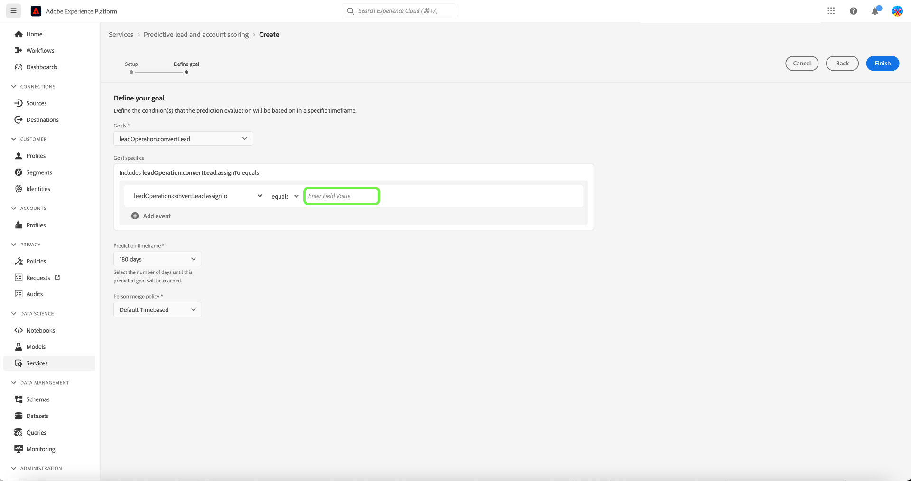
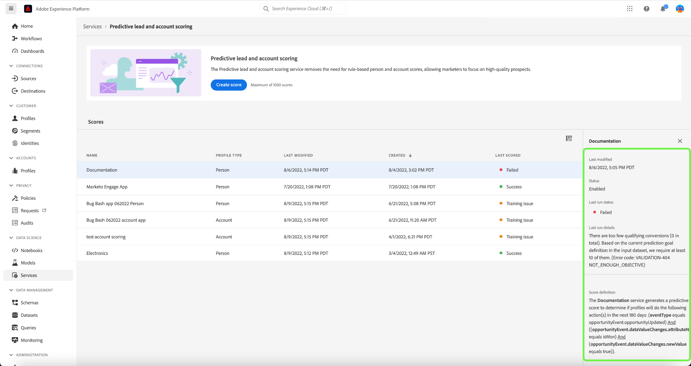

# Adobe Real-time Customer Data Platform, B2B Edition에서 예측 리드 및 계정 점수 관리

>[!NOTE]
>
>B2B AI 관리 권한이 있는 사용자만 점수 목표를 생성, 변경 및 삭제할 수 있습니다.

이 자습서에서는 예측 리드 및 계정 점수 서비스 점수 목표를 관리하는 단계를 안내합니다. 점수 목표는 개인 프로필 또는 계정 프로필 중 하나에 해당할 수 있습니다

## 새 점수 만들기

새 점수를 만들려면 **[!UICONTROL 서비스]** 사이드바에서 을(를) 선택하고 을(를) 선택합니다. **[!UICONTROL 점수 만들기]**.

다음 **[!UICONTROL 기본 정보]** 프로파일 유형을 선택하라는 메시지가 표시되는 화면이 나타납니다. 이름 및 선택적 설명을 입력합니다. 완료되면 을 선택합니다 **[!UICONTROL 다음]**.

다음 **[!UICONTROL 목표 정의]** 화면이 나타납니다. 드롭다운 화살표를 선택한 다음 표시되는 드롭다운 창에서 목표 유형을 선택합니다.

다음 **[!UICONTROL 목표 세부 사항]** 대화 상자가 열립니다. 드롭다운 화살표를 선택한 다음 표시되는 드롭다운 창에서 목표 필드 이름을 선택합니다.

다음 **[!UICONTROL 목표 조건]** 선택 영역이 나타납니다. 드롭다운 화살표를 선택한 다음 표시되는 드롭다운 창에서 조건을 선택합니다.

다음 **[!UICONTROL 목표 값]** 필드가 나타납니다. 다음으로, [!UICONTROL 목표 세부 사항]. 을(를) 선택합니다 [!UICONTROL 필드 값 입력] 패널과 목표 값을 입력합니다.

>[!NOTE]
>
>여러 목표 값을 추가할 수 있습니다.

필드를 더 추가하려면 **[!UICONTROL 필드 추가]**.

예측 기간을 구성하려면 드롭다운 화살표를 선택한 다음 선택한 기간을 선택합니다.

선택한 병합 정책은 개인 프로필의 필드 값을 선택하는 방법을 결정합니다. 드롭다운 화살표를 사용하여 선택한 병합 정책을 선택한 다음 선택합니다 **[!UICONTROL 완료]**.

다음 **[!UICONTROL 점수 설정이 완료되었습니다.]** 새 점수가 생성되었음을 확인하는 대화 상자가 나타납니다. 선택 **[!UICONTROL 확인]**.

>[!NOTE]
>
>각 점수 프로세스를 완료하는 데 최대 24시간이 걸릴 수 있습니다.

에 반환됩니다 **[!UICONTROL 서비스]** 점수 목록에서 생성된 새 점수를 볼 수 있는 탭입니다.

점수를 선택하여 마지막 실행 세부 정보에 대한 세부 정보와 추가 정보를 확인합니다.

마지막 실행 세부 정보에서 볼 수 있는 오류 코드에 대한 자세한 내용은 [리드 AI 파이프라인 오류 코드](#leads-ai-pipeline-error-codes) 참조하십시오.

## 점수 편집

점수를 편집하려면 **[!UICONTROL 서비스]** 탭을 선택하고 **[!UICONTROL 편집]** 화면 오른쪽의 추가 세부 사항 패널에서 참조할 수 있습니다.

다음 **[!UICONTROL 인스턴스 편집]** 점수에 대한 설명을 편집할 수 있는 대화 상자가 나타납니다. 변경 작업을 수행하고 을(를) 선택합니다 **[!UICONTROL 저장]**.

>[!NOTE]
>
>모델 재교육 및 재점수를 트리거하므로 점수 구성을 변경할 수 없습니다. 점수를 삭제하고 새 점수를 만드는 것과 같습니다. 점수의 구성을 편집하려면 이 점수를 복제하거나 새 점수를 만들어야 합니다.

에 반환됩니다 **[!UICONTROL 서비스]** 탭. 화면 오른쪽의 추가 세부 정보 패널에서 업데이트된 설명 세부 사항을 보려면 점수를 선택합니다.

## 점수 복제

점수를 복제하려면 **[!UICONTROL 서비스]** 탭을 선택하고 **[!UICONTROL 복제]** 화면 오른쪽의 추가 세부 사항 패널에서 참조할 수 있습니다.

다음 **[!UICONTROL 기본 정보]** 화면이 나타납니다. 프로필 유형, 이름 및 설명이 원래 점수에서 복제됩니다. 이러한 세부 사항을 수정하고 을 선택합니다 **[!UICONTROL 다음]**.

다음 **[!UICONTROL 목표 정의]** 화면이 나타납니다. 새 점수를 만들 때처럼 목표 섹션을 완료하고 를 선택합니다 **[!UICONTROL 완료]**.

에 반환됩니다 **[!UICONTROL 서비스]** 탭에서 목록에 새로 복제된 점수를 볼 수 있습니다.

>[!NOTE]
>
>다음 **[!UICONTROL 목표 정의]** 섹션이 원래 점수에서 복제되지 않습니다.

## 점수 삭제

점수를 삭제하려면 **[!UICONTROL 서비스]** 탭을 선택하고 **[!UICONTROL 삭제]** 화면 오른쪽의 추가 세부 사항 패널에서 참조할 수 있습니다.

다음 **[!UICONTROL 설명서 삭제]** 확인 대화 상자가 나타납니다. **[!UICONTROL 삭제]**&#x200B;를 선택합니다.

>[!NOTE]
>
>점수 정의를 삭제하면 개인 프로필 또는 계정 프로필에 대해 예측된 모든 점수가 삭제되지만, 점수 정의에 대해 생성된 필드 그룹은 삭제되지 않습니다. 필드 그룹은 데이터 모델에서 &quot;고립됨&quot;으로 남게 됩니다.

에 반환됩니다 **[!UICONTROL 서비스]** 탭에서 목록에 점수가 더 이상 표시되지 않습니다.

## 리드 AI 파이프라인 오류 코드

| 오류 코드 | 오류 메시지 |
| --- | --- |
| 401년 | 오류 401. 리드 AI 파이프라인이 중지되었습니다. 계정 점수 책정을 위한 유효한 계정이 부족합니다. 계정 수: {}. |
| 402년 | 오류 402. 리드 AI 파이프라인이 중지되었습니다. 연락처 점수에 적합한 연락처가 부족합니다. 연락처 수: {}. |
| 403년 | 오류 403. 리드 AI 파이프라인이 중지되었습니다. 모델 교육을 위한 활동 볼륨이 부족합니다. 이벤트 수: {}. |
| 404년 | 오류 404. 리드 AI 파이프라인이 중지되었습니다. 모델 교육을 위한 전환이 충분하지 않습니다. 전환 수: {}. |
| 405년 | 오류 405. 리드 AI 파이프라인이 중지되었습니다. 활동이 너무 스파스(스파스)하여 올바른 모델 교육을 받을 수 없습니다. 계정 중 {}%만 활동이 있습니다. |
| 406년 | 오류 406. 리드 AI 파이프라인이 중지되었습니다. 활동이 너무 스파스(스파스)하여 올바른 모델 교육을 받을 수 없습니다. 대화 상대 중 {}%만 활동이 있습니다. |
| 407년 | 오류 407. 리드 AI 파이프라인이 중지되었습니다. 점수 데이터 활동 유형이 교육 데이터와 일치하지 않습니다. |
| 408년 | 오류 408. 리드 AI 파이프라인이 중지되었습니다. 누락된 비율이 활동 기능에 비해 너무 높습니다. 누락된 비율: {}. |
| 409년 | 오류 409. 리드 AI 파이프라인이 중지되었습니다. 테스트 auc가 너무 낮습니다. 테스트 대상: {}. |
| 410년 | 오류 410. 리드 AI 파이프라인이 중지되었습니다. 매개 변수 조정 후 테스트 대상이 너무 낮습니다. 테스트 대상: {}. |
| 411년 | 오류 411. 리드 AI 파이프라인이 중지되었습니다. 교육 데이터에는 신뢰할 수 있는 모델을 생성할 충분한 전환이 없습니다. 전환: {}. |
| 412년 | 오류 412. 리드 AI 파이프라인이 중지되었습니다. 테스트 데이터에 AUC-ROC를 계산하기 위한 변환이 없습니다. |

| 경고/정보 코드 | 메시지 |
| --- | --- |
| 100 | 정보 100. 리드 AI 품질 검사: 계정 수는 다음과 같습니다. {}. |
| 101 | 정보 101. 리드 AI 품질 검사: 연락처 수는 다음과 같습니다. {}. |
| 102 | 정보 102. 리드 AI 품질 검사: 영업 기회 수는 다음과 같습니다. {}. |
| 103 | 정보 103. 리드 AI 품질 검사: auc 테스트 결과가 낮습니다. 매개 변수 조정을 시작합니다. Auc 테스트: {}. |
| 200 | 경고 200. 리드 AI 품질 검사: 첫 번째 기능의 누락 비율은 다음과 같습니다. {}. |
| 201 | 경고 201. 리드 AI 품질 검사: 활동 기능이 누락된 비율은 다음과 같습니다. {}. |

## 다음 단계

이제 이 자습서를 따라 점수를 만들고 관리할 수 있습니다. 자세한 내용은 다음 문서를 참조하십시오.

* [예측 리드 및 계정 점수 책정](/help/rtcdp/b2b-ai-ml-services/predictive-lead-and-account-scoring.md)
* [예측 리드 및 계정 점수 작업 모니터링](/help/dataflows/ui/b2b/monitor-profile-enrichment.md)
