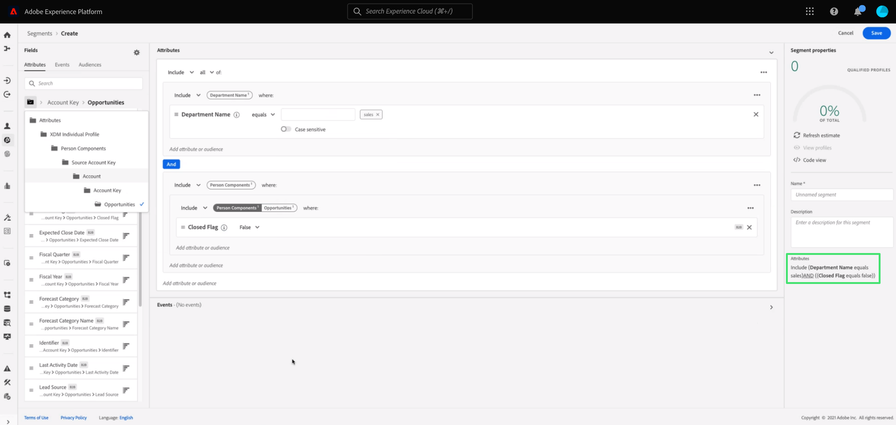

# Real-time Customer Data Platform B2B 에디션 시작하기

이 문서에서는 주요 개념을 설명하는 예제 사용 사례를 사용하여 Real-time Customer Data Platform(CDP) B2B 에디션을 시작하기 위한 높은 수준의 통합 워크플로우를 제공합니다.

기술 회사 Bodea는 새로운 제품에 대한 이메일 및 LinkedIn 광고 캠페인으로 고객을 효과적으로 타겟팅하기 위해 서로 다른 사일로 데이터 소스의 사용자와 계정 데이터를 결합하려고 합니다. Bodea는 Marketo Engage을 마케팅 자동화 플랫폼으로 사용하며 고객 데이터가 포함된 여러 CRM에서 B2B별 대상을 세그먼트화해야 합니다.

## 시작하기

이 자습서 워크플로우는 데모의 일부로서 여러 Adobe Experience Platform 서비스를 사용합니다. 다음을 따라가려면 다음 서비스를 잘 이해하는 것이 좋습니다.

- [경험 데이터 양식(XDM)](../xdm/home.md)
- [소스](../sources/home.md)
- [세그먼테이션](../segmentation/home.md)
- [대상](../destinations/home.md)

## 데이터에 대한 스키마 만들기

초기 설정의 일부로, Bodea의 IT 부서에서는 데이터가 Platform으로 가져올 때 표준 형식을 따르고 다양한 플랫폼 서비스 및 Adobe Experience Cloud 제품(예: Adobe Analytics 및 Adobe Target)에서 실행 가능하도록 하기 위해 XDM 스키마를 만들어야 합니다.

>[!WARNING]
>
>이 자습서 전체에 연결된 관련 소스 설명서에 설명된 대로 수집 패턴을 따라야 합니다. 다른 필드 매핑 방법은 작동하지 않을 수 있습니다.

Adobe Experience Platform을 사용하면 B2B 데이터 소스에 필요한 스키마 및 네임스페이스를 자동으로 생성할 수 있습니다. 이 도구는 생성된 스키마가 구조화된 재사용 가능한 방식으로 데이터를 설명하도록 합니다. 다음 [B2B 네임스페이스 및 스키마 자동 생성 유틸리티 설명서](../sources/connectors/adobe-applications/marketo/marketo-namespaces.md) 설정 프로세스에 대한 전체 참조.

Adobe Experience Platform UI 내에서 Bodea 마케터는 **[!UICONTROL 스키마]** 왼쪽 레일에서, 그 뒤에 **[!UICONTROL 찾아보기]** 탭. Marketo Engage 자동 생성 유틸리티를 사용했으므로 새 빈 스키마가 목록에 표시되며 모두 &quot;B2B&quot;라는 접두어가 있습니다.

자동 생성 유틸리티는 표준 XDM B2B 클래스(예: [XDM 비즈니스 계정](../xdm/classes/b2b/business-account.md) 및 [XDM 비즈니스 영업 기회](../xdm/classes/b2b/business-opportunity.md)기본 B2B 데이터 엔티티를 캡처합니다. 또한 이러한 클래스에 구축된 자동 생성된 B2B 스키마에는 고급 세분화 사용 사례를 허용하는 사전 설정된 관계가 있습니다. 데이터 구조에 필요한 모든 추가 필드 그룹은 UI를 통해 여기에서 쉽게 만들 수 있습니다. 다음을 참조하십시오. [스키마 섹션에 필드 그룹을 추가하는 XDM UI 안내서](../xdm/ui/resources/schemas.md#add-field-groups) 추가 정보.

>[!NOTE]
> 
>자동 생성기 유틸리티를 사용하지 않거나 새 관계를 만들어야 하는 경우 다음 자습서를 참조하십시오. [B2B 스키마 간의 관계 만들기](../xdm/tutorials/relationship-b2b.md).

Real-Time Customer Profile은 서로 다른 소스의 데이터를 병합하여 주요 B2B 엔티티의 통합 프로필을 만듭니다. 프로필은 단일 클래스를 기반으로 생성되므로 자동 생성 유틸리티는 일반적인 비즈니스 사용 사례를 기반으로 스키마 간의 관계를 설정합니다. 따라서 Bodea 팀은 이제 B2B 스키마를 기반으로 데이터를 수집할 준비가 되었습니다.

>[!NOTE]
> 
>자동 생성 유틸리티로 스키마에 대해 생성된 기본 ID 네임스페이스, 기본 키 및 관계는 스키마 작업 영역 내에서 쉽게 검색할 수 있습니다.
>
>

## 데이터를 Experience Platform에 수집

다음으로 Bodea 마케터는 [Marketo Engage 커넥터](../sources/connectors/adobe-applications/marketo/marketo.md) 다운스트림 서비스에서 사용하기 위해 데이터를 Platform에 수집 Real-Time CDP B2B 에디션에 대해 승인된 소스 중 하나를 사용하여 데이터를 수집할 수도 있습니다.

>[!NOTE]
> 
>조직에서 사용할 수 있는 소스 커넥터를 알려면 Platform UI에서 소스 카탈로그를 볼 수 있습니다. 카탈로그에 액세스하려면 다음을 선택합니다. **소스** 왼쪽 탐색에서 을(를) 선택합니다. **카탈로그**.

Marketo 계정과 플랫폼 간에 연결을 만들려면 인증 자격 증명을 획득해야 합니다. 다음을 참조하십시오. [Marketo 소스 커넥터 인증 자격 증명 달성에 대한 안내서](../sources/connectors/adobe-applications/marketo/marketo-auth.md) 자세한 지침은 을 참조하십시오.

인증 자격 증명을 획득한 후 Bodea 마케터는 Marketo 계정과 해당 Platform IMS 조직 간의 연결을 만듭니다. 에 대한 지침은 설명서 를 참조하십시오. [platform UI를 사용하여 Marketo 계정을 연결하는 방법](../sources/tutorials/ui/create/adobe-applications/marketo.md).

Marketo Engage 소스 커넥터는 모든 데이터 필드를 새로 만든 스키마의 데이터 필드에 매핑하는 프로세스를 훨씬 쉽게 만드는 자동 매핑 기능을 제공합니다.

>[!NOTE]
> 
>XDM 스키마에서 사용자 정의 필드 그룹을 만든 경우 이 프로세스 단계에서 연결되지 않은 필드가 있을 수 있습니다. 사용자 정의 필드 그룹을 채우는 모든 값을 확인하십시오.

Bodea 마케터는 모든 필드 그룹이 적절하게 매핑되었는지 확인하고 데이터 흐름을 초기화하여 소스 설정 프로세스를 계속합니다. Marketo 데이터를 가져오는 데이터 흐름을 만들어 들어오는 데이터를 다운스트림 플랫폼 서비스에서 사용할 수 있습니다. 초기 수집 프로세스 동안 데이터가 일괄 처리로 Experience Platform에 포함됩니다. 이후, 이후에 수집된 데이터는 실시간에 가까운 업데이트로 프로필에 스트리밍됩니다.

## 데이터를 평가할 세그먼트 만들기

다음 작업은 소스 데이터의 관련 엔티티의 특정 속성을 기반으로 Bodea의 새 이메일 마케팅 캠페인에 대한 대상을 만드는 것입니다. Platform UI 내에서 Bodea 마케터는 먼저 **[!UICONTROL 세그먼트]** 왼쪽 탐색에서 **[!UICONTROL 세그먼트 만들기]**.

이 예에서 세그먼트는 판매 부서에서 근무하며 최소 하나 이상의 영업 기회가 있는 모든 계정과 관련된 모든 인력을 찾습니다. 이 세그먼트를 사용하려면 XDM 개인 프로필 클래스, XDM 비즈니스 계정 클래스 및 XDM 비즈니스 영업 기회 클래스 간의 링크가 필요합니다.

>[!NOTE]
> 
>세그먼트를 만들어 데이터를 평가하는 방법에 대한 지침은 [세그먼트 빌더 UI 안내서](../segmentation/ui/segment-builder.md). 보다 구체적인 B2B 세그멘테이션 사용 사례는 다음을 참조하십시오. [Real-Time CDP B2B 에디션의 세그멘테이션 개요](./segmentation/b2b.md).

세그먼트 빌더를 사용하면 실시간 고객 프로필 데이터에서 마케팅 가능한 대상을 만들고 속성, 이벤트 및 정의한 기존 대상의 조합을 기반으로 예상 대상의 예상 예상 크기를 볼 수 있습니다.

## 평가된 데이터를 대상에 활성화

세그먼트가 성공적으로 만들어지면에서 요약이 제공됩니다. [!UICONTROL 세부 사항] 섹션에 있는 마지막 항목이 될 필요가 없습니다. 현재 세그먼트에 대해 활성화된 대상이 없으므로 Bodea 마케터는 대상자를 액세스 및 작업을 수행할 수 있는 데이터 세트로 내보내야 합니다.

다음 범위 내 [!UICONTROL 세그먼트] Bodea 마케터가 선택하는 Platform UI의 작업 영역 **[!UICONTROL 대상에 활성화]**.

>[!NOTE]
> 
>다음 튜토리얼 참조: [대상에 대한 세그먼트 활성화](https://experienceleague.adobe.com/docs/marketo/using/product-docs/core-marketo-concepts/smart-lists-and-static-lists/static-lists/push-an-adobe-experience-cloud-segment-to-a-marketo-static-list.html) 을(를) 수행하는 방법에 대한 포괄적인 단계를 설명합니다.

Bodea 마케터는 Marketo 대상에 대한 세그먼트를 활성화하여 플랫폼에서 정적 목록의 형태로 Marketo Engage으로 세그먼트 데이터를 푸시할 수 있습니다. 에서 안내서 참조 [Marketo 대상](https://experienceleague.adobe.com/docs/experience-platform/destinations/catalog/adobe/marketo-engage.html) 추가 정보.

## 다음 단계

이 자습서를 따라 Real-Time CDP B2B 에디션에서 사용하는 다양한 Adobe Experience Platform 서비스를 성공적으로 활용했습니다. 따라서 B2B 데이터를 여러 채널에서 참여할 수 있는 실행 가능한 대상으로 수집, 세그먼트화, 평가 및 내보내는 방법을 배웠습니다.
