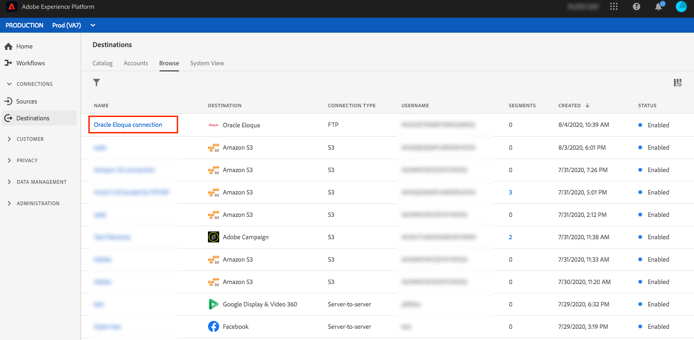
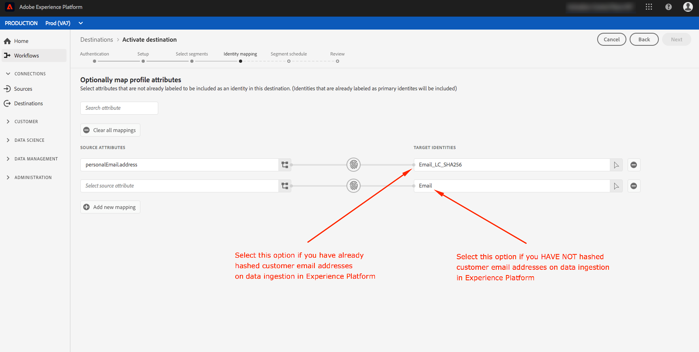

# 대상에 프로필 및 세그먼트 활성화

세그먼트를 대상에 매핑하여 실시간 고객 데이터 플랫폼에 있는 데이터를 활성화합니다. 이를 수행하려면 아래 단계를 따르십시오.

## 전제 조건 {#prerequisites}

대상에 데이터를 활성화하려면 대상을 [연결했어야 합니다](/help/rtcdp/destinations/connect-destination.md). 아직 수행하지 않은 경우 [대상 카탈로그로](/help/rtcdp/destinations/destinations-catalog.md)이동하여 지원되는 대상을 탐색하고 하나 이상의 대상을 설정합니다.

## 데이터 활성화 {#activate-data}

활성화 워크플로우의 단계는 대상 유형에 따라 약간 다릅니다. 모든 대상 유형에 대한 전체 워크플로우는 아래에 요약되어 있습니다.

### 데이터를 활성화할 대상 선택 {#select-destination}

적용 대상:모든 대상

실시간 CDP 사용자 인터페이스에서 **[!UICONTROL 대상]** > **[!UICONTROL 찾아보기로]**이동하고 세그먼트를 활성화할 대상을 선택합니다.


정품 인증 워크플로로 이동할 대상 이름을 선택합니다.


대상에 대한 활성화 워크플로우가 이미 존재하는 경우 대상에 대해 현재 활성화된 세그먼트를 볼 수 있습니다. 오른쪽 레일에서 **[!UICONTROL 활성화]** 편집을 선택하고 아래 단계에 따라 정품 인증 세부 사항을 수정합니다.

대상을 선택하고 나면 활성화를 **[!UICONTROL 선택합니다]**.

### [!UICONTROL 세그먼트 선택] 단계 {#select-segments}

적용 대상:모든 대상


대상 **[!UICONTROL 활성화]** 워크플로의 세그먼트 **[!UICONTROL 선택]** 페이지에서 대상에 활성화할 세그먼트를 하나 이상 선택합니다. 다음 **[!UICONTROL 단계로]** 진행하려면 다음을 선택합니다.


### [!UICONTROL ID 매핑] 단계 {#identity-mapping}

적용 대상:소셜 대상 및 Google 고객 일치 광고 대상


소셜 대상의 경우 소스 속성을 선택하여 대상의 타겟 ID로 매핑할 수 있습니다. 이 단계는 스키마에서 사용 중인 기본 ID에 따라 선택 사항이거나 필수 사항입니다.

스키마의 기본 ID로 이메일 주소를 사용하는 경우 아래와 같이 ID 매핑 단계를 건너뛸 수 있습니다.


스키마의 기본 ID로 &quot;보상 ID&quot; 또는 &quot;충성도 ID&quot;와 같은 다른 ID를 사용하는 경우 아래와 같이 ID 스키마의 이메일 주소를 소셜 대상의 대상 ID로 수동으로 매핑해야 합니다.


Adobe Experience Platform `Email_LC_SHA256` 로 데이터 수집 시 [!DNL Facebook] 이메일 해싱 요구 사항에 따라 고객 이메일 주소를 해시 처리한 경우 [타겟 ID로 선택합니다](/help/rtcdp/destinations/facebook-destination.md#email-hashing-requirements).

사용 `Email` 중인 이메일 주소가 해시되지 않은 경우 타겟 ID로 선택합니다. 실시간 CDP는 요구 사항을 준수하기 위해 이메일 주소를 [!DNL Facebook] 해시합니다.



### **[!UICONTROL 단계 구성]** {#configure}

적용 대상:이메일 마케팅 대상 및 클라우드 스토리지 대상


구성 **[!UICONTROL 단계에서]** 내보낼 각 세그먼트에 대한 예약 및 파일 이름을 구성할 수 있습니다. 예약 구성은 필수지만 파일 이름 구성은 선택 사항입니다.

세그먼트에 대한 예약을 추가하려면 예약 **[!UICONTROL 만들기를 선택합니다]**.


세그먼트 예약을 만드는 옵션을 표시하는 팝업이 나타납니다.

- **파일 내보내기**:전체 파일 또는 증분 파일을 내보낼 수 있습니다. 전체 파일을 내보내면 해당 세그먼트에 적합한 모든 프로파일의 전체 스냅샷이 게시됩니다. 증분 파일을 내보내면 마지막 내보내기 이후 해당 세그먼트에 자격을 부여하는 프로파일 델타가 게시됩니다.
- **빈도**:[전체 파일 **[!UICONTROL 내보내기]** ]를 선택한 경우 [ **[!UICONTROL 한 번]** ] 또는 [일별]을 내보낼 수 **[!UICONTROL 있습니다]**. 증분 파일 **[!UICONTROL 내보내기를]** 선택한 경우 **[!UICONTROL 일별]**&#x200B;내보내기 옵션만 있습니다. 파일 내보내기 한 번 **[!UICONTROL 은]** 파일을 한 번 내보냅니다. 파일 내보내기 **[!UICONTROL 일별]** 은 전체 파일을 선택한 경우 시작 날짜에서 종료 날짜까지 매일 파일을 12:00 AM UTC(7:00 PM EST)에 내보내며 증분 파일을 선택한 경우 12:00 PM UTC(7:00 EST)에 내보냅니다.
- **날짜**:한 번 **[!UICONTROL 을]** 선택하면 한 번 내보낼 날짜를 선택할 수 있습니다. [ **[!UICONTROL 일별]** ]을 선택한 경우 내보내기 시작 날짜와 종료 날짜를 선택할 수 있습니다.


기본 파일 이름은 대상 이름, 세그먼트 ID, 날짜 및 시간 표시기로 구성됩니다. 예를 들어 내보낸 파일 이름을 편집하여 다른 캠페인을 구분하거나 데이터 내보내기 시간을 파일에 추가할 수 있습니다.

연필 아이콘을 선택하여 모달 창을 열고 파일 이름을 편집합니다. 파일 이름은 255자로 제한됩니다.


파일 이름 편집기에서 다른 구성 요소를 선택하여 파일 이름에 추가할 수 있습니다. 파일 이름에서 대상 이름 및 세그먼트 ID를 제거할 수 없습니다. 이 외에 다음을 추가할 수 있습니다.

- **[!UICONTROL 세그먼트 이름]**:세그먼트 이름을 파일 이름에 추가할 수 있습니다.
- **[!UICONTROL 날짜 및 시간]**:파일이 생성된 시간의 Unix 10자리 타임스탬프 또는 `MMDDYYYY_HHMMSS` 형식을 추가하는 중 선택합니다. 각 증분 내보내기에서 동적 파일 이름을 생성하려는 경우 다음 옵션 중 하나를 선택합니다.
- **[!UICONTROL 사용자 정의 텍스트]**:파일 이름에 사용자 정의 텍스트를 추가합니다.

변경 **[!UICONTROL 적용을 선택하여]** 선택을 확인합니다.

>[!IMPORTANT]
> 
>[ **[!UICONTROL 날짜] 및 [시간]** ] 구성 요소를 선택하지 않으면 파일 이름이 고정되고 새로 내보낸 파일은 내보낼 때마다 저장소 위치의 이전 파일을 덮어씁니다. 저장소 위치에서 이메일 마케팅 플랫폼으로 반복되는 가져오기 작업을 실행할 때 권장되는 옵션입니다.


모든 세그먼트 구성을 완료하고 나면 다음을 **[!UICONTROL 선택하여]** 계속합니다.

### **[!UICONTROL 세그먼트 예약]** 단계 {#segment-schedule}

적용 대상:광고 목적지, 소셜 목적지


[ **[!UICONTROL 세그먼트 예약]** ] 페이지에서 대상으로 데이터를 전송하는 시작 날짜와 대상으로 데이터를 보내는 빈도를 설정할 수 있습니다.

>[!IMPORTANT]
>
>소셜 대상의 경우 이 단계에서 대상의 출처를 선택해야 합니다. 아래 이미지에서 옵션 중 하나를 선택한 후에만 다음 단계로 진행할 수 있습니다.


### **[!UICONTROL 속성]** 선택 단계 {#select-attributes}

적용 대상:이메일 마케팅 대상 및 클라우드 스토리지 대상


속성 **[!UICONTROL 선택]** 페이지에서 **[!UICONTROL 새 필드]** 추가를 선택하고 대상에 보낼 속성을 선택합니다.

>[!NOTE]
>
> 실시간 CDP는 스키마에서 공통으로 사용되는 네 가지 속성을 사용하여 선택 사항을 프리플라이트합니다. `person.name.firstName`,, `person.name.lastName`, `personalEmail.address`, `segmentMembership.status`.

파일 내보내기 옵션은 선택 여부에 따라 다음과 같은 방식 `segmentMembership.status` 으로 달라집니다.
- 이 `segmentMembership.status` 필드를 선택하면 내보낸 파일에는 초기 전체 스냅샷에 **[!UICONTROL 활성]** 구성원이 포함되고 이후 증분 내보내기에 **[!UICONTROL 활성]** 및 **[!UICONTROL 만료된]** 구성원이 포함됩니다.
- 이 `segmentMembership.status` 필드를 선택하지 않으면 내보낸 파일은 초기 전체 스냅샷의 **[!UICONTROL 활성]** 구성원만 포함되며 이후의 증분 내보내기에서는 활성구성원만 포함됩니다.


또한 다른 속성을 필수로 표시할 수 있습니다. 속성을 필수로 표시하면 내보낸 세그먼트에 해당 속성이 포함되어야 합니다. 따라서 추가 필터링 양식으로 사용할 수 있습니다. 속성을 필수로 표시할 **필요는 없습니다** .

특성 중 하나가 스키마에서 [고유한](/help/rtcdp/destinations/email-marketing-destinations.md#identity) 식별자입니다. 필수 속성에 대한 자세한 내용은 [이메일 마케팅 대상](/help/rtcdp/destinations/email-marketing-destinations.md#identity) 설명서의 ID 섹션을 참조하십시오.

>[!NOTE]
> 
>데이터 데이터 세트 전체 데이터 세트가 아닌 데이터 세트 내의 특정 필드에 데이터 사용 레이블이 적용된 경우 활성화에서 이러한 필드 수준 레이블의 적용은 다음 조건에 따릅니다.
>- 세그먼트 정의에서 필드가 사용됩니다.
>- 필드는 대상 대상에 대한 예상 속성으로 구성됩니다.

>
> 
예를 들어, 필드에 대상의 마케팅 사용 사례와 충돌하는 특정 데이터 사용 레이블이 `person.name.firstName` 있는 경우 검토 단계에서 데이터 사용 정책 위반이 표시됩니다. 자세한 내용은 실시간 CDP의 [데이터 거버넌스를 참조하십시오](/help/rtcdp/privacy/data-governance-overview.md#destinations).

### **[!UICONTROL 검토]** 단계 {#review}

적용 대상:모든 대상


[ **[!UICONTROL 검토]** ] 페이지에서 선택 사항의 요약을 볼 수 있습니다. 흐름을 구분하려면 **[!UICONTROL 취소]** 를, 설정을 **[!UICONTROL 수정하려면]** [뒤로]를, **[!UICONTROL 마침을]** 선택하여 선택을 확인하고 데이터를 대상에 보내기 시작합니다.

>[!IMPORTANT]
>
>이 단계에서 실시간 CDP는 데이터 사용 정책 위반을 확인합니다. 아래는 정책을 위반한 예입니다. 위반이 해결되기 전에는 세그먼트 활성화 워크플로우를 완료할 수 없습니다. 정책 위반을 해결하는 방법에 대한 자세한 내용은 데이터 거버넌스 문서 섹션에서 [정책](/help/rtcdp/privacy/data-governance-overview.md#enforcement) 적용을 참조하십시오.


정책 위반이 감지되지 않은 경우 **[!UICONTROL 마침을]** 선택하여 선택을 확인하고 대상으로 데이터 전송을 시작합니다.


## 활성화 편집 {#edit-activation}

아래 절차에 따라 실시간 CDP에서 기존 정품 인증 과정을 편집합니다.

1. 왼쪽 **[!UICONTROL 탐색 막대에서 대상을]** 선택한 다음 **[!UICONTROL 찾아보기]** 탭을 클릭하고 대상 이름을 클릭합니다.
2. 오른쪽 레일에서 **[!UICONTROL 활성화]** 편집을 선택하여 대상으로 전송할 세그먼트를 변경합니다.

## 세그먼트 활성화 성공 여부 확인 {#verify-activation}

### 이메일 마케팅 대상 및 클라우드 스토리지 대상 {#esp-and-cloud-storage}

이메일 마케팅 대상 및 클라우드 스토리지 대상의 경우 실시간 CDP는 사용자가 제공한 스토리지 위치에 탭으로 구분된 `.csv` 파일이나 `.txt` 파일을 생성합니다. 저장 위치에 매일 새 파일이 만들어집니다. The default file format is:
`<destinationName>_segment<segmentID>_<timestamp-yyyymmddhhmmss>.csv|txt`

파일 포맷을 편집할 수 있습니다. 자세한 내용은 클라우드 스토리지 [대상 및 이메일](/help/rtcdp/destinations/activate-destinations.md#configure) 마케팅 대상에 대한 구성 단계로 이동합니다.

기본 파일 포맷을 사용하면 3일 연속으로 받은 파일은 다음과 같습니다.

```console
Salesforce_Marketing_Cloud_segment12341e18-abcd-49c2-836d-123c88e76c39_20200408061804.csv
Salesforce_Marketing_Cloud_segment12341e18-abcd-49c2-836d-123c88e76c39_20200409052200.csv
Salesforce_Marketing_Cloud_segment12341e18-abcd-49c2-836d-123c88e76c39_20200410061130.csv
```

스토리지 위치에 이러한 파일이 있는지 확인한 후 정품 인증을 완료했습니다. 내보낸 파일의 구조를 이해하려면 샘플 .csv 파일을 [다운로드할 수 있습니다](assets/sample_export_file_segment12341e18-abcd-49c2-836d-123c88e76c39_20200408061804.csv). 이 샘플 파일에는 프로필 속성 `person.firstname`, `person.lastname`, `person.gender`및 `person.birthyear`파일이 포함되어 `personalEmail.address`있습니다.

### 광고 대상

데이터를 활성화할 각 광고 대상에서 계정을 확인하십시오. 정품 인증이 성공적으로 완료되면 광고 플랫폼에 대상이 채워집니다.

### 소셜 네트워크 대상

활성화 [!DNL Facebook]를 성공적으로 수행하면 사용자 지정 [!DNL Facebook] 대상이 [[!UICONTROL Facebook 광고 관리자에서 프로그래밍 방식으로 만들어집니다]](https://www.facebook.com/adsmanager/manage/). 사용자가 활성화된 세그먼트에 대해 자격이 부여되거나 자격이 부여되면 대상의 세그먼트 멤버십이 추가되고 제거됩니다.

>[!TIP]
>
>실시간 CDP와 기존 고객 채우기를 [!DNL Facebook] 지원합니다. 세그먼트를 대상에 활성화하면 모든 내역 세그먼트 자격 [!DNL Facebook] 이 전송됩니다.

## 활성화 비활성화 {#disable-activation}

기존 활성화 흐름을 비활성화하려면 아래 단계를 수행하십시오.

1. 왼쪽 **[!UICONTROL 탐색 막대에서 대상을]** 선택한 다음 **[!UICONTROL 찾아보기]** 탭을 클릭하고 대상 이름을 클릭합니다.
2. 오른쪽 레일에 **[!UICONTROL 있는]** Enabled 컨트롤을 클릭하여 활성화 흐름 상태를 변경합니다.
3. 데이터 흐름 상태 **업데이트** 창에서 **확인** 을 선택하여 활성화 흐름을 비활성화합니다.
