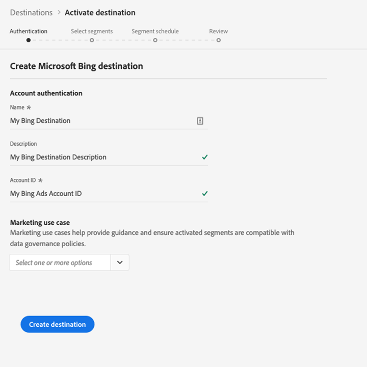

# [!DNL Microsoft Bing] 대상

## 개요 {#overview}

대상은 프로필 데이터를 보낼 때 도움이 됩니다 [!DNL Microsoft Bing] [!DNL Microsoft Display Advertising].

프로필 데이터를 대상 [!DNL Microsoft Bing]으로 보내려면 먼저 대상에 연결해야 합니다.

## 대상 사양 {#destination-specs}

대상에 대한 다음 세부 사항을 [!DNL Microsoft Bing] 참고하십시오.

* 다음 ID를 [대상으로](../../identity-service/namespaces.md) 보낼 수 [!DNL Microsoft Bing] 있습니다. [!DNL Microsoft ID].

## 사용 사례 {#use-cases}

마케터는 디스플레이 광고를 통해 사용자를 타깃팅하기 위해 만들어진 세그먼트 [!DNL Microsoft Advertising IDs] 를 다양한 [!DNL Microsoft Advertising] 채널에서 사용할 수 있어야 합니다.

## 내보내기 유형 {#export-type}

**[!DNL Segment Export]** - 세그먼트(대상)의 모든 멤버를 대상으로 [!DNL Microsoft Bing] 내보냅니다.

## 전제 조건 {#prerequisites}

대상을 구성할 때 다음 정보를 제공하도록 요청됩니다.

* [!UICONTROL 계정 ID]:정수 형식 [!DNL Bing Ads CID]으로 표시됩니다.

## 대상에 연결 {#connect-destination}

1. [ **[!UICONTROL 연결]** ] > **[!UICONTROL 대상]**&#x200B;에서 [!DNL Microsoft Bing]를 선택하고 구성을 **[!UICONTROL 선택합니다]**.

   

   >[!NOTE]
   >
   >이 대상과의 연결이 이미 있는 경우 대상 카드에 **[!UICONTROL 활성화]** 단추가 표시됩니다. 활성화 및 구성 **[!UICONTROL 의 차이에 대한 자세한]****[!UICONTROL 내용은 대상 작업 공간 설명서의]**&#x200B;카탈로그 [섹션을](../destinations/destinations-workspace.md#catalog) 참조하십시오.
   >
   >

1. 인증 [!UICONTROL 단계에서 대상] 연결 세부 사항을 입력해야 합니다.

   * **[!UICONTROL 이름]**:나중에 이 대상을 인식하는 이름입니다.
   * **[!UICONTROL 설명]**:나중에 이 대상을 식별하는 데 도움이 되는 설명입니다.
   * **[!UICONTROL 계정 ID]**:고객 [!DNL Bing Ads CID]파악
   * **[!UICONTROL 마케팅 활용 사례]**:마케팅 사용 사례에서는 데이터를 대상으로 내보내려는 의도를 나타냅니다. Adobe에서 정의한 마케팅 사용 사례에서 선택하거나 고유한 마케팅 사용 사례를 만들 수 있습니다. 마케팅 사용 사례에 대한 자세한 내용은 Adobe Experience Platform의 [데이터 거버넌스](../privacy/data-governance-overview.md#destinations) 페이지를 참조하십시오. 개별 Adobe에서 정의한 마케팅 사용 사례에 대한 자세한 내용은 [데이터 사용 정책 개요를 참조하십시오](../../data-governance/policies/overview.md#core-actions).

   

1. 대상 **[!UICONTROL 만들기를 클릭합니다]**. 이제 대상이 만들어집니다. 나중에 세그먼트를 활성화하려는 경우 [!UICONTROL 저장] 및 종료를 [!UICONTROL 클릭하거나] 다음을클릭하여 워크플로우를 계속하고 활성화할 세그먼트를 선택할 수 있습니다. 두 경우 모두 워크플로우의 나머지 [에 대해 다음 섹션, 세그먼트](#activate-segments)활성화를 참조하십시오.

## 세그먼트 활성화 {#activate-segments}

세그먼트 [활성화 워크플로에 대한 자세한 내용은 대상에](activate-destinations.md#select-attributes) 프로필 및 세그먼트 활성화를 참조하십시오.

세그먼트 [예약](activate-destinations.md#segment-schedule) 단계에서 세그먼트를 대상의 해당 ID 또는 친숙한 이름에 수동으로 매핑해야 합니다.

세그먼트를 매핑하는 경우 쉽게 사용할 수 있도록 세그먼트 [!DNL Platform] 이름 또는 더 짧은 형식을 사용하는 것이 좋습니다. 그러나 대상의 세그먼트 ID 또는 이름은 [!DNL Platform] 계정의 세그먼트 ID와 일치하지 않아도 됩니다. 매핑 필드에 삽입한 모든 값은 대상에 의해 반영됩니다.

## 내보낸 데이터 {#exported-data}

데이터를 대상으로 성공적으로 내보냈는지 확인하려면 [!DNL Microsoft Bing] [!DNL Microsoft Bing Ads] 계정을 확인하십시오. 정품 인증이 성공적으로 완료되면 사용자의 계정에 대상이 채워집니다.