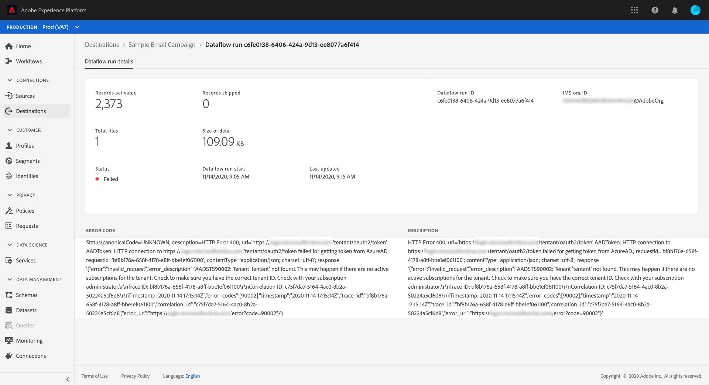

# 대상 세부 정보 페이지

Adobe Experience Platform 사용자 인터페이스에서 대상의 속성과 활동을 보고 모니터링할 수 있습니다. 이러한 세부 사항에는 대상 이름 및 ID, 대상 활성화 또는 비활성화 컨트롤 등이 있습니다. 일괄 처리 대상에 대한 세부 정보에는 활성화된 프로필 레코드에 대한 지표 및 데이터 흐름 실행 내역이 포함됩니다.

>[!NOTE]
>
>대상 세부 사항 페이지는 플랫폼 UI의 [!UICONTROL 대상] 작업 영역에 속합니다. 자세한 내용은 [[!UICONTROL 대상] 작업 공간 개요를](./destinations-workspace.md) 참조하십시오.

플랫폼 UI의 **[!UICONTROL 대상]** 작업 영역에서 **[!UICONTROL 찾아보기]** 탭으로 이동하여 보려는 일괄 처리 대상의 이름을 선택합니다.

대상에 대한 세부 사항 페이지가 나타나고 사용 가능한 컨트롤이 표시됩니다. 배치 대상의 세부 정보를 보고 있는 경우 모니터링 대시보드도 나타납니다.

## 오른쪽 레일

오른쪽 레일에는 대상에 대한 기본 정보가 표시됩니다.

다음 표에서는 오른쪽 레일에서 제공하는 컨트롤과 세부 사항을 설명합니다.

| 오른쪽 레일 항목 | 설명 |
| --- | --- |
| [!UICONTROL 활성화] | 대상에 매핑되는 세그먼트를 편집하려면 이 컨트롤을 선택합니다. 자세한 내용은 대상에 세그먼트 [를 활성화하는](/help/rtcdp/destinations/activate-destinations.md) 방법을 참조하십시오. |
| [!UICONTROL 대상 이름] | 이 필드는 대상 이름을 업데이트하기 위해 편집할 수 있습니다. |
| [!UICONTROL 설명] | 이 필드는 대상에 대한 설명을 업데이트하거나 추가하기 위해 편집할 수 있습니다. |
| [!UICONTROL 대상] | 대상이 전송되는 대상 플랫폼을 나타냅니다. 자세한 내용은 [대상 카탈로그를](./destinations-catalog.md) 참조하십시오. |
| [!UICONTROL 상태] | 대상이 활성화되었는지 여부를 나타냅니다. |
| [!UICONTROL 마케팅 작업] | 데이터 거버넌스 목적으로 이 대상에 적용되는 마케팅 작업(사용 사례)을 나타냅니다. |
| [!UICONTROL 카테고리] | 대상 유형을 나타냅니다. 자세한 내용은 [대상 카탈로그를](./destinations-catalog.md) 참조하십시오. |
| [!UICONTROL 연결 유형] | 대상을 대상으로 보내는 양식을 나타냅니다. 가능한 값에는 &quot;[!UICONTROL 쿠키]&quot; 및 &quot;[!UICONTROL 프로필 기반]&quot;이 포함됩니다. |
| [!UICONTROL 빈도] | 대상이 대상으로 전송되는 빈도를 나타냅니다. 가능한 값에는 &quot;[!UICONTROL Streaming]&quot; 및 &quot;[!UICONTROL Batch]&quot;가 포함됩니다. |
| [!UICONTROL ID] | 대상이 허용하는 ID 네임스페이스(예: `GAID`, `IDFA`또는 `email`포함)를 나타냅니다. 허용되는 ID 네임스페이스에 대한 자세한 내용은 [ID 네임스페이스 개요를 참조하십시오](../../identity-service/namespaces.md). |
| [!UICONTROL 작성자] | 이 대상을 만든 사용자를 나타냅니다. |
| [!UICONTROL 작성일] | 이 대상을 만들 때의 UTC 날짜 시간을 나타냅니다. |

## [!UICONTROL 활성화]/[!UICONTROL 비활성화] 전환

활성화/ **[!UICONTROL 비활성화]전환[!UICONTROL 을]** 사용하여 대상에 대한 모든 데이터 내보내기를 시작 및 일시 중지할 수 있습니다.

## [!UICONTROL 데이터 흐름 실행]

데이터 흐름 [!UICONTROL 실행] 탭은 데이터 흐름 실행에 대한 지표 데이터를 일괄 처리 대상으로 제공합니다. 프로필 레코드에 대한 다음 합계와 함께 개별 실행 및 특정 지표 목록이 표시됩니다.

* **[!UICONTROL 프로필 레코드 활성화]**:활성화용으로 생성되었거나 업데이트된 프로필 레코드의 총 수입니다.
* **[!UICONTROL 건너뛴 프로필 레코드]**: 프로필 종료 또는 누락된 특성을 기반으로 활성화용으로 생략된 프로필 레코드의 총 수입니다.

>[!NOTE]
>
>Dataflow는 대상 데이터 프롤의 예약 빈도를 기반으로 생성됩니다. 세그먼트에 적용된 각 병합 정책에 대해 별도의 데이터 흐름 실행이 수행됩니다.

특정 데이터 흐름 실행에 대한 세부 정보를 보려면 목록에서 실행 시작 시간을 선택합니다. 데이터 흐름 실행을 위한 세부 정보 페이지에는 처리된 데이터 크기 및 오류 진단에 대한 세부 정보와 함께 발생한 오류 목록과 같은 추가 정보가 포함되어 있습니다.

## [!UICONTROL 세그먼트]

세그먼트 [!UICONTROL 탭] 에는 시작 날짜 및 종료 날짜(해당되는 경우)를 포함하여 대상에 매핑된 세그먼트 목록이 표시됩니다. 특정 세그먼트에 대한 세부 사항을 보려면 목록에서 해당 이름을 선택합니다.

>[!NOTE]
>
>세그먼트의 세부 사항 페이지 둘러보기에 대한 자세한 내용은 세그멘테이션 [UI 개요를 참조하십시오](../../segmentation/ui/overview.md#segment-details).

## 다음 단계

이 문서에서는 대상 세부 사항 페이지의 기능에 대해 설명합니다. UI에서 대상 관리에 대한 자세한 내용은 대상 작업 [[!UICONTROL 공간] 개요를 참조하십시오](./destinations-workspace.md).