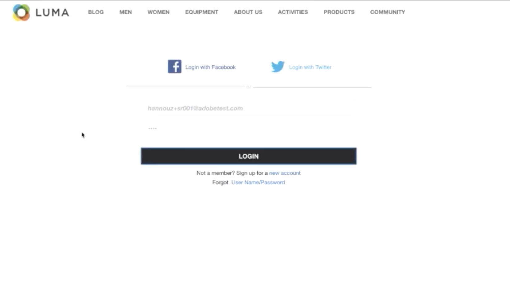

# Real-time Customer Data Platform 시작하기

이 시작 안내서는 Real-time Customer Data Platform(Real-Time CDP)의 샘플 구현 을 안내합니다. 자체 구현을 설정할 때 예로 사용할 수 있습니다. 이 안내서에서는 특정 예를 표시하지만, 설정을 만드는 동안 사용할 수 있는 추가 정보에 연결됩니다.

이 예에서는 Adobe Experience Platform에서 제공하는 Real-time Customer Data Platform의 다음과 같은 기능을 보여줍니다.

* 여러 소스에서 데이터 수집
* 이를 하나의 [!DNL real-time customer profile]
* 여러 장치에서 일관되고 연관성 있고 개인화된 경험을 제공합니다.

## 사용 사례

운동복 회사인 루마는 항상 고객 경험을 향상시키기 위해 노력하고 있습니다. 그들은 선물 관련 판매를 늘리기 위한 새로운 이니셔티브를 가지고 있다. 또한 고객을 따르는 번거로운 광고와 같은 과도한 노출을 줄이고자 합니다.

현재, 그들은 방문자가 앞으로 구입하지 않을 품목들에 대해 재타겟팅하는 미디어에 너무 많은 돈을 쓰고 있습니다. 예를 들어, Luma는 다른 사람에 대해 일회성 구매로 의도한 항목을 사용하여 다른 사람을 재타겟팅하지 않으려고 합니다.

현재 Luma의 데이터는 여러 소스에 분산되어 있습니다. 그 결과, 이들은 중대한 도전에 직면해 있습니다.

* 마케팅 조직은 웹 사이트, 모바일 앱, 로열티 시스템, CRM 등, 데이터 소스를 보유한 다양한 팀과 작업해야 합니다.
* 마케팅 팀이 데이터에 액세스할 때는 시간이 많이 걸리고 더 이상 시간이 민감한 캠페인과 관련이 없습니다.
* 채널보다 개인을 타깃팅하기 위해 데이터를 통합해야 합니다.

그 결과 Luma는 다음과 같은 비즈니스 목표를 가지고 있습니다.

* 서로 다른 데이터 소스에서 소비자에 대한 실시간 단일 뷰를 생성합니다.
* 다양한 채널 및 장치에서 관련 메시지로 마케팅 캠페인을 개인화합니다.

이러한 목표를 달성하기 위해서는 마케팅 팀이 고객 데이터를 규모에 맞게 관리할 수 있어야 합니다.

Adobe Experience Platform에서 제공하는 Real-Time CDP을 통해 Luma의 마케팅 조직은 다음을 수행할 수 있습니다.

1. 서로 다른 플랫폼에서 데이터를 수집하고 다른 마케팅 활동에 대해 다운스트림으로 사용할 수 있는지 확인합니다.
1. 데이터가 생성되는 위치와 관계없이 고객에 대한 하나의 실시간 보기를 만듭니다.
1. 모든 터치 포인트에서 일관되고 연관성 있으며 개인화된 경험을 제공합니다.

## 단계

이 자습서에는 다음 단계가 포함됩니다.

1. 빌드 [고객 프로필](#customer-profile).
1. [개인화](#personalizing-the-user-experience) 사용자 경험입니다.
1. 사용 [여러 데이터 소스](#using-multiple-data-sources).
1. [데이터 소스 구성](#configuring-a-data-source).
1. [데이터 수집](#bringing-the-data-together-for-a-specific-customer) 특정 고객에 대한 방문.
1. 설정 [세그먼트](#segments).
1. 설정 [대상](#destinations).
1. [여러 장치에서 프로필 결합](#cross-device-identity-stitching).
1. [프로필 분석](#analyzing-the-profile).

## 고객 프로필

고객이 사이트를 처음 방문하면 이에 대해 아무것도 알 수 없습니다.


탐색 시 데이터는 실시간으로 캡처되고 Adobe Analytics의 보고서 세트로 전송될 뿐만 아니라 Adobe Experience Platform으로 직접 전송됩니다. 데이터가 수집되면 의 행동 데이터를 기반으로 고객에 대한 단일 뷰를 구성할 수 있습니다 [!DNL Experience Platform's real-time customer profile].

웹 사이트의 많은 방문자가 이전에 Luma에서 구매한 반복 고객일 수 있습니다.  Luma는 알려진 고객뿐만 아니라 신규 방문자와 재방문자 모두를 해결하기 위해 메시징 및 오퍼링을 개인화하는 것이 중요합니다.

### 새 고객의 첫 방문

예를 들어, 식별되지 않은 방문자가 Luma 사이트에서 Men&#39;s 섹션으로 이동하고, 실행 중인 트레이트 셔츠를 봅니다.


고객이 이러한 제품에 대해 자세히 알려면 이러한 제품 보기는 Adobe Analytics에서 수집되어 로 전송됩니다 [!DNL Experience Platform].

<!---->

Luma는 방문자의 행동을 Adobe Experience Platform의 사용자 프로필에 매핑하고 해당 소비자의 행동에 대한 더 풍부한 보기를 조합할 수 있습니다.

### 고객에 대한 자세한 보기

고객이 웹 사이트와 계속 상호 작용함에 따라 더 분명한 그림이 나타납니다. 예를 들어 방문자가 장바구니에 제품을 추가하고 로그인한다고 가정합니다.

고객이 로그인했을 때, 그녀는 자신을 사라 로즈로 식별합니다.



두 ID가 병합됩니다.

* 익명 검색 데이터
* 사라 로즈의 계정과 연관된 기존 데이터

두 ID가 모두 [!DNL Experience Platform]. Luma는 이제 이 소비자에 대한 통합된 보기를 가지고 있습니다.

사이트의 남성 섹션에서 익명의 방문자의 탐색 행동을 기반으로 고객이 남성이라고 가정했을 수 있습니다. 그녀가 로그인했기 때문에, 루마는 사라 로즈를 인식한다. Luma는 [!DNL Real-time Customer Profile] 여러 채널에서 전달된 메시지를 세분화하기 위해 다음을 수행하십시오.

## 사용자 경험 개인화

사라는 충성도 메시지를 받고, 복지와 그녀의 지위와 포인트를 높이는 방법에 대한 더 많은 정보를 가진 청동 멤버가 된 것에 대해 감사했다.

그녀는 홈페이지로 가서 더 찾아본다.


Sarah는 자신을 기반으로 동적으로 전달되는 개인화된 홈 페이지 경험을 수신합니다 [!DNL Real-time Customer Profile] Adobe Experience Platform.

Labs는 과거 구입 내역 및 의류 및 장비 실행 선호도를 고려하는 Adobe Target의 Adobe Sensei 기반의 개인화 덕분에 관련 컨텐츠를 볼 수 있습니다. 루마는 또한 가장 최근 찾아보기를 바탕으로 남성용 카탈로그 콘텐츠를 남용으로 재단했다.

페이지 아래쪽에서 Sarah는 주요 제품 및 가장 최근에 본 항목을 기반으로 한 새 권장 사항 트레이가 표시됩니다.

이 개인화된 콘텐츠는 사라가 관련 항목을 신속하게 찾는 데 도움이 됩니다. 이를 통해 전환율을 높이고 보다 쾌적한 고객 경험을 제공할 수 있습니다.

### 고객 재방문

사라가 정신을 잃고 사이트를 떠나 그녀의 세션을 끝냅니다. Luma는 Adobe Experience Platform에서 자신의 데이터를 사용하여 사이트로 돌아올 수 있습니다.

Adobe Experience Platform 기반의 Real-time Customer Data Platform은 고객 경험 관리를 위해 구축되었습니다. 조직에서는 다음을 수행할 수 있습니다.

* 데이터 통합 및 활성화 간소화
* 알려진 데이터 및 알 수 없는 데이터 사용 관리
* 규모에 맞게 마케팅 사용 사례 가속화

## 여러 데이터 소스 사용

Luma의 팀에는 모든 행동 및 고객 데이터가 한 곳에 있습니다.


다음 모든 소스에서 데이터를 수집할 수 있습니다.

* 기존 Adobe Experience Cloud 솔루션 데이터
* Luma의 충성도 프로그램, 콜 센터 및 판매 지점 시스템 데이터와 같은 비Adobe 소스
* Luma 데이터 소스의 실시간 스트리밍 데이터
* Adobe 솔루션의 실시간 데이터(새 태그가 필요 없음)

서로 다른 소스의 모든 데이터는 하나의 통합 고객 프로필로 병합됩니다.

## 데이터 소스 구성

사용 [!DNL Real-Time Customer Data Platform] 를 사용하십시오. Real-Time CDP에는 프로필에 빠르고 쉽게 추가할 수 있는 데이터 소스 카탈로그가 포함되어 있습니다.


예를 들어 Luma의 CRM 데이터를 수집하려면 다음을 기준으로 카탈로그를 필터링합니다 *CRM*&#x200B;및 를 포함하는 모든 기본 제공 커넥터 *CRM* 나열됩니다. 추가하려면 [!DNL Microsoft Dynamics CRM] 데이터:

1. 연결을 승인합니다.

   

1. XDM 사전 매핑된 테이블 권장 목록에서 가져올 항목을 선택합니다.

   <!--     -->

   예를 들어, **[!UICONTROL 연락처]**. 연락처 데이터의 미리 보기는 자동으로 로드되므로 모든 내용이 예상대로 표시되는지 확인할 수 있습니다.

   Adobe Experience Platform에서는 표준 필드를 [!DNL Experience Data Model] (XDM) 프로필 스키마.

1. 필드 매핑을 검토합니다.

   <!--     -->

   예를 들어 연락처의 이메일 필드가 올바르게 매핑되었는지 두 번 확인합니다.\
   데이터를 미리 보고 고급 매핑을 수행하는 옵션이 있습니다.

1. 일정을 설정합니다.

   

다 끝났어 방금 추가했습니다. [!DNL Microsoft CRM] 를 데이터 소스로 사용 [!DNL Experience Platform].

### 사용 정책에 대해 수집된 데이터에 레이블 지정

Luma에는 수집된 특정 종류의 정보의 사용을 제한하는 여러 내부 정책이 있으며, 데이터 사용과 관련된 법률 및 개인 정보 보호 관련 사항도 준수해야 합니다. Adobe Experience Platform 데이터 거버넌스를 사용하여 사전 정의된 데이터 사용 레이블을 데이터 세트(및 이러한 데이터 세트 내의 특정 필드)에 적용할 수 있으므로 Luma가 특정 사용 제한에 따라 데이터를 분류할 수 있습니다.


데이터 사용 레이블이 적용되면 Luma는 데이터 거버넌스 를 사용하여 데이터 사용 정책을 만들 수 있습니다. 데이터 사용 정책은 특정 레이블이 포함된 데이터에 대해 수행할 수 있는 작업 종류를 설명하는 규칙입니다. 정책 위반을 구성하는 Real-Time CDP에서 작업을 수행하려고 할 때 작업이 방지되고 어떤 정책이 위반되었는지 및 그 이유를 알려주는 경고가 표시됩니다.

## 특정 고객을 위해 데이터 함께 가져오기

이 시나리오에서 Sarah Rose의 프로필을 검색합니다. 로그인할 때 사용한 이메일이 포함된 프로필이 나타납니다.

<!--  -->

Luma가 Sarah에 대해 가지고 있는 모든 프로필 정보. 여기에는 주소 및 전화 번호, 커뮤니케이션 환경 설정 및 그녀가 자격을 부여하는 세그먼트와 같은 개인 정보가 포함됩니다.

| 카테고리 | 설명 |
|---|---|
| ID | 에서 함께 연결된 ID를 표시합니다 [!DNL Platform] 여러 채널 및 장치에서 Luma와의 사라의 상호 작용 웹 사이트의 ECID가 표시됩니다. 이 ID에는 모바일 앱의 ECID, 이메일 ID, 최근 추가한 CRM ID도 포함됩니다 [!DNL Microsoft Dynamics] 데이터 세트 및 Luma 충성도 시스템에서 Adobe Experience Platform으로 전달된 충성도 ID입니다. |
| 이벤트 | Luma 브랜드와 Sarah의 모든 상호 작용 데이터를 표시합니다. 여기에는 그녀가 방금 본 항목, 과거에 본 모든 항목, 그녀가 받은 이메일, 콜 센터와의 상호 작용, 그리고 이러한 각각의 상호 작용이 발생한 채널과 장치가 포함됩니다. |

Real-Time CDP 프로필은 이 360도 고객 보기를 기반으로 Luma 마케팅 팀의 워크플로우를 몇 주에서 몇 분으로 줄이고 개인화 가능성을 잠금 해제합니다. 이 프로필은 로그인하기 전에 사이트를 탐색할 때 사용한 행동 데이터를 기존 고객 프로필과 병합하여 Sarah에 대한 포괄적인 보기를 만듭니다.

마케팅 팀은 향상된 기능을 사용할 수 있습니다. [!DNL Real-time Customer Profile] Luma를 사용하여 Sarah의 경험을 더 잘 개인화하고 브랜드 충성도를 높이기 위해.

## 세그먼트

강력한 Adobe Experience Platform 세그멘테이션 기능을 통해 마케터는 [!DNL Real-time Customer Profile].

<!--  -->

이 시나리오에서, 사이트에서 사라의 최근 상호 작용은 그녀의 과거 행동과는 다른 행동을 보여준다. 그녀는 주로 여성복을 산다. 하지만, 그녀의 장바구니에 있는 품목은 남성용 큰 스웨터입니다.

Luma 데이터 과학 팀은 구매 성향에 대한 모델을 만들었습니다. 한 모델은 기존 소비자에 대한 의류 카테고리(예: mens/womens) 또는 크기의 갑작스런 변경을 식별합니다. 사라의 구매 행동이 바뀌면서 그녀는 자신을 위해 쇼핑하지 않는다.

<!--  -->

### 세그먼트 정의

선물을 구매하는 과정에 있는 장바구니 포기 고객을 나타내는 세그먼트를 수정하거나 만듭니다.

```sql
Profile: Category != Preferred Category 
AND 
Product Size != Preferred Size 
in last 7 days.  
AND 
Abandoned Cart 
AND 
Loyalty member 
```

<!-- -->

사라가 장바구니에 명백한 선물 품목을 추가했고 포기했기 때문에, 루마는 무료 선물포장 서비스로 그녀를 타겟팅할 수 있다.

## 대상

&quot;선물용 장바구니 포기&quot; 세그먼트를 추가하면 이 세그먼트에 속하는 사람들의 수를 대략 볼 수 있습니다. 이에 대해 조치를 취해 여러 채널에서 개인화에 사용할 수 있도록 만들 수 있습니다.

선택 **[!UICONTROL 대상에 보내기]**.

Real-Time CDP에서 Luma는 개인화를 위해 대상 세그먼트에 대해 원활하게 작동할 수 있습니다.\
여기서는 Luma가 Adobe 솔루션과 비Adobe 솔루션 모두에 이 대상을 보낼 수 있는 모든 대상을 볼 수 있습니다.


### 대상 선택

이 시나리오에서 Luma는 다음 대상에 걸쳐 개인화를 사용하여 이 대상을 재타겟팅하려고 합니다.

* Google, 디스플레이용

   <!--* Facebook -->
* Adobe Campaign, 이메일

<!--  -->

### 대상 예약

세그먼트를 특정 시간에 시작 또는 종료하도록 예약할 수도 있습니다. 세그먼트는 게시되고 예약된 날짜에 구성된 플랫폼에서 자동으로 업데이트됩니다.

>[!NOTE]
>
>일자 필드를 선택하면 90일 동안 자동으로 스케줄링됩니다(선택적).

선택 **[!UICONTROL 저장]** 다음 페이지로 이동합니다.

이 대상의 고객이 구매를 수행하면 이 대상에 대한 멤버십이 실시간으로 표시되지 않습니다. 그들은 그들의 상태가 바뀌었기 때문에 더 이상 자격이 없다.

이렇게 하면 자격이 없는 대상을 위해 인벤토리를 사용하지 않음으로써 Luma 미디어 팀의 감독이 수십만 달러를 절약할 수 있습니다.

### 대상에 대한 데이터 사용 정책 적용

Adobe Experience Platform에는 특정 대상에 대해 세그먼트를 활성화할 수 있는지 여부를 결정하는 개인 정보 보호 및 보안 컨트롤이 포함되어 있습니다. 활성화는 작성 시 대상에 할당된 마케팅 용도와 조직에서 정의한 데이터 사용 정책을 기반으로 활성화 또는 제한됩니다.

활동이 정책을 위반하는 경우 경고가 표시됩니다. 이 경고에는 정책이 위반된 이유와 위반을 해결하기 위해 수행할 수 있는 작업을 식별하는 데 도움이 되는 데이터 계보 정보가 포함되어 있습니다.

이 컨트롤로 [!DNL Experience Platform] Luma는 규정을 준수하고 시장을 책임감 있게 준수하도록 도와줍니다. 이러한 컨트롤은 유연하며 Luma의 보안 및 거버넌스 팀의 요구 사항을 충족하도록 수정할 수 있으므로 알려진 고객 데이터와 알 수 없는 고객 데이터를 관리하기 위한 지역 및 조직 요구 사항을 확실하게 처리할 수 있습니다.

### 데이터 흐름 캔버스

저장하면 시각적 데이터 흐름 캔버스에 통합 프로필에서 선택한 세 가지 대상에 매핑된 세그먼트가 표시됩니다.


## 교차 장치 ID 결합

사라는 모바일 장치에서 소셜 미디어 사이트를 탐색하고, 루마 광고를 봅니다. 그것은 그녀가 카트에 두고 간 아이템을 그녀에게 상기시킨다.

나중에 이메일을 열고 타겟팅된 이메일을 확인합니다. 그녀는 이메일에서 Luma로 연결되는 링크를 선택합니다.

이 링크를 통해 Sarah를 모바일 Luma 홈 페이지로 이동하며, 이 홈페이지에서 Adobe Target에서 제공하는 고도로 개인화된 경험을 볼 수 있습니다.

* 그녀는 청동 멤버로 환영받는다.
* 그녀는 &quot;선물&quot; 메시지를 봅니다.
* 또한 청동기 멤버십 혜택의 일부인 &quot;무료 선물 포장&quot; 메시지를 볼 수 있다.
* 그녀는 여전히 자신의 러닝에 대한 친화성에 근거하여 주인공 이미지에 표적이다.

그녀는 스웨터를 구입하고, 선물용 랩을 추가하고, 선물용 노트를 쓴다. 이 행사를 기억하고, 내년 이맘때 선물을 받기 위해 미리 알림 받는 선택도 있다. 그녀는 예라고 말하고, 또 다른 선물을 사도록 그녀에게 상기시키기 위해 그 다음 해에 이메일 캠페인에 참가할 예정입니다.

청중의 억압 능력 덕분에 사라는 그 남자의 스웨터를 앞으로 앞으로 나아가는 대상이 되지 않을 것이다.

## 프로필 분석

Luma 마케터는 Adobe Experience Platform을 사용하여 Real-Time CDP 대시보드에서 선물 보호자 세그먼트를 봅니다. 그들은 시간이 지남에 따라 이 계획의 결과를 보고 그것이 성장하고 있다는 것을 봅니다. 고객들은 오퍼에 반응하고 더 많은 돈을 지출하고 있다.

이러한 인사이트를 통해 마케터는 CDP에서 이 데이터를 사용할 수 있고 Sarah와 같은 고객이 세그먼트에 연결됨으로써 이 신호에 대해 조치를 취할 수 있습니다.

Luma는 이 CDP 데이터를 사용하여 충성도와 고객 만족도를 높입니다.
