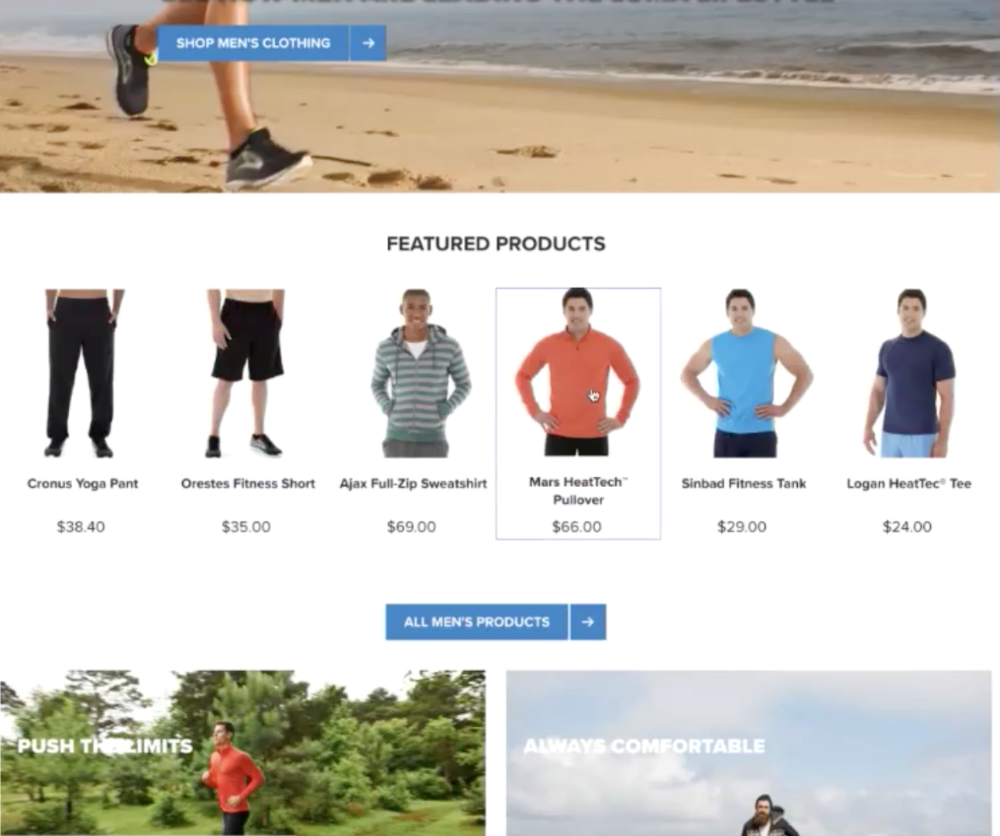
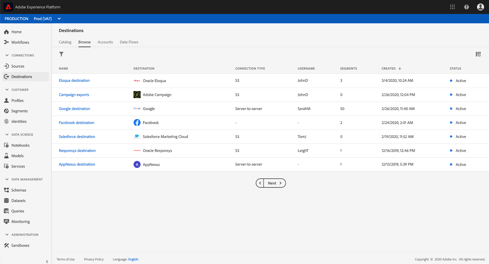

# Adobe 실시간 고객 데이터 플랫폼 시작하기

이 시작 가이드는 Adobe 실시간 고객 데이터 플랫폼(실시간 CDP)의 샘플 구현을 소개합니다. 자체 구현을 설정할 때 예로 사용할 수 있습니다. 이 안내서에서는 특정 예를 보여주지만, 설정을 만들 때 사용할 수 있는 추가 정보에 연결됩니다.

이 예에서는 Adobe Experience Platform을 기반으로 하는 Adobe 실시간 고객 데이터 플랫폼의 강력한 기능을 다음과 같이 보여줍니다.

* 여러 소스에서 데이터 인제스트
* 하나의 실시간 고객 프로파일에 통합
* 모든 디바이스에서 일관되고 연관성 있고 개인화된 경험을 제공할 수 있습니다.

## 사용 사례

운동복 회사인 루마는 고객 경험을 개선하기 위해 항상 노력하고 있습니다. 그들은 선물 관련 판매를 늘리기 위한 새로운 계획을 가지고 있다. 또한 고객을 따라다니는 번거로운 광고와 같은 과다 노출을 줄이고자 합니다.

현재 방문자가 구매하지 않을 항목을 다시 타깃팅하는 미디어에 너무 많은 비용을 투자하고 있습니다. 예를 들어 Luma는 다른 사용자를 위해 일회성 구매로 의도한 항목을 사용하여 다른 사람을 재타깃팅하지 않습니다.

현재 Luma의 데이터는 여러 소스에 분산되어 있습니다. 그 결과, 그들은 중요한 도전에 직면합니다.

* 마케팅 조직은 웹 사이트, 모바일 앱, 충성도 시스템, CRM 등 데이터 소스를 각각 보유한 다양한 팀과 작업해야 합니다.
* 마케팅 팀이 데이터에 액세스할 때 시간이 오래 걸리고 시간이 걸리는 캠페인에 더 이상 관련이 없습니다.
* 채널이 아닌 사용자를 타깃팅하려면 데이터를 통합해야 합니다.

따라서 Luma는 다음과 같은 비즈니스 목표를 가지고 있습니다.

* 서로 다른 데이터 소스를 통해 고객에 대한 실시간 뷰를 생성할 수 있습니다.
* 다양한 채널과 디바이스에서 연관성 있는 메시지를 통해 마케팅 캠페인을 개인화할 수 있습니다.

이러한 목표를 달성하기 위해서는 마케팅 팀이 고객 데이터를 규모에 맞게 관리할 수 있어야 합니다.

Luma의 마케팅 조직은 Adobe Experience Platform을 기반으로 한 실시간 CDP를 통해 다음과 같은 이점을 얻을 수 있습니다.

1. 서로 다른 플랫폼에서 데이터를 수집하고 다른 마케팅 활동에 대해 다운스트림으로 사용할 수 있는지 확인합니다.
1. 데이터의 출현 여부에 관계없이 고객의 전체 상황을 실시간으로 파악할 수 있습니다.
1. 모든 접점에서 고객의 기대에 부응하는 개인화된 경험을 제공할 수 있습니다.

## 단계

이 자습서에는 다음 단계가 포함됩니다.

1. 고객 [프로파일을](#customer-profile)만듭니다.
1. [사용자 경험 개인화](#personalizing-the-user-experience) .
1. 여러 [데이터 소스를](#using-multiple-data-sources)사용합니다.
1. [데이터 소스를](#configuring-a-data-source)구성합니다.
1. [특정 고객에 대한 데이터를](#bringing-the-data-together-for-a-specific-customer) 수집합니다.
1. 세그먼트를 [설정합니다](#segments).
1. 대상을 [설정합니다](#destinations).
1. [여러 디바이스에서](#cross-device-identity-stitching)프로파일을 연결할 수 있습니다.
1. [프로필을](#analyzing-the-profile)분석합니다.

## 고객 프로필

고객이 사이트를 처음 방문하면 이에 대해 전혀 알지 못합니다.


탐색 시 데이터는 실시간으로 캡처되어 Adobe Analytics의 보고서 세트뿐만 아니라 Adobe Experience Platform으로 직접 전송됩니다. 데이터가 수집되면 Adobe Experience Platform의 실시간 고객 프로필에서 행동 데이터를 기반으로 한 고객에 대한 단일 뷰를 생성할 수 있습니다.

웹 사이트의 많은 방문자는 이전에 Luma에서 구매한 반복 고객일 수 있습니다.  Luma는 메시징 및 오퍼링을 개인화하여 신규 방문자와 반복 방문자 및 알려진 고객을 모두 공략하는 것이 중요합니다.

### 신규 고객의 첫 방문

예를 들어, 식별되지 않은 방문자가 Luma 사이트의 남성 섹션으로 이동하여 두 사람이 실행 중인 티셔츠를 봅니다.



고객이 이러한 제품에 대해 자세히 알아보기 위해 클릭하면 이러한 제품 보기가 Adobe Analytics에서 수집되어 Experience Platform으로 전송됩니다.

<!---->

Luma는 방문자의 행동을 Adobe Experience Platform의 사용자 프로필에 매핑하고 해당 소비자의 행동에 대한 보다 풍부한 보기를 조합하기 시작할 수 있습니다.

### 고객에 대한 자세한 내용 보기

고객이 웹 사이트와 계속 상호 작용하면 보다 명확한 그림을 볼 수 있습니다. 예를 들어 방문자가 장바구니에 제품을 추가하고 로그인한다고 가정합니다.

고객이 로그인하면, 그녀는 자신을 사라 로즈로 식별합니다.


두 ID가 병합됩니다.

* 익명 검색 데이터
* 사라 로즈의 계정과 관련된 기존 데이터

두 ID는 모두 Experience Platform에서 단일 프로필로 결합됩니다. Luma는 이제 이 소비자에 대한 통합된 관점을 가집니다.

사이트의 남성 섹션에서 익명의 방문자의 탐색 행동을 기반으로, 고객이 남성이라고 가정했을 수 있습니다. 그녀가 로그인했기 때문에, 루마는 사라 로즈를 알아본다. Luma는 실시간 고객 프로필의 강력한 기능을 사용하여 여러 채널에서 전달되는 메시지를 세분화합니다.

## 사용자 경험 개인화

사라는 충성도 메시지로 환영 받았고 복지와 그녀의 지위와 포인트를 높이는 방법에 대한 더 많은 정보를 청동 멤버인 것에 대해 감사했다.

그녀는 홈 페이지를 클릭해서 더 찾아봅니다.


Sarah는 Adobe Experience Platform에서 실시간 고객 프로파일을 기반으로 동적으로 제공되는 맞춤형 홈 페이지 경험을 제공합니다.

Adobe Target의 Adobe Sensei 기반의 개인화 기능을 통해 관련 콘텐츠를 확인할 수 있습니다. Adobe Target은 과거 구매와 의류 및 장비 실행을 위한 친밀성을 고려합니다. 루마는 또한 남성들의 카탈로그 콘텐츠를 최근 자신의 검색어를 기반으로 남성용 달리기 기어로 재단했다.

페이지 아래쪽에서는 Sarah가 주요 제품과 가장 최근에 본 항목을 기반으로 한 새로운 추천 트레이가 표시됩니다.

개인화된 이 컨텐츠를 통해 Sarah는 관련 항목을 신속하게 찾을 수 있습니다. 전환율을 높이고 보다 쾌적한 고객 경험을 제공합니다.

### 고객 복귀

사라가 정신을 잃고 사이트를 떠나 그녀의 세션을 끝냅니다. Luma는 Adobe Experience Platform에서 데이터를 사용하여 사이트를 다시 방문할 수 있습니다.

Adobe Experience Platform 기반의 Adobe 실시간 고객 데이터 플랫폼은 고객 경험 관리를 위해 구축되었습니다. 이를 통해 조직은 다음 작업을 수행할 수 있습니다.

* 데이터 통합 및 활성화 간소화
* 알려진 및 알 수 없는 데이터 사용 관리
* 규모에 맞게 마케팅 활용 사례 가속화

## 여러 데이터 소스 사용

Luma의 팀은 모든 행동 및 고객 데이터를 한 곳에서 제공합니다.


다음 소스에서 데이터를 인제스트할 수 있습니다.

* 기존 Adobe Experience Cloud 솔루션 데이터
* Luma의 충성도 프로그램, 콜센터 및 POS 시스템 데이터 등 Adobe가 아닌 소스
* Luma 데이터 소스의 실시간 스트리밍 데이터
* Adobe 솔루션의 실시간 데이터(새로운 태그가 필요 없음)

서로 다른 소스에서 생성된 모든 데이터는 하나의 통합 고객 프로파일에 통합됩니다.

## 데이터 소스 구성

실시간 고객 데이터 플랫폼을 사용하여 새로운 데이터 소스를 플랫폼으로 가져올 수 있습니다. 실시간 CDP에는 몇 번의 클릭만으로 프로파일에 추가할 수 있는 데이터 소스 카탈로그가 포함되어 있습니다.


예를 들어 Luma의 CRM 데이터를 인제스트하려면 CRM별로 카탈로그를 *필터링하고* CRM을 포함하는 모든 기본 *커넥터를* 나열합니다. Microsoft Dynamics CRM 데이터를 추가하려면:

1. 연결을 승인합니다.

   

1. XDM 사전 매핑된 테이블의 권장 목록에서 가져올 항목을 선택합니다.

   <!--     -->

   예를 들어, 를 **[!UICONTROL Contacts]**&#x200B;선택합니다. 연락처 데이터의 미리 보기는 자동으로 로드되므로 모든 것이 예상대로 표시되는지 확인할 수 있습니다.

   Adobe Experience Platform은 표준 필드를 XDM(Experience Data Model) 프로필 스키마로 자동 매핑하여 이 과정에서 많은 수동 작업을 수행합니다.

1. 필드 매핑을 검토합니다.

   <!--     -->

   예를 들어 연락처에 대한 이메일 필드가 올바르게 매핑되었는지 다시 확인하십시오.\
   데이터를 미리 보고 고급 매핑을 수행하는 옵션이 있습니다.

1. 일정을 설정합니다.

   

다 끝났어 Microsoft CRM을 Experience Platform에 데이터 소스로 추가했습니다.

### 사용 정책을 위해 인제스트된 데이터 레이블 지정

Luma에는 수집된 특정 유형의 정보의 사용을 제한하는 여러 내부 정책이 있으며, 데이터 사용과 관련된 법적 및 개인 정보 보호 관련 문제를 준수해야 합니다. Adobe Experience Platform 데이터 거버넌스를 사용하면 사전 정의된 데이터 사용 레이블을 데이터 세트(및 해당 데이터 세트 내의 특정 필드)에 적용할 수 있으므로 Luma는 특정 사용 제한에 따라 데이터를 분류할 수 있습니다.


데이터 사용 레이블이 적용되면 Luma는 데이터 거버넌스를 사용하여 데이터 사용 정책을 만들 수 있습니다. 데이터 사용 정책은 특정 레이블을 포함하는 데이터에 대해 수행할 수 있는 작업의 종류를 설명하는 규칙입니다. 정책 위반을 구성하는 실시간 CDP에서 작업을 수행하려고 할 때 해당 작업을 수행할 수 없으며 어떤 정책이 위반되었는지 및 그 이유를 나타내는 경고가 표시됩니다.

## 특정 고객을 위한 데이터 통합

이 시나리오에서는 Sarah Rose의 프로필을 검색합니다. 로그인하는 데 사용한 이메일과 함께 프로필이 나타납니다.

<!--  -->

Luma가 Sarah에 대해 가지고 있는 모든 프로필 정보가 표시됩니다. 여기에는 주소 및 전화 번호, 커뮤니케이션 환경 설정 및 자격이 되는 세그먼트와 같은 개인 정보가 포함됩니다.

| 카테고리 | 설명 |
|---|---|
| ID | Sarah와 다양한 채널 및 디바이스에서 Luma의 상호 작용으로 플랫폼에서 함께 연결된 ID를 보여줍니다. 웹 사이트의 ECID가 표시됩니다. 그녀의 ID에는 모바일 앱의 ECID, 그녀의 이메일 ID, 최근에 추가된 Microsoft Dynamics 데이터 집합의 CRM ID, Luma 충성도 시스템에서 Adobe Experience Platform로 전달된 충성도 ID도 포함됩니다. |
| 이벤트 | Luma 브랜드와의 모든 Sarah 상호 작용 데이터를 보여줍니다. 여기에는 방금 본 항목, 과거에 본 내용, 받은 이메일, 콜센터와의 상호 작용, 이러한 상호 작용이 발생한 채널과 장치가 포함됩니다. |

실시간 CDP 프로필을 사용하면 Luma 마케팅 팀의 워크플로우를 몇 주에서 몇 분으로 단축할 수 있고 360° 고객 뷰를 기반으로 한 개인화의 가능성을 제거할 수 있습니다. 이 프로필은 로그인하기 전에 사이트를 탐색할 때의 행동 데이터를 기존 고객 프로필과 병합하여 Sarah의 포괄적인 보기를 만듭니다.

마케팅 팀은 이러한 향상된 실시간 고객 프로필을 사용하여 Sarah의 경험을 보다 효과적으로 개인화하고 Luma를 통해 브랜드 충성도를 높일 수 있습니다.

## 세그먼트

강력한 Adobe Experience Platform 세분화 기능을 통해 마케터는 실시간 고객 프로파일에서 수집한 데이터를 기반으로 속성, 이벤트 및 기존 세그먼트를 결합할 수 있습니다.

<!--  -->

이 시나리오에서, 사이트에서 사라의 최근 상호 작용은 그녀의 이전 행동과 다른 행동을 보여줍니다. 그녀는 주로 여성복을 산다. 하지만, 그녀의 장바구니에 든 물건은 남성들의 큰 스웨터이다.

루마 데이터 과학 팀은 구매 성향에 대한 모델을 만들었습니다. 한 모델은 기존 소비자에 대한 의류 카테고리(예: mens/womens) 또는 크기의 갑작스런 변경을 식별합니다. 사라는 구매 행동의 변화를 보면 자신이 쇼핑하고 있지 않다는 것을 알 수 있다.

<!--  -->

### 세그먼트 정의

선물을 구입하는 진행 중인 것으로 보이는 장바구니 포기 고객을 나타내는 세그먼트를 수정 또는 만듭니다.

```
Profile: Category != Preferred Category 
AND 
Product Size != Preferred Size 
in last 7 days.  
AND 
Abandoned Cart 
AND 
Loyalty member 
```

<!-- -->

사라가 카트에 명백한 선물 품목을 추가해서 포기했기 때문에, 루마는 무료 선물 포장 서비스로 그녀를 타겟팅할 수 있다.

## 대상

&quot;선물을 주는 장바구니 포기&quot; 세그먼트를 추가하면 이 세그먼트에 속한 사람 수가 대략적으로 표시됩니다. 다양한 채널에서 개인화된 경험을 제공할 수 있습니다.

**[!UICONTROL Send to destinations]**&#x200B;를 클릭합니다.

Luma는 Adobe의 실시간 CDP를 통해 고객 세그먼트를 원활하게 수행하여 개인화를 실현합니다.\
여기서는 Luma가 Adobe 및 Adobe 이외의 솔루션으로 이 대상을 보낼 수 있는 모든 대상을 볼 수 있습니다.



### 대상 선택

이 시나리오에서 Luma는 다음 대상을 대상으로 개인화하여 이 고객을 재타깃팅하려고 합니다.

* Google, 디스플레이
   <!--* Facebook -->
* Adobe Campaign, 이메일

<!--  -->

### 예약 대상

특정 시간에 시작하거나 끝나도록 세그먼트를 예약할 수도 있습니다. 세그먼트가 게시되고 예약된 날짜에 구성된 플랫폼에서 자동으로 업데이트됩니다.

>[!NOTE]
>원하는 경우 날짜 필드를 클릭하면 90일 동안 자동으로 예약됩니다.

을 **[!UICONTROL Save]** 클릭하여 다음 페이지로 이동합니다.

이 고객의 고객이 구매를 하면 해당 고객에 대한 멤버십이 실시간으로 차단됩니다. 그들은 그들의 신분이 변했기 때문에 더 이상 자격이 없다.

이렇게 하면 자격이 없는 고객을 위해 인벤토리를 사용하지 않음으로써 Luma 미디어 팀의 디렉터가 수십만 달러를 절약할 수 있습니다.

### 대상에 대한 데이터 사용 정책 적용

Adobe Experience Platform에는 특정 대상에 대해 세그먼트를 활성화할 수 있는지 여부를 결정하는 개인 정보 및 보안 컨트롤이 포함되어 있습니다. 활성화는 대상이 생성될 때 지정된 마케팅 용도와 조직에서 정의한 데이터 사용 정책을 기반으로 활성화되거나 제한됩니다.

활동이 정책을 위반하면 경고가 표시됩니다. 이 경고에는 정책 위반 이유와 위반 해결을 위해 수행할 수 있는 작업을 식별하는 데 도움이 되는 데이터 연결 정보가 포함되어 있습니다.

Luma는 이러한 제어 기능을 통해 규정 준수 및 시장 책임성을 강화합니다. 이러한 컨트롤은 유연하며 Luma 보안 및 거버넌스 팀의 요구 사항을 충족하도록 수정할 수 있으므로 알려진 및 알려지지 않은 고객 데이터 관리를 위한 지역 및 조직의 요구 사항을 안전하게 해결할 수 있습니다.

### 데이터 흐름 캔버스

저장 시 시각적 데이터 흐름 캔버스는 통합 프로필에서 선택한 세 가지 대상으로 매핑된 세그먼트를 표시합니다.


## 장치 간 ID 연결

사라는 자신의 모바일 장치에서 소셜 미디어 사이트를 탐색하고 루마 광고를 봅니다. 그것은 그녀가 카트에 남긴 물건을 연상시킨다.

나중에 이메일을 열면 리타겟팅된 이메일이 표시됩니다. 그녀는 이메일로 루마 링크를 클릭한다.

이 링크를 통해 Sarah는 모바일 Luma 홈 페이지로 이동하며, 여기에서 Adobe Target에서 제공하는 개인화된 경험을 볼 수 있습니다.

* 그녀는 청동 멤버로 환영 받는다.
* 그녀는 &quot;선물&quot; 메시지를 본다.
* 브론즈 멤버십의 일부이자 &#39;무료 선물 포장&#39;이라는 메시지도 봤다.
* 그녀는 여전히 달리기에 대한 그녀의 관심에 근거하여 주인공 이미지를 목표로 삼고 있다.

그녀는 스웨터를 구입하고, 선물용 포장을 추가하며, 상품권을 쓴다. 이 행사를 기억하고 선물을 받기 위해 내년엔 상기할 수 있는 옵션도 있다. 그녀는 &quot;그렇다&quot;고 말했고 다음 해에 그녀에게 또 다른 선물을 사도록 상기시키기 위해 이메일 캠페인에 참가할 예정이다.

관객의 억압 능력 덕분에, 사라는 그 남자의 스웨터가 앞으로 나아가는 것을 목표로 삼지 않을 것이다.

## 프로필 분석

Luma 마케터는 Adobe Experience Platform을 사용하여 실시간 CDP Dashboard에서 기프트 가담 세그먼트를 살펴봅니다. 그들은 시간이 지남에 따라 이 계획의 결과를 보고 그것이 증가하고 있는 것을 봅니다. 고객은 더 많은 비용을 지출하고 오퍼에 대응하고 있습니다.

이러한 통찰력을 통해 마케터는 이러한 데이터를 CDP에서 사용할 수 있고 Sarah와 같은 고객이 세그먼트에 연결되도록 함으로써 이러한 신호에 대한 조치를 취할 수 있습니다.

Luma는 이 CDP 데이터를 사용하여 충성도 및 고객 만족도를 높이고 있습니다.
