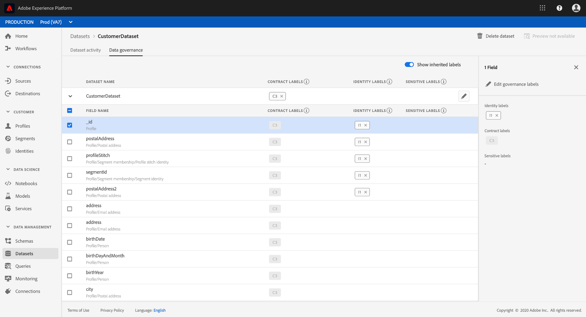

# Real-time Customer Data Platform 시작하기

이 시작 안내서는 Real-time Customer Data Platform(Real-Time CDP)의 샘플 구현을 안내합니다. 자체 구현을 설정할 때 예로 사용할 수 있습니다. 이 안내서에서는 특정 예를 보여주지만, 설정을 만드는 동안 사용할 수 있는 추가 정보에 연결됩니다.

이 예는 Adobe Experience Platform에서 제공하는 Real-time Customer Data Platform의 강력한 기능을 보여줍니다.

* 여러 소스에서 데이터 수집
* 단일 [!DNL real-time customer profile](으)로 병합
* 장치 간에 일관되고 관련성이 있으며 개인화된 경험을 제공합니다.

## 활용 사례

스포츠 의류 회사인 Luma는 항상 고객 경험을 개선하기 위해 노력하고 있습니다. 그들은 선물 관련 판매를 늘리기 위한 새로운 계획을 가지고 있다. 또한 고객들을 따라다니는 성가신 광고와 같은 과다 노출을 줄이고 싶어합니다.

현재, 그들은 방문자가 구매하지 않을 품목을 목표로 하는 미디어에 너무 많은 돈을 지출하고 있습니다. 예를 들어 Luma는 다른 사용자를 위해 일회성 구매로 의도된 항목을 통해 다른 사용자를 재타겟팅하고 싶지 않습니다.

현재 Luma의 데이터는 여러 소스에 분산됩니다. 그 결과, 다음과 같은 중대한 과제에 직면하게 됩니다.

* 마케팅 조직은 웹 사이트, 모바일 앱, 충성도 시스템, CRM 등을 포함하여 각 팀이 데이터 소스를 소유한 다양한 팀과 협력해야 합니다.
* 마케팅 팀이 데이터에 액세스할 때쯤이면 부실한 경우가 많으며, 시간에 민감한 캠페인과 더 이상 관련이 없습니다.
* 채널이 아닌 사람을 타겟팅할 수 있도록 데이터를 통합할 필요가 있습니다.

따라서 Luma는 다음과 같은 비즈니스 목표를 가지고 있습니다.

* 서로 다른 데이터 소스에서 소비자에 대한 실시간 단일 보기를 만듭니다.
* 다양한 채널 및 디바이스에서 관련 메시지를 사용하여 마케팅 캠페인을 개인화할 수 있습니다.

이러한 목표를 충족하려면 마케팅 팀이 고객 데이터를 규모에 맞게 관리할 수 있어야 합니다.

Adobe Experience Platform에서 제공하는 Real-Time CDP을 통해 Luma의 마케팅 조직은 다음과 같은 작업을 수행할 수 있습니다.

1. 서로 다른 플랫폼에서 데이터를 수집하고 다른 마케팅 활동에 다운스트림에서 사용할 수 있는지 확인합니다.
1. 데이터의 출처 없이 소비자에 대한 단일 실시간 보기를 만듭니다.
1. 모든 접점에서 일관되고 관련성이 있으며 개인화된 경험을 제공합니다.

## 단계

이 튜토리얼에는 다음 단계가 포함되어 있습니다.

1. [고객 프로필](#customer-profile)을 만듭니다.
1. 사용자 경험을 [개인 설정](#personalizing-the-user-experience)합니다.
1. [여러 데이터 원본](#using-multiple-data-sources)을 사용합니다.
1. [데이터 원본 구성](#configuring-a-data-source).
1. 특정 고객에 대한 [데이터를 수집합니다](#bringing-the-data-together-for-a-specific-customer).
1. [대상](#audiences)을(를) 설정합니다.
1. [대상](#destinations)을 설정합니다.
1. [장치 간에 프로필을 연결합니다](#cross-device-identity-stitching).
1. [프로필 분석](#analyzing-the-profile).

## 고객 프로필

고객이 사이트를 처음 방문할 때 고객에 대해 아는 것이 없습니다.


탐색할 때 데이터는 실시간으로 캡처되어 Adobe Analytics의 보고서 세트뿐만 아니라 Adobe Experience Platform으로 직접 전송됩니다. 데이터가 수집되면 [!DNL Experience Platform's real-time customer profile]의 동작 데이터를 기반으로 고객에 대한 단일 보기가 형성되기 시작합니다.

웹 사이트의 많은 방문자는 이전에 Luma에서 구매한 고객을 반복할 수 있습니다.  Luma는 신규 및 재방문자와 알려진 고객 모두를 해결하기 위해 메시지 및 서비스를 개인화하는 것이 중요합니다.

### 새 고객의 첫 번째 방문

예를 들어, 식별되지 않은 방문자가 Luma 사이트의 남성용 섹션으로 이동하여 커플 러닝 스웨트 셔츠를 봅니다.


고객이 이러한 제품에 대해 자세히 알아보려고 탐색할 때 이러한 제품 보기가 Adobe Analytics에서 수집되어 [!DNL Experience Platform](으)로 전송됩니다.

<!---->

Luma는 방문자의 행동을 Adobe Experience Platform의 사용자 프로필에 매핑하고 해당 소비자 행동을 더 잘 볼 수 있도록 조합하기 시작할 수 있습니다.

### 고객에 대한 더 자세한 보기 얻기

고객이 웹 사이트와 계속 상호 작용하면서 보다 명확한 그림이 등장합니다. 예를 들어 방문자가 장바구니에 제품을 추가하고 로그인한다고 가정하겠습니다.

고객이 로그인하면 Sarah Rose라고 알려줍니다.


두 개의 ID가 병합됩니다.

* 익명 검색 데이터
* Sarah Rose의 계정에 연결된 기존 데이터

두 ID는 [!DNL Experience Platform]에서 하나의 프로필로 결합됩니다. Luma는 이제 이 소비자에 대한 통합된 뷰를 제공합니다.

사이트의 남성용 섹션에서 익명 방문자의 탐색 행동을 기반으로 할 때 고객이 남성이라고 가정했을 수 있습니다. 로그인했으므로 Luma는 Sarah Rose를 인식합니다. Luma는 [!DNL Real-Time Customer Profile]의 기능을 사용하여 여러 채널에서 제공하는 메시지를 구체화합니다.

## 사용자 경험 개인화

사라는 충성도 메시지로 환영을 받고 있으며, 혜택과 그녀의 지위와 점수를 높이는 방법에 대해 더 많은 정보를 가진 브론즈 멤버인 것에 대해 감사함을 표했다.

그녀는 홈페이지로 이동하여 더 많은 것을 찾아본다.


Sarah는 Adobe Experience Platform에서 자신의 [!DNL Real-Time Customer Profile]을(를) 기반으로 동적으로 제공되는 개인화된 홈 페이지 경험을 수신합니다.

그녀는 과거 구매와 달리는 의류 및 기어에 대한 친화성을 고려한 Adobe Target의 Adobe Sensei 기반 개인화 덕분에 관련 콘텐츠를 볼 수 있습니다. Luma는 또한 가장 최근의 검색을 기준으로 남성용 카탈로그 콘텐츠를 남성용 런닝 기어로 맞춤화합니다.

페이지 아래쪽에는 Sarah에게 주요 제품과 함께 가장 최근에 본 항목을 기반으로 한 새로운 권장 사항 트레이가 표시됩니다.

이렇게 개인화된 콘텐츠는 Sarah가 관련 항목을 빠르게 찾는 데 도움이 됩니다. 이렇게 하면 전환율이 증가하고 더 쾌적한 고객 경험을 제공할 수 있습니다.

### 고객을 다시 불러오는 중

사라는 산만해져서 사이트를 떠나면서 세션이 끝납니다. Luma는 Adobe Experience Platform에서 자신의 데이터를 사용하여 사이트를 다시 가져올 수 있습니다.

Adobe Experience Platform에서 제공하는 Real-time Customer Data Platform은 고객 경험 관리를 위해 빌드되었습니다. 이를 통해 조직은 다음과 같은 작업을 수행할 수 있습니다.

* 데이터 통합 및 활성화 간소화
* 알려진 데이터 및 알 수 없는 데이터 사용 관리
* 규모에 맞게 마케팅 사용 사례 가속화

## 여러 데이터 소스 사용

Luma의 팀은 모든 행동 및 고객 데이터를 한 곳에 보유하고 있습니다.


다음 모든 소스에서 데이터를 수집할 수 있습니다.

* 기존 Adobe Experience Cloud 솔루션 데이터
* Luma의 충성도 프로그램, 콜 센터 및 판매 시점 시스템 데이터와 같은 비 Adobe 소스
* Luma 데이터 소스의 실시간 스트리밍 데이터
* Adobe 솔루션의 실시간 데이터(새 태그 필요 없음)

서로 다른 소스의 이러한 모든 데이터는 하나의 통합 고객 프로필에 병합됩니다.

## 데이터 소스 구성

[!DNL Real-Time Customer Data Platform]을(를) 사용하여 새로운 데이터 소스를 플랫폼으로 가져옵니다. Real-Time CDP에는 프로필에 빠르고 쉽게 추가할 수 있는 데이터 소스 카탈로그가 포함되어 있습니다.


예를 들어 Luma의 CRM 데이터를 수집하려면 카탈로그를 *CRM*&#x200B;별로 필터링하고 *CRM*&#x200B;을 포함하는 모든 기본 제공 커넥터가 나열됩니다. [!DNL Microsoft Dynamics CRM] 데이터를 추가하려면:

1. 연결을 승인합니다.

   

1. XDM 사전 매핑 테이블의 권장 목록에서 가져올 항목을 선택합니다.

   <!--     -->

   예를 들어 **[!UICONTROL 연락처]**&#x200B;를 선택합니다. 연락처 데이터의 미리 보기가 자동으로 로드되므로 모든 것이 예상대로 보이는지 확인할 수 있습니다.

   Real-Time CDP은 표준 필드를 [!DNL Experience Data Model](XDM) 프로필 스키마에 자동 매핑하여 이 프로세스에서 많은 수동 작업을 수행합니다.

1. 필드 매핑을 검토합니다.

   <!--     -->

   예를 들어 연락처에 대한 이메일 필드가 올바르게 매핑되었는지 다시 확인합니다.\
   데이터를 미리 보고 고급 매핑을 수행할 수 있는 옵션이 있습니다.

1. 일정을 설정합니다.

   

완료되었습니다. [!DNL Microsoft CRM]을(를) 데이터 원본으로 [!DNL Experience Platform]에 추가했습니다.

### 사용 정책에 대해 수집된 데이터에 레이블 지정

Luma에는 수집된 특정 종류의 정보 사용을 제한하는 많은 내부 정책이 있으며 데이터 사용과 관련된 법적 및 개인 정보 보호 관련 우려도 준수해야 합니다. Adobe Experience Platform 데이터 거버넌스를 사용하여 사전 정의된 데이터 사용 레이블을 데이터 세트(및 해당 데이터 세트 내의 특정 필드)에 적용할 수 있으므로 Luma는 특정 사용 제한에 따라 데이터를 분류할 수 있습니다.



데이터 사용 레이블이 적용되면 Luma는 데이터 거버넌스를 사용하여 데이터 사용 정책을 만들 수 있습니다. 데이터 사용 정책은 특정 레이블이 포함된 데이터에 대해 수행할 수 있는 작업 종류를 설명하는 규칙입니다. 정책 위반을 구성하는 Real-Time CDP에서 작업을 수행하려고 하면 작업이 차단되고 위반된 정책 및 이유를 보여주는 경고가 표시됩니다.

또한 Real-Time CDP

## 특정 고객을 위한 데이터 통합

이 시나리오에서는 Sarah Rose의 프로필을 검색합니다. 로그인에 사용한 이메일과 함께 프로필이 나타납니다.

<!--  -->

Luma가 Sarah에 대해 갖는 모든 프로필 정보입니다. 여기에는 주소 및 전화번호, 커뮤니케이션 환경 설정, 대상 등 그녀의 개인 정보가 포함됩니다.

| 카테고리 | 설명 |
|---|---|
| ID | 채널 및 장치 전반에 걸쳐 Luma와 Sarah의 상호 작용에서 [!DNL Platform]에 함께 연결된 ID를 표시합니다. 웹 사이트의 ECID가 표시됩니다. 또한 ID에는 모바일 앱의 ECID, 이메일 ID, 최근에 추가된 [!DNL Microsoft Dynamics] 데이터 세트의 CRM ID 및 Luma 충성도 시스템에서 Adobe Experience Platform으로 전달된 충성도 ID가 포함됩니다. |
| 이벤트 | Luma 브랜드와 Sarah의 모든 상호 작용 데이터를 표시합니다. 여기에는 방금 본 항목, 과거에 본 항목, 받은 이메일, 콜센터와의 상호 작용 및 이러한 상호 작용이 각각 발생한 채널과 장치가 포함됩니다. |

Real-Time CDP 프로필은 Luma 마케팅 팀의 워크플로우를 몇 주에서 몇 분으로 줄이고, 이 360도 고객 보기를 기반으로 개인화에 대한 가능성을 잠금 해제합니다. 이 프로필은 Sarah가 로그인하기 전에 사이트를 탐색했을 때의 행동 데이터를 기존의 고객 프로필과 병합하여 Sarah에 대한 포괄적인 보기를 만듭니다.

마케팅 팀은 이 향상된 [!DNL Real-Time Customer Profile]을(를) 사용하여 Luma를 통해 Sarah의 경험을 더 잘 개인화하고 브랜드 충성도를 높일 수 있습니다.

## 대상자

강력한 Adobe Experience Platform 세그멘테이션 기능을 통해 마케터는 [!DNL Real-Time Customer Profile]에서 캡처한 데이터를 기반으로 특성, 이벤트 및 기존 대상을 결합할 수 있습니다.

<!--  -->

이 시나리오에서는 사이트에서의 Sarah의 최근 상호 작용이 자신의 과거 행동과는 다른 행동을 보인다. 그녀는 보통 여성복을 산다. 그러나 그녀의 카트에 있는 물품은 남성용 대형 스웨터입니다.

Luma 데이터 과학 팀은 구매 성향에 대한 모델을 만들었습니다. 한 모델은 기존 소비자에 대한 의류 카테고리(예: 남성/여성) 또는 크기의 급격한 변화를 식별합니다. 사라는 구매 행동의 변화를 보면 자신을 위해 쇼핑하는 것이 아니라는 것을 알 수 있다.

<!--  -->

### 대상자 정의

Audiences 작업 영역의 다양한 시각적 구성 또는 코드 기반 표현식 편집기 옵션을 사용하여 선물을 사는 과정에 있는 것으로 보이는 장바구니 포기 고객을 나타내는 대상자를 수정하거나 만듭니다.

```sql
Profile: Category != Preferred Category 
AND 
Product Size != Preferred Size 
in last 7 days.  
AND 
Abandoned Cart 
AND 
Loyalty member 
```

<!-- -->

Sarah가 장바구니에 명백한 선물 항목을 추가하고 포기했으므로 Luma는 무료 선물 포장 오퍼로 그녀를 타겟팅할 수 있습니다.

## 대상

&quot;선물 증정 카트 포기&quot; 대상을 추가하면 이 대상의 약 몇 명이 속해 있는지 확인할 수 있습니다. 해당 작업을 수행하여 채널 전반의 개인화에 사용할 수 있도록 할 수 있습니다.

**[!UICONTROL 대상으로 보내기]**&#x200B;를 선택합니다.

Real-Time CDP에서 Luma는 개인화를 위해 해당 대상자에게 원활하게 작용할 수 있습니다.\
여기에서는 Luma가 이 대상을 Adobe 및 비 Adobe 솔루션 모두로 보낼 수 있는 모든 대상을 확인합니다.


### 대상 선택

이 시나리오에서 Luma는 다음 대상에 대한 개인화를 통해 이 대상자를 재타겟팅하려고 합니다.

* Google, 표시용
  <!--* Facebook -->
* Adobe Campaign, 이메일

<!--  -->

### 대상 예약

대상자 내보내기를 특정 시간에 시작하거나 종료하도록 예약할 수도 있습니다. 예정된 날짜에 구성된 플랫폼에서 대상자가 게시되고 자동으로 업데이트됩니다.

>[!NOTE]
>
>선택적으로 날짜 필드를 선택하면 90일 후 자동으로 예약됩니다.

다음 페이지로 이동하려면 **[!UICONTROL 저장]**&#x200B;을 선택하십시오.

이 대상의 고객이 구매를 수행하면 이 대상의 멤버십이 실시간으로 억제됩니다. 그들은 그들의 상태가 변했기 때문에 더 이상 자격을 얻지 못한다.

이렇게 하면 자격이 없는 대상에 대한 인벤토리를 사용하지 않음으로써 Luma 미디어 팀의 디렉터가 수십만 달러를 절약할 수 있습니다.

### 대상에 대한 데이터 사용 정책 시행

Adobe Experience Platform에는 특정 대상에 대상을 활성화할 수 있는지 여부를 결정하는 개인 정보 보호 및 보안 컨트롤이 포함되어 있습니다. 활성화 는 대상이 생성될 때 지정된 마케팅 목적과 조직에서 정의한 데이터 사용 정책에 따라 활성화되거나 제한됩니다.

활동이 정책을 위반하는 경우 경고가 표시됩니다. 이 경고에는 정책이 위반된 이유와 위반 사항을 해결하기 위해 수행할 수 있는 작업을 식별하는 데 도움이 되는 데이터 계보 정보가 포함되어 있습니다.

이러한 제어를 통해 [!DNL Experience Platform]은(는) Luma가 규정을 준수하고 시장화를 책임감 있게 수행할 수 있도록 지원합니다. 이러한 컨트롤은 유연하며 Luma의 보안 및 거버넌스 팀의 요구 사항에 맞게 수정할 수 있으므로 알려지거나 알려지지 않은 고객 데이터를 관리하기 위한 지역 및 조직의 요구 사항을 자신 있게 해결할 수 있습니다.

<!--

### Data flow canvas

When you save, a visual data flow canvas shows the segment mapped from the unified profile to the three destinations you selected.


-->

## 크로스 디바이스 ID 결합

Sarah가 모바일 디바이스에서 소셜 미디어 사이트를 탐색하면 Luma 광고가 표시됩니다. 그녀가 카트에 두고 간 물건이 떠오른다.

나중에 이메일을 열고 다시 타겟팅된 이메일을 확인합니다. 그녀는 이메일에서 Luma에 대한 링크를 선택합니다.

이 링크를 통해 Sarah는 모바일 Luma 홈 페이지로 이동하여 Adobe Target에서 제공하는 고도로 개인화된 경험을 보게 됩니다.

* 그녀는 브론즈 멤버로 환영받고 있다.
* 그녀는 &quot;선물&quot; 메시지를 봅니다.
* 그녀는 또한 브론즈 멤버십 혜택의 일부인 &quot;무료 선물 포장&quot; 메시지를 보고 있다.
* 그녀는 여전히 달리기에 대한 친화력을 바탕으로 영웅 이미지의 표적이 되고 있다.

그녀는 스웨터를 사고, 선물 포장을 하고, 선물 메모를 쓴다. 그녀는 또한 이 행사를 기억하고 내년에는 이 시간에 선물을 받기 위해 미리 알림을 받는 선택권을 가지고 있습니다. 그녀는 그렇다고 말했고, 그녀에게 또 다른 선물을 사라고 상기시키기 위해 이듬해 이메일 캠페인으로 예정되어 있다.

청중 억제 능력 덕분에, Sarah는 앞으로 나아가는 저 남성들의 스웨터에 표적이 되지 않을 것이다.

## 프로필 분석

Luma 마케터는 Adobe Experience Platform을 사용하여 Real-Time CDP 대시보드에서 선물 제공자 대상을 봅니다. 시간이 지남에 따라 이 이니셔티브의 결과를 보고 성장하고 있음을 파악합니다. 고객들은 오퍼에 반응하고 더 많은 돈을 소비하고 있다.

이러한 통찰력을 통해 마케터는 CDP에서 이 데이터를 사용할 수 있고 Sarah와 같은 고객을 대상자에 연결하여 이 신호에 대한 조치를 취할 수 있습니다.

Luma는 이 CDP 데이터를 사용하여 충성도와 고객 만족도를 향상시킵니다.
