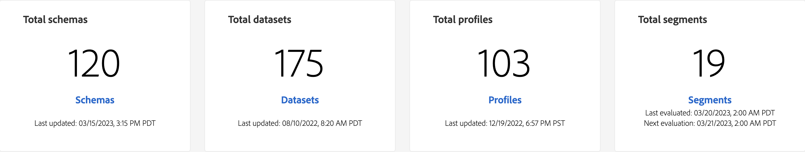

# [!DNL Real-Time Customer Data Platform] 홈 페이지

Adobe Real-time Customer Data Platform(Real-Time CDP) 홈 페이지는 Real-Time CDP에 로그인한 후 나타나는 첫 번째 페이지입니다.

Real-Time CDP 홈 페이지에는 여러 가지 다양한 기능에 빠르게 액세스할 수 있는 시작 위젯 및 조직 내의 데이터에 대한 최신 정보를 표시하는 지표 섹션이 포함되어 있습니다.

이 문서에서는 Real-Time CDP 홈페이지 및 지표 대시보드에 대한 개요를 제공합니다.

## 시작 위젯

[!UICONTROL 실시간 고객 프로필 시작하기] 위젯은 다음 네 개의 섹션으로 나뉩니다.

* **데이터를 플랫폼으로 수집**: 이 위젯은 사용자를 소스 카탈로그로 안내합니다. 소스 카탈로그를 사용하여 소스를 선택하고 데이터를 Experience Platform에 수집합니다. 소스 카탈로그로 이동하려면 **[소스 구성]**&#x200B;을 선택하십시오. 자세한 내용은 [소스 개요](../sources/home.md)를 참조하십시오.
* **데이터 구조 모델링**: 이 위젯은 스키마 개요로 안내합니다. 스키마 개요를 사용하여 기존 스키마를 찾아보거나 데이터 구조를 설명하는 블루프린트를 만듭니다. 스키마 만들기 인터페이스로 이동하려면 **[!UICONTROL 스키마 만들기]**&#x200B;를 선택하십시오. 자세한 내용은 [스키마 개요](../xdm/home.md)를 참조하십시오.
* **대상자 빌드**: 이 위젯은 UI의 세그먼트 빌더로 이동합니다. 세그먼트 빌더를 사용하여 프로필 데이터 요소와 상호 작용하고 세그먼트 정의에 대한 기준을 정의합니다. 세그먼트 빌더로 이동하려면 **[!UICONTROL 대상 만들기]**&#x200B;를 선택하십시오. 자세한 내용은 [세그먼테이션 서비스 개요](../segmentation/home.md)를 참조하세요.
* **대상으로 데이터 보내기**: 이 위젯은 대상 카탈로그로 이동합니다. 대상 카탈로그를 사용하여 연결할 수 있는 대상을 선택한 다음 대상자를 보낼 수 있습니다. 대상 카탈로그로 이동하려면 **[!UICONTROL 대상 설정]**&#x200B;을 선택하십시오. 자세한 내용은 [대상 개요](../destinations/home.md)를 참조하세요.

## 지표 대시보드 {#metrics-dashboard}

>[!CONTEXTUALHELP]
>id="platform_home_metrics_totalProfiles"
>title="총 프로필 수"
>abstract="귀하의 조직에서 Experience Platform 내에 보유하고 있는 총 프로필 수입니다. 이 수는 조직의 병합 정책을 기반으로 하며 프로필 조각은 포함되지 않습니다. 프로필 수는 24시간마다 한 번씩 업데이트됩니다."
>additional-url="https://experienceleague.adobe.com/docs/experience-platform/profile/ui/user-guide.html#profile-count" text="설명서에서 자세히 알아보기"

지표 대시보드에는 Experience Platform 데이터에 대한 최신 정보가 표시됩니다. 대시보드는 다음 두 섹션으로 나뉩니다.

### 리더보드

리더보드에는 조직의 현재 총 스키마, 데이터 세트, 프로필 및 대상자 수와 최신 업데이트 날짜가 표시됩니다.

* **Total 스키마**: **Total 스키마** 카운터는 시스템의 스키마 수를 표시합니다. 이 카운터는 스키마가 만들어지면 업데이트됩니다. 자세한 내용은 [스키마 개요](../xdm/home.md)를 참조하십시오.
* **총 데이터 집합**: **총 데이터 집합** 카운터는 시스템의 데이터 집합 수와 Experience Platform의 데이터 양을 표시합니다. 이 카운터는 데이터 세트가 만들어질 때 업데이트됩니다. 데이터 세트에 대한 자세한 내용은 [데이터 세트 개요](../catalog/datasets/overview.md)를 참조하십시오.
* **총 프로필**: **프로필** 수는 조직이 Experience Platform 내에 보유한 총 프로필 수를 보여줍니다. 프로필 조각은 포함되지 않습니다. 이것이 총 대응 가능 대상입니다. 이 수는 실시간 고객 프로필의 병합 정책 구성에 설정된 기본 [병합 정책](profile/merge-policies.md)을 사용합니다. 프로필 수는 24시간마다 한 번 업데이트됩니다. 프로필 개요 페이지로 이동하여 모든 프로필 지표를 보려면 **[!UICONTROL 프로필]**&#x200B;을 선택하십시오. 프로필에 대한 자세한 내용은 [실시간 고객 프로필 개요](../profile/home.md)를 참조하세요.
* **총 대상**: **총 대상** 카운터는 조직에 대해 만들어진 총 대상 수를 표시합니다. 이 숫자는 새 대상자가 만들어질 때 업데이트됩니다. 대상자에 대한 자세한 내용은 [세그먼테이션 서비스 개요](../segmentation/home.md)를 참조하세요.

### 최근 항목

최근 항목은 조직의 가장 최근 변경 사항을 나열합니다. 아래 예에서 가장 최근의 변경 사항은 데이터 세트, 소스, 대상 및 대상과 관련되어 있습니다.

* **최근 데이터 세트**: **[!UICONTROL 최근 데이터 세트]** 카드는 조직 내에서 만든 5개의 최신 데이터 세트를 보여 줍니다. 이 목록은 새 데이터 세트를 만들 때 업데이트됩니다. 해당 항목에 대한 세부 정보를 보려면 데이터 집합을 선택하거나 데이터 집합 목록에 대해 **[!UICONTROL 모두 보기]**&#x200B;를 선택하십시오. 여기에서 세부 정보에 대한 특정 소스를 선택할 수 있습니다. 데이터 세트에 대한 자세한 내용은 [데이터 세트 개요](../catalog/datasets/overview.md)를 참조하십시오.
* **최근 원본**: **[!UICONTROL 최근 원본]** 지표 카드는 조직 내에서 만든 5개의 최근 원본을 표시합니다. 이 목록은 새 소스를 만들 때 업데이트됩니다. 소스를 선택하여 해당 항목에 대한 세부 정보를 보거나 **[!UICONTROL 모두 보기]**&#x200B;를 선택하여 소스 목록을 확인하십시오. 여기에서 세부 정보에 대한 특정 소스를 선택할 수 있습니다. 소스에 대한 자세한 내용은 [소스 개요](../sources/home.md)를 참조하십시오.
* **최근 대상**: **[!UICONTROL 최근 대상]** 지표 카드에 조직 내에서 만든 가장 최근 대상 5개가 표시됩니다. 이 목록은 새 대상자를 만들 때 업데이트됩니다. 해당 항목에 대한 세부 정보를 볼 대상을 선택하거나 대상 목록에 대해 **[!UICONTROL 모두 보기]**&#x200B;를 선택하십시오. 대상자에 대한 자세한 내용은 [세그먼테이션 서비스 개요](../segmentation/home.md)를 참조하십시오.
* **최근 대상**: **[!UICONTROL 최근 대상]** 지표 카드는 조직 내에서 만든 5개의 최근 대상을 보여줍니다. 이 목록은 새 대상을 만들 때 업데이트됩니다. 대상을 선택하여 해당 항목에 대한 세부 정보를 보거나 **[!UICONTROL 모두 보기]**&#x200B;를 선택하여 대상 목록을 확인하십시오. 자세한 내용은 [대상 개요](../destinations/home.md)를 참조하세요.

## 리소스

마지막으로 리소스 위젯은 참조할 수 있는 추가 설명서 리소스를 제공합니다. 여기에는 다음이 포함됩니다.

* [스키마 이해하기](../xdm/schema/composition.md)
* [소스 연결하기](../sources/home.md)
* [실시간 고객 프로필을 채우는 방법](../profile/home.md)
* [대상 연결하기](../destinations/home.md)
* [액세스 관리](../access-control/abac/overview.md)

<!-- ### Successful profile records

In the leaderboard **[!UICONTROL Successful profile records]** shows the total number of records that have been successfully processed into the profile.

There is also a metric card that shows the percentage of successful records. Select **[!UICONTROL View datasets]** to see more details about the profile records. Hover over the colored area of the graph to see additional details:

The number of successful profile records is updated hourly. 

For more information about profiles, see [A unified view of your customer in Real-Time CDP](profile/profile-overview.md).

### Total profile records

The **[!UICONTROL Total profile records]** metric card shows the total number of data records enabled to feed into the profiles, and the percentage that are successful, updated once per day. This does not include all data in the data lake, because some data might not be enabled to feed into the profiles.

 Hover over the colored area of the graph to see additional details about the successful profiles:

Select **[!UICONTROL View profiles]** to see more details about the profile records.

For more information about profiles, see [A unified view of your customer in Real-Time CDP](profile/profile-overview.md).

For more information about viewing a specific profile, see [Profile viewer](profile/profile-viewer.md).

### Failed profile records

In the leaderboard, **[!UICONTROL Failed profile records]** counts the number of records that failed to process into the profile.

The **[!UICONTROL Failed profile records]** metric card shows this count, and includes a graphical representation that helps you see how failures have trended during the time shown below the graphic. This chart is updated hourly. Select **[!UICONTROL View datasets]** to see more details about the profile records.

The number of failed profile records is updated hourly. -->
