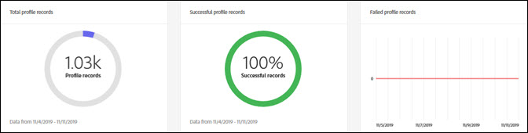

# [!DNL Real-Time Customer Data Platform] 홈 페이지 및 대시보드

지표 대시보드가 포함된 Adobe Real-time Customer Data Platform(Real-Time CDP) 홈 페이지는 Real-Time CDP에 로그인할 때 나타납니다.

홈 페이지는 지표 카드가 표시되는 위치 중 하나뿐입니다. Real-Time CDP은 경험 전체에서 지표 카드를 제공합니다. 이러한 지표는 시스템의 데이터, 프로필 및 세그먼트 대상에 대해 알려줍니다.

Real-Time CDP에 로그인할 때 시스템에 데이터가 없으면 홈 페이지의 대시보드가 나타나지 않습니다. 이 경우 홈 페이지는 처음으로 사용자 경험을 위한 학습 자료를 제공합니다. 데이터가 수집되면, 즉 <!--sources-->데이터 세트, 프로필, 세그먼트 및 대상을 만들고 시스템으로 데이터를 전송합니다. 대시보드는 해당 데이터에 대한 정보를 표시하기 위해 자동으로 업데이트됩니다<!-- in metric cards-->.

## 홈 페이지 대시보드 보기

<!--The dashboard shows information in several areas. Each category of information displays for the time range shown beneath the data.-->

대시보드는<!-- two areas.-->:

* **리더보드** 대시보드 맨 위에 있습니다. 리드 보드는 시스템의 데이터 세트, 프로필, 세그먼트 및 대상 수를 보여줍니다.

   

<!-- * **Metric cards** display beneath the leaderboard. Metric cards show additional information, such as percentages or trends. Metric cards appear as data is collected.
    
Some information is shown in different ways on both the leaderboard and metric cards. -->
* **최근 항목** 시스템에 추가된 최신 데이터 세트, 소스, 세그먼트 및 대상 5개를 나열합니다.

   

추가 지표(예: 프로필 및 세그먼트)는 Real-time Customer Data Platform의 다른 부분에서 사용할 수 있습니다.

### 데이터 세트

다음 **[!UICONTROL 데이터 세트]** 카운터는 시스템의 데이터 세트 수와 의 데이터 양을 표시합니다 [!DNL Platform]. 이 카운터는 데이터 세트를 만들 때 업데이트됩니다.

데이터 세트에 대한 자세한 내용은 [데이터 세트 개요](../catalog/datasets/overview.md).

### 프로필

다음 **[!UICONTROL 프로필]** 개수는 [!DNL Real-Time Customer Profile]. 프로필 조각은 포함되지 않습니다. 총 대응 가능 대상입니다.

이 개수는 기본값을 사용합니다 [병합 정책](profile/merge-policies.md) 통합 프로필의 병합 정책 구성에 설정된 경우입니다.

프로필 수는 24시간마다 한 번 업데이트됩니다.

프로필에 대한 자세한 내용은 [Real-Time CDP에서 고객에 대한 통합된 보기](profile/profile-overview.md).

### 세그먼트

**[!UICONTROL 세그먼트]** 조직에 대해 생성된 총 세그먼트 수를 표시합니다. 이 숫자는 새 세그먼트를 만들 때 업데이트됩니다.

세그먼트에 대한 자세한 내용은 [세그먼테이션 서비스 개요](segmentation/segmentation-overview.md).

### 대상

**[!UICONTROL 대상]** 조직에 대해 생성된 총 대상 수를 표시합니다. 이 번호는 새 대상을 만들 때 업데이트됩니다.

대상에 대한 자세한 내용은 [대상 개요](destinations/overview.md).

<!-- ### Successful profile records

In the leaderboard **[!UICONTROL Successful profile records]** shows the total number of records that have been successfully processed into the profile.

There is also a metric card that shows the percentage of successful records. Select **[!UICONTROL View datasets]** to see more details about the profile records. Hover over the colored area of the graph to see additional details:

The number of successful profile records is updated hourly. 

For more information about profiles, see [A unified view of your customer in Real-Time CDP](profile/profile-overview.md).

### Total profile records

The **[!UICONTROL Total profile records]** metric card shows the total number of data records enabled to feed into the profiles, and the percentage that are successful, updated once per day. This does not include all data in the data lake, because some data might not be enabled to feed into the profiles.

 Hover over the colored area of the graph to see additional details about the successful profiles:

Select **[!UICONTROL View profiles]** to see more details about the profile records.

For more information about profiles, see [A unified view of your customer in Real-Time CDP](profile/profile-overview.md).

For more information about viewing a specific profile, see [Profile viewer](profile/profile-viewer.md).

### Failed profile records

In the leaderboard, **[!UICONTROL Failed profile records]** counts the number of records that failed to process into the profile.

The **[!UICONTROL Failed profile records]** metric card shows this count, and includes a graphical representation that helps you see how failures have trended during the time shown below the graphic. This chart is updated hourly. Select **[!UICONTROL View datasets]** to see more details about the profile records.

The number of failed profile records is updated hourly. -->

### 최근 데이터 세트

다음 **[!UICONTROL 최근 데이터 세트]** 카드는 조직 내에서 만들어진 가장 최근 데이터 세트 5개를 보여줍니다. 이 목록은 새 데이터 세트를 만들 때 업데이트됩니다.

해당 항목에 대한 세부 사항을 볼 데이터 세트를 선택하거나 **[!UICONTROL 모두 보기]** 를 클릭하여 데이터 세트 목록을 확인합니다. 여기에서 자세한 내용을 보려면 특정 소스를 선택할 수 있습니다.

데이터 세트에 대한 자세한 내용은 [데이터 세트 개요](../catalog/datasets/overview.md).

### 최근 소스

다음 **[!UICONTROL 최근 소스]** 지표 카드는 조직 내에서 만들어진 5개의 가장 최근 소스를 보여줍니다. 이 목록은 새 소스를 만들 때 업데이트됩니다.

해당 항목에 대한 세부 정보를 볼 소스를 선택하거나 **[!UICONTROL 모두 보기]** 소스 목록을 확인합니다. 여기에서 자세한 내용을 보려면 특정 소스를 선택할 수 있습니다.

소스에 대한 자세한 내용은 [소스 개요](sources/sources-overview.md).

### 최근 세그먼트

다음 **[!UICONTROL 최근 세그먼트]** 지표 카드는 조직 내에서 만들어진 5개의 가장 최근 세그먼트를 보여줍니다. 이 목록은 새 세그먼트가 만들어지면 업데이트됩니다.

세그먼트를 선택하여 해당 항목에 대한 세부 사항을 보거나 **[!UICONTROL 모두 보기]** 추가 세그먼트에 대한 정보를 참조하십시오.

세그먼트에 대한 자세한 내용은 [세그먼테이션 서비스 개요](segmentation/segmentation-overview.md).

### 최근 대상

다음 **[!UICONTROL 최근 대상]** 지표 카드는 조직 내에서 만들어진 가장 최근 5개의 대상을 보여줍니다. 이 목록은 새 대상을 만들 때 업데이트됩니다.

해당 항목에 대한 세부 정보를 볼 대상을 선택하거나, **[!UICONTROL 모두 보기]** 추가 대상에 대한 정보를 참조하십시오.

대상에 대한 자세한 내용은 [대상 개요](destinations/overview.md).
