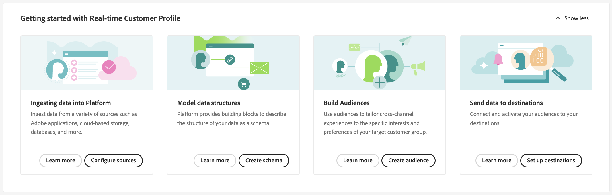

# [!DNL Real-Time Customer Data Platform] 홈 페이지

Adobe Real-time Customer Data Platform(Real-Time CDP) 홈 페이지는 Real-Time CDP에 로그인한 후 나타나는 첫 번째 페이지입니다.

Real-Time CDP 홈 페이지에는 여러 가지 다양한 기능에 빠르게 액세스할 수 있는 시작 위젯 및 조직 내의 데이터에 대한 최신 정보를 표시하는 지표 섹션이 포함되어 있습니다.

이 문서에서는 Real-Time CDP 홈페이지 및 지표 대시보드에 대한 개요를 제공합니다.

## 시작 위젯

다음 [!UICONTROL 실시간 고객 프로필 시작하기] 위젯은 다음 네 개의 섹션으로 나뉩니다.

* **플랫폼으로 데이터 수집**: 이 위젯은 사용자를 소스 카탈로그로 안내합니다. 소스 카탈로그를 사용하여 소스를 선택하고 데이터를 Experience Platform에 수집합니다. 자세한 내용은 [소스 개요](../sources/home.md)
* **모델 데이터 구조**: 이 위젯은 스키마 개요로 안내합니다. 스키마 개요를 사용하여 기존 스키마를 찾아보거나 데이터 구조를 설명하는 빌딩 블록을 만듭니다. 자세한 내용은 [스키마 개요](../xdm/home.md).
* **세그먼트 대상자**: 이 위젯은 사용자를 [!DNL Segment Builder] UI에서 사용 [!DNL Segment Builder] 를 사용하여 프로필 데이터 요소와 상호 작용하고 세그먼트에 대한 규칙을 정의할 수 있습니다. 자세한 내용은 [세그먼테이션 서비스 개요](../segmentation/home.md).
* **대상으로 데이터 보내기**: 이 위젯은 대상 카탈로그로 이동합니다. 대상 카탈로그를 사용하여 연결할 수 있는 대상을 선택한 다음 세그먼트를 보낼 수 있습니다. 자세한 내용은 [대상 개요](../destinations/home.md)

## 지표 대시보드

지표 대시보드에는 Experience Platform 데이터에 대한 최신 정보가 표시됩니다. 대시보드는 다음 두 섹션으로 나뉩니다.

### 리더보드

리더보드에는 조직의 현재 총 스키마, 데이터 세트, 프로필 및 세그먼트 수와 가장 최근 업데이트 날짜가 표시됩니다.

* **총 스키마**: **총 스키마** 카운터는 시스템의 스키마 수를 표시합니다. 이 카운터는 스키마가 만들어지면 업데이트됩니다. 자세한 내용은 [스키마 개요](../xdm/home.md).
* **총 데이터 세트**: **총 데이터 세트** 카운터는 시스템의 데이터 세트 수와 [!DNL Platform]. 이 카운터는 데이터 세트가 만들어질 때 업데이트됩니다. 데이터 세트에 대한 자세한 내용은 [데이터 세트 개요](../catalog/datasets/overview.md).
* **총 프로필**: **프로필** count는 다음에 프로필이 있는 총 사람 수를 보여줍니다. [!DNL Real-Time Customer Profile]. 프로필 조각은 포함되지 않습니다. 이것이 총 대응 가능 대상입니다. 이 카운트는 기본값을 사용합니다. [병합 정책](profile/merge-policies.md) 통합 프로필의 병합 정책 구성에서 설정된 대로. 프로필 수는 24시간마다 한 번 업데이트됩니다. 프로필에 대한 자세한 내용은 [실시간 고객 프로필 개요](../profile/home.md).
* **총 세그먼트**: **세그먼트** 조직에 대해 생성된 총 세그먼트 수를 표시합니다. 이 숫자는 새 세그먼트를 만들 때 업데이트됩니다. 세그먼트에 대한 자세한 내용은 [세그먼테이션 서비스 개요](../segmentation/home.md).

### 최근 항목

최근 항목은 조직의 가장 최근 변경 사항을 나열합니다. 아래 예에서 가장 최근의 변경 사항은 데이터 세트, 소스, 세그먼트 및 대상과 관련이 있습니다.

* **최근 데이터 세트**: **[!UICONTROL 최근 데이터 세트]** 카드는 조직 내에서 만들어진 가장 최근 5개의 데이터 세트를 보여 줍니다. 이 목록은 새 데이터 세트를 만들 때 업데이트됩니다. 데이터 세트를 선택하여 해당 항목에 대한 세부 정보를 보거나 **[!UICONTROL 모두 보기]** 데이터 세트 목록. 여기에서 세부 정보에 대한 특정 소스를 선택할 수 있습니다. 데이터 세트에 대한 자세한 내용은 [데이터 세트 개요](../catalog/datasets/overview.md).
* **최근 소스**: **[!UICONTROL 최근 소스]** 지표 카드는 조직 내에서 생성된 5개의 가장 최근 소스를 보여줍니다. 이 목록은 새 소스를 만들 때 업데이트됩니다. 소스를 선택하여 해당 항목에 대한 세부 정보를 보거나 **[!UICONTROL 모두 보기]** 소스 목록을 참조하십시오. 여기에서 세부 정보에 대한 특정 소스를 선택할 수 있습니다. 소스에 대한 자세한 내용은 [소스 개요](../sources/home.md).
* **최근 세그먼트**: **[!UICONTROL 최근 세그먼트]** 지표 카드는 조직 내에서 생성된 5개의 가장 최근 세그먼트를 보여줍니다. 이 목록은 새 세그먼트를 만들 때 업데이트됩니다. 세그먼트를 선택하여 해당 항목에 대한 세부 정보를 보거나 **[!UICONTROL 모두 보기]** 세그먼트 목록. 세그먼트에 대한 자세한 내용은 [세그먼테이션 서비스 개요](../segmentation/home.md).
* **최근 대상**: **[!UICONTROL 최근 대상]** 지표 카드는 조직 내에서 생성된 5개의 가장 최근 대상을 보여줍니다. 이 목록은 새 대상을 만들 때 업데이트됩니다. 대상을 선택하여 해당 항목에 대한 세부 정보를 보거나 **[!UICONTROL 모두 보기]** 대상 목록. 자세한 내용은 [대상 개요](../destinations/home.md).

## 리소스

마지막으로 리소스 위젯은 참조할 수 있는 추가 설명서 리소스를 제공합니다. 다음과 같은 보고서가 포함됩니다.

* [스키마 이해](../xdm/schema/composition.md)
* [소스 연결 중](../sources/home.md)
* [실시간 고객 프로필을 채우는 방법](../profile/home.md)
* [대상 연결 중](../destinations/home.md)
* [액세스 관리](../access-control/abac/overview.md)

<!-- ### Successful profile records

In the leaderboard **[!UICONTROL Successful profile records]** shows the total number of records that have been successfully processed into the profile.

There is also a metric card that shows the percentage of successful records. Select **[!UICONTROL View datasets]** to see more details about the profile records. Hover over the colored area of the graph to see additional details:

The number of successful profile records is updated hourly. 

For more information about profiles, see [A unified view of your customer in Real-Time CDP](profile/profile-overview.md).

### Total profile records

The **[!UICONTROL Total profile records]** metric card shows the total number of data records enabled to feed into the profiles, and the percentage that are successful, updated once per day. This does not include all data in the data lake, because some data might not be enabled to feed into the profiles.

 Hover over the colored area of the graph to see additional details about the successful profiles:

Select **[!UICONTROL View profiles]** to see more details about the profile records.

For more information about profiles, see [A unified view of your customer in Real-Time CDP](profile/profile-overview.md).

For more information about viewing a specific profile, see [Profile viewer](profile/profile-viewer.md).

### Failed profile records

In the leaderboard, **[!UICONTROL Failed profile records]** counts the number of records that failed to process into the profile.

The **[!UICONTROL Failed profile records]** metric card shows this count, and includes a graphical representation that helps you see how failures have trended during the time shown below the graphic. This chart is updated hourly. Select **[!UICONTROL View datasets]** to see more details about the profile records.

The number of failed profile records is updated hourly. -->
